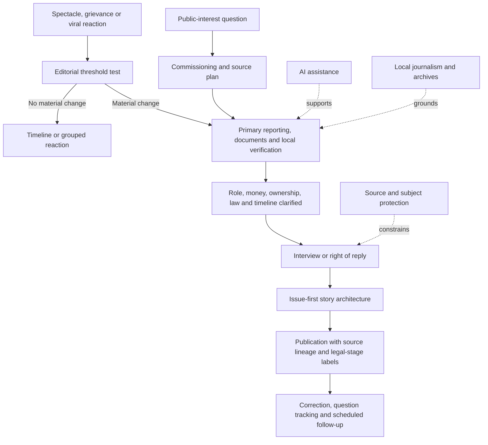

# 🗞️ Media Practice  
**First created:** 2026-07-17 | **Last updated:** 2026-07-17  
*Practical newsroom guidance for covering colliding confidence systems without becoming their distribution infrastructure.*

---

## 🛰️ Orientation

This folder turns the Manifestation Molehill from analysis into practice.

The wider pack asks how political finance, crypto, commercial AI, war, sanctions, media ownership, legal exposure, and public distrust collide.

This folder asks what a newsroom should do about it.

A story can be factually accurate and still:

- centre the wrong actor
- reward spectacle
- flatten the legal stage
- confuse reaction with development
- extract attention from local consequences
- replace source creation with summary
- turn ridicule into distribution
- expose people with less power
- make the public more overwhelmed rather than better informed

Media practice therefore concerns commissioning, framing, interviewing, sourcing, timing, correction, visual form, repetition, distribution, institutional memory, and public re-entry.

> Cover the risk.  
> Do not feed the spectacle.

---

## ✨ Key Features

- Routes readers through five practical media nodes.
- Separates reporting value from content volume.
- Keeps evidence, documents, money, law, and consequences ahead of personality.
- Treats time and repetition as editorial choices.
- Uses humour without allowing farce to replace accountability.
- Protects local reporting as source and memory infrastructure.
- Distinguishes AI assistance from newsroom replacement.
- Preserves source lineage and legal-stage clarity.
- Provides a common editorial workflow and publication test.
- Connects analysis to cleanup, trust repair, and democratic re-entry.

---

## 🧿 Core Proposition

A newsroom does not merely describe the information environment.

It helps construct it.

Editorial choices determine:

- who becomes central
- which quote survives
- which source receives credit
- which reaction becomes a development
- which legal stage is visible
- which local consequence is ignored
- which actor gains distribution
- whether a correction catches up
- whether the public can safely stop reading

The newsroom cannot eliminate manipulation.

It can refuse to become its user interface.

---

# 🧭 Reading Order

## 1. [`📺_media_cycle_capture.md`](./📺_media_cycle_capture.md)

Start with attention and time.

This node explains how an actor under scrutiny can become the organiser of everyone else’s attention through grievance, hostile amplification, reaction loops, SEO and retrieval capture, temporal capture, and personality-centred story architecture.

Core question:

> Are we covering a material development, or allowing the actor to set the public clock?

Core line:

> A spectacle politician can lose the interview and still win the cycle.

---

## 2. [`📰_quality_as_click_resilience.md`](./📰_quality_as_click_resilience.md)

Move from attention to institutional value.

This node argues that AI search exposes interchangeable journalism and makes original reporting, archives, source relationships, local presence, specialist judgment, visual explanation, and continuing beats more commercially and democratically important.

Core question:

> What would disappear if this newsroom did not produce it?

Core line:

> The protection is not that the article cannot be summarised.  
> It is that the reporting institution cannot be safely replaced by the summary.

---

## 3. [`🎙️_how_to_cover_and_interview.md`](./🎙️_how_to_cover_and_interview.md)

Move into live accountability.

This node provides a booking test, speaking-role clarification, frame-before-quote practice, a five-step question ladder, non-answer categories, money, declaration, liability, crypto, platform, and democracy questions, live-correction rules, stopping conditions, and post-interview tracking.

Core question:

> What remains unanswered, and how can the public record make that gap legible?

Core line:

> Do not repeat the same question forever.  
> Narrow the evidential gap until the public record is clear.

---

## 4. [`🃏_how_to_cover_farce_without_becoming_it.md`](./🃏_how_to_cover_farce_without_becoming_it.md)

Then examine humour and absurdity.

This node distinguishes comic presentation, political function, material capacity, public harm, and distribution gain.

Core question:

> What does the joke reveal, and what does it obscure?

Core line:

> The actor may be ridiculous.  
> The infrastructure carrying them may not be.

---

## 5. [`🏘️_local_journalism_as_resilience_infrastructure.md`](./🏘️_local_journalism_as_resilience_infrastructure.md)

Finish with ground truth.

This node treats local reporting as source creation, attendance, archive, institutional memory, early warning, verification, and community accountability.

Core question:

> Which public facts would disappear if nobody local were funded to notice and remember them?

Core line:

> When local journalism disappears, national narratives lose their ground truth.

---

# 🗂️ What Belongs Where

| Editorial problem | Primary node |
|---|---|
| The actor dominates every update | [`📺_media_cycle_capture.md`](./📺_media_cycle_capture.md) |
| The story is mostly interchangeable prose | [`📰_quality_as_click_resilience.md`](./📰_quality_as_click_resilience.md) |
| The guest evades or changes role | [`🎙️_how_to_cover_and_interview.md`](./🎙️_how_to_cover_and_interview.md) |
| The event is absurd but materially serious | [`🃏_how_to_cover_farce_without_becoming_it.md`](./🃏_how_to_cover_farce_without_becoming_it.md) |
| A national claim needs local verification | [`🏘️_local_journalism_as_resilience_infrastructure.md`](./🏘️_local_journalism_as_resilience_infrastructure.md) |
| Reactions are multiplying without new evidence | [`📺_media_cycle_capture.md`](./📺_media_cycle_capture.md) |
| AI summaries are replacing visits | [`📰_quality_as_click_resilience.md`](./📰_quality_as_click_resilience.md) |
| A quote needs documentary framing | [`🎙️_how_to_cover_and_interview.md`](./🎙️_how_to_cover_and_interview.md) |
| A meme is increasing the actor’s reach | [`🃏_how_to_cover_farce_without_becoming_it.md`](./🃏_how_to_cover_farce_without_becoming_it.md) |
| Public bodies are escaping institutional memory | [`🏘️_local_journalism_as_resilience_infrastructure.md`](./🏘️_local_journalism_as_resilience_infrastructure.md) |

---

# 🧬 Shared Editorial Method

Across the folder, use the same basic sequence:

1. **Name the public-interest issue.**
2. **Identify the original source or event.**
3. **Establish the relevant clock and legal stage.**
4. **Separate evidence from reaction.**
5. **Identify the money, ownership, authority, or mechanism.**
6. **Clarify who is speaking and in what role.**
7. **Test the claim against local or documentary reality.**
8. **State what remains unresolved.**
9. **Protect people with less power.**
10. **Publish only the amount of spectacle needed for understanding.**
11. **Correct visibly.**
12. **Return when something material changes.**

This is not a formula for identical stories.

It is a discipline against capture.

---

# 🧾 The Public-Interest Frame

Before publishing, be able to state the issue without using the spectacle actor’s name.

For example:

- unresolved donor support
- undeclared services
- platform ownership
- public procurement
- sanctions compliance
- civil liability
- local service failure
- regulatory delay
- political-finance exposure
- public-safety consequence

If the story disappears when the personality is removed, check whether the story is really about public consequence, entertainment, fandom, outrage, or rivalry.

A personality may be genuinely central.

The newsroom should still know the issue underneath the name.

---

# 🕰️ Time As An Editorial Choice

Track:

- event
- publication
- reaction
- correction
- legal process
- regulatory review
- implementation
- consequence

A fast actor may try to exploit a slow institution.

A slow institution may also use delay to evade public scrutiny.

Do not assume either.

Label the clock.

Useful update thresholds include:

- new evidence
- new legal status
- new money
- new ownership
- new institutional action
- changed capacity
- changed consequence

A new quote is not automatically a new stage.

---

# 🔁 Reaction Control

Reaction is sometimes important.

But reaction coverage should not automatically reproduce itself.

Better patterns:

- grouped reaction
- one curated timeline
- scheduled briefings
- consequence-led follow-up
- a single status box
- fewer standalone “hits back” items

Ask:

- Did the evidence change?
- Did policy change?
- Did money move?
- Did legal status change?
- Did operational capacity change?

If not, consider whether the reaction belongs in the existing record rather than a fresh distribution event.

---

# 📚 Source Lineage

A newsroom should make clear whether apparently separate claims derive from:

- one document
- one press release
- one interview
- one anonymous source
- one platform post
- one wire report
- one court filing
- one AI-generated summary

Reference count is not source count.

Useful practices include:

- linking the primary source
- naming the originating report
- distinguishing original reporting from aggregation
- flagging shared source material
- publishing methodology
- maintaining a source library
- propagating corrections

> Follow the claim backward until the references stop multiplying and the evidence begins.

---

# 🎭 Role Clarity

Political-media actors may move between roles:

- politician
- presenter
- employee
- shareholder
- campaigner
- donor
- candidate
- private citizen

That movement can obscure responsibility, payment, editorial control, lobbying, commercial benefit, and applicable rules.

Coverage should state:

- which role is active
- whether it is paid
- who benefits
- what authority attaches
- whether interests are disclosed

A person should not be able to use one role for access and another for escape.

---

# 🛡️ Risk Should Not Be Exported Downward

Coverage must not transfer the cost of scrutiny onto:

- complainants
- survivors
- whistleblowers
- junior staff
- family members
- migrants
- disabled people
- private individuals
- local communities

Common transfer routes include:

- unnecessary identification
- leaked personal data
- speculative blame
- directing online harassment
- using distress as visual content
- asking less powerful people to rebut a powerful actor in real time

The public-interest frame should move scrutiny upward toward authority, money, ownership, decisions, documentation, and legal responsibility.

---

# 🤖 AI In The Newsroom

AI may assist with:

- transcription
- translation
- archive search
- document comparison
- structured extraction
- accessibility
- duplicate detection
- first-pass summaries

It should not be treated as an autonomous substitute for:

- source judgment
- legal responsibility
- local presence
- public-interest ranking
- correction
- protection of vulnerable people
- institutional memory
- evidential uncertainty

AI can support the reporting process.

It cannot become the only witness, editor, or bearer of trust.

---

# 🧰 Practical Newsroom Workflow

## Commissioning

Ask:

- What public-interest question are we answering?
- What original reporting is required?
- Is an interview necessary?
- What local verification exists?
- What legal review may be needed?
- What would make this materially new?

## Reporting

Collect:

- primary documents
- source lineage
- dates
- roles
- money
- ownership
- jurisdiction
- legal stage
- local consequence
- correction history

## Writing

Lead with:

1. public-interest issue
2. verified evidence
3. unresolved gap
4. relevant process
5. material consequence
6. actor response

## Publication

Check:

- headline
- image
- clip
- metadata
- source links
- legal-stage label
- role clarity
- privacy
- correction route

## Follow-Up

Maintain:

- question tracker
- promised-document deadlines
- correction log
- legal-status updates
- “what changed / what did not” summary
- local consequence record

---

# 🧠 Publication Diagnostic

Before publishing, ask:

- What did we verify?
- What remains an allegation or claim?
- Is this a material development or reaction?
- Are the sources independent?
- Who becomes more visible?
- Who becomes less visible?
- Does the headline reproduce the grievance frame?
- Does the piece identify money, authority, ownership, or mechanism?
- Is the legal stage clear?
- Does the piece protect people with less power?
- Would this still matter without the personality?
- What would disappear if we did not publish?
- Will the correction be able to catch up?
- Are we covering the risk, or feeding the spectacle?

---

# 🧯 Common Failure Modes

- personality-first framing
- grievance-first headlines
- repeated reaction stories
- quote laundering
- synthetic corroboration
- unclear source lineage
- legal-stage collapse
- role confusion
- theatrical interviews without documentary yield
- satire without receipts
- national stories without local verification
- AI filler replacing original reporting
- corrections with lower prominence than errors
- treating clicks as the only value
- allowing promised documents to disappear from follow-up

---

# 🛡️ Common Buffers

- primary documents
- source lineage
- issue-first headlines
- clean timelines
- legal-stage labels
- role disclosure
- local reporting
- question trackers
- correction archives
- specialist beats
- shared legal support
- structured re-entry updates
- grouped reactions
- limited name repetition
- receipts beside satire
- editorial stopping conditions

---

# 🔄 Media-Practice Workflow

The aim is not to eliminate speed, personality, humour, or technology.

It is to keep them subordinate to public-interest reporting.

---

## ⚖️ Evidence Discipline

Preserve the distinctions:

- attention is not support
- reaction is not development
- repetition is not corroboration
- access is not accountability
- hostility is not neutralised amplification
- humour is not evidence
- local is not automatically accurate
- AI assistance is not source creation
- allegation is not finding
- finding is not judgment
- judgment is not enforcement
- ownership is not automatic editorial command
- platform prominence is not public importance
- quality is not automatic profitability
- withdrawal is not apathy

Use labels such as:

- primary document
- original reporting
- direct observation
- institutional statement
- actor response
- political reaction
- legal process
- verified development
- correction
- analysis
- unresolved question

---

## 🧪 What Would Disconfirm The Concern?

Evidence of healthy media practice may include:

- spectacle actors receiving less automatic prominence
- primary documents receiving more attention
- reactions being grouped
- local reporting feeding national investigations
- visible, timely corrections
- interviews producing verifiable information
- source lineage remaining intact in AI and search products
- satire improving understanding without increasing political capacity
- strong journalism producing durable audience relationships
- people being able to disengage and re-enter without losing the material story

A personality-led interview may be justified.

A rapid reaction story may be materially important.

An AI summary may accurately direct readers to the original.

The framework should preserve those possibilities.

---

## ✨ Working Rules

> Cover the risk.  
> Do not feed the spectacle.

> The newsroom should not become the actor’s user interface.

> A new quote is not automatically a new stage.

> Follow the claim backward until the references stop multiplying and the evidence begins.

> Do not repeat the same question forever.  
> Narrow the evidential gap until the public record is clear.

> The joke opens the door.  
> The documents still need to walk through it.

> You cannot automate the summary of reporting that nobody was funded to do.

> AI can assist the reporting process.  
> It cannot carry public trust for you.

> The correction must be able to catch up.

---

## 🌌 Constellations

🗞️ 📺 📰 🎙️ 🃏 🏘️ — practical media discipline; cycle capture; quality; interviews; farce; local ground truth.

---

## ✨ Stardust

media practice, journalism, cycle capture, interview discipline, satire, local journalism, source lineage, legal-stage labels, correction, ai search, public trust

---

## 🏮 Footer

*Media Practice* is a living cluster of the **Polaris Protocol**.  
It provides practical editorial methods for reporting spectacle-driven political, financial, technological, and legal systems without becoming their distribution infrastructure.  
Its function is to preserve public-interest framing, source creation, documentary accountability, local ground truth, and the public’s ability to understand what materially changed.

> 📡 Cluster Nodes:
>
> - [`📺_media_cycle_capture.md`](./📺_media_cycle_capture.md)
> - [`📰_quality_as_click_resilience.md`](./📰_quality_as_click_resilience.md)
> - [`🎙️_how_to_cover_and_interview.md`](./🎙️_how_to_cover_and_interview.md)
> - [`🃏_how_to_cover_farce_without_becoming_it.md`](./🃏_how_to_cover_farce_without_becoming_it.md)
> - [`🏘️_local_journalism_as_resilience_infrastructure.md`](./🏘️_local_journalism_as_resilience_infrastructure.md)
>
> 📡 Cross-references:
>
> - [`👹_Collision_Systems`](../👹_Collision_Systems/) — *political finance, crypto, AI, war, media power, liability, and public distrust*
> - [`🌫️_public_distrust_and_algorithmic_overload.md`](../👹_Collision_Systems/🌫️_public_distrust_and_algorithmic_overload.md) — *public fog, ranking failure, and regulated re-entry*
> - [`📺_media_ownership_and_platform_power.md`](../👹_Collision_Systems/📺_media_ownership_and_platform_power.md) — *ownership, prominence, search, recommendation, and audience transfer*
> - [`🧾_donor_provenance_and_civil_liability.md`](../👹_Collision_Systems/🧾_donor_provenance_and_civil_liability.md) — *source of funds, legal stages, enforcement, and collectability*
> - [`⏱️_temporal_hygiene_rhythm_not_panic.md`](../🌀_Core_Model/⏱️_temporal_hygiene_rhythm_not_panic.md) — *event, publication, recognition, institutional, and consequence clocks*
> - [`🔗_risk_transmission_between_systems.md`](../🌀_Core_Model/🔗_risk_transmission_between_systems.md) — *originating stress, carrier, route, receiver, consequence, and cost bearer*
> - [`🧹_Exit_And_Cleanup`](../🧹_Exit_And_Cleanup/) — *cost allocation, trust repair, democratic off-ramps, and public re-entry*
>
> 🏮 Return To:
>
> - [`🗻_The_Manifestation_Molehill`](../) — *media-facing pack on colliding confidence systems*
> - [`👻_Ghosts_Of_Accountability`](../../) — *parent accountability cluster*
> - [`📲_Press_Matters`](../../../) — *press and media-analysis layer*
> - [`🌓_3_In_The_Moment`](../../../../) — *current-events and active-pattern layer*

*Survivor authorship is sovereign. Containment is never neutral.*

_Last updated: 2026-07-17_
