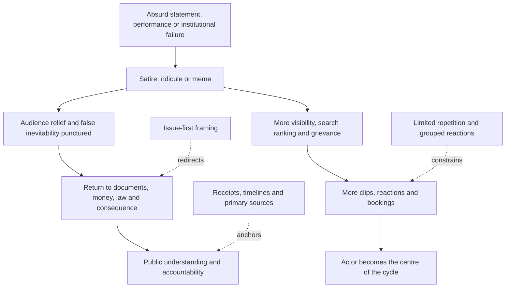

# 🃏 How To Cover Farce Without Becoming It  
**First created:** 2026-07-17 | **Last updated:** 2026-07-17  
*Practical media guidance for using humour, absurdity, and satire to expose spectacle politics without converting accountability into entertainment infrastructure.*

---

## 🛰️ Orientation

Some political events are genuinely ridiculous.

The costumes are ridiculous.

The slogans are ridiculous.

The administrative incompetence is ridiculous.

The contradictions are ridiculous.

The visible actor may be vain, theatrical, incoherent, or plainly out of their depth.

None of that makes the underlying system harmless.

Farce can reveal:

- weak institutions
- elite indulgence
- donor capture
- legal impunity
- operational failure
- authoritarian fantasy
- administrative decay
- violence hidden behind theatrical incompetence

The newsroom problem is not whether to laugh.

The problem is how to laugh without allowing the joke to become:

- free advertising
- personality branding
- emotional escape from evidence
- permission to underestimate risk
- a substitute for accountability

> The actor may be ridiculous.  
> The infrastructure carrying them may not be.

---

## ✨ Key Features

- Distinguishes comic presentation from material consequence.
- Uses satire to puncture false inevitability.
- Prevents ridicule from becoming promotional distribution.
- Keeps money, documents, law, power, and cost bearers in frame.
- Separates laughing at power from laughing at people harmed by it.
- Identifies when humour clarifies and when it obscures.
- Protects reporting from meme-cycle capture.
- Provides practical headline, visual, interview, and clipping rules.
- Preserves evidential discipline around motive, competence, and danger.

---

## 🧿 Core Rule

> Use humour to reveal the power relation.  
> Do not use humour to replace the power analysis.

A joke is useful when it makes something easier to see.

It is dangerous when it makes the audience feel that seeing the joke is equivalent to understanding the system.

Satire may expose:

- hypocrisy
- inflated seriousness
- fake inevitability
- status anxiety
- contradiction
- administrative absurdity
- the gap between power and competence

But the joke does not answer:

- who paid
- who benefited
- who authorised
- who was harmed
- what rule applied
- what capacity remains
- who carries liability
- what happens next

The joke opens the door.

The documents still need to walk through it.

---

# 🃏 Farce As Political Method

Farce is not always accidental.

A political actor may use absurdity to:

- dominate attention
- exhaust critics
- create plausible deniability
- blur seriousness and irony
- make correction look humourless
- convert failure into performance
- turn accountability into a fandom dispute
- generate clips
- recruit through transgression
- force institutions onto their emotional clock

The actor can move between:

- “I was serious”
- “I was joking”
- “You took it out of context”
- “The establishment cannot take a joke”
- “Everyone understood what I meant”

This ambiguity is useful.

It allows the actor to test a claim without fully owning it.

---

## 🎭 Weaponised Unseriousness

Weaponised unseriousness occurs when an actor uses comic ambiguity to avoid responsibility.

Common forms include:

- deliberately absurd proposals
- offensive jokes presented as policy signals
- meme language
- theatrical threats
- exaggerated self-presentation
- intentional misspeaking
- ironic extremist references
- staged incompetence
- repeated “jokes” that establish a political frame

The humour does not erase the political function.

Ask:

- What idea was introduced?
- Which audience was being signalled to?
- What conduct became more thinkable?
- Who was threatened or degraded?
- What later action used the same frame?
- Was the ambiguity preserved deliberately?

Do not force every bad joke into a coordinated strategy.

Do not let “it was a joke” end the analysis.

---

# 🪞 Satire As Deflation

Spectacle politics depends on inflated seriousness.

It wants the audience to accept:

- grandeur
- inevitability
- masculinity
- historic destiny
- personal exceptionalism
- the leader as the centre of reality

Satire can puncture that pose.

It can reveal that:

- the emperor is underdressed
- the strongman is dependent
- the insurgent is subsidised
- the rebel has a broadcast contract
- the financial genius needs a bailout
- the anti-establishment movement is full of establishment intermediaries

That deflation matters.

False inevitability is a political asset.

Ridicule can reduce its value.

---

## 🫧 Decompression

Humour can also help audiences metabolise fear.

It can:

- make an overwhelming story approachable
- create emotional distance
- restore agency
- interrupt authoritarian grandeur
- permit discussion of difficult material
- expose contradiction quickly

This is not trivial.

People cannot remain at maximum alarm indefinitely.

But decompression should return the audience to reality.

A joke that provides relief and then restores the evidence is useful.

A joke that permits permanent avoidance is not.

---

# ⚠️ The Underestimation Trap

Ridiculous actors can still cause serious harm.

Incompetence can coexist with:

- coercive power
- institutional access
- large audiences
- money
- weapons
- legal authority
- platform reach
- protection from consequences

Farce can cause observers to assume:

- the actor cannot win
- the system cannot function
- the threat is too silly to be real
- institutions will correct themselves
- the public will eventually become embarrassed

History does not guarantee that ridicule defeats power.

A foolish actor may still be carried by serious infrastructure.

> Comic incompetence is not the same as political incapacity.

---

## 🏗️ Keep The Infrastructure In Frame

Whenever coverage focuses on a ridiculous personality, also ask:

- Who funds them?
- Who books them?
- Who distributes them?
- Who provides legal support?
- Who converts attention into money?
- Which officials accommodate them?
- Which platform recommends them?
- Which institutions treat them as unavoidable?
- Who benefits if the public focuses on the personality rather than the structure?

The personality may be bait.

The system may be the hook.

---

# 📡 Ridicule Is Still Distribution

A mocking headline can still strengthen:

- name recognition
- search ranking
- recommendation
- grievance
- fundraising
- in-group loyalty
- persecution narratives

Every repetition teaches the distribution system that the actor matters.

This does not mean never using the name or image.

It means asking whether the joke adds:

- understanding
- evidence
- context
- public protection

or merely another unit of attention.

> A joke can puncture the pose and still feed the algorithm.

Both effects can be true.

---

## 🧲 Meme-Cycle Capture

The meme cycle may work like this:

1. actor produces absurd statement or image
2. critics mock it
3. meme spreads
4. actor’s supporters circulate the mockery as proof of persecution
5. media report the meme’s popularity
6. commercial AI summarises the controversy
7. the actor receives more visibility and bookings

The actor may lose dignity.

They may gain reach.

The newsroom should distinguish:

- reputational damage
- distribution gain
- fundraising gain
- political capacity
- actual public persuasion

---

# 🎯 What The Joke Should Do

A useful political joke should ideally do at least one of these:

- expose contradiction
- reveal dependency
- puncture false inevitability
- clarify a power relation
- identify hypocrisy
- make hidden paperwork memorable
- protect the audience from intimidation
- direct attention toward the material issue

A weaker joke merely:

- repeats the actor’s name
- reproduces the offensive line
- mocks appearance
- rewards theatrical behaviour
- creates a reusable campaign asset
- invites harassment
- obscures the harmed party
- turns politics into fandom

The test is not whether the joke is funny.

It is whether it improves public understanding.

---

## 🧾 Attach The Receipt

Satire becomes more resilient when attached to evidence.

Useful pairings include:

- cartoon + contract
- joke + timeline
- parody + declaration record
- satirical caption + ownership map
- comic clip + legal-status box
- absurd quote + documented contradiction
- meme + primary source

The joke helps the audience remember.

The receipt keeps the joke accountable.

> Satire breaks the spell.  
> Investigation follows the money.

---

# 📰 Headline Discipline

Avoid headlines that merely reproduce the spectacle:

- “X in bizarre rant”
- “X mocked after outrageous claim”
- “Internet erupts over X”
- “X becomes a meme”
- “X humiliated”
- “X hits back at critics”

These may create attention without adding public-interest value.

Prefer headlines that lead with:

- the material contradiction
- the financial relationship
- the policy consequence
- the institutional failure
- the documentary gap

Example:

Weak:

> Politician mocked for chaotic launch speech.

Stronger:

> Launch speech obscures unresolved questions over funding, staffing, and legal responsibility.

The absurdity may appear in the story.

It should not automatically become the story architecture.

---

# 🎨 Visual Discipline

Political farce often arrives through strong images.

Before publishing a visual, ask:

- Does this show a material fact?
- Does it clarify the contradiction?
- Does it humiliate a vulnerable person rather than a powerful actor?
- Will it become free campaign merchandise?
- Does cropping remove important context?
- Is the image current?
- Is it synthetic or manipulated?
- Are private individuals visible?
- Does repetition increase harm?

Use visual humour to expose power.

Do not use it to turn harmed people into scenery.

---

# 🎙️ Interviewing The Farce

Do not become the comic straight person in the guest’s routine.

Avoid:

- performative disbelief
- competitive sarcasm
- escalating insults
- allowing the guest to control the rhythm through outrageous claims
- turning the interview into a clip contest

Use:

- short documentary questions
- precise dates
- role clarification
- mechanism questions
- document requests
- status statements

Example:

> You have described this as a joke. Which part was not intended as policy?

Then:

> Was the proposal discussed with staff, donors, officials, or advisers?

Then:

> Is there a document recording that discussion?

The objective is not to prove that the guest is ridiculous.

The public can often see that.

The objective is to establish what the ridiculous performance was doing.

See [`🎙️_how_to_cover_and_interview.md`](./🎙️_how_to_cover_and_interview.md).

---

# 🛡️ Laugh Up The Power Gradient

The safest target of satire is usually:

- power
- hypocrisy
- wealth
- impunity
- institutional absurdity
- inflated status
- coercive seriousness

Take care where the joke lands on:

- survivors
- complainants
- disabled people
- junior staff
- migrants
- poor people
- private individuals
- people caught in public systems they do not control

A powerful person’s ridiculous behaviour may be fair material.

The vulnerability of the people harmed by it is not the punchline.

---

## 🩹 Harmed People Are Not Props

Coverage should not use:

- victims’ distress
- leaked private material
- medical information
- courtroom emotion
- harassment footage
- family members

as comic texture around a spectacle actor.

The story may contain farce.

The harm remains real.

Keep reverence where reverence is required.

---

# 🧠 The Farce Diagnostic

Before publishing, ask:

- What is the material public-interest issue?
- What does the humour reveal?
- What evidence accompanies it?
- Who receives the attention?
- Who receives the money?
- Who becomes the punchline?
- Does the piece weaken false inevitability?
- Does it underestimate operational danger?
- Would the story still matter without the comic image?
- Does the joke direct the audience toward the documents?
- Are we laughing at power or at damage?
- Are we clarifying the system or merely enjoying the chaos?

---

## 🧯 Anti-Farce Practice

Better patterns include:

- one sharp joke rather than twenty reaction items
- issue-first headlines
- limited name repetition
- visual context
- receipts beside satire
- grouped meme coverage
- consequence-led follow-up
- local reporting
- ownership and money maps
- clear separation of comic presentation and material harm
- stopping once the joke has done its explanatory work

Do not serialise the farce merely because it is easy content.

---

# 🔁 Farce-To-Accountability Route

The newsroom’s job is to route the joke toward accountability rather than allowing it to loop back into personality distribution.

---

## ⚖️ Evidence Discipline

Preserve the distinctions:

- ridiculous is not harmless
- incompetence is not incapacity
- humour is not evidence
- satire is not defamation immunity
- ridicule is not accountability
- virality is not persuasion
- reputational damage is not loss of political capacity
- ironic language is not always insincere
- offensive humour is not automatically a policy commitment
- “it was a joke” is not automatic exoneration
- repeated absurdity is not proof of central coordination
- laughter is not consent
- serious analysis is not required to be humourless

Use categories such as:

- documented conduct
- public statement
- performance
- satire
- reaction
- policy consequence
- institutional action
- financial relationship
- legal process
- analytical inference
- unresolved question

---

## 🧪 What Would Disconfirm The Concern?

Evidence that humorous coverage is serving the public may include:

- the joke clearly exposes a material contradiction
- the underlying documents receive greater attention
- audiences understand the power relation more accurately
- the coverage does not materially increase the actor’s political capacity
- vulnerable people are protected
- later reporting follows the money, law, and institutional consequence
- humour improves accessibility without reducing accuracy
- the actor’s false inevitability genuinely weakens

A meme may be the fastest accurate explanation.

A ridiculous statement may itself be a material development.

A comic format may reach audiences traditional reporting does not.

The model should preserve those possibilities.

---

## ✨ Working Rules

> The actor may be ridiculous.  
> The infrastructure carrying them may not be.

> Use humour to reveal the power relation.  
> Do not use humour to replace the power analysis.

> Comic incompetence is not the same as political incapacity.

> A joke can puncture the pose and still feed the algorithm.

> Laugh up the power gradient.

> The joke opens the door.  
> The documents still need to walk through it.

> Satire breaks the spell.  
> Investigation follows the money.

> Do not serialise the farce merely because it is easy content.

---

## 🌌 Constellations

🃏 🎭 📡 🧾 🛡️ — farce; weaponised unseriousness; distribution; receipts; protection of people with less power.

---

## ✨ Stardust

farce, satire, spectacle politics, humour, ridicule, political memes, hostile amplification, evidence, media cycle, accountability, public harm

---

## 🏮 Footer

*How To Cover Farce Without Becoming It* is a living node of the **Polaris Protocol**.  
It provides practical guidance for using humour to puncture false inevitability, expose power, and decompress public attention without converting ridicule into free distribution or allowing the joke to replace the evidence.  
Its function is to keep the material system, the harmed people, and the final cost bearer visible beneath the spectacle.

> 📡 Cross-references:
>
> - [`📺_media_cycle_capture.md`](./📺_media_cycle_capture.md) — *hostile amplification, temporal capture, and personality distribution*
> - [`📰_quality_as_click_resilience.md`](./📰_quality_as_click_resilience.md) — *satire, production value, and reporting that remains useful after the spike*
> - [`🎙️_how_to_cover_and_interview.md`](./🎙️_how_to_cover_and_interview.md) — *documentary questioning and anti-spectacle interview discipline*
> - [`📺_media_ownership_and_platform_power.md`](../👹_Collision_Systems/📺_media_ownership_and_platform_power.md) — *distribution, recommendation, search, and audience transfer*
> - [`🌫️_public_distrust_and_algorithmic_overload.md`](../👹_Collision_Systems/🌫️_public_distrust_and_algorithmic_overload.md) — *overload, recursive reaction, and public ranking failure*
> - [`💰_far_right_political_finance.md`](../👹_Collision_Systems/💰_far_right_political_finance.md) — *movement finance, media support, and attention as capacity*
> - [`⏱️_temporal_hygiene_rhythm_not_panic.md`](../🌀_Core_Model/⏱️_temporal_hygiene_rhythm_not_panic.md) — *event, reaction, correction, institutional, and consequence clocks*
>
> 🏮 Return To:
>
> - [`🗞️_Media_Practice`](./) — *current practical media cluster*
> - [`🗻_The_Manifestation_Molehill`](../) — *media-facing pack on colliding confidence systems*
> - [`👻_Ghosts_Of_Accountability`](../../) — *parent accountability cluster*
> - [`📲_Press_Matters`](../../../) — *press and media-analysis layer*
> - [`🌓_3_In_The_Moment`](../../../../) — *current-events and active-pattern layer*

*Survivor authorship is sovereign. Containment is never neutral.*

_Last updated: 2026-07-17_
