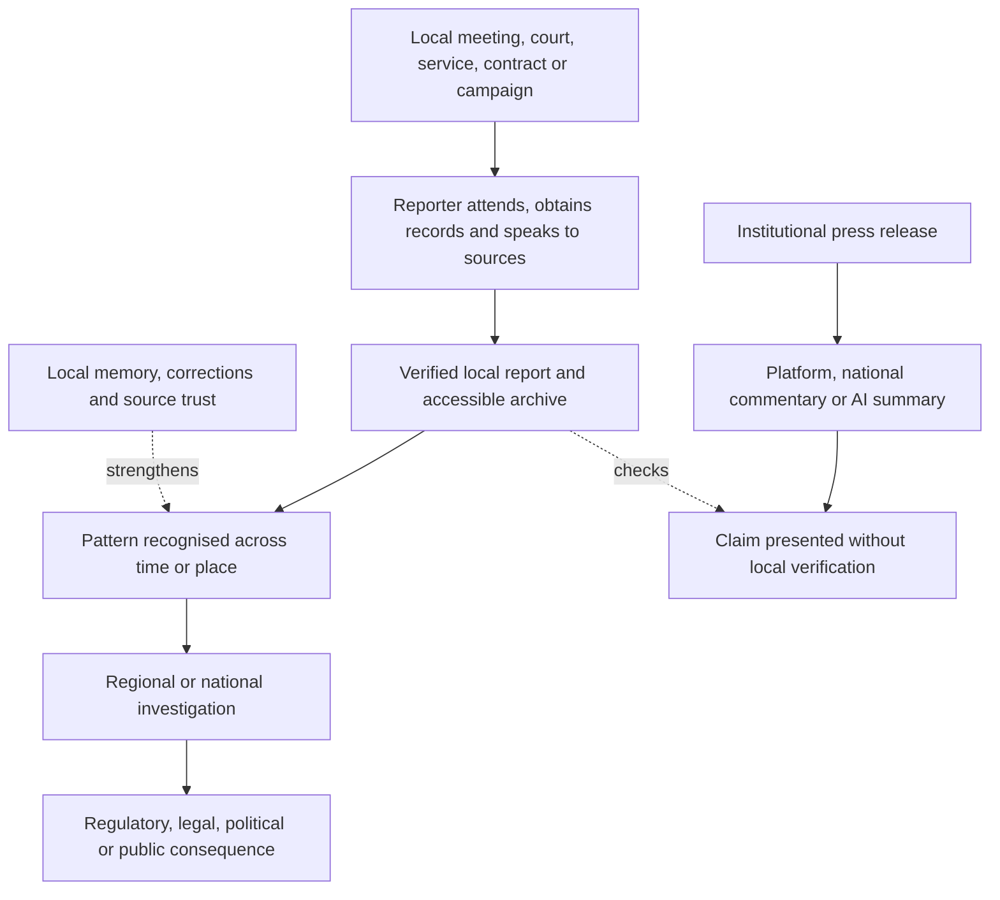

# 🏘️ Local Journalism As Resilience Infrastructure  
**First created:** 2026-07-17 | **Last updated:** 2026-07-17  
*Why local reporting is not a nostalgic media category but source, memory, verification, and early-warning infrastructure for democratic life.*

---

## 🛰️ Orientation

Local journalism is often discussed as though it were a smaller version of national journalism.

It is not.

It performs functions that national outlets, platforms, and commercial AI cannot safely reproduce from a distance.

Local reporters:

- attend
- notice
- remember
- compare
- recognise
- follow up
- know who is missing
- know which answer was promised before
- know when a national claim does not match local reality

They create the source material everyone else later tries to summarise.

Without local reporting, the information environment does not merely become quieter.

It loses ground truth.

> When local journalism disappears, national narratives lose their ground truth.

---

## ✨ Key Features

- Treats local journalism as democratic and civic infrastructure.
- Separates source creation from later summarisation.
- Maps local reporting as institutional memory.
- Identifies verification deserts, not merely news deserts.
- Shows how local reporting detects false grassroots activity.
- Connects courts, councils, planning, procurement, policing, health, schools, and local business.
- Explains the early-warning value of repeated small anomalies.
- Protects against national personality capture and algorithmic distortion.
- Examines sustainable funding without sacrificing editorial independence.
- Provides practical resilience tests and public-interest diagnostics.

---

## 🧿 Core Proposition

A national story may claim:

- a movement is growing
- a policy is working
- a community is angry
- a candidate has local support
- a contractor is delivering
- a public body has acted
- an event was spontaneous
- a crisis is contained

Local journalism can test those claims against:

- attendance
- minutes
- court records
- budgets
- planning applications
- staffing
- procurement
- local sources
- visible consequence

The national system often provides the frame.

The local reporter checks whether the frame touches reality.

---

# 🧱 Source Creation, Not Content Replication

AI can summarise a council meeting after someone reports it.

It cannot reliably know:

- which agenda item matters
- which paragraph changed
- which promise disappeared
- which contractor keeps returning
- which councillor has altered position
- why an evasive answer matters locally
- who should have attended but did not
- what residents have been warning about for years

Local reporting creates information that did not previously exist in public form.

That is different from:

- aggregation
- summarisation
- commentary
- synthetic explanation
- platform reaction

> You cannot automate the summary of reporting that nobody was funded to do.

---

## 🪑 Attendance Is A Reporting Technology

Being physically or institutionally present matters.

Attendance allows a reporter to observe:

- tone
- hesitation
- procedural confusion
- who speaks
- who does not
- who leaves
- who meets privately
- what is omitted from the press release
- how the official record differs from the lived event

Not every meeting requires physical presence.

Remote access can expand coverage.

But reporting cannot be reduced to processing published documents after the institution has selected what becomes visible.

---

# 🧠 Institutional Memory

Local journalism remembers across cycles that institutions would prefer to treat separately.

It can connect:

- today’s contractor with a previous failure
- a new planning promise with an abandoned commitment
- a police assurance with an earlier complaint
- a budget cut with a later service crisis
- a political donor with a local development
- a renamed organisation with its previous record
- a fresh consultation with an old predetermined decision

Institutional memory is not trivia.

It is a constraint on repeated deception.

> A public body can rebrand the programme.  
> A reporter may remember the invoices.

---

## 🗂️ The Local Archive

A resilient local archive may contain:

- council minutes
- court reports
- planning decisions
- election records
- procurement notices
- public-health reports
- school-governance records
- police statements
- business closures
- local campaigns
- correction history
- promises and outcomes

The archive allows a community to ask:

- What was known?
- When was it known?
- Who said what?
- What changed?
- Who benefited?
- Who carried the cost?

Without an accessible archive, each controversy can be presented as unprecedented and context-free.

---

# 🏜️ Verification Deserts

“News desert” describes the loss of local outlets.

“Verification desert” describes the democratic consequence.

A verification desert may contain:

- active institutions
- political campaigns
- public contracts
- courts
- policing
- development
- organised interests

but no reporter with the time and knowledge to check them consistently.

The vacuum is filled by:

- institutional press releases
- neighbourhood rumour
- political Facebook pages
- campaign material
- national personalities
- platform trends
- automated summaries
- anonymous local accounts

The volume of information may remain high.

The verification base collapses.

---

## 🌵 What Grows In The Desert

Verification deserts make it easier for:

- fake grassroots campaigns
- donor-backed local fronts
- contractor failure
- planning opacity
- extremist organising
- public-service neglect
- corruption
- environmental harm
- intimidation
- misinformation

to persist without joined-up scrutiny.

This does not mean every unreported local problem is a conspiracy.

It means the community has fewer mechanisms for distinguishing:

- isolated complaint
- repeated pattern
- political claim
- documented failure

---

# 🌱 Early-Warning Infrastructure

Large failures often begin as small local anomalies.

A local reporter may notice:

- recurring procurement irregularities
- unusual staff turnover
- repeated safety complaints
- unexplained meeting cancellations
- missing declarations
- sudden organisational renaming
- coordinated attendance
- repeated property purchases
- changing policing practice
- a widening gap between official assurance and public experience

Each item may be minor.

Together, they may form an early-warning pattern.

National journalism often arrives after:

- litigation
- scandal
- financial collapse
- violence
- regulatory intervention

Local journalism may see the preconditions.

---

## 🔔 Weak Signals

Weak signals require:

- continuity
- local knowledge
- source trust
- patience
- editorial support
- legal protection
- time to compare records

A newsroom organised only around immediate traffic will struggle to retain them.

The value of a weak signal may become visible years after the first report.

This makes local journalism difficult to price through daily clicks alone.

---

# 🏛️ The Democratic Beat

Local resilience depends on beats that appear ordinary until they fail.

## Councils

- budgets
- contracts
- planning
- housing
- social care
- transport
- licensing
- standards

## Courts

- criminal proceedings
- civil disputes
- housing possession
- employment
- family and safeguarding boundaries
- regulatory enforcement

## Health

- service closures
- waiting times
- public-health decisions
- care provision
- procurement
- workforce pressure

## Education

- school governance
- exclusions
- special-needs provision
- academy finance
- university decisions
- safeguarding

## Policing

- public-order practice
- local crime patterns
- misconduct
- custody
- stop and search
- community confidence

## Environment And Planning

- flooding
- pollution
- development
- land use
- infrastructure
- local consent

These beats create a continuous public record.

They should not have to become national scandals before they are treated as journalism.

---

# 🧾 Courts As Public Memory

Court reporting is particularly important because legal processes may establish:

- allegations
- evidence
- findings
- judgments
- sentencing
- settlement
- enforcement

Without careful local court reporting:

- rumour may replace the record
- legal stages may collapse into one another
- minor cases may disappear
- powerful parties may face less scrutiny
- harmful details may circulate without context
- judgments may remain technically public but practically invisible

Court access without reporting is not the same as public understanding.

---

# 🧭 Testing National Claims Locally

Local reporting can test claims such as:

### “The movement has real grassroots support.”

Ask:

- Is there a local organisation?
- Who runs it?
- Who funds the venue?
- How many people attend?
- Are the same organisers travelling between locations?
- Is the campaign locally initiated or centrally supplied?

### “The policy is working.”

Ask:

- What changed in service delivery?
- Who gained access?
- Who lost access?
- Did waiting times fall?
- Did staff numbers change?
- Did the budget move elsewhere?

### “The community is furious.”

Ask:

- Which community?
- Who was consulted?
- What do local election, meeting, and survey records show?
- Are national commentators substituting for local voices?

### “The contractor delivered.”

Ask:

- On time?
- At what cost?
- To what specification?
- With what remedial work?
- Who signed it off?
- What happened after the press release?

---

# 🌿 False Grassroots And Local Fronts

Astroturfing is easier where no one knows the local terrain.

Signals may include:

- identical campaign materials
- newly registered groups
- shared directors or addresses
- centralised digital assets
- imported speakers
- unclear funding
- abrupt media prominence
- little prior local activity
- coordinated attendance without continuing organisation

None of these proves a false grassroots campaign alone.

Local reporting provides the context needed to distinguish:

- a genuinely new movement
- national support for local organising
- professional campaigning
- donor-created political theatre

---

# 📺 Resistance To National Personality Capture

National coverage often turns local politics into a story about:

- one party leader
- one broadcaster
- one viral clip
- one culture-war frame
- one national poll

Local journalism can restore:

- service delivery
- named decisions
- local costs
- actual candidates
- public records
- community variation

The national personality may visit for one day.

The local consequences remain.

> The national story leaves.  
> The bins, court list, school budget, and planning decision do not.

---

# 🤖 Local Journalism And Commercial AI

Commercial AI can support local journalism through:

- transcription
- archive search
- document comparison
- translation
- accessibility
- meeting-summary drafts
- anomaly detection
- structured data extraction

But it cannot safely replace:

- attendance
- source judgment
- community trust
- legal responsibility
- contextual memory
- decisions about what matters
- protection of vulnerable sources
- follow-up

A model may find a changed number.

A reporter decides whether the change matters and who bears the cost.

AI can assist local memory.

It cannot become the only witness.

---

# 🧲 Platform Distortion

Platforms may distort local information by rewarding:

- conflict
- novelty
- visual drama
- personality
- outrage
- national frames

Slow local reporting may lose visibility to:

- rumours
- campaign pages
- decontextualised clips
- national influencers
- automated content
- paid promotion

This creates a perverse system:

- the local reporter produces the source
- the platform rewards the reaction
- the national outlet takes the frame
- the community struggles to find the original reporting

Source prominence and local discoverability are therefore infrastructure questions.

---

# 💷 Funding Resilience

Local journalism requires funding models that do not convert public dependence into political control.

Possible models include:

- subscriptions
- membership
- cooperatives
- nonprofit ownership
- charitable support
- public-interest funds
- university partnerships
- syndication
- shared service organisations
- local advertising
- events
- mixed revenue

No model is automatically safe.

Each should be tested for:

- editorial independence
- donor concentration
- transparency
- sustainability
- accessibility
- legal support
- workforce conditions
- community accountability

---

## 🏛️ Public Funding With Safeguards

Public support may be justified because local journalism creates public goods that markets systematically underprovide.

Safeguards may include:

- arm’s-length allocation
- transparent criteria
- multi-year funding
- independent governance
- publication of grants
- protection from ministerial direction
- plural local providers
- strong correction standards
- no requirement for favourable coverage

Public funding without independence becomes patronage.

Market funding without sufficient revenue becomes collapse.

The design problem is real.

It is not solved by pretending the infrastructure is optional.

---

## 🤝 Shared Infrastructure

Small local outlets may benefit from shared:

- legal advice
- data tools
- document storage
- cybersecurity
- training
- insurance
- payroll
- investigations support
- public-record expertise
- syndication
- accessibility services

Shared infrastructure can reduce cost without centralising editorial voice.

The goal is not to make every local outlet identical.

It is to stop each reporter having to rebuild the entire institutional stack alone.

---

# 🧑‍💼 Workforce Resilience

Local reporting cannot be resilient if reporters are:

- underpaid
- isolated
- legally exposed
- harassed
- expected to cover every beat
- dependent on unstable freelance income
- denied time for source development
- replaced by press-release processing

Workforce resilience includes:

- sustainable pay
- manageable beats
- legal protection
- trauma support
- physical safety
- editorial backing
- training
- succession planning
- routes into the profession

A community relationship cannot be maintained by a permanently rotating exhausted workforce.

---

# 🛡️ Source And Community Protection

Local journalists often report within communities where:

- everyone knows one another
- anonymity is difficult
- retaliation is visible
- institutions overlap
- family and employment ties matter

Protection requires care with:

- identification
- small-number data
- medical information
- safeguarding
- court restrictions
- immigration status
- employment vulnerability
- private addresses
- community stigma

“Local” does not mean low risk.

Sometimes proximity increases risk.

---

# 🧰 Local Resilience Package

A resilient local newsroom might maintain:

- council and committee tracker
- court-reporting rota
- planning database
- procurement map
- promise-and-outcome log
- public-body contacts directory
- ownership and donor records
- correction archive
- local election guide
- service-closure tracker
- searchable document library
- weekly “what changed / what did not” briefing
- secure source channel
- partnership with specialist national reporters

This is not bureaucratic decoration.

It is memory infrastructure.

---

## 🧠 Local Journalism Diagnostic

Ask:

- What information would disappear without this reporter?
- Which institutions receive routine scrutiny?
- Are courts and councils covered?
- Is there an accessible archive?
- Can residents identify who made a decision?
- Are ownership and funding transparent?
- Does the outlet correct visibly?
- Are local voices used as sources rather than scenery?
- Can the newsroom sustain a story after national attention leaves?
- Is the outlet creating source material or mainly rewriting it?
- Are reporters protected from legal and physical retaliation?
- Can the community distinguish reporting from political content?

---

## 🧯 Common Failure Modes

- parachute reporting
- press-release dependence
- personality-led coverage
- donor concentration
- advertorial confusion
- inaccessible paywalls around essential civic information
- no correction archive
- no court coverage
- no institutional memory
- isolated reporters
- unmanaged legal risk
- national stories using local people as atmosphere
- AI filler replacing source creation
- treating community Facebook pages as verified public opinion

---

# 🔁 Local-to-National Verification Route

National accountability is often built from local observations that someone was funded to remember.

---

## ⚖️ Evidence Discipline

Preserve the distinctions:

- local is not automatically accurate
- proximity is not independence
- community trust is not universal trust
- attendance is not complete knowledge
- a weak signal is not proof of a pattern
- repeated complaints are not automatically verified
- public funding is not automatically political control
- nonprofit status is not automatic independence
- platform popularity is not local representation
- a national frame may sometimes be correct
- AI assistance is not source creation
- an official record may still require interpretation

Use categories such as:

- meeting record
- court record
- public document
- direct observation
- named source
- protected source
- community report
- institutional statement
- verified pattern
- analytical inference
- unresolved question

---

## 🧪 What Would Disconfirm The Concern?

Evidence against the strongest version of the argument may include:

- reliable national or regional coverage maintaining local scrutiny
- well-designed public data replacing some routine reporting functions
- community organisations producing transparent, verified records
- AI tools materially expanding rather than replacing local reporting
- sustainable local outlets emerging without conventional newsroom structures
- public institutions publishing unusually complete, usable, and correct records
- strong cross-regional investigative partnerships filling local gaps

Not every meeting requires a reporter in the room.

Not every community needs the same newsroom model.

A small digital outlet may provide stronger scrutiny than a legacy newspaper.

The model should preserve those possibilities.

---

## ✨ Working Rules

> When local journalism disappears, national narratives lose their ground truth.

> You cannot automate the summary of reporting that nobody was funded to do.

> A public body can rebrand the programme.  
> A reporter may remember the invoices.

> A verification desert can remain full of content.

> The national story leaves.  
> The local consequence remains.

> AI can assist local memory.  
> It cannot become the only witness.

> The outlet should create source material, not merely process everybody else’s claims.

> Local journalism is not nostalgia.  
> It is reality infrastructure.

---

## 🌌 Constellations

🏘️ 🪑 🗂️ 🏜️ 🔔 🏛️ — local journalism; attendance; archives; verification deserts; early warning; democratic beats.

---

## ✨ Stardust

local journalism, news deserts, verification deserts, councils, courts, institutional memory, source creation, public records, local democracy, ai summaries, resilience infrastructure

---

## 🏮 Footer

*Local Journalism As Resilience Infrastructure* is a living node of the **Polaris Protocol**.  
It treats local reporting as source creation, institutional memory, verification, early warning, and democratic infrastructure rather than a smaller commercial version of national media.  
Its function is to preserve ground truth, sustain public records, and keep national narratives answerable to the places where consequences are actually lived.

> 📡 Cross-references:
>
> - [`📰_quality_as_click_resilience.md`](./📰_quality_as_click_resilience.md) — *original reporting, institutional value, and resistance to summary substitution*
> - [`📺_media_cycle_capture.md`](./📺_media_cycle_capture.md) — *national personality capture, reaction loops, and temporal distortion*
> - [`🎙️_how_to_cover_and_interview.md`](./🎙️_how_to_cover_and_interview.md) — *documentary questions, source protection, and public-record construction*
> - [`🃏_how_to_cover_farce_without_becoming_it.md`](./🃏_how_to_cover_farce_without_becoming_it.md) — *keeping local consequences visible beneath national spectacle*
> - [`🌫️_public_distrust_and_algorithmic_overload.md`](../👹_Collision_Systems/🌫️_public_distrust_and_algorithmic_overload.md) — *verification loss, overload, synthetic corroboration, and public re-entry*
> - [`📺_media_ownership_and_platform_power.md`](../👹_Collision_Systems/📺_media_ownership_and_platform_power.md) — *ownership, prominence, recommendation, and local discoverability*
> - [`🧾_donor_provenance_and_civil_liability.md`](../👹_Collision_Systems/🧾_donor_provenance_and_civil_liability.md) — *source of funds, ownership, claims, enforcement, and collectability*
> - [`⏱️_temporal_hygiene_rhythm_not_panic.md`](../🌀_Core_Model/⏱️_temporal_hygiene_rhythm_not_panic.md) — *event, publication, recognition, institutional, and consequence clocks*
>
> 🏮 Return To:
>
> - [`🗞️_Media_Practice`](./) — *current practical media cluster*
> - [`🗻_The_Manifestation_Molehill`](../) — *media-facing pack on colliding confidence systems*
> - [`👻_Ghosts_Of_Accountability`](../../) — *parent accountability cluster*
> - [`📲_Press_Matters`](../../../) — *press and media-analysis layer*
> - [`🌓_3_In_The_Moment`](../../../../) — *current-events and active-pattern layer*

*Survivor authorship is sovereign. Containment is never neutral.*

_Last updated: 2026-07-17_
