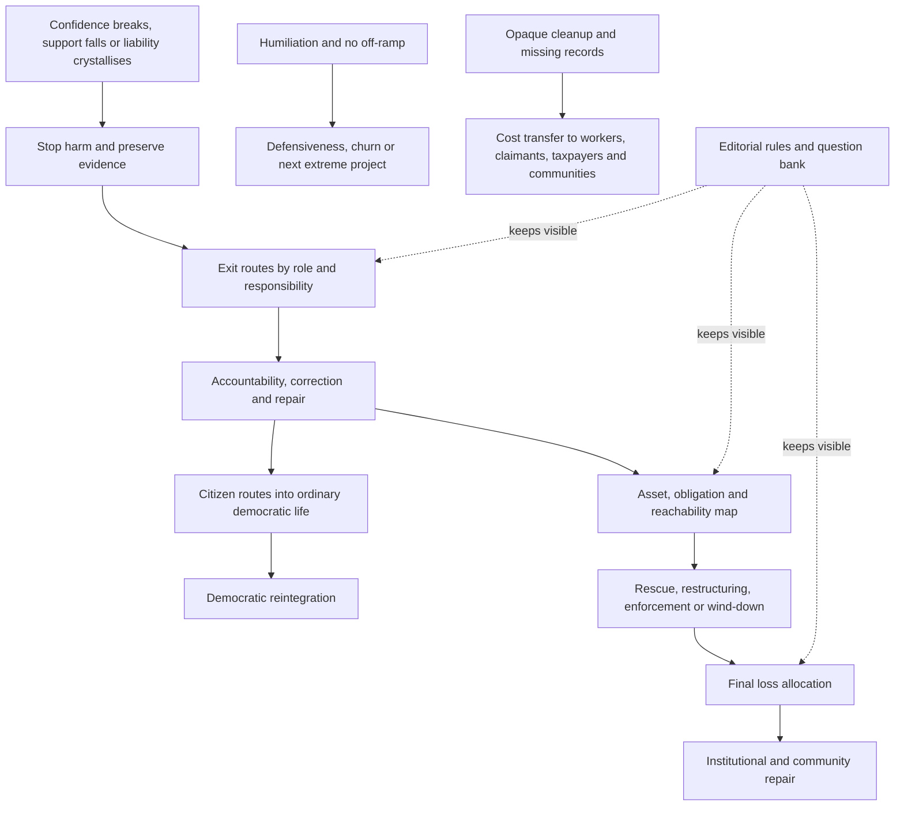

# 🧹 Exit And Cleanup  
**First created:** 2026-07-17 | **Last updated:** 2026-07-17  
*How people leave fragile confidence systems, how democratic life receives them, who inherits the damage, and how journalism reports the aftermath without manufacturing another cycle.*

---

## 🛰️ Orientation

The Manifestation Molehill does not end when confidence breaks.

It ends when four questions can be answered:

1. How do people leave?
2. Where do citizens go next?
3. Who carries the material cost?
4. How should the story be reported through repair and cleanup?

Collapse without exit creates churn.

Exposure without reintegration creates recruitment surfaces.

Judgment without recovery leaves claimants waiting.

Rescue without conditions can preserve the same power that caused the harm.

Coverage without cleanup can turn the aftermath into one more spectacle cycle.

This folder is the landing sequence.

> The story is not complete when the confidence breaks.  
> It is complete when the exit route, repair obligation, and final cost bearer are visible.

---

## ✨ Key Features

- Routes readers through four exit-and-cleanup nodes.
- Separates exit, accountability, repair, reintegration, and exoneration.
- Gives citizens low-drama routes back into democratic life.
- Maps assets, obligations, rescue, wind-down, and loss allocation.
- Keeps workers, users, claimants, taxpayers, and communities visible.
- Prevents former insiders from converting late exit into instant authority.
- Treats journalism as part of democratic aftercare.
- Provides a compact operational rulebook and question bank.
- Connects public re-entry with material cleanup.
- Ends the wider Molehill with cost allocation rather than spectacle.

---

## 🧿 Core Proposition

Confidence systems are not repaired by simply proving that they failed.

People, institutions, and assets remain.

The aftermath may include:

- angry former supporters
- damaged public trust
- unresolved claims
- hidden records
- stranded workers
- unpaid suppliers
- public-service consequences
- exhausted communities
- media organisations searching for a new storyline

A democratic cleanup therefore needs:

- off-ramps
- boundaries
- evidence preservation
- ordinary civic routes
- loss allocation
- public-interest reporting
- recurrence prevention

The purpose is not to rescue every institution or absolve every participant.

It is to reduce future harm while making responsibility legible.

---

# 🧭 Reading Order

## 1. [`🚪_exit_routes_back_to_democracy.md`](./🚪_exit_routes_back_to_democracy.md)

Start with the system-level off-ramp.

This node explains:

- exit as a sequence
- doubt, friction, withdrawal, public exit, accountability, repair, and reintegration
- differentiated responsibility by power and conduct
- exit churn
- the next-extreme-project problem
- anti-rebranding safeguards
- journalism as exit infrastructure

Core question:

> How can people leave without erasing harm or being pushed into the next total explanation?

Core line:

> Democracy needs off-ramps, not victory laps.

---

## 2. [`🧭_citizen_routes_back_to_democracy.md`](./🧭_citizen_routes_back_to_democracy.md)

Move from system exit to citizen re-entry.

This node provides practical routes through:

- non-total institutions
- local democracy
- regulated news re-entry
- ordinary civic action
- small visible outcomes
- legitimate grievances separated from false explanations
- belonging without total belief

Core question:

> What ordinary democratic door can remain open after the political spectacle has collapsed?

Core line:

> People do not return to democracy through a trapdoor.  
> They return through ordinary doors that remain open.

---

## 3. [`🧹_cleanup_map_who_carries_the_cost.md`](./🧹_cleanup_map_who_carries_the_cost.md)

Then follow the money, obligations, and loss.

This node maps:

- assets
- debts
- guarantees
- insurance
- reachability
- insolvency
- rescue
- restructuring
- wind-down
- workers
- users
- public-sector exposure
- community and environmental cost

Core question:

> Who absorbs the loss after confidence, liquidity, or legal protection fails?

Core line:

> The collapse story is incomplete until the bill has an address.

---

## 4. [`📌_editorial_rules_and_question_bank.md`](./📌_editorial_rules_and_question_bank.md)

Finish with the operational endpoint.

This node provides:

- publication thresholds
- headline tests
- interview rules
- source-lineage discipline
- legal-stage labels
- protection rules
- topic-specific question banks
- final cost-bearer checks
- a “what changed / what did not” template

Core question:

> What should the newsroom publish, ask, update, correct, and carry forward?

Core line:

> Every confidence story should end with an exit route, a cost bearer, and a question that can still be answered with evidence.

---

# 🗂️ What Belongs Where

| Problem | Primary node |
|---|---|
| People are afraid to leave a failing movement | [`🚪_exit_routes_back_to_democracy.md`](./🚪_exit_routes_back_to_democracy.md) |
| Former insiders are seeking instant authority | [`🚪_exit_routes_back_to_democracy.md`](./🚪_exit_routes_back_to_democracy.md) |
| Citizens need ordinary civic routes | [`🧭_citizen_routes_back_to_democracy.md`](./🧭_citizen_routes_back_to_democracy.md) |
| Information overload blocks democratic re-entry | [`🧭_citizen_routes_back_to_democracy.md`](./🧭_citizen_routes_back_to_democracy.md) |
| Assets and obligations need tracing | [`🧹_cleanup_map_who_carries_the_cost.md`](./🧹_cleanup_map_who_carries_the_cost.md) |
| A rescue may preserve existing control | [`🧹_cleanup_map_who_carries_the_cost.md`](./🧹_cleanup_map_who_carries_the_cost.md) |
| A newsroom needs a fast operational checklist | [`📌_editorial_rules_and_question_bank.md`](./📌_editorial_rules_and_question_bank.md) |
| The legal stage or final cost bearer is unclear | [`📌_editorial_rules_and_question_bank.md`](./📌_editorial_rules_and_question_bank.md) |

---

# 🔄 Shared Repair Logic

Across the cluster, use this sequence:

1. **Stop further harm.**
2. **Preserve evidence.**
3. **Name the stage of exit or cleanup.**
4. **Differentiate responsibility by power, knowledge, benefit, and conduct.**
5. **Protect people with the least bargaining power.**
6. **Provide a practical off-ramp or civic route.**
7. **Map assets and surviving obligations.**
8. **Identify who retains control and upside.**
9. **Allocate the remaining loss.**
10. **Repair institutions and public records.**
11. **Prevent instant rebranding.**
12. **State what remains unresolved.**

The aim is not frictionless forgiveness.

It is accountable movement away from harm.

---

# 🚪 Exit, Repair And Reintegration Are Different

## Exit

Leaving the person, movement, platform, or project.

## Accountability

Acknowledging conduct, benefit, responsibility, or failure.

## Repair

Correcting, disclosing, cooperating, repaying, restoring, or accepting consequence.

## Reintegration

Returning to ordinary civic participation.

## Exoneration

A finding that relevant wrongdoing was not established.

These categories should not be collapsed.

A person may exit without repairing.

A person may participate democratically while still facing legal or professional consequences.

A public apology may not produce restitution.

A late defection may still reduce future harm.

Name the stage honestly.

---

# 🧱 Dignity And Boundaries

The cluster uses a dual rule:

> Dignity without indulgence.  
> Accountability without humiliation.

Dignity makes exit possible.

Boundaries prevent:

- harm erasure
- instant leadership
- media redemption arcs
- unsafe access
- forced forgiveness
- restoration of authority without evidence

Democratic reintegration does not require harmed people to absorb the emotional labour of someone else’s exit.

---

# 🧭 Democracy As Ordinary Practice

Democratic re-entry is strengthened by:

- limited-purpose institutions
- local journalism
- unions
- councils
- professional bodies
- community groups
- regulator processes
- public records
- visible correction
- small concrete outcomes

These settings teach:

- disagreement
- procedure
- compromise
- evidence
- shared responsibility
- exit without exile

The point is not to create a new total identity.

It is to restore democratic habit.

---

# 🧹 Cleanup As Political Allocation

Cleanup is often presented as technical administration.

It is a political decision about:

- priority
- access
- protection
- evidence
- ownership
- delay
- final loss

Ask:

- Which function is preserved?
- Which owner retains control?
- Which worker loses income?
- Which claimant waits?
- Which community inherits damage?
- Which public body absorbs cost?
- Which asset remains protected?
- Which archive disappears?

A system may collapse publicly while its most powerful participants retain the upside.

The cleanup map should make that visible.

---

# 🧾 Preserve The Record

Exit and cleanup both create incentives to:

- delete messages
- restructure entities
- rewrite timelines
- sell archives
- disperse staff
- blame junior people
- present late doubt as early resistance

Preserve:

- contracts
- declarations
- financial records
- internal communications
- ownership data
- policy drafts
- platform logs
- correction history
- user and claimant records
- local reporting archives

Cleanup without evidence preservation can become evidence destruction.

---

# 🏛️ Public Rescue Conditions

Where public money, guarantees, infrastructure, or emergency capacity are used, ask:

- What public function is being protected?
- What private loss is being absorbed?
- What conditions attach?
- Does ownership change?
- Do executives retain control?
- Are workers protected?
- Are claimants paid?
- Are records preserved?
- Does the rescue reduce recurrence?
- Can the public recover upside later?

A rescue should be judged by what it preserves and who it protects.

---

# 📰 Journalism Through The Aftermath

Journalism should not stop at:

- collapse
- resignation
- bankruptcy filing
- public apology
- donor withdrawal
- electoral defeat
- regulatory announcement

Follow through to:

- document disclosure
- enforcement
- actual recovery
- worker outcomes
- user access
- archive custody
- public cost
- civic reintegration
- recurrence prevention

The scandal story and the cleanup story are not the same story.

The second is often slower and more important.

---

# 🧰 Exit-And-Cleanup Workflow

## Recognition

- confidence breaks
- support falls
- liability crystallises
- liquidity weakens
- public trust fails

## Stabilisation

- stop harm
- protect essential functions
- preserve evidence
- secure people and records

## Exit

- identify routes for supporters, staff, donors, contractors, and office-holders
- prevent coercive retention
- distinguish movement from rebranding

## Repair

- correct claims
- disclose records
- cooperate
- repay or restore
- accept consequences

## Cleanup

- map assets
- map obligations
- establish priority
- assess insurance and guarantees
- reach available assets
- allocate remaining loss

## Reintegration

- provide ordinary civic routes
- restore local and institutional trust through conduct
- protect boundaries
- avoid instant authority

## Reporting

- state what changed
- state what did not
- identify the next process
- follow the cost bearer
- keep the correction able to catch up

---

# 🔄 Exit-And-Cleanup Route

The cluster succeeds when exit becomes possible, repair remains attached, and the final loss cannot disappear into abstraction.

---

## 🧠 Cluster Diagnostic

Ask:

- What stage are we in: doubt, exit, repair, cleanup, or reintegration?
- Who has power to leave?
- Who cannot leave?
- What responsibility follows each role?
- What records may disappear?
- What obligations survive?
- Which assets are reachable?
- Who retains control?
- Who is being asked to forgive?
- Who is being asked to pay?
- Is public money involved?
- Is a rescue preserving essential function or private power?
- Are citizens being offered ordinary democratic routes?
- Has the final cost bearer been named?
- What remains unresolved?

---

## 🧯 Common Failure Modes

- humiliation without off-ramp
- exit treated as exoneration
- former insiders granted instant authority
- confession replacing repair
- harmed people made responsible for reintegration
- ordinary supporters treated like senior organisers
- senior organisers treated like ordinary supporters
- public rescue without conditions
- evidence lost during restructuring
- workers and users paid last
- judgment reported as recovery
- closure reported as cleanup
- public cost hidden across institutions
- no local follow-through
- endless reaction coverage after the material story has moved on

---

## 🛡️ Common Buffers

- clear exit stages
- differentiated responsibility
- local civic routes
- non-total institutions
- evidence preservation
- transparent ownership
- accessible claims processes
- worker and user protections
- public-interest rescue conditions
- strong local journalism
- correction archives
- source-lineage records
- final cost-bearer reporting
- limits on restored authority
- recurrence prevention

---

## ⚖️ Evidence Discipline

Preserve the distinctions:

- doubt is not exit
- exit is not repair
- repair is not exoneration
- reintegration is not restored authority
- humiliation is not accountability
- public apology is not restitution
- collapse is not cleanup
- judgment is not recovery
- wealth is not collectability
- rescue is not bailout
- bailout is not innocence
- legal separation is not absence of shared exposure
- ordinary civic action is not ideological purity
- harmed people are not rehabilitation infrastructure
- a slower cleanup story is not a less important story

Use labels such as:

- doubt
- withdrawal
- public exit
- accountability
- correction
- disclosure
- repair
- reintegration
- asset
- obligation
- enforcement
- recovery
- public cost
- unresolved responsibility

---

## 🧪 What Would Disconfirm The Concern?

Evidence of healthy exit and cleanup may include:

- people leaving without entering a new total project
- differentiated accountability
- sustained ordinary civic participation
- factual correction and document disclosure
- cooperation with lawful processes
- workers and users protected
- records preserved
- reachable assets used
- public rescue carrying strong conditions
- final loss allocation made transparent
- archives and corrections maintained
- reduced recurrence risk
- harmed people not required to perform forgiveness

A rapid public exit may genuinely prevent harm.

A rescue may protect an essential function.

A former insider may provide decisive evidence.

The framework should preserve those possibilities.

---

## ✨ Working Rules

> The story is not complete when the confidence breaks.  
> It is complete when the exit route, repair obligation, and final cost bearer are visible.

> Democracy needs off-ramps, not victory laps.

> People return through ordinary doors that remain open.

> Exit is not repair.

> Reintegration does not require restored authority.

> Cleanup without evidence preservation can become evidence destruction.

> A rescue should be judged by what it preserves and who it protects.

> The collapse story is incomplete until the bill has an address.

> Follow the cost until it stops moving.

---

## 🌌 Constellations

🧹 🚪 🧭 🧾 🏛️ 📌 — cleanup; exit; citizen re-entry; obligations; public repair; editorial application.

---

## ✨ Stardust

exit and cleanup, democratic repair, reintegration, accountability, assets, liabilities, rescue, wind-down, public cost, final cost bearer, journalism

---

## 🏮 Footer

*Exit And Cleanup* is a living cluster of the **Polaris Protocol**.  
It maps how people leave fragile confidence systems, how citizens return to ordinary democratic life, how assets and obligations are allocated after failure, and how journalism follows the aftermath without manufacturing another spectacle cycle.  
Its function is to make exit possible, keep repair attached, preserve evidence, and ensure the final cost bearer remains visible.

> 📡 Cluster Nodes:
>
> - [`🚪_exit_routes_back_to_democracy.md`](./🚪_exit_routes_back_to_democracy.md)
> - [`🧭_citizen_routes_back_to_democracy.md`](./🧭_citizen_routes_back_to_democracy.md)
> - [`🧹_cleanup_map_who_carries_the_cost.md`](./🧹_cleanup_map_who_carries_the_cost.md)
> - [`📌_editorial_rules_and_question_bank.md`](./📌_editorial_rules_and_question_bank.md)
>
> 📡 Cross-references:
>
> - [`🗞️_Media_Practice`](../🗞️_Media_Practice/) — *cycle capture, quality, interviews, satire, and local ground truth*
> - [`👹_Collision_Systems`](../👹_Collision_Systems/) — *political finance, crypto, AI, war, media power, liability, and public distrust*
> - [`🌫️_public_distrust_and_algorithmic_overload.md`](../👹_Collision_Systems/🌫️_public_distrust_and_algorithmic_overload.md) — *regulated disengagement, re-entry, and trust repair*
> - [`🧾_donor_provenance_and_civil_liability.md`](../👹_Collision_Systems/🧾_donor_provenance_and_civil_liability.md) — *source of funds, claims, enforcement, and collectability*
> - [`💸_can_the_assets_carry_the_risk.md`](../👹_Collision_Systems/💸_can_the_assets_carry_the_risk.md) — *asset capacity, liquidity, leverage, and exposure*
> - [`📺_media_ownership_and_platform_power.md`](../👹_Collision_Systems/📺_media_ownership_and_platform_power.md) — *ownership, archives, distribution, and audience transfer*
> - [`⏱️_temporal_hygiene_rhythm_not_panic.md`](../🌀_Core_Model/⏱️_temporal_hygiene_rhythm_not_panic.md) — *event, reaction, institutional, enforcement, and consequence clocks*
> - [`🔗_risk_transmission_between_systems.md`](../🌀_Core_Model/🔗_risk_transmission_between_systems.md) — *originating stress, carrier, route, receiver, consequence, and final cost bearer*
>
> 🏮 Return To:
>
> - [`🗻_The_Manifestation_Molehill`](../) — *media-facing pack on colliding confidence systems*
> - [`👻_Ghosts_Of_Accountability`](../../) — *parent accountability cluster*
> - [`📲_Press_Matters`](../../../) — *press and media-analysis layer*
> - [`🌓_3_In_The_Moment`](../../../../) — *current-events and active-pattern layer*

*Survivor authorship is sovereign. Containment is never neutral.*

_Last updated: 2026-07-17_
