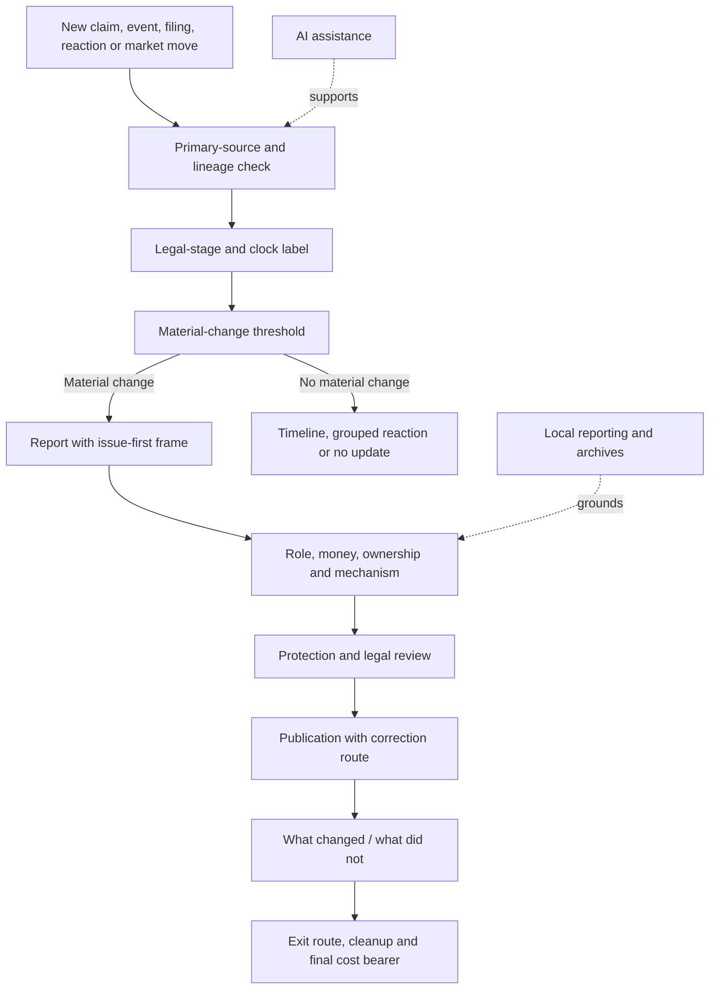

# 📌 Editorial Rules And Question Bank  
**First created:** 2026-07-17 | **Last updated:** 2026-07-17  
*Compact newsroom rules, publication thresholds, question banks, and final checks for covering colliding confidence systems, democratic exit, and material cleanup.*

---

## 🛰️ Orientation

This is the operational endpoint of the Manifestation Molehill.

The wider pack maps:

- fragile confidence systems
- political finance
- crypto
- commercial AI
- war and sanctions
- media ownership
- donor provenance
- civil liability
- public distrust
- democratic exit
- material cleanup

This node asks:

> What should the newsroom actually do next?

Its purpose is not to replace judgment.

It is to make judgment easier to apply under pressure.

Use it when:

- commissioning
- interviewing
- writing
- editing
- headlining
- clipping
- correcting
- updating
- closing a story

> Every confidence story should end with an exit route, a cost bearer, and a question that can still be answered with evidence.

---

## ✨ Key Features

- Compact editorial rules for the whole Molehill pack.
- Publication thresholds for material developments.
- Headline, framing, interview, visual, and correction checks.
- Source-lineage and legal-stage discipline.
- Question banks for money, assets, donors, ownership, crypto, AI, sanctions, media, liability, exit, and cleanup.
- A “what changed / what did not” template.
- Stopping conditions for interviews and reaction coverage.
- Protections for people with less power.
- A final cost-bearer test.
- A route from exposure to repair rather than endless spectacle.

---

# 📌 Core Editorial Rules

## 1. Lead With The Public-Interest Issue

Name the issue before the personality.

Examples:

- undeclared support
- donor provenance
- asset exposure
- sanctions compliance
- platform ownership
- civil liability
- local service failure
- public subsidy
- regulatory delay

## 2. Identify The Original Source

Ask:

- What is the primary document?
- Who reported this first?
- Are later reports independent?
- Does the claim derive from one press release, interview, filing, or post?

## 3. Label The Stage

Use the correct category:

- allegation
- claim
- filing
- investigation
- finding
- judgment
- enforcement
- recovery
- political reaction
- market reaction
- correction

## 4. Separate Reaction From Development

A new quote is not automatically a new stage.

Publish a fresh item when something material changes.

## 5. Clarify Role, Money, Ownership, And Mechanism

Ask:

- Who is speaking?
- In what role?
- Who paid?
- Who benefited?
- Who owns?
- Who controls?
- How did the influence travel?

## 6. Protect People With Less Power

Do not transfer scrutiny onto:

- survivors
- complainants
- whistleblowers
- junior staff
- private individuals
- local communities

## 7. State What Remains Unknown

Uncertainty should be visible.

Do not force closure where the process remains open.

## 8. Correct At Comparable Prominence

A buried correction does not repair a viral error.

## 9. Update Only When Something Material Changes

Avoid reaction churn.

## 10. End With Consequence

Ask:

- Who gained?
- Who is exposed?
- Who can leave?
- Who cannot?
- Who pays?

---

# 🚦 Publication Threshold

Publish a new standalone story when at least one of these changes:

- evidence
- legal status
- ownership
- money
- regulatory action
- institutional response
- operational capacity
- public consequence
- final cost bearer

Otherwise consider:

- adding to a timeline
- grouped reaction
- a status box
- a scheduled briefing
- no update

> More activity is not always more information.

---

# 📰 Headline Test

Before publication, ask:

- Does the headline lead with the issue or the grievance?
- Does it reproduce a slogan?
- Does it overstate the legal stage?
- Does it convert reaction into development?
- Does it strengthen a personality moat?
- Does it identify the material consequence?
- Would it remain accurate if the quote vanished?
- Will the correction fit into the same frame?

Avoid:

- “hits back”
- “lashes out”
- “internet erupts”
- “humiliated”
- “bombshell” without a clear material change
- “cleared” where only one process ended
- “guilty” without a relevant finding
- “bankrupt” where the issue is liquidity or restructuring

Prefer:

- issue-first
- document-first
- consequence-first
- legal-stage clarity
- ownership and money clarity

---

# 🧾 Frame-Before-Quote Rule

Use:

> [Actor], who faces unresolved questions about [documented public-interest issue], described the scrutiny as [response]. They have not yet provided [specific missing evidence].

Do not release the grievance without the documentary frame.

The quote is not the story.

The quote is evidence of the response strategy.

---

# 🎙️ Interview Rules

Before booking, ask:

- What public-interest information could this produce?
- Does the guest hold the relevant authority or documents?
- Will the format allow follow-up?
- Could written questions create a cleaner record?
- Is the guest materially relevant or merely dramatic?

During the interview:

1. establish the speaking role
2. state the public-interest issue
3. ask the narrow question
4. identify whether it was answered
5. narrow the evidential gap
6. ask for the document
7. state what remains unresolved

Do not repeat the same sentence forever.

Move through:

- open question
- narrow question
- document question
- status question
- record statement

---

## 🛑 Interview Stopping Conditions

End or redirect when:

- the guest repeatedly refuses every documentary question
- falsehoods arrive faster than they can be handled
- protected information is being exposed
- the interview becomes targeted harassment
- the agreed subject has been abandoned
- the remaining exchange adds heat but no information

Ending an unproductive interview is editorial control.

Not censorship.

---

# 🔁 Reaction-Control Rules

Use grouped reaction where possible.

Avoid:

- one story per response
- serial “X reacts” coverage
- liveblogs with no material change
- reaction to reaction
- algorithmic urgency without evidential change

Ask:

- Did policy change?
- Did money move?
- Did legal status change?
- Did operational capacity change?
- Did the evidence change?

If not, the reaction may belong in the timeline.

---

# 📚 Source-Lineage Rules

For each major claim, record:

- original source
- date
- jurisdiction
- whether it is primary or secondary
- whether later reports are independent
- correction status
- confidence level

Useful labels:

- primary document
- original reporting
- direct observation
- institutional statement
- actor response
- political reaction
- market signal
- legal process
- AI summary
- unresolved question

Reference count is not source count.

---

# ⚖️ Legal-Stage Labels

Use exact labels.

## Allegation

A claim not yet established.

## Investigation

A formal process examining possible wrongdoing.

## Filing

A document submitted to a court or regulator.

## Finding

A conclusion reached by a competent body.

## Judgment

A court decision establishing rights or liability.

## Enforcement

Action taken to implement a decision.

## Recovery

Money or property actually obtained.

Do not collapse:

- filing into finding
- finding into judgment
- judgment into recovery
- investigation closure into complete exoneration
- settlement into automatic admission

---

# 🛡️ Protection Rules

Before publication, ask:

- Is identification necessary?
- Could this expose a survivor, complainant, child, or private person?
- Does the image reveal location or personal data?
- Are junior staff being blamed for senior decisions?
- Is distress being used as visual texture?
- Could the clip direct harassment?
- Does the public-interest value outweigh the risk?

Scrutiny should move upward toward:

- authority
- ownership
- money
- decisions
- documentation
- legal responsibility

---

# 💸 Money Question Bank

- Who paid?
- Who benefited?
- What was the value?
- Was it cash, loan, guarantee, gift, staffing, travel, advice, accommodation, security, media support, or service in kind?
- Was it on commercial terms?
- Was it declared?
- Under what category?
- Who checked permissibility?
- Who performed due diligence?
- What was the source of funds?
- What was the source of wealth?
- Were intermediaries used?
- Will the documents be published?

---

# 🧾 Donor And Provenance Question Bank

- Who is the named donor?
- Who is the beneficial owner?
- Who controls the entity?
- What business generated the funds?
- Was the donor permissible?
- Were loans or guarantees involved?
- Were there connected companies or trusts?
- Was any value provided below market price?
- Were declarations corrected?
- What due diligence was conducted?
- What records exist?
- Who carries liability if the provenance changes?

---

# 🏢 Ownership And Control Question Bank

- Who legally owns the asset or organisation?
- Who beneficially controls it?
- Are voting and economic rights different?
- Are there nominees, trusts, or layered entities?
- Who appoints directors?
- Who controls editorial, operational, or financial decisions?
- Are there related-party contracts?
- Are owners also donors, lenders, or guarantors?
- What happens if one owner exits?
- Which obligations remain with the entity?

---

# 📺 Media And Platform Question Bank

- In what role is the person speaking?
- Is the role paid?
- Who benefits commercially?
- Who selected the format?
- Who owns the platform?
- Who controls distribution?
- Is the appearance editorial, promotional, political, or commercial?
- Are conflicts disclosed?
- Are clips monetised?
- Does the platform have related political or financial interests?
- What happens to archives, corrections, subscriber data, and sources if ownership changes?

---

# 🪙 Crypto And Digital-Money Question Bank

- Who controls the keys?
- Which jurisdiction governs?
- Is the asset segregated?
- Are reserves verified?
- What redemption right exists?
- Are withdrawals restricted?
- Which intermediaries are involved?
- Are there sanctions risks?
- Was lobbying declared?
- Who benefits from the policy change?
- Is price being treated as proof of adoption?
- Is a visible balance actually recoverable?

---

# 🤖 AI Question Bank

- What capability is being claimed?
- Is this pilot, deployment, adoption, revenue, or profit?
- What evidence supports the claim?
- Who owns the model, data, and infrastructure?
- What capex and public subsidy are involved?
- What energy, water, and grid obligations exist?
- What contracts survive if the project closes?
- Who carries data-protection duties?
- What logs must be preserved?
- Can the infrastructure be repurposed?
- What would disconfirm the confidence narrative?
- Is AI assisting journalism or replacing source creation?

---

# ⚔️ War And Sanctions Question Bank

- Which jurisdiction imposed the measure?
- Which actor, asset, good, or service is covered?
- What conduct is prohibited?
- What licence or exemption exists?
- Who owns and controls the asset?
- Who bears delay, storage, spoilage, or rerouting cost?
- Are humanitarian safeguards functioning?
- Is the activity adaptation, circumvention, evasion, or ordinary third-country trade?
- What evidence supports attribution?
- What happens when the measure changes or ends?
- Who carries the cleanup after sanctions expire?

---

# ⚖️ Liability Question Bank

- Is there a filed claim?
- Has a finding been made?
- Is there a judgment?
- Has enforcement begun?
- Has money actually been recovered?
- Is insurance available?
- Has the insurer been notified?
- Is coverage disputed?
- Are assets pledged or encumbered?
- Are there competing claimants?
- Is collectability realistic?
- Who carries liability if the factual position changes?

---

# 🚪 Exit Question Bank

- What first created doubt?
- What made leaving difficult?
- What did the person stop doing first?
- Are they leaving the leader or the method?
- What harm do they acknowledge?
- What evidence have they supplied?
- What have they corrected?
- What repair remains?
- Are they monetising the exit?
- Are they seeking instant authority?
- Is there a route into ordinary civic life?
- Who is being asked to carry the emotional cost of their reintegration?

---

# 🧭 Citizen Re-Entry Question Bank

- What does the person need most: information, belonging, efficacy, safety, or repair?
- Is there a non-total institution available?
- Can they act on one concrete issue?
- Are legitimate grievances being preserved?
- Are false explanations being challenged?
- Is information exposure regulated?
- Are harmed people protected?
- Is progress possible without public performance?
- Is there a new guru replacing the old one?
- What small democratic outcome could rebuild efficacy?

---

# 🧹 Cleanup Question Bank

- What triggered the cleanup phase?
- Which functions must continue?
- What assets remain?
- Who owns and controls them?
- Which obligations survive?
- Who has legal priority?
- What insurance or guarantee applies?
- Which assets are reachable?
- What records must be preserved?
- Which costs are moving to the public sector?
- Who cannot absorb delay?
- Is a rescue preserving essential function or existing control?
- Who retains the upside?
- Who carries the final loss?

---

# 🗺️ Final Cost-Bearer Test

Every major story should answer:

- Who gained during the confidence phase?
- Who was paid?
- Who retained ownership?
- Who is exposed now?
- Which assets are reachable?
- Which losses are insured?
- Which obligations survive?
- Who can leave easily?
- Who cannot?
- Who inherits the legal cost?
- Who inherits the infrastructure cost?
- Who inherits the environmental cost?
- Who inherits the psychological and community cost?
- Who pays if the claim is true?
- Who pays if the confidence collapses?

> Follow the cost until it stops moving.

---

# 📰 “What Changed / What Did Not” Template

## What Changed

- new evidence
- new legal status
- new ownership
- new money
- new institutional action
- changed capacity
- changed consequence
- changed cost bearer

## What Did Not Change

- unresolved questions
- missing documents
- unchanged legal stage
- unchanged ownership
- unchanged exposure
- reaction without material consequence
- continued uncertainty

## What Happens Next

- expected filing
- hearing
- regulator decision
- publication deadline
- repayment date
- enforcement step
- next scheduled update

This format reduces panic and reaction churn.

---

# 🧠 Final Publication Diagnostic

Before pressing publish, ask:

- What is the public-interest issue?
- What did we verify?
- What remains unverified?
- Is this a new stage or a new reaction?
- Is the legal label correct?
- Are the sources independent?
- Is the original source visible?
- Who becomes more prominent because of this story?
- Does the headline reproduce the grievance frame?
- Are role, money, ownership, and mechanism clear?
- Are people with less power protected?
- What materially changed?
- What did not change?
- What happens next?
- Who carries the cost?
- What exit route is visible?
- Can the correction catch up?

---

# 🔄 Editorial Decision Route

The story should move toward clarity, consequence, exit, and repair.

Not endless reaction.

---

## ⚖️ Evidence Discipline

Preserve the distinctions:

- attention is not support
- reaction is not development
- repetition is not corroboration
- allegation is not finding
- finding is not judgment
- judgment is not recovery
- access is not accountability
- ownership is not automatic control
- wealth is not collectability
- rescue is not exoneration
- exit is not repair
- reintegration is not restored authority
- humour is not evidence
- AI assistance is not source creation
- local reporting is not automatically accurate
- public anger is not proof of consensus

---

## 🧪 What Would Disconfirm The Concern?

Evidence of healthy editorial practice may include:

- fewer personality-led reaction stories
- stronger source lineage
- accurate legal-stage labels
- visible corrections
- primary documents receiving prominence
- interviews producing verifiable information
- local reporting grounding national stories
- exit reporting avoiding humiliation and instant rebranding
- cleanup reporting identifying real cost bearers
- readers being able to disengage and return without losing the material story

A rapid update may be necessary.

A personality-led headline may sometimes be accurate.

A dramatic interview may produce decisive evidence.

The framework should preserve those possibilities.

---

## ✨ Working Rules

> Every confidence story should end with an exit route, a cost bearer, and a question that can still be answered with evidence.

> More activity is not always more information.

> Reference count is not source count.

> A new quote is not automatically a new stage.

> The correction must be able to catch up.

> Do not repeat the same question forever.  
> Narrow the evidential gap.

> The joke opens the door.  
> The documents still need to walk through it.

> Follow the cost until it stops moving.

> Cover the risk.  
> Do not feed the spectacle.

---

## 🌌 Constellations

📌 📰 🎙️ 🧾 🚪 🧹 — editorial rules; reporting; interviewing; evidence; exit; cleanup.

---

## ✨ Stardust

editorial rules, question bank, media practice, legal stages, source lineage, exit reporting, cleanup reporting, final cost bearer, correction, public interest

---

## 🏮 Footer

*Editorial Rules And Question Bank* is a living node of the **Polaris Protocol**.  
It provides the compact operational rules, publication thresholds, question banks, and final checks required to cover colliding confidence systems from exposure through democratic exit and material cleanup.  
Its function is to keep evidence, public consequence, repair, and the final cost bearer visible when newsroom pressure rewards speed, spectacle, and repetition.

> 📡 Cross-references:
>
> - [`🚪_exit_routes_back_to_democracy.md`](./🚪_exit_routes_back_to_democracy.md) — *system-level exit, accountability, repair, and reintegration*
> - [`🧭_citizen_routes_back_to_democracy.md`](./🧭_citizen_routes_back_to_democracy.md) — *citizen-level re-entry, ordinary participation, and political efficacy*
> - [`🧹_cleanup_map_who_carries_the_cost.md`](./🧹_cleanup_map_who_carries_the_cost.md) — *assets, obligations, reachability, rescue, wind-down, and final loss allocation*
> - [`🗞️_Media_Practice`](../🗞️_Media_Practice/) — *cycle capture, quality, interviews, farce, and local journalism*
> - [`👹_Collision_Systems`](../👹_Collision_Systems/) — *political finance, crypto, AI, war, media power, liability, and public distrust*
> - [`⏱️_temporal_hygiene_rhythm_not_panic.md`](../🌀_Core_Model/⏱️_temporal_hygiene_rhythm_not_panic.md) — *event, publication, reaction, institutional, and consequence clocks*
> - [`🔗_risk_transmission_between_systems.md`](../🌀_Core_Model/🔗_risk_transmission_between_systems.md) — *originating stress, carrier, route, receiver, consequence, and cost bearer*
>
> 🏮 Return To:
>
> - [`🧹_Exit_And_Cleanup`](./) — *current repair, reintegration, and cost-allocation cluster*
> - [`🗻_The_Manifestation_Molehill`](../) — *media-facing pack on colliding confidence systems*
> - [`👻_Ghosts_Of_Accountability`](../../) — *parent accountability cluster*
> - [`📲_Press_Matters`](../../../) — *press and media-analysis layer*
> - [`🌓_3_In_The_Moment`](../../../../) — *current-events and active-pattern layer*

*Survivor authorship is sovereign. Containment is never neutral.*

_Last updated: 2026-07-17_
