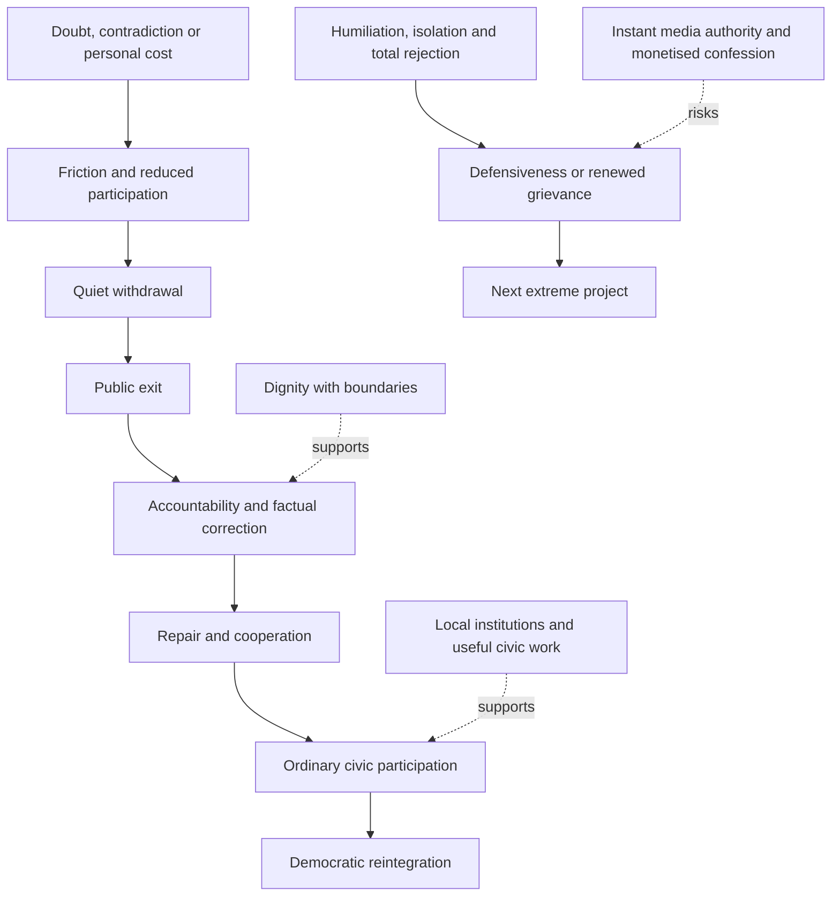

# 🚪 Exit Routes Back To Democracy  
**First created:** 2026-07-09 | **Last updated:** 2026-07-17  
*Democratic off-ramp model for people leaving confidence-cult politics without being pushed into the next extreme project.*  

---

## 🛰️ Orientation  

Exposure is not enough.

Collapse is not enough.

Humiliation is not enough.

If people leave one confidence system with nowhere to go, they are vulnerable to the next one.

A person can lose faith in:

- MAGA
- Reform
- conspiracist politics
- influencer politics
- strongman politics
- crypto-political movements
- purity movements
- civilisational rescue projects

and still be:

- angry
- ashamed
- lonely
- frightened
- economically insecure
- socially displaced
- desperate for explanation

That is a recruitment surface.

Democracy needs off-ramps.

Not victory laps.

> A system becomes more dangerous when everyone inside it believes leaving will cost more than staying.

---

## ✨ Key Features  

- Treats exit as a democratic safety problem.
- Separates accountability from humiliation.
- Distinguishes doubt, withdrawal, defection, repair, and reintegration.
- Gives people practical civic routes.
- Reduces migration from one extreme project to another.
- Makes local democracy visible again.
- Uses ordinary participation as repair.
- Refuses both indulgence and purity theatre.
- Prevents late exit from becoming instant authority.
- Treats disillusionment as unstable political material.
- Connects journalism, civic institutions, and local life to democratic re-entry.

---

## 🧿 Core Proposition

People rarely leave confidence-cult systems in one clean movement.

They may:

- doubt privately
- reduce donations
- stop sharing content
- avoid meetings
- soften language
- distance from one leader
- keep the wider ideology
- deny the extent of their involvement
- leave socially before leaving politically
- leave politically before admitting harm

Exit is therefore not one door.

It is a sequence.

A resilient democracy should make movement possible without pretending that every stage is complete.

---

# 🧭 The Exit Problem  

When a confidence system breaks, people do not automatically become democrats.

They may become:

- ashamed
- defensive
- furious
- grieving
- isolated
- humiliated
- financially anxious
- socially displaced
- distrustful of institutions
- hungry for a new explanation
- vulnerable to the next recruiter

If the only public message is:

> You were stupid.

then many people will not leave.

They will double down.

Or they will move sideways into the next project promising dignity without accountability.

That is not democratic repair.

That is churn.

---

# 🚪 Exit Is A Sequence

Useful stages include:

## 1. Doubt

The person notices contradiction, failure, hypocrisy, or personal cost.

## 2. Friction

Participation becomes less automatic.

They stop donating, sharing, attending, or defending.

## 3. Quiet Withdrawal

They reduce involvement without publicly renouncing the system.

## 4. Public Exit

They state that they no longer support the person, project, or movement.

## 5. Accountability

They acknowledge their own conduct, role, benefit, or contribution.

## 6. Repair

They correct claims, repay money, cooperate with processes, apologise, disclose records, or support harmed people.

## 7. Reintegration

They participate in ordinary civic life without demanding immediate leadership or absolution.

These stages may overlap.

A person may move backward.

The existence of an incomplete exit does not make movement meaningless.

It does mean the stage should be named honestly.

---

## 🧩 Different People Need Different Exit Routes

An ordinary supporter does not carry the same responsibility as:

- a major donor
- an elected official
- a media owner
- a paid propagandist
- a contractor
- a political adviser
- a platform executive
- a lawyer structuring the system
- a person who directed harassment or violence

Exit architecture should distinguish:

### Low-power participants

They may need:

- information
- social belonging
- local civic routes
- shame reduction
- practical political education

### Staff And Influencers

They may need:

- whistleblowing routes
- legal advice
- employment transition
- disclosure obligations
- correction duties
- clear boundaries on future authority

### Donors And Contractors

They may need:

- financial disclosure
- records preservation
- repayment
- cooperation with investigators
- liability assessment
- conflict declarations

### Office-Holders And Senior Organisers

They may need:

- resignation
- formal accountability
- public correction
- document production
- standards or legal process
- restrictions on future roles

Dignity is not the same as equal treatment.

Responsibility should follow power, knowledge, benefit, and conduct.

---

## 🪤 The Next Extreme Project  

People leaving one confidence cult may be recruited into another.

The new project may look different.

It may use different language.

It may claim to be more sophisticated.

It may offer a different enemy.

It may sell itself as:

- truth
- patriotism
- masculinity
- purity
- anti-corruption
- anti-elite rebellion
- spiritual awakening
- technological destiny
- civilisational rescue
- financial liberation
- national renewal

The pattern is often familiar:

- you were right to be angry
- you were betrayed by the last leader
- only we understand why
- everyone else is lying
- shame means you are awakening
- doubt means you are being tested
- give us your attention, money, vote, identity, and rage

A broken spell can become a doorway.

That doorway needs guarding.

---

## 🔄 Exit Churn

Exit churn occurs when a person changes:

- leader
- platform
- vocabulary
- target
- aesthetic

without changing the underlying relationship to certainty, authority, or evidence.

Signals include:

- immediate attachment to a new guru
- one total explanation replacing another
- unchanged contempt for process
- continued dependence on grievance
- refusal to check claims independently
- transferring all blame to the former leader
- instant rebranding as an expert on extremism
- seeking a new audience before doing repair

A new label is not necessarily a new political method.

---

## ⚖️ Accountability Without Humiliation  

People leaving harmful politics still need accountability.

They may have:

- spread lies
- harassed people
- voted for cruelty
- ignored warnings
- laughed at harm
- donated money
- recruited others
- helped build the thing now collapsing

That matters.

But humiliation is not the same as accountability.

Humiliation often protects the old identity.

Accountability can loosen it.

A useful frame is:

> You are responsible for what you did.  
> You are not required to keep serving the thing that used you.

This is not absolution.

It is exit architecture.

---

## 🧱 Dignity Without Indulgence  

A democratic off-ramp needs two things at once:

1. **Dignity**
2. **Boundaries**

Dignity says:

> You can leave. You can learn. You can repair. You can become useful.

Boundaries say:

> You do not get to erase the harm. You do not get to make yourself the main victim. You do not get instant authority because you escaped late.

Both are necessary.

Without dignity, people hide.

Without boundaries, they rebrand.

---

# 🛑 Exit Is Not Exoneration

Leaving a harmful movement does not automatically:

- erase prior conduct
- cancel legal responsibility
- restore trust
- create expertise
- entitle someone to a media platform
- make them representative of harmed people
- prove the wider worldview has changed

Exit should be welcomed as movement away from harm.

It should not be misreported as completion.

> Leaving is a beginning.  
> Not a medal.

---

## 🎭 The Rebranding Risk

Former insiders can become valuable witnesses.

They can also become:

- media mascots
- professional defectors
- instant commentators
- reputational shields
- new movement entrepreneurs
- distributors of the same worldview in softer language

Before granting authority, ask:

- What did they know?
- What did they do?
- What have they corrected?
- What records have they provided?
- Who was harmed?
- What repair has occurred?
- Are they speaking beyond their evidence?
- Are they monetising the exit?
- Do they accept limits on their authority?

The person may have useful evidence.

That does not require turning them into the new main character.

---

## 🏘️ Local Democracy As Aftercare  

People leaving spectacle politics need somewhere concrete to put their attention.

Local democracy helps.

It is not glamorous.

Good.

Glamour was part of the problem.

Routes back include:

- council meetings
- planning committees
- local journalism
- tenants’ unions
- workplace unions
- disability groups
- mutual aid
- school governance
- library campaigns
- food banks
- local environmental work
- constituency casework
- regulator complaints
- freedom of information requests
- police and crime panels
- NHS trust meetings
- local budget scrutiny
- professional associations
- faith communities
- neighbourhood groups

Boring democracy is not a downgrade.

It is where reality lives.

---

## 🧰 Ordinary Action As Repair

Extremist politics often makes ordinary participation feel:

- weak
- compromised
- slow
- humiliating
- pointless

Repair requires visible ordinary efficacy.

Examples:

- getting a dangerous crossing changed
- challenging a planning decision
- helping a tenant
- attending a union meeting
- supporting a local newsroom
- reading a regulator’s findings
- correcting one false claim
- helping someone complete a form
- tracking one public promise

Small outcomes rebuild the link between:

- action
- process
- evidence
- consequence

Democratic efficacy is often relearned locally.

---

## 📰 Journalism As Exit Infrastructure  

Journalism should not only expose the molehill.

It should build a bridge away from it.

Useful journalism gives disillusioned readers:

- a timeline
- a correction path
- a process map
- a local route
- a glossary
- a source hierarchy
- a way to check claims
- a way to understand what happened
- a way to act without joining another cult
- a way to be wrong without becoming useless
- a clear statement of what remains unresolved
- a route back after disengagement

This is not soft coverage.

It is democratic containment.

If a story ends at “look how stupid they were,” it may feel satisfying.

It may also leave the recruitment surface open.

---

## 🧠 What People May Need To Hear  

Useful messages include:

- You can stop now.
- You do not have to defend every past belief.
- You can apologise without performing collapse.
- You can check one claim at a time.
- You do not need a new guru.
- You do not need a new saviour.
- You do not need to turn shame into another identity.
- You can do one concrete civic thing this week.
- You can learn how the process actually works.
- You can repair without demanding applause.
- You can keep a legitimate grievance while abandoning a false explanation.
- You can change your mind without pretending you never believed it.

The aim is not emotional indulgence.

The aim is political decompression.

---

## 🛠️ Practical Exit Steps  

First steps:

- stop giving money to personalities
- stop treating every clip as evidence
- stop treating humiliation as proof that you are right
- turn off automatic donations
- leave high-pressure group chats
- preserve relevant messages and records
- check one claim at a time
- follow local reporting
- learn how your council works
- learn how to write an FOI request
- contact your councillor or MP about one concrete issue
- join one ordinary group doing useful work
- read regulator findings before influencer threads
- keep a list of claims that changed when checked
- notice who benefits from keeping you angry
- correct claims you personally circulated
- make practical repair where possible

Small steps matter.

Extremist politics often captures people by making ordinary action feel pointless.

Repair begins when ordinary action becomes visible again.

---

# 🧾 Repair Ladder

Repair may include:

1. **Stop the harmful conduct.**
2. **Correct false claims.**
3. **Preserve records.**
4. **Disclose relevant facts.**
5. **Apologise without demanding absolution.**
6. **Repay or restore where possible.**
7. **Cooperate with lawful processes.**
8. **Accept loss of status or access.**
9. **Support institutions that reduce recurrence.**
10. **Do useful work without making the repair performance the centre.**

Not every case requires every step.

The greater the power and harm, the stronger the repair obligation.

---

## 🚫 What Not To Do  

Do not demand instant ideological purity.

Do not make humiliation the price of entry.

Do not reward rebranded extremists with immediate leadership.

Do not erase harm.

Do not treat “I was duped” as the whole story.

Do not turn former believers into media mascots.

Do not platform confession theatre without repair work.

Do not let people migrate from one “truth-teller” influencer to another.

Do not confuse exit with completion.

Do not require harmed people to supervise someone else’s redemption.

Do not make forgiveness a condition of reintegration.

Leaving is a beginning.

Not a medal.

---

## 🎙️ Questions For Exit Reporting  

Good questions:

- What first made you doubt?
- What did you lose by believing?
- What made it hard to leave?
- What information would have helped earlier?
- What do you wish journalists had explained differently?
- What practical thing helped you reconnect with reality?
- What would have pushed you deeper?
- What would help others leave sooner?
- What are you doing now that is useful and ordinary?
- What repair remains?
- What records or evidence can you provide?
- Which claims have you corrected?
- What responsibility do you accept?
- What should journalists avoid turning you into?

Bad questions:

- How could you be so stupid?
- Aren’t you ashamed?
- Do you finally admit we were right?
- Can you denounce everyone you knew?
- Are you now on our side?
- How does it feel to be one of the good ones now?

Confession is not the same as repair.

---

## 🧯 Democratic Containment  

The goal is not to love-bomb people out of accountability.

The goal is to reduce future harm.

A good exit route:

- lowers shame enough for movement
- keeps accountability attached
- provides practical civic work
- prevents instant rebranding
- names the harm
- avoids purity theatre
- offers local routes
- refuses new saviours
- restores process
- makes boring democracy usable again
- preserves evidence
- protects harmed people from becoming unpaid rehabilitation staff

This is not sentimental.

It is risk management.

---

# 🔄 Exit-To-Reintegration Route

The route is not guaranteed.

Its purpose is to make democratic movement more possible than extremist churn.

---

## 🧠 Exit Diagnostic

Ask:

- What stage of exit is this?
- What power did the person hold?
- What harm did they contribute to?
- What evidence have they provided?
- What have they corrected?
- What repair remains?
- Are they leaving the method or only the leader?
- Are they moving toward ordinary civic life?
- Are they immediately attaching to another total explanation?
- Are they demanding authority before accountability?
- Who is being asked to absorb the emotional cost of their exit?
- Does the route reduce future harm?

---

## ⚖️ Evidence Discipline  

Preserve the distinctions:

- doubt is not exit
- quiet withdrawal is not public accountability
- public exit is not repair
- apology is not restitution
- confession is not evidence by itself
- humiliation is not accountability
- reintegration is not exoneration
- former insider status is not automatic expertise
- legitimate grievance does not validate false explanation
- ordinary civic participation is not ideological purity
- an incomplete exit may still reduce harm
- refusal to forgive is not obstruction of democracy

Use categories such as:

- private doubt
- reduced participation
- public exit
- factual correction
- document disclosure
- cooperation
- repair
- reintegration
- rebranding
- unresolved responsibility

---

## 🧪 What Would Disconfirm The Concern?

Evidence that an exit route is working may include:

- reduced financial and organisational support for the movement
- factual corrections
- records supplied
- cooperation with lawful processes
- acceptance of consequences
- sustained ordinary civic participation
- no immediate replacement guru
- no demand for instant authority
- measurable repair
- reduced harassment or recruitment
- stronger local democratic engagement

Some people may leave quickly and sincerely.

Public denunciation may sometimes prevent immediate harm.

Strong condemnation may be necessary.

The framework should preserve those possibilities.

---

## ✨ Working Rules  

> Democracy needs off-ramps, not victory laps.

> A system becomes more dangerous when everyone inside it believes leaving will cost more than staying.

> Do not only expose the molehill.  
> Build a bridge away from it.

> Dignity without indulgence.  
> Accountability without humiliation.

> Responsibility should follow power, knowledge, benefit, and conduct.

> Boring democracy is where reality lives.

> You can keep a legitimate grievance while abandoning a false explanation.

> Leaving is a beginning.  
> Not a medal.

> Confession is not the same as repair.

---

## 🌌 Constellations  

🚪 🧭 🏘️ 📰 🧯 — democratic off-ramps; civic route-finding; local democracy; journalism as repair; containment without humiliation.

---

## ✨ Stardust  

democratic repair, exit routes, confidence cults, far right, conspiracy politics, local democracy, civic action, accountability, humiliation, journalism, political decompression, reintegration

---

## 🏮 Footer  

*Exit Routes Back To Democracy* is a living node of the **Polaris Protocol**.  
It defines democratic off-ramp practice for people leaving confidence-cult politics without erasing harm, rewarding instant rebranding, or pushing them into the next extremist project.  
Its function is to connect exposure, differentiated accountability, repair, local civic action, and political decompression into a democratic reintegration pathway.

> 📡 Cross-references:
>
> - [`🗻_the_manifestation_molehill_core_model.md`](../🌀_Core_Model/🗻_the_manifestation_molehill_core_model.md) — *core model for fragile confidence systems and small inputs*
> - [`📺_media_cycle_capture.md`](../🗞️_Media_Practice/📺_media_cycle_capture.md) — *hostile amplification, grievance loops, and public-clock capture*
> - [`📰_quality_as_click_resilience.md`](../🗞️_Media_Practice/📰_quality_as_click_resilience.md) — *journalism quality, institutional value, and AI-search pressure*
> - [`🎙️_how_to_cover_and_interview.md`](../🗞️_Media_Practice/🎙️_how_to_cover_and_interview.md) — *coverage discipline, documentary questioning, and post-interview repair*
> - [`🃏_how_to_cover_farce_without_becoming_it.md`](../🗞️_Media_Practice/🃏_how_to_cover_farce_without_becoming_it.md) — *satire, deflation, and the danger of ridicule as distribution*
> - [`🏘️_local_journalism_as_resilience_infrastructure.md`](../🗞️_Media_Practice/🏘️_local_journalism_as_resilience_infrastructure.md) — *local source creation, memory, and ordinary democratic infrastructure*
> - [`🌫️_public_distrust_and_algorithmic_overload.md`](../👹_Collision_Systems/🌫️_public_distrust_and_algorithmic_overload.md) — *public fog, conspiratorial compression, disengagement, and regulated re-entry*
> - [`🧹_cleanup_map_who_carries_the_cost.md`](./🧹_cleanup_map_who_carries_the_cost.md) — *material obligations, loss allocation, and final cost bearers*
> - [`📌_editorial_rules_and_question_bank.md`](./📌_editorial_rules_and_question_bank.md) — *compact newsroom application across exit and cleanup reporting*
>
> 🏮 Return To:
>
> - [`🧹_Exit_And_Cleanup`](./) — *current repair, reintegration, and cost-allocation cluster*
> - [`🗻_The_Manifestation_Molehill`](../) — *media-facing pack on colliding confidence systems*
> - [`👻_Ghosts_Of_Accountability`](../../) — *parent accountability cluster*
> - [`📲_Press_Matters`](../../../) — *press and media-analysis layer*
> - [`🌓_3_In_The_Moment`](../../../../) — *current-events and active-pattern layer*

*Survivor authorship is sovereign. Containment is never neutral.*

_Last updated: 2026-07-17_
