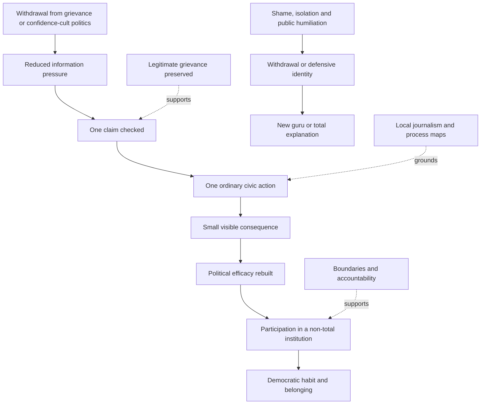

# 🧭 Citizen Routes Back To Democracy  
**First created:** 2026-07-17 | **Last updated:** 2026-07-17  
*Practical civic re-entry routes for people leaving grievance politics, conspiratorial certainty, political fatalism, and permanent information warfare.*

---

## 🛰️ Orientation

People do not return to democracy through a trapdoor.

They return through ordinary doors that remain open.

A person leaving a confidence cult may not be ready to:

- trust institutions
- join a political party
- speak publicly
- admit everything
- abandon every grievance
- feel optimistic
- accept a new ideological identity

That does not mean democratic re-entry is impossible.

It means the route should begin with:

- reality
- ordinary participation
- useful work
- small consequences
- relationships that do not demand total belief

Democracy is not only a set of institutions.

It is a habit of:

- checking
- listening
- disagreeing
- waiting
- correcting
- sharing power
- accepting partial outcomes
- acting without certainty

> People do not return to democracy through a trapdoor.  
> They return through ordinary doors that remain open.

---

## ✨ Key Features

- Treats citizen re-entry as a practical civic process.
- Preserves legitimate grievances while rejecting false explanations.
- Rebuilds political efficacy through small visible outcomes.
- Offers low-drama routes into ordinary democratic life.
- Separates institutions from office-holders.
- Restores distinctions between disagreement, betrayal, compromise, and surrender.
- Includes regulated news re-entry after overload.
- Avoids demanding public confession as the price of participation.
- Prevents new gurus from replacing old ones.
- Keeps accountability attached without turning harmed people into rehabilitation staff.

---

## 🧿 Core Proposition

A citizen may leave an extreme political project while still believing:

- institutions are remote
- elites do not care
- nothing changes
- ordinary action is weak
- compromise is betrayal
- uncertainty is manipulation
- politics is only real when it feels historic

Democratic re-entry therefore cannot rely only on persuasion.

It needs experience.

People rebuild trust when they can see:

- a process
- a record
- a result
- a correction
- a consequence
- a route for appeal
- a role for themselves

The point is not to manufacture faith.

It is to make ordinary democratic agency visible again.

---

# 🧭 The Citizen Re-Entry Problem

A person leaving grievance politics may still be carrying:

- loneliness
- anger
- humiliation
- economic pain
- status loss
- distrust
- information overload
- political grief
- fear of ridicule
- damaged relationships
- a need to belong

If democratic life offers only:

- lectures
- scolding
- purity tests
- professionalised jargon
- distant institutions
- symbolic participation

then the person remains vulnerable to movements offering:

- immediate identity
- emotional certainty
- simple enemies
- constant feedback
- heroic importance

The democratic route must be concrete enough to compete with the emotional intensity of the system being left.

---

# 🪜 A Citizen Re-Entry Ladder

## 1. Stop Feeding The System

- pause donations
- mute high-pressure channels
- stop automatic sharing
- leave coercive group chats
- reduce notification exposure
- stop treating every update as urgent

## 2. Check One Claim

Choose one material claim.

Find:

- the primary document
- the legal stage
- the original source
- the local consequence
- what remains unresolved

## 3. Restore One Relationship

Reconnect with someone outside the political bubble without turning the interaction into a debate.

## 4. Do One Ordinary Civic Task

Examples:

- contact a councillor
- attend a local meeting
- submit an FOI request
- help with a tenant problem
- support a library or school campaign
- read a regulator’s decision

## 5. Join A Non-Total Institution

Choose a group that does not require total ideological agreement.

## 6. Accept Partial Outcomes

Learn to recognise:

- improvement
- compromise
- delay
- defeat
- repair
- unfinished process

without converting every imperfection into betrayal.

## 7. Contribute Without Demanding Authority

Do useful work.

Let trust rebuild through conduct.

---

# 🏘️ Ordinary Democratic Doors

Possible routes include:

- local councils
- tenants’ unions
- workplace unions
- professional associations
- disability groups
- mutual aid
- local journalism
- faith communities
- school governance
- parent groups
- community gardens
- environmental campaigns
- public consultations
- library campaigns
- neighbourhood forums
- charities
- sports clubs
- constituency casework
- regulator complaints
- public-health meetings
- NHS trust meetings
- police accountability forums

The route does not need to begin with national party politics.

National politics may be exactly where the person learned that participation meant spectacle.

Local and associational life can provide a slower political metabolism.

---

## 🪑 Non-Total Institutions

A non-total institution:

- has a limited purpose
- does not demand belief on every issue
- allows disagreement
- has procedures
- shares responsibility
- permits exit
- produces concrete work
- does not depend on one charismatic figure

Examples include:

- a union branch
- a residents’ association
- a parent group
- a community kitchen
- a local campaign
- a professional body
- a sports club committee

These settings teach democratic habits because they require cooperation without total agreement.

---

# 🧱 Preserve The Grievance, Change The Explanation

People may have legitimate reasons to be angry about:

- housing
- wages
- public services
- corruption
- loneliness
- insecure work
- elite impunity
- regional inequality
- political neglect
- media failure
- technological disruption

Democratic re-entry should not require pretending those grievances were imaginary.

The task is to separate:

- real harm
- false attribution
- manipulative explanation
- ineffective remedy

A useful frame is:

> The harm may be real.  
> The explanation may still be false.  
> The proposed solution may still make the harm worse.

This allows people to change their politics without surrendering their lived experience.

---

# ⚖️ Restore Democratic Distinctions

Confidence-cult politics often collapses distinctions.

Democratic re-entry restores them.

## Disagreement Is Not Treason

A person can oppose you without being an enemy of the nation.

## Compromise Is Not Surrender

Partial agreement may be the mechanism of shared government.

## Delay Is Not Always Conspiracy

Some processes are slow because:

- evidence is incomplete
- rights must be protected
- institutions are under-resourced
- decisions are reviewable

Delay can also conceal failure.

The difference requires evidence.

## Institution Is Not Office-Holder

A bad minister does not make every public institution illegitimate.

## Uncertainty Is Not Deception

Not knowing yet may be more honest than immediate certainty.

## Correction Is Not Humiliation

Changing a claim after evidence changes is a democratic strength.

---

# 📰 Regulated News Re-Entry

People leaving permanent information warfare may need a structured route back to news.

Useful practices include:

- checking at fixed times
- choosing one or two reliable sources
- preferring primary documents
- avoiding reaction-only coverage
- reading local reporting
- using “what changed / what did not” summaries
- muting personality-driven notifications
- keeping a claim log
- returning only when something material changes

Ask:

- Is this an event or a reaction?
- Is the source independent?
- Is the item current?
- What legal stage applies?
- What materially changed?
- Do I need this information now?

Democratic attention should not require permanent alarm.

---

## 🧠 Claim Logs

A claim log may record:

- the original claim
- the source
- the evidence available
- what changed
- whether the claim was corrected
- what remains unresolved

This helps people notice:

- repeated false certainty
- changing explanations
- unsupported predictions
- reliable sources
- their own improvement in judgment

The goal is not obsessive self-surveillance.

It is visible learning.

---

# 🧑‍🤝‍🧑 Belonging Without Total Belief

People often remain in harmful movements because leaving means losing:

- friends
- status
- routine
- shared language
- identity
- purpose

Democratic re-entry needs belonging that does not depend on:

- enemies
- total agreement
- constant outrage
- leader worship
- public performance

Healthy belonging may be built around:

- place
- work
- care
- craft
- sport
- faith
- neighbourhood
- shared practical goals

Belonging should not require epistemic surrender.

---

# 🛠️ Rebuilding Political Efficacy

Political efficacy means believing that action can produce consequence.

It can be rebuilt through small outcomes:

- a repaired streetlight
- a safer crossing
- a successful appeal
- a corrected public record
- a protected service
- a union grievance resolved
- a planning condition enforced
- a local meeting attended
- an FOI answered
- a harmful claim corrected

These outcomes may look trivial beside civilisational rhetoric.

That is precisely why they matter.

They reconnect politics with reality.

> Boring democracy is not politically empty.  
> It is where cause and consequence become visible again.

---

# 🚫 What Citizen Re-Entry Is Not

It is not:

- instant ideological conversion
- forced optimism
- public confession theatre
- compulsory forgiveness
- denial of legitimate anger
- permanent shame
- immediate party membership
- a media redemption arc
- a new influencer identity
- a demand that harmed people provide emotional care

A person may re-enter democratic life quietly.

That can be enough to begin.

---

# 🛡️ Boundaries For Reintegration

Reintegration should not mean:

- restoring access to previous victims
- ignoring threats or harassment
- returning someone to a position of authority
- bypassing legal or professional consequences
- demanding trust before it is earned
- placing vulnerable people in unsafe contact
- treating apology as complete repair

Democracy can permit participation while maintaining:

- safeguarding
- legal boundaries
- professional restrictions
- evidential standards
- consequences
- distance

Inclusion does not require carelessness.

---

# 🧭 Practical Routes By Need

## If The Main Problem Is Isolation

Try:

- low-pressure community activity
- volunteering
- a hobby group
- a faith or cultural group
- a union branch
- local mutual aid

## If The Main Problem Is Distrust

Try:

- primary documents
- local reporting
- public meetings
- regulator findings
- transparent process maps
- comparing sources

## If The Main Problem Is Political Helplessness

Try:

- one constituency issue
- one council issue
- one workplace issue
- one public consultation
- one FOI request

## If The Main Problem Is Shame

Try:

- private correction
- practical repair
- stepping back from performance
- allowing trust to rebuild through conduct

## If The Main Problem Is Anger

Try:

- issue-specific organising
- union activity
- housing or disability advocacy
- documented complaint routes
- work with measurable outcomes

The route should match the need.

---

# 🧰 Citizen Re-Entry Toolkit

Useful tools include:

- local meeting calendars
- councillor and MP contact details
- FOI templates
- complaint-process maps
- regulator directories
- legal-stage explainers
- local-news subscriptions
- claim logs
- public-record search guides
- union and tenants’ group directories
- “what changed / what did not” briefings
- guides to consultations and petitions
- safe routes for reporting harassment or fraud

A democratic invitation should include instructions.

“Get involved” is not enough.

---

# 🧪 A One-Week Re-Entry Plan

A low-pressure first week might include:

1. Mute one high-pressure channel.
2. Stop one automatic donation or subscription.
3. Check one important claim against a primary source.
4. Read one local news report.
5. Identify one ordinary civic issue.
6. Contact one relevant body.
7. Write down what changed and what remains unresolved.

This does not prove ideological transformation.

It begins to restore agency.

---

# 🔄 Citizen Re-Entry Route

The aim is not to create perfect citizens.

It is to create durable routes away from political captivity.

---

## 🧠 Citizen Re-Entry Diagnostic

Ask:

- What does the person need most: information, belonging, efficacy, safety, or repair?
- Are they leaving the method or only the leader?
- Do they have a non-total institution available?
- Can they act on one concrete issue?
- Are legitimate grievances being acknowledged?
- Are false explanations being challenged?
- Is information exposure regulated?
- Are harmed people protected?
- Is authority being restored too quickly?
- Can progress occur without public performance?
- Does the route reduce dependence on total explanations?

---

## ⚖️ Evidence Discipline

Preserve the distinctions:

- anger is not extremism
- distrust is not proof of conspiracy
- disengagement is not apathy
- civic participation is not endorsement of every institution
- compromise is not moral surrender
- local action is not politically trivial
- apology is not full repair
- reintegration is not restoration of authority
- preserving a grievance is not preserving a false explanation
- a small outcome is not proof that the whole system works
- public silence is not necessarily continued belief
- news avoidance may be protective rather than irresponsible

Use categories such as:

- disengagement
- claim correction
- ordinary civic action
- local participation
- practical repair
- institutional trust
- democratic efficacy
- reintegration
- unresolved concern
- relapse risk

---

## 🧪 What Would Disconfirm The Concern?

Evidence that citizen re-entry is occurring may include:

- reduced dependence on personality-driven sources
- willingness to check claims
- participation in ordinary institutions
- acceptance of partial outcomes
- fewer total explanations
- sustained local engagement
- corrected misinformation
- reduced harassment
- no immediate replacement guru
- improved ability to disengage and return
- greater distinction between institutions and office-holders

Some people may return through national party politics.

A powerful public conversion may help others leave.

Intense moral clarity may sometimes be necessary.

The framework should preserve those possibilities.

---

## ✨ Working Rules

> People do not return to democracy through a trapdoor.  
> They return through ordinary doors that remain open.

> The harm may be real.  
> The explanation may still be false.

> Democracy is a habit before it is an identity.

> Belonging should not require epistemic surrender.

> Boring democracy is where cause and consequence become visible again.

> A democratic invitation should include instructions.

> Reintegration does not require restored authority.

> One ordinary civic action can be more politically reparative than one hundred confession posts.

---

## 🌌 Constellations

🧭 🏘️ 🪑 📰 🧠 🛠️ — civic route-finding; local institutions; ordinary participation; regulated news; judgment; efficacy.

---

## ✨ Stardust

citizen re-entry, democracy, civic participation, local democracy, conspiratorial politics, political efficacy, regulated news, belonging, accountability, institutional trust

---

## 🏮 Footer

*Citizen Routes Back To Democracy* is a living node of the **Polaris Protocol**.  
It maps practical civic routes for people leaving grievance politics, conspiratorial certainty, political fatalism, and permanent information warfare without demanding instant ideological conversion or erasing accountability.  
Its function is to rebuild judgment, belonging, political efficacy, and ordinary democratic habit through concrete participation and visible consequence.

> 📡 Cross-references:
>
> - [`🚪_exit_routes_back_to_democracy.md`](./🚪_exit_routes_back_to_democracy.md) — *system-level exit stages, differentiated responsibility, repair, and reintegration*
> - [`🧹_cleanup_map_who_carries_the_cost.md`](./🧹_cleanup_map_who_carries_the_cost.md) — *material obligations, loss allocation, and final cost bearers*
> - [`📌_editorial_rules_and_question_bank.md`](./📌_editorial_rules_and_question_bank.md) — *compact newsroom rules for exit, reintegration, and cleanup reporting*
> - [`🌫️_public_distrust_and_algorithmic_overload.md`](../👹_Collision_Systems/🌫️_public_distrust_and_algorithmic_overload.md) — *public fog, regulated disengagement, and re-entry*
> - [`🏘️_local_journalism_as_resilience_infrastructure.md`](../🗞️_Media_Practice/🏘️_local_journalism_as_resilience_infrastructure.md) — *local source creation, institutional memory, and democratic ground truth*
> - [`📰_quality_as_click_resilience.md`](../🗞️_Media_Practice/📰_quality_as_click_resilience.md) — *journalism as institutional and civic resilience*
> - [`⏱️_temporal_hygiene_rhythm_not_panic.md`](../🌀_Core_Model/⏱️_temporal_hygiene_rhythm_not_panic.md) — *event, reaction, institutional, and consequence clocks*
>
> 🏮 Return To:
>
> - [`🧹_Exit_And_Cleanup`](./) — *current repair, reintegration, and cost-allocation cluster*
> - [`🗻_The_Manifestation_Molehill`](../) — *media-facing pack on colliding confidence systems*
> - [`👻_Ghosts_Of_Accountability`](../../) — *parent accountability cluster*
> - [`📲_Press_Matters`](../../../) — *press and media-analysis layer*
> - [`🌓_3_In_The_Moment`](../../../../) — *current-events and active-pattern layer*

*Survivor authorship is sovereign. Containment is never neutral.*

_Last updated: 2026-07-17_
