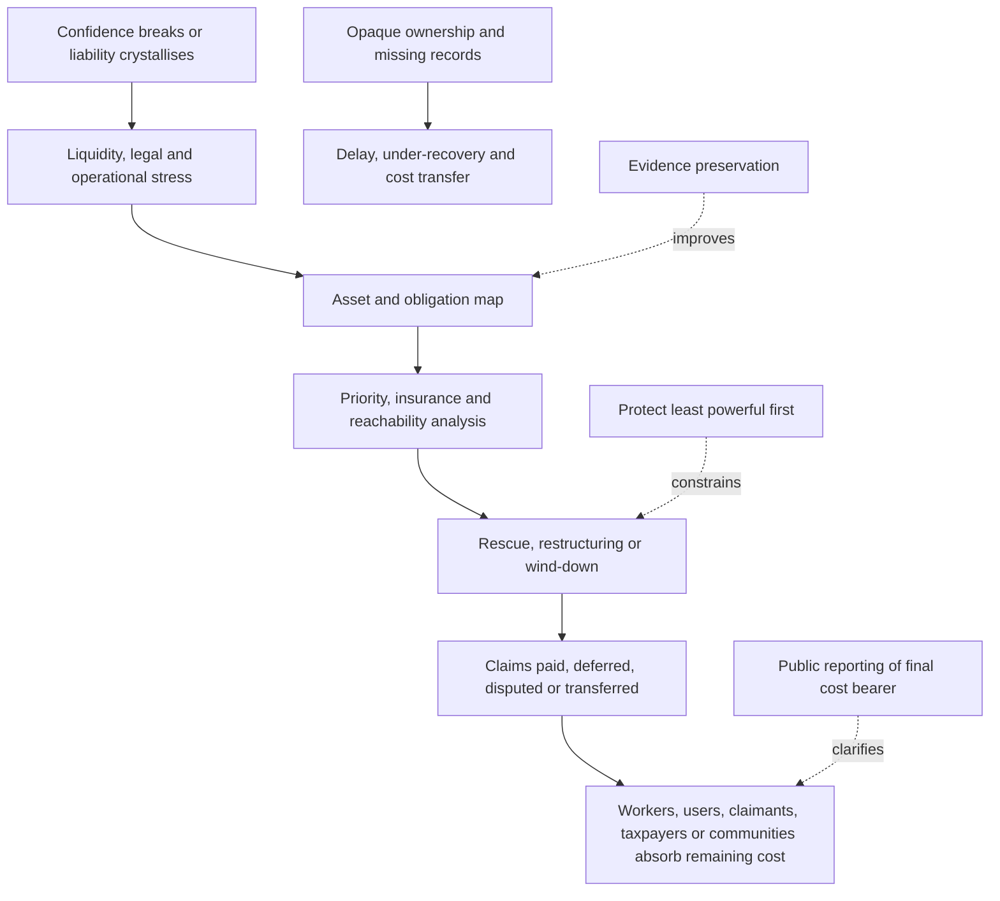

# 🧹 Cleanup Map: Who Carries The Cost  
**First created:** 2026-07-17 | **Last updated:** 2026-07-17  
*Material cleanup framework for tracing assets, obligations, liabilities, rescue structures, and the final human cost after a political, financial, media, crypto, AI, or sanctions-linked confidence system begins to fail.*

---

## 🛰️ Orientation

Collapse is not cleanup.

Exposure is not recovery.

A scandal can become public while:

- workers remain unpaid
- claimants wait
- users lose access
- investors absorb losses
- public bodies inherit infrastructure
- communities carry environmental damage
- legal costs continue
- records disappear
- powerful actors retain valuable assets

The story is not finished when confidence breaks.

It is finished when the bill has an address.

> The collapse story is incomplete until the bill has an address.

---

## ✨ Key Features

- Distinguishes visible wealth from reachable, liquid, and unencumbered wealth.
- Maps assets, debts, claims, contracts, guarantees, and insurance.
- Separates rescue, bailout, restructuring, insolvency, and orderly wind-down.
- Keeps workers, users, claimants, taxpayers, and communities in frame.
- Identifies how powerful actors retain upside while exporting cleanup.
- Connects donor capacity, civil liability, crypto liquidity, AI infrastructure, media failure, and sanctions adaptation.
- Provides a practical cleanup sequence.
- Tracks evidence preservation and record custody.
- Requires a final cost-bearer analysis.
- Includes diagnostics, disconfirmation, and editorial questions.

---

## 🧿 Core Proposition

Every confidence system has a balance sheet, even when it presents itself as:

- a movement
- a personality
- a platform
- a national project
- a technological destiny
- a moral crusade
- an insurgency
- a media brand

When confidence falls, the system must answer:

- What assets remain?
- Which obligations survive?
- Who has priority?
- Which assets are reachable?
- Which losses are insured?
- Which liabilities are disputed?
- Which costs move into the public sector?
- Who cannot exit?

The distribution of cleanup is political.

It is not merely technical.

---

# 🧾 What Needs Mapping

A cleanup map may include:

## Assets

- cash
- property
- equity
- securities
- crypto
- intellectual property
- data
- audience lists
- licences
- contracts
- equipment
- receivables
- insurance rights
- litigation claims

## Obligations

- wages
- pensions
- severance
- tax
- leases
- supplier invoices
- debt
- guarantees
- customer refunds
- regulatory penalties
- civil judgments
- settlement payments
- remediation
- environmental repair
- data-protection duties

## Structural Relationships

- parent companies
- subsidiaries
- trusts
- nominees
- beneficial owners
- lenders
- guarantors
- insurers
- contractors
- political organisations
- media entities
- platform partners

The first cleanup task is not commentary.

It is inventory.

---

# 💰 Visible Wealth Is Not Reachable Wealth

A person or organisation may appear wealthy while much of that wealth is:

- illiquid
- pledged
- encumbered
- jointly owned
- held through separate entities
- subject to prior claims
- outside the relevant jurisdiction
- difficult to value
- dependent on confidence
- protected by insolvency structure
- controlled by someone else

Preserve the distinctions:

- wealth
- liquidity
- solvency
- collectability
- availability
- control

> Wealth is not the same as collectability.

---

## 🧱 Asset Reachability Ladder

Ask:

1. Does the asset exist?
2. Who legally owns it?
3. Who beneficially controls it?
4. Is it in the relevant jurisdiction?
5. Is it liquid?
6. Is it pledged or charged?
7. Are there prior-ranking claims?
8. Is it exempt or protected?
9. Can it be frozen, sold, or enforced against?
10. What would enforcement cost and how long would it take?

A headline valuation may have little cleanup value.

---

# 🧮 Priority And Sequence

Different claimants may compete for the same pool.

Possible claimants include:

- employees
- secured lenders
- tax authorities
- landlords
- suppliers
- consumers
- civil claimants
- regulators
- shareholders
- insurers
- public bodies

Priority may depend on:

- jurisdiction
- contract
- security
- insolvency law
- employment law
- public-law duties
- court order
- insurance terms

A moral claim and a legal priority are not always the same thing.

The gap should be reported.

---

# 🛟 Rescue, Bailout, Restructuring And Wind-Down

These terms are not interchangeable.

## Rescue

External support intended to preserve the entity or function.

## Bailout

Public or private support that absorbs losses to prevent wider harm.

## Restructuring

Changes to debt, ownership, operations, or obligations to restore viability.

## Insolvency

A formal process where liabilities cannot be met as due or exceed available assets, depending on jurisdiction.

## Orderly Wind-Down

A managed closure designed to preserve evidence, pay priority claims, protect users, and reduce spillover.

The key questions are:

- What is being preserved?
- Who is being protected?
- Who absorbs the loss?
- What conditions attach?
- Who retains control afterward?

---

## 🧯 Rescue Can Preserve The Wrong Thing

A rescue may preserve:

- jobs
- essential services
- infrastructure
- data
- public access

It may also preserve:

- existing owners
- executive control
- donor influence
- harmful contracts
- opacity
- political leverage

A rescue should not be evaluated only by whether the organisation survives.

Ask what survives with it.

---

# 🧑‍🏭 Workers And Contractors

Workers often absorb cleanup first through:

- unpaid wages
- redundancy
- lost pensions
- lost benefits
- delayed invoices
- unsafe handovers
- reputational harm
- relocation
- burnout
- legal uncertainty

Contractors may be especially exposed where they are:

- small
- unsecured
- dependent on one client
- outside formal employee protections
- paid through intermediaries

Cleanup plans should prioritise:

- wage continuity
- records
- benefit protection
- notice
- severance
- references
- whistleblower protection
- access to personal data and work product where lawful

---

# 👥 Users And Small Investors

Users may lose:

- deposits
- access
- purchased services
- stored data
- subscriptions
- digital assets
- community networks

Small investors may face:

- illiquidity
- misleading valuation
- dilution
- token collapse
- frozen withdrawals
- complex recovery processes

Do not report the losses only as aggregate market numbers.

Ask:

- Who cannot absorb the loss?
- Who understood the risk?
- Who was sold safety or inevitability?
- Was the product usable after collapse?
- Were complaints visible before failure?

---

# 🏛️ Public-Sector Cost Transfer

Private systems often become public problems when they fail.

Costs may move to:

- local authorities
- regulators
- courts
- health services
- police
- welfare systems
- environmental agencies
- deposit or compensation schemes
- taxpayers

Common transfer routes include:

- emergency service provision
- infrastructure takeover
- litigation
- unemployment
- safeguarding
- remediation
- public communication
- records recovery

A private upside can become a public cleanup bill.

> Privatised confidence can leave socialised debris.

---

# 🌍 Community And Environmental Cost

Cleanup may include harms that do not appear on a conventional balance sheet:

- pollution
- abandoned buildings
- energy infrastructure
- water use
- grid upgrades
- local traffic
- lost services
- reputational damage to a place
- community division
- harassment
- public fear
- depleted local institutions

These costs are often distributed across many people and therefore undercounted.

The absence of one invoice does not mean the cost is unreal.

---

# 🧾 Evidence Preservation

Before restructuring, sale, closure, or deletion:

- preserve records
- secure devices
- freeze document-destruction schedules
- identify custodians
- maintain audit trails
- protect whistleblowers
- preserve contracts
- retain financial records
- protect user data
- document asset transfers

Cleanup without evidence preservation can become evidence destruction.

The timing matters.

Records may disappear before formal proceedings begin.

---

# 🏦 Insurance And Indemnity

Insurance may alter who pays.

Ask:

- What policy exists?
- What is covered?
- What is excluded?
- Has the insurer been notified?
- Is coverage disputed?
- Is there an excess?
- Is there an aggregate limit?
- Is defence cost inside or outside the limit?
- Does misconduct void cover?
- Who benefits from an indemnity?
- Is the indemnity itself funded?

Insurance does not erase liability.

It changes the transmission route.

---

# 🔗 Guarantees And Shared Exposure

Risk may move through:

- personal guarantees
- parent guarantees
- cross-default clauses
- shared services
- intercompany loans
- joint ventures
- licensing
- common insurance
- common lenders
- reputational dependence

An entity may appear legally separate but economically coupled.

Preserve the distinction between:

- separate legal personality
- shared exposure
- actual control
- moral responsibility

---

# 🪙 Crypto And Digital Asset Cleanup

Crypto-linked cleanup may involve:

- exchange insolvency
- wallet custody
- private-key control
- token valuation
- stablecoin redemption
- reserve quality
- bridge exposure
- sanctions risk
- frozen withdrawals
- fraud claims
- jurisdictional uncertainty

Ask:

- Who controls the keys?
- Which assets are segregated?
- Are reserves verified?
- What claim does the user legally hold?
- Is the asset liquid?
- Can it be traced?
- Are there competing creditors?
- Which jurisdiction governs?

A visible wallet balance is not necessarily recoverable value.

---

# 🤖 AI And Data-Infrastructure Cleanup

AI projects may leave:

- long-term leases
- data-centre obligations
- grid commitments
- cloud contracts
- model licences
- data-processing duties
- employment losses
- local planning costs
- public subsidies
- proprietary data
- safety obligations

Ask:

- Who owns the hardware?
- Who owns the data?
- Who must preserve the model or logs?
- What public money is exposed?
- Can the project be repurposed?
- Who pays for stranded infrastructure?
- What user or employee rights survive closure?

The model may be intangible.

The cleanup is not.

---

# 📺 Media And Platform Cleanup

A failing media or platform system may leave:

- unpaid staff
- archives
- subscriber data
- legal claims
- defamation exposure
- advertiser contracts
- content rights
- public-interest records
- vulnerable sources
- ongoing corrections

Ask:

- Who controls the archive?
- Will public-interest reporting remain accessible?
- Are confidential sources protected?
- Who maintains corrections?
- What happens to subscriber data?
- Is the audience list sold?
- Does a new owner inherit editorial obligations?
- Which claims survive the sale?

An archive can be an asset.

It can also be a public record that should not disappear.

---

# ⚔️ War And Sanctions Cleanup

Sanctions-linked cleanup may involve:

- blocked assets
- licence applications
- contract frustration
- stranded cargo
- insurance disputes
- payment interruption
- humanitarian exemptions
- secondary effects on workers and civilians
- later asset release

Ask:

- Which jurisdiction imposed the restriction?
- Which asset is blocked?
- Who owns and controls it?
- What licence route exists?
- Who bears storage, delay, or spoilage cost?
- Are humanitarian safeguards working?
- What happens when sanctions change?

A sanctions measure can end before the commercial and human cleanup does.

---

# 🧑‍⚖️ Civil Claims And Recovery

Civil liability moves through stages:

1. allegation
2. claim
3. filing
4. finding
5. judgment
6. enforcement
7. recovery

Do not collapse them.

A judgment may establish liability.

It does not guarantee payment.

Recovery may depend on:

- asset tracing
- priority
- jurisdiction
- insurance
- settlement
- insolvency
- enforcement cost
- time

> A judgment is not recovery.

---

# 🧹 Cleanup Sequence

A practical sequence is:

## 1. Stop Further Harm

- stop unsafe activity
- protect users
- prevent retaliation
- maintain essential functions

## 2. Preserve Evidence

- secure records
- identify custodians
- protect sources and whistleblowers

## 3. Map Assets And Obligations

- ownership
- control
- debt
- claims
- contracts
- insurance
- guarantees

## 4. Protect The Least Powerful

- workers
- users
- small suppliers
- claimants
- local communities

## 5. Stabilise Essential Functions

- data access
- public services
- infrastructure
- payroll
- communication

## 6. Reach Available Assets

- voluntary payment
- insurance
- sale
- enforcement
- restructuring

## 7. Allocate Remaining Loss

State clearly who absorbs what.

## 8. Repair Institutions

- governance
- regulation
- archives
- correction
- public trust
- recurrence prevention

Cleanup should be sequenced around harm reduction, not merely creditor convenience.

---

# 🗺️ Cleanup Map Template

For each system, record:

| Field | Question |
|---|---|
| Trigger | What caused the cleanup phase? |
| Essential function | What must continue temporarily? |
| Assets | What remains and who controls it? |
| Obligations | What must still be paid or performed? |
| Insurance | What coverage may respond? |
| Priority claims | Who ranks first legally? |
| Vulnerable groups | Who cannot absorb delay or loss? |
| Public exposure | Which costs may move to the state? |
| Evidence | What records must be preserved? |
| Exit route | Can the system be restructured or wound down? |
| Final cost bearer | Who ultimately absorbs the loss? |

---

# 🔄 Cleanup Transmission Route

The cleanup route should make loss transfer visible.

---

## 🧠 Cleanup Diagnostic

Ask:

- What triggered the cleanup phase?
- Which functions must continue?
- What assets remain?
- Who owns and controls them?
- Which obligations survive?
- Who has legal priority?
- What insurance or guarantee applies?
- Which assets are reachable?
- What evidence may disappear?
- Which costs are moving into the public sector?
- Who cannot absorb delay?
- Is a rescue preserving essential function or existing control?
- Who retains the upside?
- Who carries the final loss?

---

## 🧯 Common Failure Modes

- treating headline wealth as recoverable value
- ignoring secured creditors
- assuming insurance will pay
- losing records during restructuring
- protecting investors before workers or users
- selling data without public scrutiny
- allowing archives to disappear
- public rescue without conditions
- preserving executive control
- undercounting community and environmental harm
- reporting a judgment as recovery
- reporting closure as completion
- ignoring small suppliers
- treating sanctions expiry as immediate normalisation

---

## 🛡️ Common Buffers

- transparent ownership
- clean records
- asset segregation
- insurance
- conservative leverage
- worker protections
- user compensation schemes
- arm’s-length governance
- public-interest conditions on rescue
- archive preservation
- strong regulators
- early intervention
- cross-border cooperation
- accessible claims processes
- local reporting

---

## ⚖️ Evidence Discipline

Preserve the distinctions:

- collapse is not cleanup
- exposure is not recovery
- wealth is not liquidity
- liquidity is not collectability
- ownership is not control
- control is not availability
- rescue is not bailout
- bailout is not exoneration
- judgment is not payment
- insurance is not guaranteed coverage
- legal separation is not absence of shared exposure
- public cost is not always visible in one budget line
- closure is not the end of obligation
- sanctions expiry is not completed remediation

Use categories such as:

- asset
- liability
- secured claim
- unsecured claim
- insurance
- guarantee
- judgment
- enforcement
- public exposure
- community cost
- unresolved obligation

---

## 🧪 What Would Disconfirm The Concern?

Evidence of an effective cleanup may include:

- essential services preserved
- records secured
- workers and users paid promptly
- clear asset ownership
- insurance responding
- public rescue carrying strong conditions
- executives and owners absorbing proportionate loss
- archives and corrections preserved
- community and environmental remediation funded
- transparent final loss allocation
- strong recovery against reachable assets
- reduced recurrence risk

A rescue may genuinely protect the public.

An insolvency process may allocate losses fairly.

A wealthy owner may voluntarily meet obligations.

The framework should preserve those possibilities.

---

## ✨ Working Rules

> The collapse story is incomplete until the bill has an address.

> Wealth is not the same as collectability.

> A judgment is not recovery.

> Privatised confidence can leave socialised debris.

> Cleanup without evidence preservation can become evidence destruction.

> A rescue should be judged by what it preserves and who it protects.

> Protect the least powerful before protecting the story of the institution.

> Follow the cost until it stops moving.

---

## 🌌 Constellations

🧹 💰 🧾 🛟 🏛️ 👥 — cleanup; assets; obligations; rescue; public cost; final cost bearers.

---

## ✨ Stardust

cleanup, assets, liabilities, collectability, insolvency, rescue, bailout, workers, users, taxpayers, civil claims, insurance, evidence preservation, public cost

---

## 🏮 Footer

*Cleanup Map: Who Carries The Cost* is a living node of the **Polaris Protocol**.  
It maps the material aftermath of political, financial, media, crypto, AI, and sanctions-linked confidence failures through assets, obligations, reachability, insurance, rescue, wind-down, and final loss allocation.  
Its function is to keep the workers, users, claimants, taxpayers, and communities carrying the cleanup visible after the spectacle has moved on.

> 📡 Cross-references:
>
> - [`🚪_exit_routes_back_to_democracy.md`](./🚪_exit_routes_back_to_democracy.md) — *system-level exit, differentiated accountability, repair, and reintegration*
> - [`🧭_citizen_routes_back_to_democracy.md`](./🧭_citizen_routes_back_to_democracy.md) — *citizen-level re-entry, ordinary participation, and democratic efficacy*
> - [`📌_editorial_rules_and_question_bank.md`](./📌_editorial_rules_and_question_bank.md) — *compact newsroom rules for exit, cleanup, and cost-bearer reporting*
> - [`💸_can_the_assets_carry_the_risk.md`](../👹_Collision_Systems/💸_can_the_assets_carry_the_risk.md) — *asset capacity, liquidity, leverage, and exposure*
> - [`🧾_donor_provenance_and_civil_liability.md`](../👹_Collision_Systems/🧾_donor_provenance_and_civil_liability.md) — *source of funds, ownership, claims, enforcement, and collectability*
> - [`🪙_crypto_and_stablecoin_lobbying.md`](../👹_Collision_Systems/🪙_crypto_and_stablecoin_lobbying.md) — *digital assets, reserves, redemption, and political confidence*
> - [`🤖_ai_market_confidence.md`](../👹_Collision_Systems/🤖_ai_market_confidence.md) — *AI infrastructure, capex, energy, and commercial exposure*
> - [`⚔️_war_sanctions_and_workarounds.md`](../👹_Collision_Systems/⚔️_war_sanctions_and_workarounds.md) — *blocked assets, workarounds, trade rerouting, and delayed cleanup*
> - [`📺_media_ownership_and_platform_power.md`](../👹_Collision_Systems/📺_media_ownership_and_platform_power.md) — *media assets, audience transfer, archives, and ownership*
> - [`🏘️_local_journalism_as_resilience_infrastructure.md`](../🗞️_Media_Practice/🏘️_local_journalism_as_resilience_infrastructure.md) — *local scrutiny, public records, and consequence tracking*
>
> 🏮 Return To:
>
> - [`🧹_Exit_And_Cleanup`](./) — *current repair, reintegration, and cost-allocation cluster*
> - [`🗻_The_Manifestation_Molehill`](../) — *media-facing pack on colliding confidence systems*
> - [`👻_Ghosts_Of_Accountability`](../../) — *parent accountability cluster*
> - [`📲_Press_Matters`](../../../) — *press and media-analysis layer*
> - [`🌓_3_In_The_Moment`](../../../../) — *current-events and active-pattern layer*

*Survivor authorship is sovereign. Containment is never neutral.*

_Last updated: 2026-07-17_
