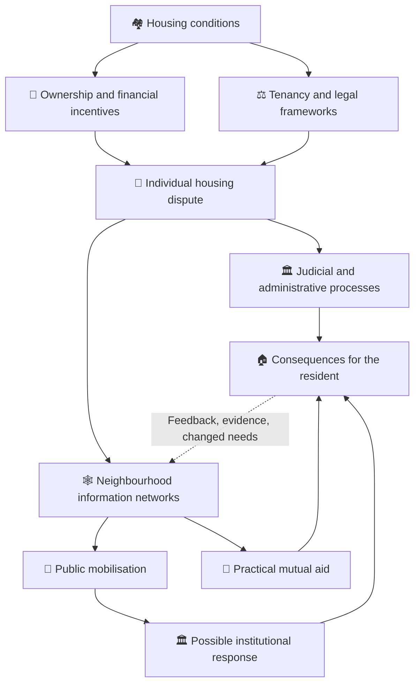
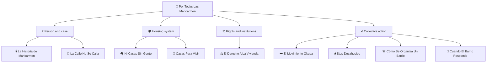

# 🌹 Por Todas Las Maricarmen
**First created:** 2026-10-09 | **Last updated:** 2026-10-09  
*One person's home; the legal, financial and social systems around it; and the neighbourhood question of who actually turns up when somebody needs help.*

---

## 🧭 Orientation — The front door

A home is an awkward thing to fit into a single institutional category. The person who lives there knows its rooms, its noises, the route to the shops, the neighbours who notice when the curtains have not opened. A property owner knows a legal interest in land and a set of obligations. A bank may see collateral. A court sees a dispute with pleadings, evidence and a procedural route. A housing authority sees an application, an eligibility test and a stock of available accommodation. A neighbourhood sees a person whose presence is part of its own history.

None of these descriptions necessarily makes the others disappear. The trouble begins when a decision made under one description changes somebody's life under another. A property transaction does not move the kitchen, the memories or the neighbour who has been checking in for thirty years. A possession order may settle an important legal question without answering where its consequences leave the person affected. And the person who has to live with those consequences does not have the luxury of considering them merely an interesting policy interaction.

**Por Todas Las Maricarmen** is a ten-node research cluster within **🔊 Turn The Public Up**. It uses the story named in its title to investigate housing insecurity in Spain: who can access a home; how property becomes an investment; what the law recognises and can enforce; how Spanish housing movements developed; how a neighbourhood organises; and what mutual aid actually provides. The cluster's starting point is a person, not a spreadsheet. The spreadsheet will nevertheless be summoned to give evidence.

The individual case, the Spanish housing system and Polaris's cybernetic interpretation are **different evidential layers**. A general account of financialisation cannot prove the motive of a particular owner. A constitutional provision cannot, by itself, prove that a specific eviction was unlawful. A moving campaign account cannot establish every detail of a court file. The reader should be able to follow each layer without being tricked into confusing them.

> **The organising question:** What happens when the systems that determine the legal and financial status of a building do not adequately account for the life being lived inside it — and what can people and institutions actually do about that?

---

## 🌹 1. Why this name?

*Por todas las Maricarmen*: for all the Maricarmens. The plural matters. One person's experience can make a wider problem visible, and solidarity can recognise that other people face related risks. But the plural must not consume the singular. The woman at the centre of a story has her own circumstances, wishes, decisions and legal position. She is not a blank template on which to write an entire national housing policy.

This cluster therefore holds two commitments together. It takes the human consequences of insecure housing seriously, including those that escape market indicators and administrative forms. It also insists that the specific case be reconstructed with evidence rather than with details borrowed from a plausible political narrative. The [central narrative](🌹_por_todas_las_maricarmen.md) supplies the cluster's emotional and analytical starting point; the [case chronology](🕯️_la_historia_de_maricarmen.md) is where dates, actors, proceedings, reporting and uncertainties belong.

There is a reason this work sits under **Turn The Public Up**. A housing dispute can be legally private and politically significant at the same time. Public concern does not automatically alter a contract or a court order. It can, however, bring attention to administrative practice, the availability of remedies, the conduct of public bodies, the distribution of housing resources and the ways a local problem may recur elsewhere. The public question is not merely whether people are angry. It is whether information reaches the people with the capacity — or the duty — to act.

## 🕯️ 2. Start with the person, then establish the sequence

### 🌹 [Por Todas Las Maricarmen](🌹_por_todas_las_maricarmen.md)

The narrative node asks what a home means when the person living in it and the systems governing it describe it differently. It connects the individual experience of threatened displacement with housing policy, legal procedure, public mobilisation and neighbourhood belonging. Read this first for the cluster's central argument and authorial voice.

### 🕯️ [La Historia de Maricarmen](🕯️_la_historia_de_maricarmen.md)

The chronology node separates the reported sequence of the case from the wider interpretation. Its existing draft describes a longstanding Madrid tenancy, an eviction dispute, enforcement events, public attention and a proposed route home. **Those case-specific statements require independent documentary checking before the README can adopt them as established facts.** The working draft is a research source *about what the draft currently claims*, not a substitute for the underlying court record, first-hand account or corroborated reporting.

That distinction is particularly important for a story with an emotionally consequential ending. A date can be wrong. An ownership description can confuse a landlord, agent and beneficial owner. A report of a scheduled eviction can be mistaken for an executed one. A public statement about a proposed agreement can be mistaken for a completed legal arrangement. None of these are small errors when the claim concerns somebody's home.

The chronology should answer: what happened, when, according to whom, with what evidence, and what remains unresolved? The narrative may then explore why it matters. This is not a choice between humanity and rigour. It is how we avoid using one to counterfeit the other.

## 🏘️ 3. There can be buildings without accessible homes

### 🏘️ [Ni Casas Sin Gente](🏘️_ni_casas_sin_gente.md)

The slogan *ni casas sin gente, ni gente sin casas* — neither houses without people nor people without houses — has the rather devastating advantage of sounding administratively straightforward. Unfortunately, a dwelling being counted does not mean a household can move into it. It may be in the wrong place, cost too much, lack accessible facilities, be unavailable for long-term residence, or sit within a tenure system that the household cannot enter.

The housing-access node distinguishes a physical shortage from an affordability shortage, a shortage of secure tenancies, and a shortage of suitable or accessible accommodation. It also investigates vacant dwellings and the limits of the statistics used to describe them. Vacancy figures are not a magical inventory of immediately habitable homes, any more than a national total of dwellings tells you whether a disabled tenant can find a suitable flat near existing support.

The key question is **not simply how many buildings Spain has, but which households can obtain which homes, on what terms, and where**. That is a material question about prices, geography, income, housing quality, public provision and the design of tenure systems. It should not be collapsed into a slogan about empty properties, however satisfying the slogan may be.

### 🏦 [Casas Para Vivir, No Para Especular](🏦_casas_para_vivir_no_para_especular.md)

The financialisation node investigates a different, connected problem: what happens when housing operates as collateral, an income-producing asset, a portfolio holding and a means of storing or accumulating wealth. Its terrain includes mortgages, the property boom and crash, SAREB, SOCIMIs, investment funds, ownership structures and public housing sales.

Financialisation is **not** a synonym for every landlord, every expensive home or every property purchase. Investment can fund construction and maintenance. The analytical question is which incentives shape decisions, who receives returns, who carries risks and how those arrangements affect people's access to stable housing. Likewise, the presence of institutional investors in a market does not prove that any particular tenancy dispute arose from speculation. Establish the transaction before diagnosing its motive.

These two nodes belong together because housing scarcity, access constraints and financial incentives can interact. They remain separate because the measurements and causal arguments are not identical. One asks whether people can live in the available stock; the other asks how financial arrangements shape the stock, its ownership and its price. A building may be both somebody's home and somebody else's investment. The second description does not cancel the first.

## ⚖️ 4. The law has several doors, not one

### ⚖️ [El Derecho A La Vivienda](⚖️_el_derecho_a_la_vivienda.md)

Spain's Constitution recognises a right to decent and adequate housing in Article 47, while Article 33 protects private property and Article 53 helps determine how different constitutional provisions operate. Tenancy legislation, civil procedure, legal aid, the 2023 Housing Law and European and international standards add further layers. They are related; they are not interchangeable.

The legal node's organising distinction is **recognition is not the same as entitlement, procedure or remedy**. A person may possess a valid defence to a possession claim. Another may qualify for an administrative housing programme. Another may have grounds to challenge procedural irregularity. A social-services assessment can identify urgent need without itself overturning a court order. A constitutional principle can influence legislation and judicial reasoning without automatically entitling every claimant to the particular dwelling they occupy.

This matters because housing insecurity is experienced as one crisis, while the law may divide it into separate questions: who owns the property; who has the right to occupy it; which historical tenancy regime applies; why possession is sought; what deadlines govern a defence; whether proceedings can be suspended; and which institution can provide housing assistance. The individual may have to navigate all of them while still getting through an ordinary Tuesday.

The node distinguishes threatened eviction, judgment, enforcement, suspension and alternative accommodation. It also separates mortgage foreclosure from tenancy litigation and occupation without a valid title. Those categories carry different laws and protections. When reading any account of the Maricarmen case, the applicable legal route needs to be established from records, not inferred from the general fact that somebody faced displacement.

The Constitution has made an important statement. It has not personally filled out the application form, found the relevant office, or checked whether the office has an accessible appointment slot. This is precisely why the implementation machinery matters.

## 🗝️ 5. Spanish housing movements have histories, plural

### 🗝️ [El Movimiento Okupa](🗝️_el_movimiento_okupa.md)

The *okupa* node traces Spanish squatting, autonomous social centres, urban contestation and the use of buildings for political and community purposes. It distinguishes self-managed social centres, residential occupation, tenancy disputes and other forms of contested possession. Those distinctions are both historically and legally important. **A longstanding tenant resisting eviction is not thereby an *okupa*.** Shared concerns about urban space do not create a shared legal status.

The node also asks what buildings do when they become collective spaces: host meetings, distribute knowledge, sustain culture, provide resources and make organising possible. It is possible to analyse the political role of occupation without pretending that all occupations have the same motives or legal consequences.

### ✊ [Stop Desahucios](✊_stop_desahucios.md)

The anti-eviction node examines the mortgage crisis, the emergence of the Plataforma de Afectados por la Hipoteca (PAH), assemblies, collective legal literacy, *dación en pago*, public interventions and the long work of contesting housing insecurity. It makes a crucial distinction between an eviction postponed, a proceeding suspended, a negotiated settlement, a preserved tenancy and a household rehoused elsewhere. All may matter; they are not the same outcome.

These movements sometimes intersect, share people or respond to related structural conditions. They should not be collapsed into a single romantic picture of Spain's housing resistance. An autonomous social centre, a PAH assembly and a neighbourhood campaign around a particular tenant can have different aims, membership, practices and legal questions. History is more interesting when we allow it to retain its distinctions.

## 📣 6. When the street becomes part of the information system

### 📣 [La Calle No Se Calla](📣_la_calle_no_se_calla.md)

The mobilisation node asks how an individual dispute becomes a public question. A call circulates; people gather; a campaign frames demands; journalists report; institutions respond or do not. The movement of information can change what is publicly known and which decisions attract scrutiny. But the sequence **visibility → pressure → response → remedy** is not automatic. Public attention can win time or generate political leverage; it does not, on its own, rewrite a contract or invalidate a judicial decision.

There is a second difficulty. Public campaigns may need a story people can understand quickly. Legal proceedings and personal lives are rarely designed for the convenience of a headline. Simplification can make an injustice visible, but it can also erase relevant facts, exaggerate an outcome or turn the affected person into a symbol whose own wishes become inconvenient. Consent to one public statement is not consent to indefinite access to somebody's private life.

The street can make an institution listen. The analytical task is to establish **which institution**, what it was asked to do, what powers it actually held, what it did and whether anything changed. Protest is neither a substitute for evidence nor an irrelevant footnote to it. It is part of the system through which information, collective demands and political accountability move.

## 🕸️ 7. A neighbourhood is not automatically a network

### 🕸️ [Cómo Se Organiza Un Barrio](🕸️_como_se_organiza_un_barrio.md)

A *barrio* is a place. Becoming an effective support network takes more than sharing a postcode. People need relationships, trusted ways to exchange information, meeting places, knowledge of local institutions and some method of coordinating action. The neighbourhood-organisation node investigates how those capacities develop, including through historical associations, assemblies, weak ties, shared records and organisational memory.

Its central insight is that **collective intelligence depends on routing**. One person knows tenancy paperwork. Another knows the municipal office. Someone else has a car, understands an accessibility requirement or knows which organiser can arrange accompaniment. The group does not need to turn everybody into an expert in everything. It needs to connect knowledge to the people who can use it, with enough provenance and context to avoid creating fresh errors.

This is also where the risks become visible. A single indispensable coordinator can become a bottleneck. A busy group chat can spread a rumour faster than a correction. An assembly can speak in the name of a neighbourhood while excluding residents who cannot attend. Informal authority can become hard to challenge. The point is not to declare communities inherently wise. It is to ask what makes collective knowledge reliable, accountable and useful.

## 🌱 8. Solidarity has to work on Thursday

### 🌱 [Cuando El Barrio Responde](🌱_cuando_el_barrio_responde.md)

The mutual-aid node takes the next step. Once a neighbourhood can organise, what does that capacity actually provide? Food, transport, accessible meeting places, help understanding documents, referrals, accompaniment, emergency funds, childcare, practical repairs, time and attention. The answer may be unglamorous. That is not a defect. A resident who needs to get to an appointment benefits rather more from an agreed lift than from a beautifully typeset statement of collective principles.

Mutual aid is not merely charity with a friendlier label. The distribution of power matters: who identifies a need, who decides what support is appropriate, whether the recipient can refuse, how information is shared and who is accountable when something goes wrong. Reciprocity need not mean a person must repay assistance in equal measure. People have different capacities, and those capacities change.

The node also examines the limits of unpaid care. Volunteers burn out. Buildings and transport cost money. Disability access cannot be an afterthought. Personal information should not circulate more widely than necessary. Community assistance may help someone reach a solicitor or housing office, but it cannot replace qualified legal representation, create missing social housing stock or absolve a public authority of its duties.

**Neighbourhood organisation** asks how collective capacity forms. **Mutual aid** asks whether that capacity reaches the person who needs it, in a form they actually want, at the time it matters. The first can hold an excellent assembly. The second must still remember Thursday.

---

## 🗺️ 9. The complete reading map

All ten research nodes are linked below. The README is the front door, not a compulsory examination before admission.

| Node | Central question | Read it for |
|---|---|---|
| [🌹 Por Todas Las Maricarmen](🌹_por_todas_las_maricarmen.md) | What does one threatened home reveal? | The central narrative and synthesis |
| [🕯️ La Historia de Maricarmen](🕯️_la_historia_de_maricarmen.md) | What happened, and what can be established? | Case chronology, claims and evidence gaps |
| [📣 La Calle No Se Calla](📣_la_calle_no_se_calla.md) | How does a private dispute become a public issue? | Mobilisation, media and institutional pressure |
| [🏘️ Ni Casas Sin Gente](🏘️_ni_casas_sin_gente.md) | Why do existing dwellings not guarantee accessible homes? | Supply, affordability, vacancy and suitability |
| [🗝️ El Movimiento Okupa](🗝️_el_movimiento_okupa.md) | How have occupation and social-centre movements developed? | Movement history and urban space |
| [✊ Stop Desahucios](✊_stop_desahucios.md) | How have people organised against eviction? | PAH, legal knowledge and anti-eviction practice |
| [🕸️ Cómo Se Organiza Un Barrio](🕸️_como_se_organiza_un_barrio.md) | How does a neighbourhood acquire collective capacity? | Networks, assemblies and information routing |
| [🏦 Casas Para Vivir, No Para Especular](🏦_casas_para_vivir_no_para_especular.md) | How do financial incentives shape housing? | Credit, investors, ownership and financialisation |
| [⚖️ El Derecho A La Vivienda](⚖️_el_derecho_a_la_vivienda.md) | What rights exist, and how can they be enforced? | Constitutional, tenancy and procedural law |
| [🌱 Cuando El Barrio Responde](🌱_cuando_el_barrio_responde.md) | How does solidarity become dependable assistance? | Mutual aid, consent, care and resource limits |

## 🧭 10. Five routes through the cluster

**🌹 Follow the person.** Begin with the [central narrative](🌹_por_todas_las_maricarmen.md), then the [chronology](🕯️_la_historia_de_maricarmen.md), [public mobilisation](📣_la_calle_no_se_calla.md) and [mutual aid](🌱_cuando_el_barrio_responde.md). This route starts with lived experience and follows its immediate public and practical context. Treat unverified case particulars as research questions, not settled facts.

**🏘️ Understand the housing system.** Read [housing access](🏘️_ni_casas_sin_gente.md), [financialisation](🏦_casas_para_vivir_no_para_especular.md) and [housing rights](⚖️_el_derecho_a_la_vivienda.md). This route moves from the material distribution of homes through the incentives governing property to the rules and institutions that shape occupation and remedies.

**✊ Follow the movements.** Read the [okupa history](🗝️_el_movimiento_okupa.md), [Stop Desahucios](✊_stop_desahucios.md), [neighbourhood organisation](🕸️_como_se_organiza_un_barrio.md) and [mutual aid](🌱_cuando_el_barrio_responde.md). This route compares different traditions of collective action rather than treating them as one organisation.

**🧠 Follow the information.** Start with [neighbourhood networks](🕸️_como_se_organiza_un_barrio.md), move through [legal procedure](⚖️_el_derecho_a_la_vivienda.md) and [public communication](📣_la_calle_no_se_calla.md), then ask whether [practical assistance](🌱_cuando_el_barrio_responde.md) reaches the resident. Who knows what? Who needs to know? Who has authority? Where does the message get lost?

**🏛️ Follow responsibility.** Start with [rights and remedies](⚖️_el_derecho_a_la_vivienda.md), then examine [housing provision](🏘️_ni_casas_sin_gente.md), [economic incentives](🏦_casas_para_vivir_no_para_especular.md) and the [case record](🕯️_la_historia_de_maricarmen.md). This route is for readers asking not only what ought to happen, but which actor could legally or practically have done what.

These routes are invitations, not prerequisites. A reader may enter through the historical movement, the legal question or the story itself and still find the others without a treasure map and a ceremonial compass.

## 🧠 11. What does each system think a home is?

This is the cluster's central **Embodied Information Ecology** problem. Different systems do not merely hold different opinions about the same property. They use different categories, evidence, timescales and decision rules. Those differences can be useful: courts must apply law rather than neighbourly affection, and banks must assess credit risk rather than reconstruct the family history of every building. But the effects of their decisions extend beyond the categories in which those decisions are made.

| Person or system | The home may appear as | What this view can miss |
|---|---|---|
| Resident | Security, habit, belonging, everyday life | Not a deficiency of the resident's view; other actors may not receive this information |
| Property owner | Legal title, use, maintenance, income and obligations | The lived consequences of exercising a legal entitlement |
| Lender | Collateral and credit exposure | The social significance of the secured dwelling |
| Investor | Asset, yield, risk and projected value | The timescale and costs of residential displacement |
| Court | Claims, evidence, legal status and available remedies | Consequences beyond its jurisdiction or the material before it |
| Housing authority | Stock, eligibility, allocation and statutory duties | Needs that do not fit a particular programme or category |
| Social services | Household circumstances, needs and vulnerability | Powers held by courts or housing providers rather than social services |
| Neighbour | Relationship, history and practical mutual dependence | The legal record or the wider market conditions |
| Campaign | A case raising collective concerns | The individual's wishes or legally significant complexities |
| Journalist | A reportable sequence of events | The full private life and documentary context |

This table is a **conceptual model**, not a psychological profile of particular people. An owner may also care deeply about a tenant; a court may take serious account of vulnerability where the law permits; a neighbour may be misinformed. The issue is the design of institutional roles, not an assumption that everyone within a category thinks alike.

A resident can experience one event as the loss of a home, while the court has determined a narrower question about possession, the housing office is assessing eligibility and a campaign is trying to generate attention. Each process may be internally coherent. Together they may still leave a person without an effective solution. **The system can be locally correct and collectively inadequate.**

That is why information is embodied here. The consequences of a missing document, an inaccessible appointment, a delayed referral or an inaccurate legal category are not confined to the document, appointment, referral or category. They arrive in a person's body, routines, relationships and material environment. A procedural deadline and a hospital appointment do not cease to conflict because they appear in different databases.

## 🔄 12. From market pressure to institutional response

The following map describes possible relationships between systems, **not an established causal chain in Maricarmen's case**:

The arrows indicate questions about influence and coordination, not proof that one actor caused another to act. Housing prices may change incentives without causing a particular dispute. Publicity may generate a response without obtaining a legal remedy. Practical support may reduce immediate hardship without preserving a tenancy. Conversely, a legal victory may prevent displacement while leaving other forms of insecurity unresolved.

Several recurring dynamics are worth watching. **Delays:** an institution can reach a correct decision after the relevant deadline has passed. **Bottlenecks:** a single lawyer, organiser or caseworker may hold essential knowledge that nobody else can access. **Feedback:** a campaign may reveal new evidence or public commitments, while a court decision may alter the urgency of organising. **Externalities:** an apparently rational decision within a property or credit system can impose costs on households and neighbourhoods not included in the original calculation. **Adaptation:** groups and authorities may change procedures after repeated failures, but only if failures are recorded and recognised.

A useful analysis asks what information was available to each actor at the time, which actions were possible, which were required, and what evidence would show that one action affected another. That is more demanding than simply announcing that 'the system failed'. It is also more useful if anyone wants to change the system.

## 🏛️ 13. Who can actually do what?

The legal and administrative landscape is divided. The distinctions below are general orientation, not a substitute for checking the operative law and jurisdiction of a particular case.

| Actor | Possible role | Important boundary |
|---|---|---|
| National legislature | Sets statutory frameworks | Does not adjudicate an individual tenancy claim |
| Autonomous community | Exercises significant housing-policy powers | Implementation and programmes differ by territory |
| Municipality | Local housing functions, planning and services | Cannot simply reverse a court judgment |
| Court | Determines claims and orders under applicable law | Is not generally the body allocating permanent social housing |
| Social services | Assesses needs, coordinates support and relevant referrals | Does not automatically control possession proceedings |
| Property owner | Exercises lawful property rights and obligations | Ownership does not extinguish statutory tenant protections |
| Housing organisation | Advice, organising, advocacy, referrals | Does not gain judicial authority through public support |
| Neighbours and volunteers | Knowledge, accompaniment and practical resources | Cannot be treated as an unlimited replacement for public provision |

The point is not to excuse institutional inaction. It is to locate responsibility precisely. A genuine lack of authority is different from a failure to use authority that exists. A housing office may be unable to change a court order but still have duties relating to assistance. A court may be unable to create social housing but still be obliged to apply procedural protections. An effective campaign must know which question belongs at which door — and what to do when the door leads to yet another department.

The person affected should not have to become an expert in administrative topology before their needs are recognised. Yet that is often what complex systems demand. Neighbourhood groups can reduce the burden by mapping procedures and contacts, while the underlying responsibility for accessible public services remains with the institutions entrusted to provide them.

## 📚 14. Evidence, provenance and unfinished questions

The cluster combines narrative, legislation, official data, historical scholarship, movement records, participant accounts and Polaris analysis. These are not equivalent sources of authority. The reader deserves to know what kind of claim they are being asked to accept.

| Claim type | Appropriate foundation | What it does not prove by itself |
|---|---|---|
| Legal rule | Operative statute, regulation or authoritative judgment | That the rule applied in a particular case without relevant facts |
| Judicial event | Court record or reliable, attributable reporting | Every private consequence of the event |
| Administrative action | Official record, decision or statement | That the action achieved its intended effect |
| Housing statistic | Identified dataset, period and methodology | A causal explanation without further analysis |
| Participant experience | Attributed testimony, used with consent | Independent verification of every surrounding fact |
| Movement claim | Organisation's dated statement or record | A neutral finding about all parties or outcomes |
| Historical interpretation | Scholarship and traceable primary material | That every locality followed the same history |
| Polaris model | Explicit reasoning and declared assumptions | A measured empirical result |
| Open question | Clearly labelled research gap | Permission to insert a convenient answer |

**Publication boundary:** Several existing case-centred drafts contain detailed assertions about Maricarmen's identity, tenancy duration, named organisations, dates, proceedings, health and outcome. Their presence in these drafts does **not** mean they have been independently verified for this README. Those assertions should be checked against reliable contemporary reporting and, where obtainable and appropriate, primary legal or institutional documents before being presented as settled fact. The [chronology](🕯️_la_historia_de_maricarmen.md) is the proper place to record competing accounts and missing documents.

The same discipline applies to legal and economic material. An official consolidated statute may have changed after an earlier article was written; the version operative on a particular date matters. A statistic about vacant homes needs its definition and geographic context. A company's legal title, its asset manager and its beneficial ownership should not be confused. A campaign's claim that an eviction was 'stopped' requires clarification of whether enforcement was cancelled, postponed, suspended or followed by a negotiated outcome.

Research should also be honest about silence. Missing evidence is not proof that support did not exist; it is a limit on what the archive can establish. A persuasive explanation is not made stronger by pretending the remaining uncertainties have gone away. **A living archive is allowed to have questions.** It is not allowed to quietly turn those questions into facts.

### 🔎 Outstanding case checks

The case-facing nodes should maintain a shared verification register for the tenancy's relevant dates and terms; ownership and agency arrangements; the actual legal grounds and procedural route; court orders and enforcement stages; attributable statements by the resident and organisers; public-authority involvement; any documented practical support; and the eventual outcome. Personal health information should be included only when relevant, responsibly sourced and appropriate to disclose.

### 📖 Where the detailed sources live

Each specialist node carries its own research references, caveats or source register. That division is intentional. The README is an interpretive and navigational hub, not a device for laundering citations from one subject into another. Follow the linked node for the evidence behind a particular legal, historical or economic claim. Where a draft flags a fact for checking, retain that flag until the underlying source has actually been examined.

## 🗺️ 15. Cluster architecture

The ten nodes can be read as four intersecting branches, with the narrative linking them:

This is a **reading architecture**, not a hierarchy of moral worth or an empirical diagram of causation. The financial system can affect housing access; legal processes can change the urgency of mutual aid; public mobilisation can produce information that reaches institutions; neighbourhood knowledge can help a resident use a legal remedy. Each branch needs the others to explain the whole, but each retains its own evidence and questions.

The architecture also prevents a common analytical error: asking one kind of evidence to do every job. The account of a neighbour's practical help cannot establish the constitutionality of a law. A constitutional provision cannot measure the supply of accessible homes. A property transaction cannot tell us how a resident experienced her kitchen. And a photograph of a crowd cannot tell us whether an order was legally suspended. We need all these forms of knowledge, without pretending they are interchangeable.

## 🌌 16. Constellations

**🪿 Embodied Information Ecology.** Housing information is experienced through bodies, routines, relationships and physical access. The meaning of a home cannot be exhausted by title, rent, eligibility or market value. The cluster tests what happens when institutional representations govern an environment people must inhabit.

**♻️ Cybernetics.** Housing disputes pass through overlapping systems with different inputs, decision rules, delays and feedback. A neighbourhood's capacity to respond depends on recognising needs, routing knowledge and correcting errors. The institutional question is whether responses arrive in time to matter.

**🦆 Digital Disruption.** Public records, networked communication, digital organising and institutional scrutiny can change what is visible and actionable. Digital reach also creates problems of verification, privacy, accessibility and unequal participation. Visibility is a tool, not a verdict.

**📲 Press Matters.** Journalism and public communication shape which cases become legible beyond their immediate locality. A report can expose a genuine problem while still requiring careful attribution, context and correction.

**🔊 Turn The Public Up.** Public participation can make private harms and institutional gaps matters of democratic concern. Effective scrutiny asks who knew, who could act, what was done and what changed — not merely who received the loudest headline.

**🌹 This cluster.** The shared object is the home as lived place, property, asset, legal relationship and node in a social network. Its task is to hold those descriptions together without allowing any one of them to erase the person inside.

## ✨ 17. Stardust

**🌹 The individual is not an interchangeable case study.** A collective name must not overwrite the person's wishes or evidence.

**🏠 A home has several meanings.** Financial, legal, social and embodied descriptions can conflict without any one becoming imaginary.

**🏘️ Housing stock is not housing access.** Location, affordability, suitability and tenure matter.

**🏦 Financialisation is a mechanism, not an allegation about every owner.** Specific motives require specific evidence.

**⚖️ Recognition is not enforcement.** A right needs an applicable rule, a usable route and an effective remedy.

**🗝️ Housing movements are not one movement.** Historical distinctions and legal categories matter.

**✊ A postponement is not necessarily a permanent resolution.** Name the outcome precisely.

**📣 Publicity is not consent.** The person affected retains control over what they choose to share.

**🕸️ Neighbourhoods process information.** Trust, routing, accessibility and verification shape what they can do.

**🌱 Care is material.** Someone has to supply the time, transport, space and labour.

**🧺 Unpaid work is not inexhaustible.** Solidarity that relies on burning out its organisers is not reliably organised.

**🏛️ Public duties do not evaporate when neighbours volunteer.** Informal support and institutional responsibility must be distinguished.

**🧠 Institutional categories are useful and incomplete.** Their effects can be experienced beyond the office that applies them.

**📚 Evidence types cannot be exchanged at will.** A moving narrative does not substitute for a court file; a statute does not prove the facts of a case.

**🕯️ Uncertainty is part of the archive.** Keep it visible until evidence resolves it.

**🌹 The resident remains central.** The point of understanding systems is to understand what they make possible, prevent or fail to protect in a human life.

## 🏮 18. Footer — The door remains open

*Por Todas Las Maricarmen* is a living research cluster within the **Polaris Protocol**. It brings together the individual experience of housing insecurity, the Spanish legal and political economy of housing, the history of collective organising and the practical work of neighbourhood care. Its documents are connected but not interchangeable: each has its own scope, evidence and unfinished questions.

The cluster's claim is not that a neighbourhood can solve every housing crisis, nor that public institutions make neighbours unnecessary. It is that people live inside legal, economic, material and social systems at the same time. When those systems collide, it matters who knows, who can act, who must act, and who actually does.

A court may have its file. An investor may have a valuation. A housing authority may have an eligibility form. A neighbourhood may have an assembly, a contact list and a spare seat in somebody's car. All of them are dealing, in different ways, with a building. **Somebody is dealing with her home.**

> 🏮 **Return To:**
>
> - [🔊 Turn The Public Up](../README.md) — parent collection.
> - [📲 Press Matters](../../README.md) — reporting and public accountability.
> - [🌓 In The Moment](../../../README.md) — wider contemporary research.

*Survivor authorship is sovereign. Containment is never neutral.*

---

*Last updated: 2026-10-09*
