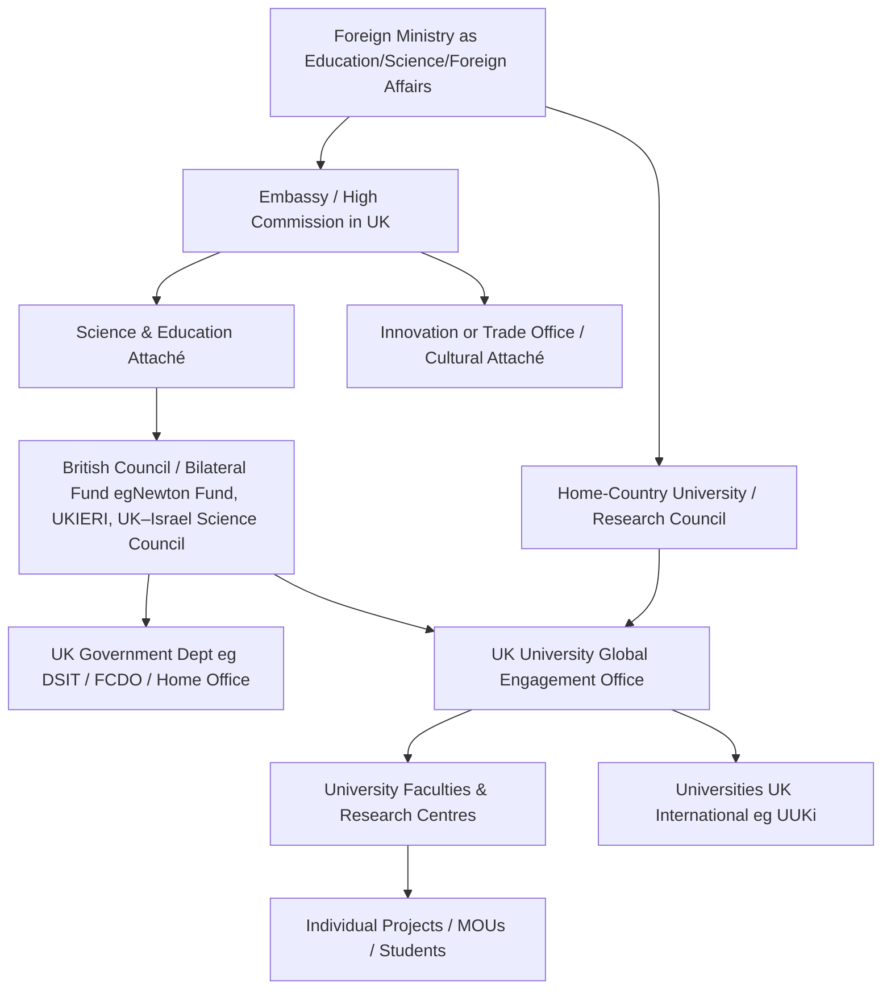

# 🌐 Academic Partnership Architecture — How International University Networks Work  
**First created:** 2025-11-07 | **Last updated:** 2026-05-21  
*A reference node explaining the multi‑layered structure behind foreign academic partnerships with UK institutions.*  

---

## 🧭 Framing — The Architecture of Cooperation  

When a foreign country establishes academic or research ties with the United Kingdom, it rarely happens through a single actor.  
Instead, it forms a **stacked architecture**: diplomatic, bureaucratic, and academic layers that each manage part of the relationship.  
This structure makes collaboration possible but also obscures accountability — useful for diplomacy, difficult for transparency.  

In the setting of investigation British state domestic policing and security in respect to universities during the 2023 - 2025 period, this utilises the structure for UK-Israel relations specifically.  

Please note this is not the only state which has a similar network of influence, and transparency is ultimately beneficial for all stakeholders who may influence the actions of UK institutions.  

---

>"Defend institutions.  
>It is institutions that help us to preserve decency.  
>They need our help as well.  
>Do not speak of “our institutions” unless you make them yours by acting on their behalf.  
>Institutions do not protect themselves.  
>So choose an institution you care about and take its side.  
>
>*Timothy Snyder, Twenty Lessons for Fighting Tyranny*

---

## 🕸️ Mermaid Diagram — The Network of Responsibility  

Each node represents a recurring institutional actor in bilateral academic cooperation.  
The lines show typical information or contract flow, not legal hierarchy.  

---

## 🧩 Layer Descriptions  

### 1. **Foreign Ministry Layer**  
Origin point for policy and funding mandates. Oversees embassies and national research councils.  

### 2. **Embassy / High Commission Layer**  
Hosts education, culture, and science attachés. They negotiate memoranda of understanding (MOUs) and coordinate visits.  

### 3. **Intermediary Programmes**  
Bodies such as the **British Council**, **Newton Fund**, or **UK–Israel Science Council** co‑fund research and run grant competitions.  

### 4. **UK Government Departments**  
Departments for Science, Innovation and Technology (DSIT) or the Foreign, Commonwealth and Development Office (FCDO) may co‑sign frameworks or provide oversight.  

### 5. **University Global Engagement Offices**  
Institution‑level managers who negotiate, draft, and monitor partnerships; they form the internal counterpart to embassy staff.  

### 6. **Universities UK International (UUKi)**  
Sector‑wide coordination body that aggregates data, best practices, and advocacy for internationalisation.  

### 7. **Operational Mechanisms**  
Faculty or research centres implement projects and exchange programmes under MOUs, sometimes creating spin‑outs or joint labs.  

---

## 🔍 Tracing or Auditing the Network  

| Evidence Type | Where to Look | Typical Source |
|----------------|---------------|----------------|
| Memoranda of Understanding | University partnership registers, FOI requests | Global Engagement Office |
| Embassy or Attaché listings | Embassy websites, diplomatic directories | Foreign mission pages |
| Funding agreements | Grants.gov.uk, British Council, DSIT / FCDO portals | Public contract databases |
| Project deliverables | ResearchFish, Gateway to Research | UKRI or partner databases |
| Meeting minutes | University Council / Senate, bilateral committees | FOI or public governance pages |

These records show how diplomatic intent turns into research contracts, revealing both transparency and influence gaps.  

---

## 🌌 Constellations  

🧾 Filling the Transparency Gap — identifies missing documents in international partnerships  
🏛️ Containment Studies — diplomacy as containment architecture  
🧩 Myth vs Mechanism — narrative of “international cooperation” versus its operational reality  
🕵️‍♀️ OSINT Guide — techniques for tracing institutional linkages  

---

## ✨ Stardust  

academic partnerships, embassy attachés, bilateral research, MOUs, transparency, diplomacy, education policy, internationalisation, British Council, global engagement  

---

## 🏮 Footer  

*🌐 Academic Partnership Architecture* maps the institutional mechanics that connect foreign governments and UK universities.  
It provides a structural lens for analysing where diplomacy ends and operational accountability begins.  

*Survivor authorship is sovereign. Containment is never neutral.*  

_Last updated: 2026-05-21_
