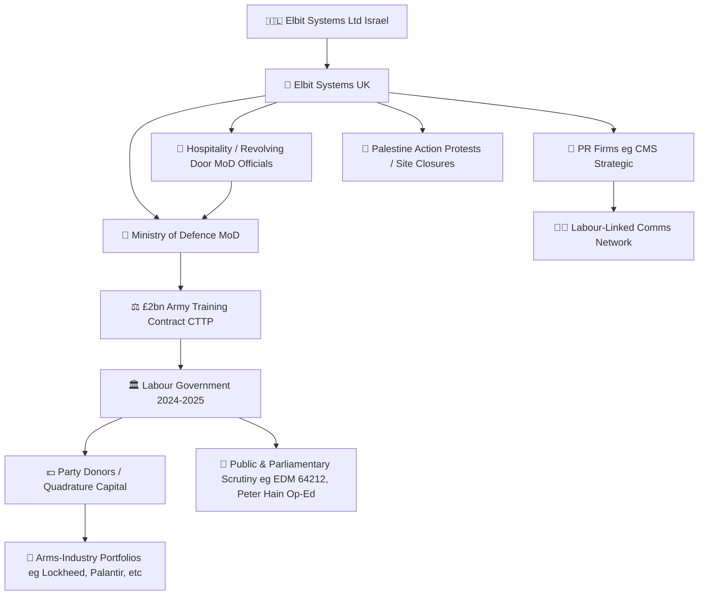

# 🛰️ Elbit Systems UK — Labour Linkage Map  
**First created:** 2025-11-08 | **Last updated:** 2026-05-21  
*Preliminary governance and influence map tracing Elbit Systems UK’s interactions with the UK Labour Government and donor ecosystems.*

---

## 🧭 Orientation  

This node compiles public-domain evidence on **Elbit Systems UK**, its **UK Ministry of Defence contracts**, and proximity to **Labour Party decision-making, donors, and lobbying ecosystems**.  
It is not an accusation but a structural visibility map — clarifying what *is* known, what remains unverified, and where systemic opacity occurs.  

---

## 🧩 Key Features  

- £2 billion / 15-year MoD Army training contract under consideration.  
- Internal Labour criticism (Peter Hain 2025) urging rejection of Elbit bid.  
- Parliamentary Early Day Motion 64212 opposing any Elbit award.  
- Hospitality & revolving-door concerns (MoD officials ↔ Elbit UK).  
- Closure of Elbit’s Bristol site after Palestine Action protests.  
- Indirect ties via donor networks (e.g., Quadrature Capital) and PR ecosystems (CMS Strategic).  

---

## 🔍 Analysis  

Elbit Systems UK’s footprint in British defence procurement predates the Labour Government but persists into its current administration.  
The controversy centres on the **Collective Training Transformation Programme (CTTP)**, valued at ≈£2 billion over 15 years.  

Key political risk vectors include:

1. **Procurement Exposure** — MoD’s reliance on Elbit simulation platforms (ICAVS D) positions the firm as incumbent supplier.  
2. **Influence Ecosystem** — Hospitality and post-service employment patterns raise questions about impartiality in bidding.  
3. **Donor Entanglement** — While no Labour donor is publicly shown to hold Elbit equity, major donors invest heavily in similar arms portfolios.  
4. **Reputational Overhang** — Ongoing Gaza conflict and Palestine Action protests intensify scrutiny of any contract under a Labour Government that presents as rights-forward.  

---

## 🕸️ Influence Diagram  

---

## 🌌 Constellations  

🛰️ ⚖️ 🧩 🔍 — This node sits in the **forensic + governance register**, bridging Defence Procurement, Political Funding, and Narrative Containment.  

---

## ✨ Stardust  

Elbit Systems UK, Labour Party, MoD contracts, defence procurement, donor transparency, arms industry, Quadrature Capital, lobbying networks, PR ecosystem, governance risk  

---

## 🏮 Footer  

*🛰️ Elbit Systems UK — Labour Linkage Map* is a living node of the **Polaris Protocol**.  
It records intersections between corporate defence ecosystems and political funding structures to inform accountability analysis and suppression-signal detection.  

> 📡 Cross-references:  
> - [🛰️ OSINT Field Operations](../🛰️_OSINT_Field_Operations/) — procurement & stakeholder mapping  
> - [⚖️ Containment Contract Trace](../Big_Picture_Protocols/⚖️_containment_contract_trace.md) — systemic risk analysis  
> - [🎛️ Polaris Drafting Rules — Survivor Voice Fidelity](../🏮_Admin_Kit/🎛️_polaris_drafting_rules_survivor_voice_fidelity.md) — tone anchor  

*Survivor authorship is sovereign. Containment is never neutral.*  

_Last updated: 2026-05-21_
