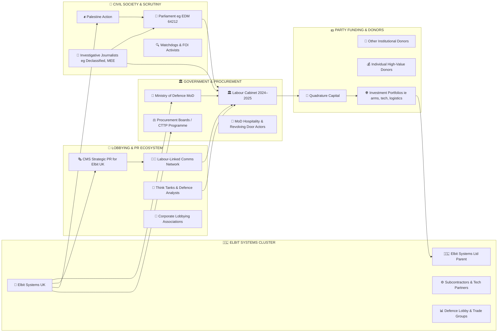

# 🪐 Stakeholder Constellation Map — Elbit Systems UK & Labour Ecosystem  
**First created:** 2025-11-08 | **Last updated:** 2026-05-21  
*Relational constellation showing intersecting clusters of industry, government, donors, PR, and civil activism.*

---

## 🪐 Stakeholder Constellation Map — Elbit Systems UK & Labour Ecosystem  

---

## 🌌 Constellations  

🛰️ 🧿 ⚖️ 💥 — This constellation maps *industrial gravity wells* (arms contracts) against *civic counter-forces* (activism, inquiry, public oversight).  

---

## ✨ Stardust  

defence procurement, influence networks, Labour Party donors, Elbit Systems UK, PR ecosystem, civil activism, transparency, governance, OSINT mapping, accountability  

---

## 🏮 Footer  

*🪐 Stakeholder Constellation Map — Elbit Systems UK & Labour Ecosystem* is a living satellite node of the **Polaris Protocol**, designed to visualise intersecting vectors of power, finance, and dissent in UK defence politics.  

> 📡 Cross-references:  
> - [🛰️ Elbit Systems UK — Labour Linkage Map](./🛰️_elbit_systems_uk_labour_linkage_map.md)  
> - [🛰️ OSINT Field Operations](../🛰️_OSINT_Field_Operations/) — relational and influence mapping logs  
> - [⚖️ Containment Contract Trace](../Big_Picture_Protocols/⚖️_containment_contract_trace.md) — systemic procurement analysis  

*Survivor authorship is sovereign. Containment is never neutral.*  

_Last updated: 2026-05-21_
