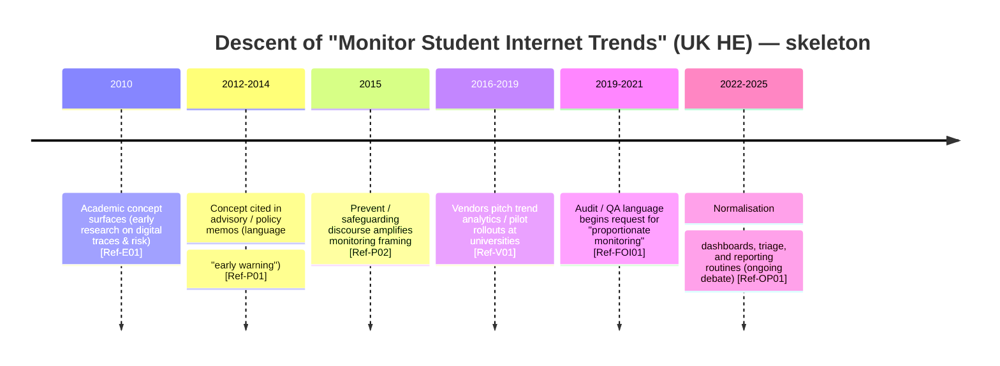
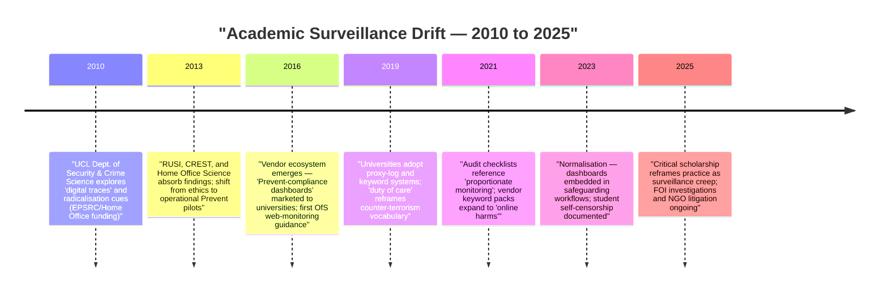

# 🪶 Descent Map — Academic Surveillance Drift
**First created:** 2025-10-23 | **Last updated:** 2026-05-21  
*Tracing how an early academic programme of “monitoring internet usage” descended into policy, procurement, campus practice, and everyday surveillance narratives.*

---

## 🛰️ Orientation
This node traces the *descent* of an academic idea (early-2010s research on digital traces and radicalisation risk) as it migrated from research outputs into policy vocab, procurement asks, vendor products, and campus operational practice. The focus is not origin-genealogy but the pathways and mechanisms of adoption, translation, and normalisation.  

---

## 🪜 Descent Pathway: Overview  
1. **Emission (2010–2012)** — Academic research programmes and conference presentations (concept: digital trace signals → radicalisation risk).  
2. **Policy docking (2012–2016)** — Think-tanks, Home Office science notes, and advisory groups reuse the research; framing shifts to “early-warning”/safeguarding.  
3. **Middleware step (2015–2019)** — Security/edTech vendors productise trend analytics and keyword-flagging for campus Wi-Fi / proxy stacks.  
4. **Soft mandates (2017–2022)** — Audits, KPI expectations, or funding/risk-management pressures make monitoring a de facto requirement.  
5. **Practice drift (2020–2025)** — Trend dashboards, triage flows, and pre-referral habit formation normalise campus surveillance.  
6. **Counter-mutations (ongoing)** — Civil-society pushback, academic critique, DPIAs, legal test cases, and student union resistance.  

---

## 🐁🐁 Timelines of Monitoring Student Internet Trends  

---

## 🔮 Analytic Questions  

- Language laundering: which phrases enabled the shift from academic research to “duty of care”?  
- Incentive vectors: who benefits institutional-politically from adopting monitoring (insurers, auditors, reputational actors)?  
- Technical affordances: what logs/telemetry were needed to make this practical for a campus IT team?  
- Opacity points: where in the pipeline is auditability weakest (vendor code, data brokers, DPIAs)?  
- Social impact: how did normalisation change student conduct, self-censorship, and staff practice?  

---

##  🦆🦆 Final Ducks To Get In A Row  
- Use FOI/SAR/DPIA & procurement searches to fill evidence slots.  
- Avoid publishing raw sensitive logs or operational vulnerabilities — annotate with redacted quotes and contract metadata only.  

---

🌌 Constellations

🪄 🐍 🧿 — norms and governance; radicalisation policy; oversight.  

---

✨ Stardust

academic surveillance, Prevent, trend monitoring, procurement, vendor middleware, DPIA, FOI, audit, student privacy, compliance drift  

---

🏮 Footer

*🪶Descent Map — Academic Surveillance Drift* is a living node of the Polaris Protocol.
It maps how an academic idea can be translated into institutional practice and normalised as a governance instrument.

> 📡 Cross-references:
>
> - [🎓 British University Compliance Service](../../../Disruption_Kit/Big_Picture_Protocols/🪄_Expression_Of_Norms/🎓_British_University_Compliance_Service/README.md) — *compliance playbooks and audit pressures*
> - [🧬 Structural Mapping](../../../Metadata_Sabotage_Network/Structural_Analysis/🧬_Structural_Mapping/README.md) — *pipeline & evidence mapping templates*

Survivor authorship is sovereign. Containment is never neutral.  

_Last updated: 2026-05-21_
