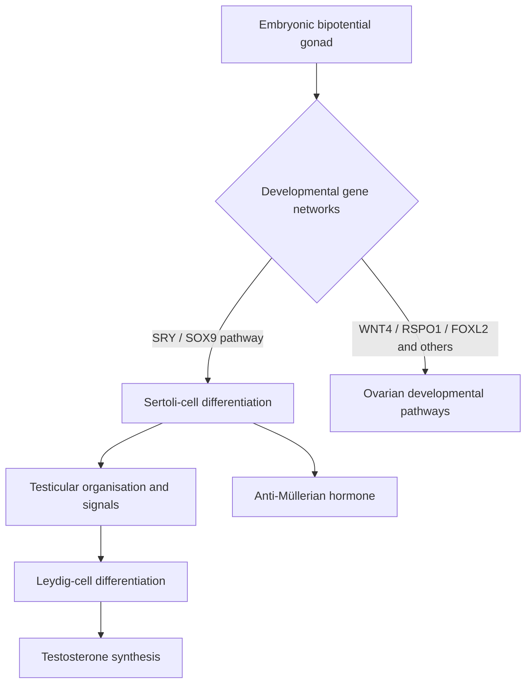
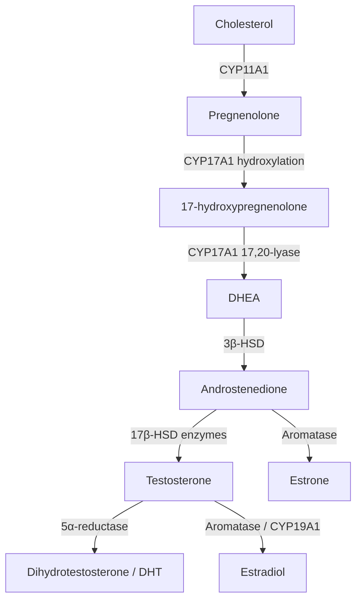
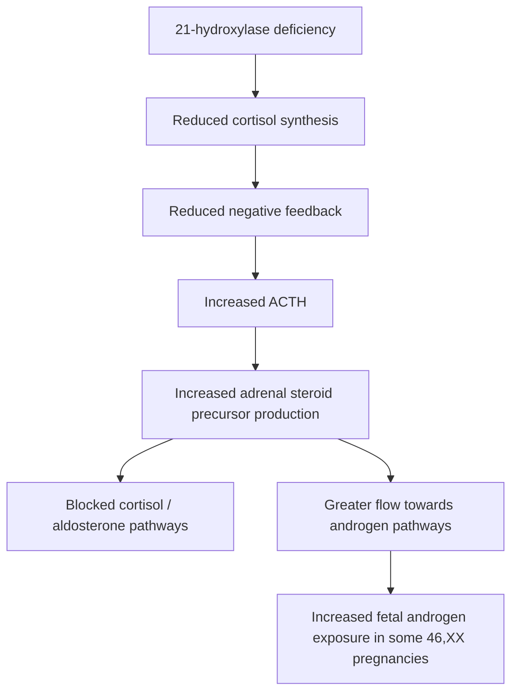
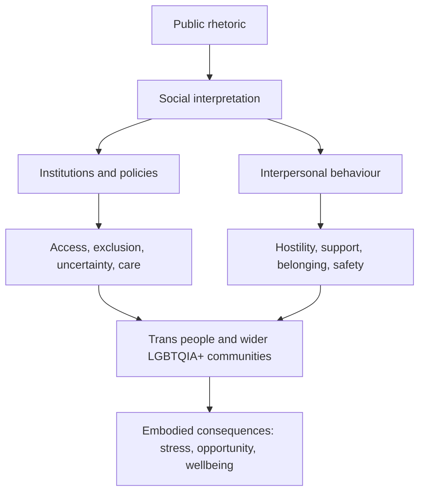
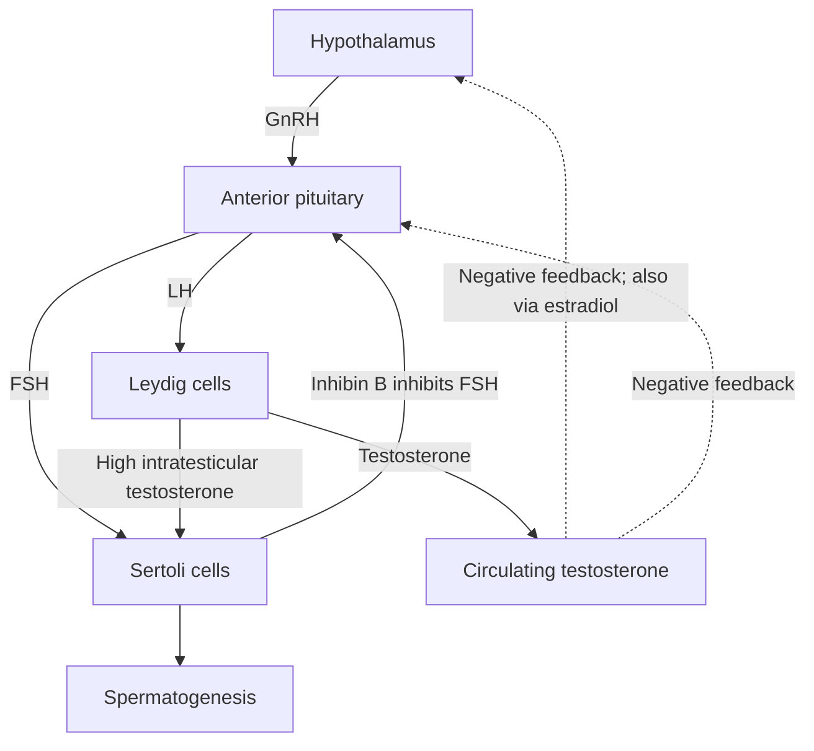
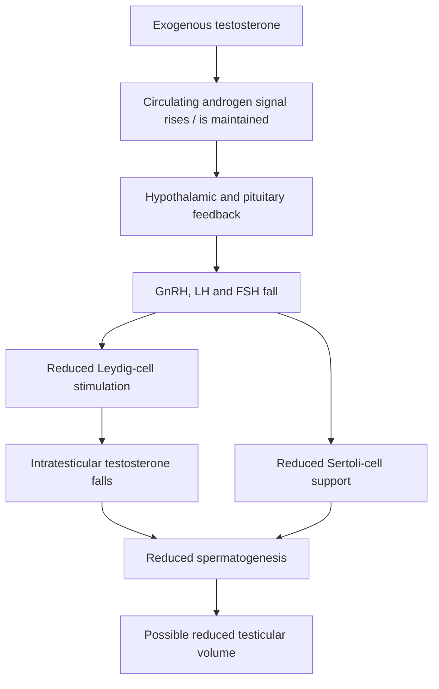
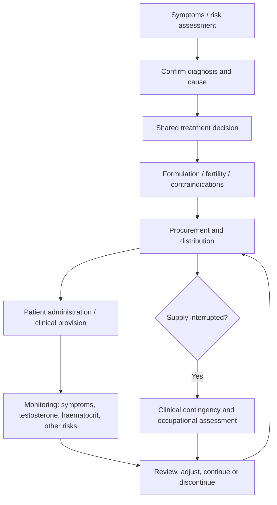
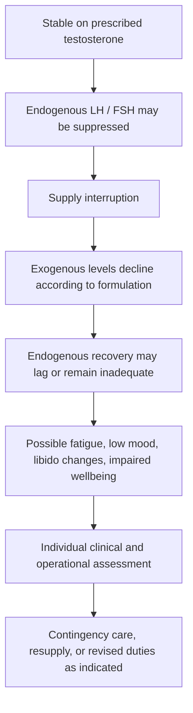
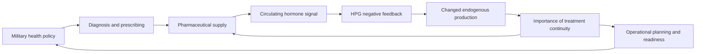

# 🧪 Daddy Hegseth’s Gender-Affirming Care
**First created:** 2026-10-09 | **Last updated:** 2026-10-11  
*In which the gentlemen discover that hormones are healthcare, the hypothalamus is not in the chain of command, and a prescription is not a logistics plan.*

---

## 🛰️ Orientation

Gentlemen, welcome to endocrinology. Please leave your motivational posters by the door. We have diagrams.

There is a perfectly sensible reason to investigate testosterone deficiency in a man who is exhausted, losing libido, developing anaemia or experiencing other compatible symptoms. He deserves competent healthcare, not a lecture about insufficient masculinity. If the Department of War has decided to take men's health seriously, splendid. The question is what exactly it has decided to do, how it will distinguish illness from ordinary biological variation, and what happens when the resulting treatment has to accompany a service member into an operational environment.

Because a hormone is not a readiness metric. A blood test is not a diagnosis. A diagnosis is not a prescription. A prescription is not a resupply plan. And testosterone administered from outside the body can change the body's own endocrine output. **The pharmaceutical supply chain can become part of the conditions under which someone's physiology is maintained.**

This node is survivor-authored science communication, political criticism and satire. Dialogue with the fox, the gentlemen and the procurement department is fictional. Clinical claims and actual policy are separated from hypothetical misuse. Nobody is alleging, without evidence, that Hegseth has ordered soldiers to be dosed to induce aggression.

Our starting question is deliberately irritating: if giving testosterone to cisgender men to support their health and masculine-associated functioning is celebrated, why does the political conversation about hormone therapy for transgender people so often use entirely different moral language? The clinical indications are different; the need for careful diagnosis, consent, monitoring and continuity of care is not a joke.


## 1. 🦊 Daddy Discovers Men’s Healthcare

On **18 September 2026**, the Defense Health Agency (DHA) published guidance titled *Testosterone Deficiency in the Male Service Member*. Its own account says the July memorandum directed screening for personnel aged 30 and older. Crucially, the September guidance describes **structured symptom and risk-factor assessment** for male service members aged 30 and over, with younger men assessed on request or when clinically indicated. It does **not** mean that every man over 30 is automatically prescribed testosterone; nor is a screening questionnaire the same thing as a universal blood draw. The DHA says a separate document for female service members is forthcoming. [DHA, 18 September 2026](https://dha.mil/News/2026/09/18/14/32/Testosterone-Deficiency-Screenings-for-Male-Service-Members).

The September version followed an earlier version withdrawn for revision, according to contemporary reporting. This matters: the **current guidance**, not an abandoned draft or the loudest headline, is the starting point. [*Washington Post*, 18 September 2026](https://www.washingtonpost.com/national-security/2026/09/18/pentagon-issues-testosterone-screening-guidance-male-troops/).

The DHA explicitly characterises the initiative as restoring function rather than artificial enhancement. That is an important statement of intent, although whether implementation follows the distinction is an empirical question. We should not silently convert a policy for screening and clinical treatment into a documented plan for pharmacological aggression. The latter is a separate hypothetical we will stress-test later.

| Question | Screening | Replacement | Enhancement |
|---|---|---|---|
| Who is involved? | People meeting assessment criteria | Patients with confirmed clinical indications | People given extra androgens for performance goals |
| What is measured? | Symptoms, risk factors, appropriate laboratory tests | Symptoms, hormone concentrations, safety markers | Performance, harms, dosing exposure, consent |
| Primary concern | Over- and under-diagnosis | Benefit, safety and continuity | Uncertain benefit and potentially substantial harm |

🦊 “Gentlemen, are we diagnosing a medical condition or optimising masculinity?”

“YES.”

🦊 **“THAT WAS NOT A MULTIPLE-CHOICE QUESTION.”**


## 2. 🩺 Testosterone Deficiency Is Not a Moral Failing

Hypogonadism may result from dysfunction of the testes (**primary**) or the hypothalamic–pituitary signalling system (**secondary**). Symptoms can include diminished sexual desire, erectile problems, reduced energy, changes in mood, low bone density, reduced muscle mass and anaemia. They overlap with depression, sleep disorders, chronic illness, medications, undernutrition and other conditions. Fatigue does not identify its own cause.

The Endocrine Society recommends diagnosing hypogonadism when compatible signs and symptoms coexist with **consistently and unequivocally low** testosterone, confirmed with repeat morning testing. It recommends against routine general-population screening of asymptomatic men. Its July 2026 statement reiterates concerns about inaccurate assays and unnecessary diagnosis. [Endocrine Society guideline](https://www.endocrine.org/clinical-practice-guidelines/testosterone-therapy); [July 2026 statement](https://www.endocrine.org/news-and-advocacy/news-room/2026/statement-on-testosterone-replacement-therapy).

A military symptom-and-risk assessment is not necessarily equivalent to indiscriminate laboratory screening. The evaluation should ask whether its case-finding approach identifies people who benefit, and what false positives, false negatives and downstream workload it generates. Age is a useful context, not a diagnosis. UK NHS Health Checks are not automatically testosterone tests; a GP can investigate relevant symptoms separately.

**Men deserve healthcare without being made into a political advertisement for testosterone.** A man can have low testosterone without being weak, deficient in character or any less a man. Conversely, an apparently robust man can have a condition worth treating. Neither fact is a referendum on masculinity.


## 3. 🧬 The Y Chromosome Is Not a Testosterone Factory

Our deliberately naughty shorthand is that SRY “basically turns on testosterone”. The accurate version is more interesting. **SRY** is a transcription factor that helps initiate testicular differentiation, prominently through **SOX9** and a wider regulatory network. Supporting-cell precursors become **Sertoli cells**; signals within the developing gonad support **Leydig-cell** differentiation. Leydig cells synthesise testosterone. SRY does not encode testosterone, nor does it directly catalyse steroid synthesis.

**Diagram 1 — Developmental cascade (schematic, not exhaustive)**



Different pathways coordinate gonads, internal reproductive structures and external genital development. Anti-Müllerian hormone affects Müllerian ducts; testosterone supports Wolffian structures; **DHT** is especially important in androgen-dependent external genital development. Receptors and timing matter as much as the presence of hormone. Not every person follows the textbook 46,XX or 46,XY pathway. That does not abolish sex-linked biological patterns; it tells us that patterns are not a complete account of every body.

🦊 “Gentlemen, the Y chromosome does not come with its own tiny testosterone bottling plant.”


## 4. 🧪 Cholesterol: The Unromantic Beginning of Masculinity

Testosterone is a **steroid hormone synthesised from cholesterol**. Its synthesis requires transport of cholesterol into mitochondria and a series of enzyme-mediated reactions. There are several routes through a branched network, and the balance differs across tissues. The following is a teaching pathway, not a claim that every cell follows one unbranched assembly line.

**Diagram 2 — One androgen pathway and two important conversions**



The network also contains progesterone-related routes and tissue-specific enzyme differences. Testosterone can be converted to estradiol. Estradiol contributes to physiology in men, including bone health. DHT has powerful androgen-receptor effects in certain tissues. The same precursor pool feeds several hormones; they are not politically segregated departments.

🦊 “Gentlemen, some of your testosterone becomes oestrogen.”

“STOP IT.”

🦊 **“I WOULD ADVISE AGAINST TRYING TO STOP ALL AROMATASE ACTIVITY, SIR.”**


## 5. 🧫 Which Cells Are Doing the Work?

The location matters. **Leydig cells** sit in the interstitial tissue between the seminiferous tubules and respond to pituitary **LH**. **Sertoli cells**, within the tubules, respond to **FSH** and support germ-cell development; high **intratesticular testosterone** is also required for normal sperm production. The testis is a coordinated tissue system, not a single bag of testosterone.

**Diagram 3 — Testicular tissue**

```text
       INTERSTITIAL SPACE
       Leydig cells ◉ ◉  <-- LH
             │
             └── Testosterone ───────────┐
                                         ▼
     ╔════════ SEMINIFEROUS TUBULE ════════╗
     ║ Sertoli cells  <-- FSH               ║
     ║ Developing germ cells                ║
     ║ Spermatogenesis needs local androgen ║
     ╚══════════════════════════════════════╝
```

The ovary uses a different arrangement. In a growing follicle, **theca interna** cells respond to LH and produce androgen precursors; **granulosa cells** respond to FSH and aromatise androgens into oestrogens. This is the classic **two-cell, two-gonadotropin** model, although real ovarian physiology varies by follicular stage.

**Diagram 4 — Ovarian follicle**

```text
       THECA INTERNA          GRANULOSA CELLS
           LH                      FSH
           │                        │
           ▼                        ▼
     Androgen precursors ──► Aromatase ──► Estradiol
```

The **adrenal cortex**, especially the **zona reticularis**, also produces androgen precursors including DHEA and DHEA-S. Peripheral tissues can convert precursors into active androgens. Women produce testosterone. Adrenal glands do not request a Y chromosome before beginning steroidogenesis.


## 6. 🧬 Turner Syndrome, X Dosage and the Trouble With Slogans

Turner syndrome may involve a 45,X karyotype, mosaicism, or structural changes affecting an X chromosome. People with Turner syndrome are generally girls and women. Their development and healthcare needs vary; ovarian insufficiency, growth differences and cardiovascular conditions are among the recognised concerns. **Two intact X chromosomes are not a universal prerequisite for being a woman.**

X-chromosome inactivation in typical XX cells silences much of one X, but some genes escape inactivation. Two X chromosomes can contribute genetic mosaicism and buffering for some X-linked variants; dosage also matters for genes escaping silencing. That is a fascinating subject. It is **not evidence that women are objectively prettier because they have two X chromosomes**. The joke may stay; the fabricated causal claim may not.

**Diagram 5 — Dosage, not destiny**

```text
      XX complement             45,X or mosaic forms
            │                            │
      X-inactivation            Different gene dosage
            │                            │
      Escape genes / mosaicism  Variable developmental effects
            └────────────┬───────────────┘
                         ▼
           Chromosomes influence biology;
           they do not write a social contract.
```

🦊 “Gentlemen, the diagram was a generalisation.”

“THEN WHY DID THEY PRINT IT?”

🦊 “Because the entire developmental genetics textbook wouldn't fit on the classroom wall.”


## 7. 🧬 46,XX CAH: The Adrenal Cortex Refuses to Read the Manifesto

In classic **21-hydroxylase-deficient congenital adrenal hyperplasia (CAH)**, cortisol synthesis is impaired. Reduced cortisol feedback increases pituitary ACTH, stimulating the adrenal cortex. Steroid precursors accumulate upstream of the blocked reactions and can be channelled into androgen pathways. A 46,XX fetus may therefore experience elevated androgen exposure **without a Y chromosome or SRY**. External genital development may be virilised to varying degrees while a uterus and fallopian tubes can be present, because there was no typical testicular anti-Müllerian hormone signal.

**Diagram 6 — The feedback and branch-point problem**



This is not a cute curiosity divorced from healthcare. Salt-wasting forms can be life-threatening and require specialist treatment. The lesson is about the interaction of enzyme pathways, feedback, fetal development and individual variation, not using patients as rhetorical props.

The complementary example is **androgen insensitivity**: an individual may have testes and produce androgens, yet tissues respond differently because of androgen-receptor function. A hormone is a signal. A receptor and a tissue have to do something with it.


## 8. 🪞 Cis, Trans and the Stereochemistry Department

The Latin prefixes **cis** (“on this side”) and **trans** (“across / on the other side”) also occur in chemistry. In stereochemistry they describe relative spatial arrangements in certain molecules. **Cis/trans geometric isomerism is not the same as chirality**: a chiral object cannot be superimposed on its mirror image; a cis/trans pair need not be chiral. Steroid stereochemistry matters enormously to receptor binding and enzyme recognition. People, however, are not chemical isomers.

**Diagram 7 — Vocabulary, not a moral hierarchy**

```text
  Chemistry:     cis / trans  -> relative spatial arrangement
  Gender terms:  cis / trans  -> relationship between gender
                                 identity and sex assigned at birth

  SAME LATIN PREFIXES ≠ SAME SCIENTIFIC CLAIM
```

*Cisgender* is a useful adjective when the distinction is relevant. It is not an order to announce one's chromosomes over lunch. Refusing a term for the majority while insisting on a qualifier for the minority risks making one group linguistically unmarked and the other perpetually exceptional.

🦊 “Are you cisgender, sir?”

“I'M JUST A MAN.”

“Splendid. The adjective is optional unless the distinction matters.”

“THEN WHY DOES IT EXIST?”

🦊 **“PRECISION, GENTLEMEN. HAVE YOU MET A NOUN BEFORE?”**

For the chemistry companion, see [*On the Chirality of Fentanyl*](./🪞_on_the_chirality_of_fentanyl.md). The shared lesson is that molecular structure matters, but the presence of a scientific word does not confer political authority over another person's life.


## 9. 🌈 When the Culture War Becomes Someone Else’s Living Conditions

Most people can spend a day without their gender identity becoming an administrative problem. Trans people, who form a small minority in Western population surveys, can find themselves subjected to sustained argument about their existence, healthcare and ordinary participation in society. Specific questions about medical evidence, sport, privacy or safeguarding can be examined on their merits. That is different from treating a whole population as a permanent emergency.

The consequences can spread beyond trans people. Gender-nonconforming cis people, lesbians, gay men, bisexual people and wider LGBTQIA+ communities share workplaces, public spaces, families, healthcare institutions and social networks. A rhetorical target can be narrow while its **downstream harm radius** is wider. The exact causal contribution of any one speech to any one incident may be impossible to isolate; institutional and social pathways still deserve scrutiny.

**Diagram 8 — Information enters institutions and bodies**



The people producing a controversy are not necessarily the people who live with its effects. **Political speech has downstream recipients.** This is not a demand to abandon debate; it is a demand to account for consequences and proportionality.

🦊 “Gentlemen, you've finished discussing trans people.”

“EXCELLENT.”

🦊 **“UNFORTUNATELY, THEY STILL HAVE TO GO OUTSIDE.”**


## 10. 💉 Replacement Is Not Enhancement

**Testosterone replacement therapy (TRT)** for confirmed hypogonadism generally aims to restore an appropriate physiological level and relieve clinically meaningful symptoms. **Supraphysiological anabolic-androgenic steroid use** is a different exposure, often involving different compounds, doses and risk profiles. Evidence of harms from the latter cannot simply be pasted onto every patient receiving the former.

Treatment can be given through intramuscular or subcutaneous injections, gels, patches and other formulations depending on jurisdiction and clinical suitability. Testosterone is lipophilic, and ester formulations can create depot release profiles; this does not mean all steroid hormones must be administered intramuscularly, nor that all testosterone products need refrigeration. **The operational problem is reliable access to the right product, monitoring and follow-up**, not automatically a cold-chain requirement.

The patient's preferences, fertility plans, cardiovascular and haematological risks, cost, deployment and ability to self-administer matter. A service member is a patient, not a test tube attached to a rifle.


## 11. 🔄 The Hypothalamus Is Not in Your Chain of Command

The **hypothalamic–pituitary–gonadal (HPG) axis** is a classic negative-feedback system. The hypothalamus releases GnRH; the anterior pituitary releases LH and FSH; LH stimulates Leydig-cell testosterone synthesis, while FSH and high local testosterone support Sertoli-cell function and spermatogenesis. Testosterone and estradiol feed back on upstream signalling. Sertoli-derived **inhibin B** suppresses FSH.

**Diagram 9 — Normal HPG feedback**



**Diagram 10 — Add external testosterone**



Here is the apparent paradox: **circulating testosterone may be normal or high while intratesticular testosterone is low**. Sperm production can be markedly suppressed. A significant proportion of testicular volume comes from seminiferous tubules and germ-cell development, so testicular shrinkage is not merely Leydig cells getting bored. Exogenous testosterone can impair fertility; patients considering conception need that discussion *before* treatment.

🦊 “Gentlemen, you've outsourced testosterone production.”

“EXCELLENT.”

🦊 **“THE DOMESTIC MANUFACTURING BASE IS NOW CLOSING.”**

“ORDER IT TO REOPEN.”

🦊 “The hypothalamus is not in your chain of command.”


## 12. 🪮 The Follicles Have Submitted Their Objections

Testosterone is converted by **5α-reductase** to **dihydrotestosterone (DHT)**. DHT acts through the androgen receptor, but effects vary by tissue. Androgen signalling encourages beard and some body-hair growth while promoting miniaturisation of genetically susceptible scalp follicles. The androgen receptor gene is on the X chromosome; pattern hair loss is nevertheless **polygenic**, and women can experience it too.

**Diagram 11 — Same signal, different tissue response**

```text
                   TESTOSTERONE
                        │ 5α-reductase
                        ▼
                       DHT
                        │
                 ANDROGEN RECEPTOR
                        │
              ┌─────────┴──────────┐
              ▼                    ▼
         Beard/body hair       Susceptible scalp
          growth response      follicle miniaturisation
```

Two men with similar serum testosterone can have different hair outcomes because receptor sensitivity, local enzyme activity and inherited susceptibility differ. Testosterone therapy may accelerate androgenetic hair loss in someone predisposed to it; it does not guarantee baldness.

🦊 “Gentlemen, the androgen receptor gene is on the X chromosome.”

“WHY DOES THE X CHROMOSOME KEEP APPEARING?”

🦊 **“BECAUSE IT IS AN IMPORTANT CHROMOSOME, SIR.”**


## 13. 🩺 The Adverse-Effects Department Would Like a Word

Appropriate TRT may help symptomatic patients, but informed consent requires discussion of possible harms and monitoring. These include **erythrocytosis** (raised haematocrit), acne, fluid retention, fertility suppression, testicular shrinkage, possible worsening of untreated severe sleep apnoea, breast tenderness or gynaecomastia, and formulation-specific problems. Prostate and cardiovascular risk assessments require individual context; the long-term evidence is not reducible to either “perfectly safe” or “guaranteed heart attack”.

High-dose anabolic-androgenic steroid misuse introduces additional concerns, including more pronounced endocrine suppression, cardiovascular effects, adverse lipid changes, and mood or behavioural changes. The dose and substance matter. Some men stop prescribed therapy because of adverse effects, fertility concerns, burden or lack of benefit; others with permanent hypogonadism may require long-term replacement. **Discontinuation should be medically planned, not moralised.**

The endocrinology lesson is straightforward: raising one variable can change several others, including variables the patient values more. A man may want more energy and libido without wanting reduced fertility, acne, breast tissue development or accelerated hair loss. Those preferences are part of healthcare, not an administrative inconvenience.


## 14. 🧠 Roid Rage Is Not a Rules-of-Engagement System

“Roid rage” is a colloquial expression for irritability and aggression sometimes associated with **supraphysiological anabolic-androgenic steroid exposure**. Evidence shows variability between people and studies; it is not a universal or inevitable effect, and findings from misuse cannot automatically be generalised to standard replacement therapy. Testosterone is not a dial labelled *disciplined violence*.

An effective soldier must identify threats, discriminate between lawful and unlawful targets, cooperate with colleagues, follow lawful orders, refuse unlawful orders and restrain force when required. More anger is not necessarily more courage, decisiveness, accuracy or self-control. An intervention that increases aggressive impulses while reducing behavioural regulation could undermine military effectiveness rather than improve it.

**Diagram 12 — The missing causal shortcut**

```text
   Androgen exposure
          │
          ▼
   Physiological effects
          │
          ├── Individual sensitivity
          ├── Dose / duration / compound
          ├── Sleep and stress
          ├── Training and social context
          └── Situation and incentives
          │
          ▼
   Variable behaviour
          │
          ▼
   NOT a guaranteed improvement in
   discipline, judgement or lawful force
```

**Evidence boundary:** Nothing in the cited September DHA guidance establishes a programme to dose troops for aggression. Discussing the dangers of such a hypothetical is not proof of intent.


## 15. ⚔️ The Historical Temptation to Chemically Outrun the Body

German military use of **Pervitin (methamphetamine)** during the Second World War is a documented example of pharmacologically extending wakefulness and endurance. It is not a testosterone programme. Stimulants and androgens have different mechanisms and harms. Historical drug use also cannot explain German defeat on its own; war outcomes depend on strategy, industry, logistics, alliances and many other variables.

The useful comparison is structural: militaries have sometimes sought a short-term performance advantage through substances whose longer-term physiological and behavioural costs were poorly managed. An intervention may buy wakefulness, endurance or some other short-term effect while accumulating risk. The question is whether leaders measure the whole system rather than the exciting initial response.

🦊 “Gentlemen, the body has limits.”

“CAN WE PROCUREMENT THEM AWAY?”

🦊 “You can procure medicines. You cannot procure away physiology.”


## 16. ⚖️ Medical Ethics, Command Authority and the Laws of War

Medically indicated testosterone for a soldier is not inherently prohibited by international humanitarian law. A hypothetical programme intended to alter aggression, especially if coerced or concealed, would raise distinct questions of **consent, clinical justification, human experimentation safeguards, occupational medicine and military command**. These must be assessed under the relevant law and facts, not inferred from a testosterone screening announcement.

International humanitarian law regulates conduct in conflict, including **distinction, proportionality and precautions in attack**. Administering a hormone does not waive those duties or excuse unlawful attacks. Commanders have responsibilities concerning orders, training and prevention of violations; the exact legal consequences depend on conduct, knowledge and applicable law. Pharmacology cannot serve as a replacement for lawful rules of engagement.

**Three scenarios must stay separate:**

1. Diagnosed hypogonadism treated with consent and monitoring.
2. Performance enhancement without an established clinical indication.
3. Deliberate behavioural manipulation of troops, potentially without meaningful consent.

These are not synonyms. Treating them as synonyms produces both bad science and bad legal analysis.

🦊 **“GENTLEMEN, MEDICAL ETHICS DOES NOT COME IN A CAMOUFLAGE EDITION.”**


## 17. 📦 A Prescription Is Not a Logistics Plan

Now to the really irritating question. Suppose screening identifies a man who genuinely needs testosterone replacement. The clinician and patient choose a suitable formulation, symptoms improve, and the treatment becomes part of ordinary life. Then the military moves him to another unit, another country, a ship or a remote operational environment. The therapy does not travel by motivational speech.

The system needs pharmaceutical procurement, product-specific storage, dispensing, controlled-substance accountability, administration training where needed, needles and sharps disposal for injections, laboratory monitoring, follow-up, adverse-effect management, transfer records and continuity when someone leaves military service. Testosterone is a **Schedule III controlled substance in the United States**. Different preparations have different administration intervals and storage requirements. **Do not import vaccine cold-chain assumptions wholesale into testosterone logistics.**

**Diagram 13 — Provision is a continuing cycle**



Military medicine already manages chronic conditions and deployment constraints; the existence of a medicine does not automatically mean desk duties or disqualification. The point is that someone must write the **actual policy**: what is deployable, under what conditions, with which alternatives and contingencies? If the programme expands treatment numbers, has the system budgeted for the lifetime of care rather than the publicity of the initial screen?

🦊 “Gentlemen, we've prescribed the testosterone.”

“EXCELLENT.”

“And the next dose?”

“...”

“And the blood tests?”

“...”

“And the overseas resupply?”

🦊 **“GENTLEMEN, A PRESCRIPTION IS NOT A LOGISTICS PLAN.”**


## 18. 🌍 Smallpox: The World Did Not Eradicate a Virus by Announcing a Vaccine

The **World Health Organization intensified global smallpox eradication in 1967**; eradication was certified in **1980**. It took international coordination, vaccine manufacture and quality control, surveillance, contact tracing, case finding, local workers, training, transport and practical delivery methods. The last known naturally occurring case was in Somalia in 1977. [WHO smallpox history](https://www.who.int/emergencies/situations/smallpox/).

A particularly important technological achievement was the **freeze-dried smallpox vaccine**, whose improved heat stability made vaccination more feasible where maintaining a conventional cold chain was difficult. The WHO's eradication review explicitly identifies heat-stable vaccine as central to operations in tropical regions. [WHO eradication review](https://iris.who.int/bitstream/handle/10665/154533/WHA33_3_eng.pdf).

This is not an assertion that testosterone needs the same refrigeration. It is a lesson in **delivery engineering**: successful medicine is a relationship among chemistry, manufacture, people, infrastructure, international cooperation and local conditions. And there is a further difference. Vaccination can produce durable immune memory after a finite course; hormone replacement often requires continued supply. A one-time intervention and an ongoing substitution create different logistical obligations.

The scientists, nurses, public-health workers, local communities, administrators and cross-border partners did not eradicate smallpox because someone shouted *optimise immunity*. They built and sustained the fucking programme.


## 19. 🪖 What Happens When the Special Forces Run Out?

**Hypothetical stress test, not a report of a real incident.** A service member with hypogonadism is stable on testosterone. The treatment suppresses LH and FSH and may reduce endogenous testicular production. The person deploys; resupply is disrupted. What happens?

It depends on the original diagnosis, formulation, dose, duration and individual physiology. Long-acting preparations decline more slowly than short-acting ones. A man with permanent primary hypogonadism may have little endogenous production to recover; a man whose axis was previously functioning may recover over a variable period. There is no universal withdrawal clock and no guarantee of an immediate crisis.

**Diagram 14 — Supply interruption meets biological feedback**



Possible symptoms include fatigue, depressed mood, reduced concentration, sexual symptoms and reduced wellbeing. Whether these affect operational performance depends on severity and context. It would be irresponsible to assume all affected personnel become unfit; it would be equally irresponsible to assume interruption has no consequences. No general rule automatically sends a man on TRT to a desk, nor does a commanding officer get to order the hypothalamus to restart.

This is the distinction between **chemical addiction** and **physiological adaptation**. Prescribed testosterone can produce endocrine suppression without the person having an addictive disorder. Withdrawal of the external supply can still be clinically consequential. The body is not making a political statement. It is responding to feedback.

🦊 “Can we order his testes to restart?”

“THEY'RE OUR TESTES.”

🦊 **“NOT IN THE MILITARY-INDUSTRIAL SENSE, GENTLEMEN.”**


## 20. 🔄 The Supply Chain Has Become Part of the Body

This is the Polaris centre of gravity. A body receives external testosterone. Its endocrine feedback network changes output. The continued supply of medication becomes relevant to maintaining the body's hormonal state. Procurement decisions, prescribing practices, laboratory capacity and deployment logistics are no longer merely *administration*. They become part of the environment in which physiology operates.

**Diagram 15 — Coupled systems / embodied information ecology**



The body experiences information through hormonal concentrations and receptor responses. The clinician interprets symptoms and laboratory information. The logistics network interprets procurement and demand signals. The command structure interprets readiness. These systems interact, but they do not share one objective or one unit of measurement.

**Optimising one output can degrade another.** More circulating testosterone can coexist with less intratesticular testosterone, impaired spermatogenesis, higher haematocrit or an increased dependence on continuing provision. A programme that improves symptoms for appropriately selected patients may be valuable. A programme that treats testosterone as a universal readiness proxy risks mistaking the number for the system.

🦊 **“GENTLEMEN, HAVE WE CONSIDERED THAT READINESS IS A SYSTEM PROPERTY?”**


## 21. 🪞 The Gender-Affirming Care Question Returns

And now, after the diagrams, the uncomfortable comparison. Testosterone prescribed to a cisgender man for hypogonadism is conventionally classified as treatment for testosterone deficiency, not as a specialist gender-affirming care pathway. Yet restoring hormone-dependent traits and functions can plainly support how that man experiences his body and masculinity. Testosterone prescribed to a transgender man has a different clinical indication and different treatment goals. The molecule is the same; the clinical context is not.

That difference warrants **specific medical assessment**, not a political hierarchy of whose relationship to their body deserves respect. Appropriate care asks about evidence, benefits, risks, consent, fertility, monitoring and continuity. The patient has preferences and the right to discuss treatment or discontinuation. Medical decisions may also involve age-related safeguards and other legitimate clinical questions. None of this requires pretending that chromosomes dictate a person's clothing, name, relationships or social life.

The wider rhetorical environment matters too. A debate that is abstract to one speaker may influence access, safety and ordinary daily life for trans people and wider LGBTQIA+ communities. **A narrow rhetorical target can have a broad downstream harm radius.** Biological description is not moral authority; political office is not a substitute for clinical judgement.

🦊 “Gentlemen, we're supporting men's hormonal health.”

“EXCELLENT.”

“And informed consent?”

“NATURALLY.”

“And treatment according to clinical need?”

“OBVIOUSLY.”

“And respecting patients' goals and continuity of care?”

“YES.”

🦊 “Wonderful. Shall we examine how consistently those principles are applied?”

“...”

🦊 **“GENTLEMEN, I'M AFRAID THE ANDROGEN RECEPTOR DOES NOT ASK HOW YOU VOTE.”**


## 22. 🦊 The Final Procurement Review

“Gentlemen, have we improved military readiness?”

“WE'VE INCREASED TESTOSTERONE.”

“That wasn't the question.”

“WE'VE MADE THE MEN MORE MASCULINE.”

“How did you measure that?”

“...”

“Have we improved their health?”

“...”

“Have we protected their fertility?”

“...”

“Have we explained DHT and the hair?”

“WE WERE HOPING YOU WOULDN'T MENTION THE HAIR.”

“Have we secured the supply chain?”

“...”

“Have we established a plan for interrupted treatment?”

“...”

“Have we consulted endocrinologists, military clinicians and logisticians?”

“...”

🦊 **“GENTLEMEN, I THINK WE HAVE DISCOVERED THAT A HORMONE IS NOT A MILITARY STRATEGY.”**

The serious conclusion is not anti-testosterone, anti-men or anti-military medicine. It is pro-science, pro-patient and pro-operational competence. Treat diagnosed deficiency. Investigate symptoms. Respect clinical autonomy. Build continuity into procurement. Don't invent a behavioural capability from a hormone's name. And don't pretend a politician's preferred account of masculinity is a substitute for the complex biological system in front of you.

**You cannot optimise a person by isolating one variable from the systems that produce, regulate and sustain it.**

🐝 **BZZZT. THE GENTLEMEN HAVE REQUESTED A SIMPLER ENDOCRINE SYSTEM.**

🦊 “I'm afraid the endocrine system has declined.”


## 🌌 Constellations

- 🪞 [On the Chirality of Fentanyl](./🪞_on_the_chirality_of_fentanyl.md) — stereochemistry, pharmacology, and why a molecule is not an operational plan.
- 🫂 [Hugging, But Make It a Bomb](./🫂_hugging_but_make_it_a_bomb.md) — oxytocin, feedback, and the hazards of mistaking hormonal signalling for a behavioural programme.
- 🧬 [Endocrine Society: Testosterone Therapy for Hypogonadism](https://www.endocrine.org/clinical-practice-guidelines/testosterone-therapy) — clinical diagnostic and treatment standards.
- 🩺 [Endocrine Society: 2026 Statement on Testosterone Replacement Therapy](https://www.endocrine.org/news-and-advocacy/news-room/2026/statement-on-testosterone-replacement-therapy) — testing quality and the limits of population screening.
- 🪖 [Defense Health Agency: Testosterone Deficiency Screenings for Male Service Members](https://dha.mil/News/2026/09/18/14/32/Testosterone-Deficiency-Screenings-for-Male-Service-Members) — September 2026 policy description and eligibility.
- 🌍 [WHO: Smallpox](https://www.who.int/emergencies/situations/smallpox/) — eradication through international public-health delivery.
- 📦 [WHO: Global Smallpox Eradication Review](https://iris.who.int/bitstream/handle/10665/154533/WHA33_3_eng.pdf) — freeze-dried vaccine and implementation infrastructure.
- ⚖️ [ICRC: International Humanitarian Law](https://www.icrc.org/en/law-and-policy/international-humanitarian-law) — the framework governing conduct in armed conflict.

**Evidence status:** The DHA September 2026 guidance and Endocrine Society recommendations were checked against their published pages for this draft. The discussion of a hypothetical aggression-enhancement programme is analytical, **not** a factual claim about the Pentagon's intent. Complex biochemical diagrams are simplified teaching schematics; they are not substitutes for specialist clinical pathway maps. Further source work would strengthen the historical stimulant comparison, variation-of-sex-development examples, and military-specific deployability regulations before treating those as exhaustive reviews.  

*Further media:*  

- [🎶: *War Pigs*, Black Sabbath, live at the Olympia Theater in Paris, France on December 20, 1970, via YouTube.](https://youtu.be/K3b6SGoN6dA?is=q2m0zxYf4ztF8OBt)  

## ✨ Stardust

testosterone, hypogonadism, gender-affirming care, cisgender, transgender, SRY, SOX9, Leydig cells, Sertoli cells, theca interna, granulosa cells, adrenal cortex, steroidogenesis, Turner syndrome, congenital adrenal hyperplasia, androgen insensitivity, X-chromosome dosage, chirality, cis/trans stereochemistry, DHT, aromatase, HPG axis, negative feedback, fertility, testicular atrophy, androgenetic alopecia, aggression, military medicine, military readiness, pharmaceutical supply chains, continuity of care, smallpox eradication, international humanitarian law, embodied information ecology, cybernetics

---

*Survivor authorship is sovereign. Containment is never neutral.*
