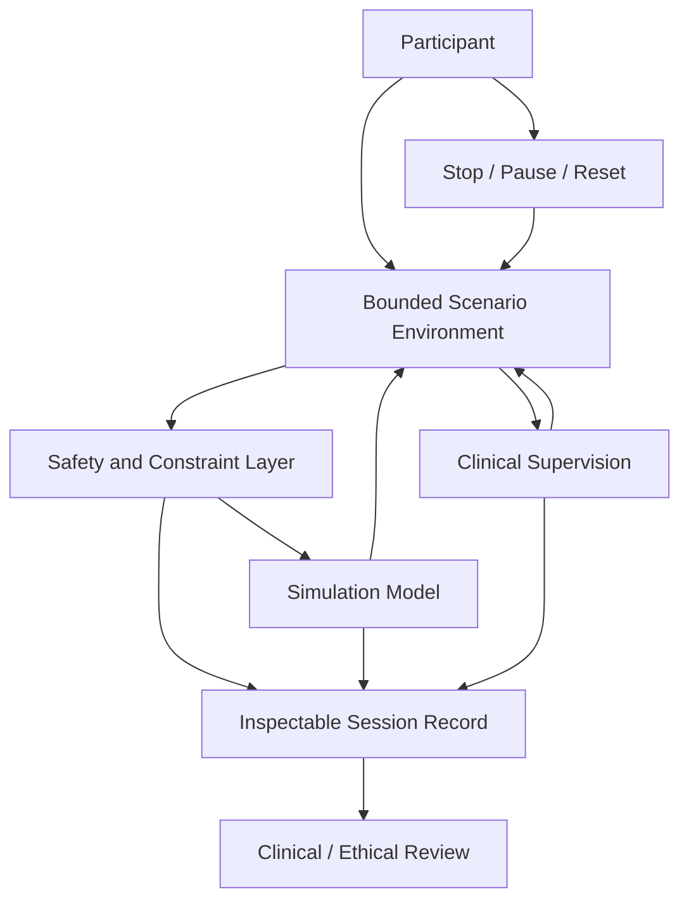

# 💎 Therapeutic Sandbox — AI-Assisted Boundary Rehabilitation
**First created:** 2025-11-07 | **Last updated:** 2026-09-05  
*A conceptual framework for a bounded, clinically supervised AI environment in which people can practise communication, consent, refusal, and boundary-setting without treating AI as therapist or oracle.*

---

## 🛰️ Orientation

AI may have a useful role in therapeutic rehabilitation not as therapist, diagnostician, authority, or synthetic attachment figure, but as **practice infrastructure**.

This node proposes a supervised *therapeutic sandbox*: a deliberately bounded environment in which a person could rehearse difficult conversations, practise boundary-setting, explore different responses, and stop or repeat scenarios without requiring another human to perform the opposing role every time.

The useful property of AI here is not that it can convincingly imitate a caring person.

It is that a computational system can generate **repeatable, adjustable simulations**.

That distinction matters.

A therapeutic sandbox should increase the participant’s ability to act outside the sandbox. It should not make continued access to the system itself the measure of successful recovery.

Its governing principle is:

> **Learning about people is not permission to operate on people.**

---

## 🧿 The Design Problem

People recovering from coercion, chronic boundary erosion, trauma, or severe anxiety may understand a healthy boundary intellectually while still finding it difficult to enact under pressure.

Knowing:

> *I am allowed to say no.*

is not identical to being able to say no when another person becomes disappointed, angry, manipulative, persistent, frightening, or emotionally demanding.

Practice matters.

But practising interpersonal conflict with real people has obvious limitations.

The other person may be unsafe.

A clinician cannot indefinitely perform every possible conversational role.

A friend or partner should not have to become a permanent therapeutic simulation.

And real interactions cannot simply be rewound because somebody wants to try the sentence again.

A sandbox potentially creates another option:

```text
scenario
→ response
→ reflection
→ adjustment
→ repetition
→ exit
```

The participant gets somewhere to practise.

The machine does not get promoted into therapist.

---

## 💎 Why A Sandbox?

The word **sandbox** is doing important work.

This is not intended as an unrestricted conversational agent with a therapeutic personality layered over it.

A sandbox should have:

- defined purposes;
- defined participants;
- defined boundaries;
- defined data rules;
- inspectable behaviour;
- explicit stop conditions;
- human oversight;
- and a clear route back out.

The system should know less, reach less, retain less, and be authorised to do less than a general-purpose assistant.

Constraint is a feature.

---

## 🧩 Possible Use Cases

A supervised sandbox could potentially support structured rehearsal around:

- refusing an unwanted request;
- asking somebody to stop;
- maintaining a boundary after pushback;
- expressing a need without excessive apology;
- recognising coercive conversational patterns;
- preparing for a difficult workplace or healthcare interaction;
- practising consent language;
- tolerating another person's disappointment without immediately surrendering the boundary;
- rehearsing different ways to exit an interaction;
- repeating a stressful exchange at lower intensity before attempting it in real life.

The objective is not to identify the single “correct” sentence.

It is to expand the participant's available repertoire.

---

## 🫀 Survivor Autonomy

The participant should remain the primary agent throughout the system.

That means the sandbox should not quietly transform:

**support → observation → classification → intervention**

without explicit justification and consent.

A person practising an anxious response should not automatically become a risk score.

A person rehearsing anger should not become an aggression classification.

A person exploring coercive language should not be treated as though the simulated content describes their intentions.

A person stopping a scenario should not be scored as failing it.

And therapeutic data should not become convenient material for unrelated model development.

The system exists to support practice.

The participant does not exist to improve the system.

---

## 🧠 Therapeutic Foundations

The concept draws on established therapeutic ideas without assuming that placing those ideas inside an AI system automatically creates an evidence-based treatment.

Relevant traditions include:

### Cognitive and behavioural rehearsal

Structured practice can help people examine habitual responses and experiment with alternatives.

### DBT-informed skills

Distress tolerance, emotional regulation, interpersonal effectiveness, and the ability to maintain a boundary during emotional activation are relevant design areas.

### Trauma-informed practice

The participant needs meaningful control over pacing, intensity, repetition, stopping, and what happens to information disclosed during the exercise.

### Feminist approaches to safety and consent

Boundary difficulties do not occur in a social vacuum.

Power, coercion, gendered expectations, dependency, previous violence, and learned responsibility for other people's emotions can all shape how safe refusal feels.

The sandbox should therefore avoid treating every interpersonal problem as an individual cognitive error requiring correction.

Sometimes the environment really is unsafe.

---

## 🧨 What The AI Must Not Become

A therapeutic interface creates obvious temptations.

The system should not become:

- a substitute clinician;
- an autonomous diagnostic system;
- an authority on whether abuse “really happened”;
- an arbiter of whether a boundary is reasonable;
- a hidden behavioural-risk classifier;
- an attachment-maximising companion;
- a surveillance channel into intimate therapeutic material;
- an automated escalation system whose decisions cannot be inspected;
- or a mechanism for training on survivors because their disclosures happen to be technically valuable.

A persuasive therapeutic tone does not confer therapeutic competence.

Human-likeness is not clinical validation.

---

## 🛠️ Conceptual Architecture

Rather than assuming particular technical components are already solved, the architecture can be expressed as **functions the system would need to satisfy**.



### Participant layer

The person controls participation, pacing, repetition, and stopping within the therapeutic plan.

### Scenario layer

The system generates only the kinds of interactions authorised for that exercise rather than functioning as an unrestricted general assistant.

### Constraint layer

Rules governing intensity, prohibited behaviour, scenario boundaries, data access, and escalation should be explicit and testable.

### Simulation layer

The model generates responses appropriate to the exercise.

Its job is simulation, not diagnosis.

### Clinical supervision

A qualified human professional remains responsible for the therapeutic use of the system, including whether a particular exercise is appropriate.

### Inspectable record

Where session records are clinically necessary, participants and authorised supervisors should be able to distinguish user input, generated material, system actions, and supervisory changes.

### Review

Safety failures, model drift, inappropriate outputs, and unintended behavioural effects require structured review rather than being treated as ordinary product feedback.

---

## 🔐 Data Architecture

A therapeutic sandbox would handle unusually sensitive material.

Data minimisation should therefore be architectural rather than aspirational.

Possible design requirements include:

- no secondary advertising use;
- no sale of therapeutic interaction data;
- no silent incorporation of sessions into general model training;
- explicit retention periods;
- separation between therapeutic records and model-improvement pipelines;
- strong access controls;
- inspectable data provenance;
- deletion mechanisms;
- clear rules governing clinician access;
- and no external integrations merely because they are technically convenient.

Where a function can operate without retaining intimate material, **do not retain it**.

---

## 🧪 Evidence Before Scale

A plausible mechanism is not evidence of therapeutic benefit.

Before deployment, questions would include:

- Does rehearsal transfer into real-world boundary behaviour?
- Which participants benefit?
- Who finds simulation destabilising or irritating?
- Does repeated AI interaction increase or decrease human agency?
- Can the model reliably remain within scenario constraints?
- What kinds of failure are clinically significant?
- Does the system reproduce gendered, racialised, cultural, or disability-related assumptions about “healthy” communication?
- Can participants recognise when generated guidance is poor?
- Does clinical supervision actually mitigate the relevant risks?
- Is the system better than simpler alternatives?

The comparison matters.

If a workbook, role-play protocol, scripted tool, game, or non-generative application produces the same benefit with fewer risks, **use the simpler thing**.

Rehabilitated Tech is not a requirement to put AI everywhere.

---

## 🧿 Failure Modes

A serious prototype should be designed around how it could fail.

Potential failures include:

| Failure | Why it matters |
|---|---|
| **Over-anthropomorphism** | participant begins treating simulation as therapeutic authority |
| **Attachment optimisation** | product incentives reward continued dependence rather than increased autonomy |
| **Misclassification** | simulated content or emotional expression becomes evidence about the participant |
| **Boundary drift** | system moves outside the authorised therapeutic scenario |
| **Unsafe rehearsal** | generated responses intensify distress or reproduce coercive dynamics |
| **Cultural norm enforcement** | one communication style is incorrectly presented as universally healthy |
| **Data leakage** | intimate therapeutic material escapes its intended context |
| **Automation bias** | clinician or participant gives generated material more authority than it deserves |
| **Success inversion** | engagement or retention is mistaken for therapeutic improvement |

The last one is particularly important.

For many commercial technologies:

**more engagement = success**

For rehabilitation:

**needing the system less may be success.**

Those incentives are not naturally aligned.

---

## ♻️ The Exit Is Part Of The Design

A rehabilitative technology should be capable of making itself less necessary.

That means successful use might look like:

```text
supported rehearsal
→ increased repertoire
→ increased confidence
→ real-world practice
→ reduced reliance on simulation
```

Not:

```text
vulnerability
→ engagement
→ attachment
→ retention
→ subscription
```

The ability to leave is not evidence that the product failed.

It may be evidence that the rehabilitation worked.

---

## 🌌 Constellations

💎 🧿 🫀 ♻️ 🛠️ — bounded therapeutic simulation; survivor autonomy; consent architecture; inspectable systems; rehabilitation through increased human capability.

---

## ✨ Stardust

therapeutic sandbox, supervised AI, boundary rehearsal, survivor autonomy, trauma-informed technology, consent architecture, clinical oversight, data minimisation, human machine relations, rehabilitated tech

---

## 🏮 Footer

*💎 Therapeutic Sandbox — AI-Assisted Boundary Rehabilitation* is a conceptual node of the **Polaris Protocol**.  
It explores whether bounded AI simulation could support clinically supervised rehearsal of communication and boundary-setting while preserving a strict distinction between therapeutic practice infrastructure and therapeutic authority.

> 📡 Cross-references:
>
> - [❤️‍🩹 Rehabilitated Tech](./README.md) — *parent strategy cluster for rebuilding technological systems around human agency, legibility, repair, and material reality.*
> - [🤖 AI Beyond AI](./🤖_AI_Beyond_AI/README.md) — *machine intelligence as instrument and augmentation rather than automatic synthetic personhood.*
> - [🧵 Community Vulnerability and Early Canaries](../../🌑_1_Origin_Points/🪿_Embodied_Information_Ecology/♻️🧿_Observation_Becomes_Intervention/🧵_community_vulnerability_and_early_canaries.md) — *why systems designed around vulnerability must not silently convert observation into classification and consequential intervention.*
>
> 🏮 Return To:
>
> - [❤️‍🩹 Rehabilitated Tech](./README.md) — *1up*
> - [🌕 Long Strategies](../README.md) — *2up*
> - [🌌 Polaris Protocol - Root](../../README.md) — *root*

*Survivor authorship is sovereign. Containment is never neutral.*

_Last updated: 2026-09-05_
