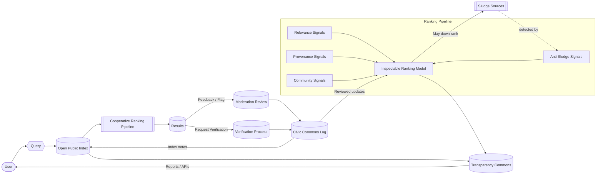
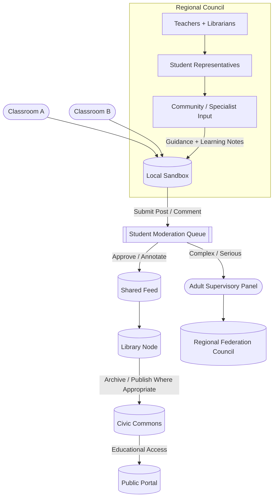

# 💧 Sludgy Solutions
**First created:** 2025-10-15 | **Last updated:** 2026-09-05  
*Structural countermeasures to digital sludge: changing the architectures, incentives, and governance systems that produce polluted information environments.*

---

## 🛰️ Orientation

Digital sludge is not merely bad content.

It is an environmental outcome.

Junk information, SEO spam, engagement bait, repetitive synthetic content, manipulative interfaces, overloaded feeds, and low-trust search environments do not appear independently of the systems distributing them. They are shaped by ranking architectures, economic incentives, moderation choices, institutional concentration, and the costs imposed on people trying to navigate the resulting mess.

This node asks what happens if we stop treating every individual user as personally responsible for filtering an information environment whose infrastructure is rewarded for producing sludge.

The question becomes:

> **What would cleaner information infrastructure actually require?**

The proposals here are design sketches rather than claims that any one model has already solved the problem.

They explore a common principle:

**change the conditions producing sludge, not merely the user's ability to tolerate it.**

---

## 🩻 Diagnostic Snapshot

| Layer | Source of sludge | Typical manifestation | Possible countermeasure |
|---|---|---|---|
| **Algorithmic** | engagement-heavy ranking and weak provenance signals | clickbait, content farms, repetitive low-value material | alternative ranking models, provenance signals, user-controllable weighting |
| **Economic** | incentives tied to attention, advertising, affiliate traffic, or volume | SEO spam, churn, manufactured engagement | public-interest funding, cooperative ownership, different revenue models |
| **Cognitive** | systems designed around continuous attention | overload, fatigue, compulsive checking, difficulty locating useful material | humane defaults, pacing, finite interfaces, deliberate stopping points |
| **Institutional** | concentrated control over indexes, feeds, standards, and discovery | opaque ranking, limited alternatives, weak public accountability | interoperability, open indexes, competition policy, public or cooperative infrastructure |
| **Governance** | affected users have little ability to inspect or alter system rules | appeals without observability, unexplained ranking changes, asymmetric moderation | transparent rules, meaningful appeals, participatory governance, public auditing |

These mechanisms can overlap.

A poor information environment may be simultaneously profitable, technically reinforced, cognitively exhausting, and difficult to challenge because the institution governing it is opaque.

That is why individual media literacy, while useful, cannot carry the whole repair burden.

---

## 🧿 Design Principle: Treat The Environment

Many current responses to information pollution operate downstream:

```text
sludge is produced
→ sludge is distributed
→ user encounters sludge
→ user is told to identify and filter sludge better
```

That makes the person at the end of the pipeline responsible for compensating for every upstream incentive.

A structural approach asks different questions:

```text
what produces sludge?
→ what rewards its distribution?
→ what makes it visible?
→ what makes useful material harder to find?
→ who can alter those conditions?
```

The intervention can then move closer to the source.

This does not eliminate individual judgement.

It stops pretending individual judgement is an adequate substitute for functioning infrastructure.

---

## 🪺 Design Sketch: Cooperative / Public-Interest Search

Imagine a search system whose governing objective was not maximising advertising value or time-on-platform, but maintaining a useful public information index.

That could take different institutional forms: cooperative, civic, public-service, nonprofit, federated, or some hybrid arrangement.

The important question is not the label.

It is **what the system is optimised to do**.

Possible characteristics include:

- a transparent or inspectable public index;
- ranking criteria that can be documented and challenged;
- meaningful provenance signals;
- separation between relevance and advertising;
- public-interest knowledge treated as infrastructure rather than merely content inventory;
- user control over some ranking priorities;
- independent auditing;
- and governance mechanisms through which affected communities can contest systemic failures.

A shorthand might be a **“BBC of Search”**, but the analogy is institutional rather than architectural: information discovery treated partly as public infrastructure rather than solely as an advertising market.

---

## ✈️ Design Flow: Cooperative Search

> **Alt-text:** A user query travels through an open public index and cooperative ranking process. Relevance, provenance, community feedback, and anti-sludge signals contribute to ranking. Moderation and verification decisions produce inspectable records that can inform later weighting and indexing decisions.



This is not a finished technical architecture.

Several hard governance questions remain:

- Who defines a trustworthy provenance signal?
- How are minority or dissident sources protected from majoritarian ranking?
- What prevents coordinated manipulation of community signals?
- Which decisions require human review?
- What information should remain private even inside a transparency regime?
- How are ranking changes tested for unintended exclusion?
- How does a public-interest system avoid simply reproducing state or institutional authority?

A rehabilitated search system needs answers to those questions.

“Public” is not automatically synonymous with “good.”

“Transparent” is not automatically synonymous with “safe.”

---

## 🧩 Design Sketch: Federation Sandboxes

Another possibility is smaller-scale digital infrastructure built around institutions that already have educational and civic functions.

Schools and libraries could participate in federated spaces where young people learn not only how to consume information but how information environments are maintained.

Possible features include:

- local moderated spaces;
- shared standards between participating institutions;
- age-appropriate governance;
- transparent escalation routes;
- documentation of moderation decisions;
- structured opportunities for young people to participate in governance;
- regional review for difficult cases;
- and public-interest archiving where appropriate.

The important shift is educational:

**moderation becomes something people can understand and practise, rather than an invisible action performed somewhere inside a platform.**

---

## 🏖️ Design Flow: School–Library Federation Sandbox

> **Alt-text:** Classrooms participate in a local moderated sandbox. Routine moderation is handled locally with adult supervision; difficult cases can move to a regional review structure. Libraries participate as archive and access nodes, while governance decisions feed back into local practice.



Again, this is a design sketch.

Safeguarding, privacy, accessibility, moderation burden, legal responsibility, age-appropriate participation, and protection against harassment would need to be designed before such a model could become operational.

The point is not that children should become unpaid platform moderators.

The point is that **digital governance can itself become part of digital literacy**.

---

## 💸 Funding And Governance Possibilities

Different infrastructures would need different governance arrangements.

Possible models worth exploring include:

### 🌀 Rotating Youth Councils

Small, time-limited panels of students working with teachers, librarians, or other appropriate adults on selected governance questions.

Rotation reduces the risk that participation becomes a permanent status hierarchy and allows governance literacy to spread across the community.

### 🏫 Local Institutional Cooperatives

Participating schools, libraries, universities, councils, or community organisations could pool resources for shared hosting, technical support, moderation training, and governance.

The point is shared infrastructure rather than every institution independently purchasing another opaque platform.

### 🎨 Arts–Tech Partnerships

Creative organisations, universities, libraries, and technical groups could run residencies or projects around digital maintenance, interface design, archives, moderation, and civic information systems.

Maintenance becomes visible as creative and technical work rather than invisible labour.

### 📡 Transparency Audits

Participating systems could publish regular reports describing:

- moderation volumes;
- appeals;
- governance changes;
- funding;
- major technical changes;
- known failure modes;
- accessibility work;
- and what was learned from mistakes.

Transparency should make governance more contestable.

It should not become another metric theatre in which institutions publish numbers nobody can meaningfully interpret.

---

## 🧠 Ranking Is Governance

Search and recommendation systems are often discussed as though ranking were simply a technical problem.

But every ranking system decides what becomes easier to encounter.

That makes questions such as these unavoidable:

- What counts as relevance?
- What counts as quality?
- How much should popularity matter?
- Should freshness outrank authority?
- How should provenance be represented?
- When should users control weighting themselves?
- What signals are vulnerable to gaming?
- What happens to material that does not fit the dominant classification system?
- Who can discover why something was ranked, suppressed, or excluded?

There is no perfectly neutral ordering of an enormous information environment.

The practical objective is therefore not mythical neutrality.

It is **inspectability, contestability, pluralism, and the ability to change course when the ranking system produces harm.**

---

## 🕸️ Sludge And The Commons

A cleaner information environment is not simply one with fewer annoying posts.

The deeper question is whether useful information can remain discoverable without every contribution being forced through the incentives of a small number of commercial intermediaries.

Commons-oriented infrastructure could include:

- open or shared indexes;
- interoperable archives;
- public-interest metadata;
- portable reputation or provenance mechanisms where appropriate;
- community-maintained collections;
- public libraries with stronger digital infrastructure roles;
- open standards;
- and interfaces that allow multiple ranking systems to operate over shared information resources.

The architecture matters because **plural interfaces over shared infrastructure** create different possibilities from one platform controlling the index, ranking, interface, advertising market, moderation rules, and user identity simultaneously.

---

## 🧨 Failure Modes

Structural solutions can create their own sludge.

A serious design therefore needs to anticipate:

| Failure mode | Risk |
|---|---|
| **Majoritarian trust signals** | unpopular or minority material becomes structurally disadvantaged |
| **Institutional capture** | a public-interest system becomes an instrument of whichever institution governs it |
| **Metric substitution** | new “quality” scores recreate the optimisation problem under nicer language |
| **Moderation exhaustion** | participatory governance becomes unpaid, unequal, or unsustainable labour |
| **Transparency theatre** | large quantities of data are published without meaningful accountability |
| **Verification centralisation** | a small group acquires excessive authority over contested knowledge |
| **Privacy leakage** | provenance and auditability expose people who require anonymity |
| **Federation fragmentation** | communities become isolated or standards become impossible to maintain |
| **Accessibility drift** | systems designed around technically confident participants exclude everyone else |

A cooperative system can fail.

A public system can fail.

An open system can fail.

Rehabilitation means designing for those possibilities rather than assuming a virtuous ownership model solves governance automatically.

---

## 🌱 What Success Might Look Like

The objective is not a perfectly clean internet.

Humans are messy.

Culture is messy.

Disagreement is useful.

Low-stakes nonsense is often delightful.

A healthy information environment should not optimise all of that away.

Success looks more like:

- useful material remaining findable;
- people understanding why systems behave as they do;
- fewer incentives for industrial-scale junk production;
- meaningful alternatives to dominant discovery systems;
- communities able to participate in governance without carrying the entire burden themselves;
- public-interest information infrastructure that can survive commercial fashion;
- and ordinary users having more control without needing to become full-time systems administrators.

The goal is not sterility.

It is an ecosystem in which **sludge does not automatically win because sludge is what the infrastructure knows how to monetise.**

---

## 🌌 Constellations

💧 🧿 🪞 🛠️ 🌱 — information-environment repair; cooperative infrastructure; transparent ranking; participatory governance; public-interest technical systems.

---

## ✨ Stardust

digital sludge, cooperative media, public infrastructure, search reform, transparent ranking, civic technology, moderation, platform repair, education, federation, information commons

---

## 🏮 Footer

*💧 Sludgy Solutions* is a living strategy node of the **Polaris Protocol**.  
It explores structural responses to polluted information environments and sketches cooperative, civic, educational, and commons-oriented alternatives to systems that make individual users absorb the costs of upstream design and incentive failures.

> 📡 Cross-references:
>
> - [❤️‍🩹 Rehabilitated Tech](./README.md) — *parent strategy cluster for rebuilding technological systems around human agency, legibility, repair, and material reality.*
> - [🌷 Opening the Source](./🌷_Opening_The_Source/README.md) — *how repaired systems become legible, participatory, adaptable, and shareable infrastructure.*
> - [🦑 Take It Back](./🦑_Take_It_Back/README.md) — *reclaiming technical culture from prestige systems and inherited measures that confuse authority with competence.*
>
> 🏮 Return To:
>
> - [❤️‍🩹 Rehabilitated Tech](./README.md) — *1up*
> - [🌕 Long Strategies](../README.md) — *2up*
> - [🌌 Polaris Protocol - Root](../../README.md) — *root*

*Survivor authorship is sovereign. Containment is never neutral.*

_Last updated: 2026-09-05_
