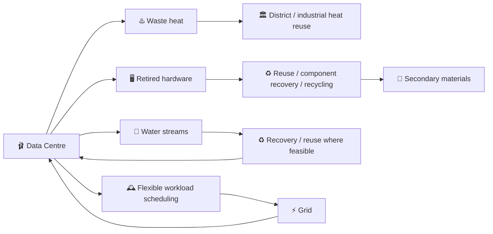

# 🩰 Crafting Datacentre Balance
**First created:** 2026-05-02 | **Last updated:** 2026-09-06  
*Whole-system accounting for computational infrastructure: where the energy, water, minerals, labour, heat, pollution, value, and human burden actually go.*

---

## 🛰️ Orientation

The cloud is not weightless.

It is an industrial system that has become unusually good at hiding the industrial part.

Behind an apparently immaterial service sit:

- electricity;
- cooling;
- water;
- chips;
- minerals;
- chemicals;
- buildings;
- land;
- networks;
- human labour;
- backup generation;
- maintenance;
- and eventually retired hardware.

So this node asks a different question from:

> **How do we make data centres more efficient?**

Efficiency is necessary.

It is not enough.

> **Efficiency asks how little input produces an output. Balance asks where every load went.**

That is the pointe-shoe principle.

A pointe shoe does not abolish load.

It distributes, redirects, supports, and manages load well enough to make something apparently weightless possible.

The cloud is the arabesque.

**The infrastructure is the pointe shoe.**

---

## 🍸 Origin Story: Boris And The Vodka-Cooled PC

There is a serious systems-engineering argument in this node.

Naturally, its intellectual lineage includes **Life of Boris putting vodka through a PC cooling system on YouTube**.

The 2018 project is funny because the premise is immediately physical.

A computer computes.

A computer also gets hot.

The heat has to go somewhere.

That is true whether the machine is:

- a home PC;
- a GPU workstation;
- a rack;
- a server hall;
- or a hyperscale AI facility.

Scale the computation and the cooling problem scales with it.

Scale the cooling problem and suddenly we are discussing:

- thermodynamics;
- electricity grids;
- water systems;
- pumps;
- fans;
- chillers;
- heat exchangers;
- liquid cooling;
- buildings;
- semiconductor supply;
- critical minerals;
- and industrial geography.

Nine million views of accidental infrastructure pedagogy.

The vodka is not the engineering recommendation.

The useful lesson is:

> **No computation escapes thermodynamics.**

---

## 🩰 The Pointe-Shoe Principle

A badly framed sustainability problem asks:

> How can we reduce one undesirable metric?

A systems problem asks:

> **What happens to the rest of the system when we do?**

A cooling architecture might reduce electricity consumption while increasing water demand.

A low-water system might require more electricity.

A highly efficient chip might encourage much more total computation.

A facility powered by low-carbon electricity might still depend on short-lived hardware and mineral-intensive supply chains.

A heat-reuse system may look brilliant where there is a nearby heat network and pointless where nobody can use the output.

A resilient facility may deliberately carry redundant capacity that appears inefficient under a narrow utilisation metric.

Balance therefore does not mean:

```text
minimise everything
```

It means:

```text
identify the load
→ identify where it travels
→ identify who carries it
→ identify what useful capability it supports
→ recover what can be recovered
→ decide whether the whole arrangement is worth it
```

---

## 📥 The Datacentre As A Physical Transformation System

```mermaid
flowchart LR

    subgraph IN["INPUTS"]
        E["⚡ Energy"]
        W["🌊 Water"]
        M["🪏 Minerals + materials"]
        HL["🔧 Human labour"]
        HW["🖥️ Chips + hardware"]
        L["🏛️ Land + buildings"]
        N["🌐 Network infrastructure"]
        K["🧠 Knowledge + software"]
    end

    DC["🩰 DATA CENTRE<br/>computation as physical process"]

    subgraph USE["USEFUL OUTPUTS"]
        C["🧮 Computation"]
        S["🌐 Digital services"]
        F["🕸️ Data fusion"]
        R["🔬 Research capability"]
        D["📊 Data / model outputs"]
        V["💰 Economic value"]
    end

    subgraph COST["ENVIRONMENTAL OUTPUTS"]
        H["♨️ Waste heat"]
        WW["🌊 Water impacts"]
        A["🌫️ Air / grid emissions"]
        NO["🎶 Persistent noise"]
        CH["🧪 Chemical / toxic streams"]
        EW["♻️ Retired hardware / e-waste"]
        LP["🏛️ Land + infrastructure pressure"]
    end

    IN --> DC
    DC --> USE
    DC --> COST
```



This diagram is deliberately blunt.

The useful digital output does not appear from nowhere.

It is purchased with physical inputs.

And the transformation produces outputs other than computation.

---

## ⚡ Energy In

Electricity demand is now large enough that data-centre expansion has become an energy-system problem.

The International Energy Agency estimates that global data-centre electricity consumption reached roughly **485 TWh in 2025** and projects around **950 TWh by 2030** in its central outlook.

AI-focused facilities are growing faster than the sector overall.

The IEA also identifies a timing mismatch:

- data centres can be built comparatively quickly;
- grids, generation, transformers, and other energy infrastructure often take much longer.

That means compute demand can collide with physical bottlenecks long before the software runs out of ambition.

Energy accounting therefore has to ask:

- How much electricity?
- At what time?
- From which generation mix?
- With what grid reinforcement?
- What backup systems?
- Can flexible workloads move in time?
- Does new demand crowd out other loads?
- Is the facility helping or destabilising the surrounding electricity system?

A megawatt-hour is not context-free.

---

## 🌊 Water In

Water is another load that disappears easily behind the interface.

It can be used directly in cooling systems and indirectly through electricity generation and semiconductor manufacturing.

Lawrence Berkeley National Laboratory's 2024 US data-centre report projected substantial growth in direct site water use under its 2028 scenarios, while also stressing the importance of **indirect water consumption associated with electricity generation**.

The relevant question is therefore not:

> Does this data centre use water?

Almost every industrial system sits inside water dependencies somewhere.

The better questions are:

- how much;
- which type;
- in which watershed;
- during which season;
- under what level of local water stress;
- consumed versus discharged;
- and whether a different cooling architecture merely moves the burden into the electricity system.

**A litre in a wet region and a litre during drought are not the same systems decision.**

---

## 🪏 Minerals, Chips, And The Geology Of The Cloud

The cloud has developed a rather embarrassing amount of geology.

Compute infrastructure depends on:

- copper;
- silicon;
- aluminium;
- steel;
- gallium;
- germanium;
- tantalum;
- rare earth elements;
- and many other specialised materials across chips, power systems, cooling equipment, networking, batteries, motors, and buildings.

The geopolitical concentration is substantial.

The IEA's *Global Critical Minerals Outlook 2025* found that China was the dominant refiner for **19 of 20** strategic minerals in its broader analysis, with an average market share around **70%**.

By 2025–26, export controls and strategic stockpiling had moved these vulnerabilities from theoretical supply-chain risk into active industrial policy.

Gallium, germanium, graphite, tungsten, rare earths, and other strategic materials now sit inside a geopolitical system connecting:

```text
AI demand
→ compute capacity
→ chips + power equipment
→ specialised materials
→ mining + refining
→ trade controls
→ strategic stockpiles
→ national industrial policy
```

This does not mean every data-centre mineral is scarce.

It means **compute resilience increasingly depends on understanding material supply chains that software culture spent years treating as somebody else's problem.**

---

## 🧪 The Fab Is Part Of The Datacentre Story

A clean server hall is not evidence of a clean system.

The chip arrived from somewhere.

Semiconductor manufacturing involves highly sophisticated chemical processes.

A 2026 review in *Environmental Science & Technology* describes the particular difficulty of managing PFAS-containing semiconductor waste streams:

- complex chemical backgrounds;
- gas, liquid, and solid waste phases;
- ultrashort PFAS;
- and facility waste streams that can reach very large volumes.

Another 2026 paper modelled potential health and treatment trade-offs associated with PFAS wastewater from expanding electronics and semiconductor manufacturing.

The point is not:

> chips are toxic, therefore stop computing.

It is:

> **the environmental boundary of a data centre cannot reasonably end at the server-room wall.**

Lifecycle accounting has to reach upstream into fabrication.

---

## 🔧 Human Labour In

There is no autonomous cloud.

People:

- mine;
- refine;
- fabricate;
- assemble;
- transport;
- build;
- cable;
- cool;
- maintain;
- clean;
- secure;
- operate;
- repair;
- decommission;
- and recycle the physical stack.

There are also less visible forms of labour around the computational system:

- data work;
- annotation;
- moderation;
- operations;
- software;
- network maintenance;
- facilities engineering;
- and the institutional labour that turns computation into a service.

These workers do not occupy one labour market.

The global stack can combine:

```text
lower-paid extraction / assembly / waste work
            ↓
high-value technical infrastructure
            ↓
high-paid engineering / analysis / ownership
```

That pattern should make us suspicious of any account of a “local data-centre economy” that begins and ends with the jobs inside the final building.

**The glamorous engineering job is one slice of the labour chain.**

---

## 🌍 Where Does The Load Happen?

Modern compute can separate production, pollution, labour, ownership, and decision-making across continents.

That makes the system harder to perceive as a single industrial object.

```text
MINING
   ↓
REFINING
   ↓
SEMICONDUCTOR FABRICATION
   ↓
HARDWARE ASSEMBLY
   ↓
LOGISTICS
   ↓
DATA CENTRE
   ↓
DATA FUSION / ANALYSIS
   ↓
DECISION / PRODUCT / SERVICE
   ↓
RETIREMENT
   ↓
REUSE / RECYCLING / WASTE
```

At every stage ask:

```text
WHERE IS IT?
      ↓
WHO DOES THE WORK?
      ↓
WHO OWNS THE ASSET?
      ↓
WHO RECEIVES THE VALUE?
      ↓
WHO IS EXPOSED?
      ↓
WHERE DOES THE WASTE GO?
      ↓
WHO GETS A SAY?
```

The older colonial outsourcing pattern has not necessarily disappeared.

Parts of it may have become **vertically layered**.

Extraction, fabrication, assembly, and waste can remain geographically distant while compute, intellectual property, fusion, ownership, and decision-making concentrate around wealthy institutions and cities.

So:

> **Has computation become cleaner, or have we concentrated the clean-looking parts where powerful institutions can see them and distributed the dirty parts elsewhere?**

That question should remain open until the lifecycle evidence answers it.

---

## 🏘️ Residents Are Part Of The System Boundary

A data centre can affect people who never use the service.

Potential local effects include:

- persistent mechanical noise;
- construction traffic;
- land-use change;
- grid infrastructure;
- water competition;
- backup-generator emissions;
- changes in local electricity demand;
- and industrial development close to residential communities.

Potential local benefits can include:

- employment;
- tax revenue;
- infrastructure investment;
- heat reuse;
- and economic activity.

The question is not whether every data centre harms its neighbours.

It is:

> **Do the people carrying local burdens receive a proportionate share of the benefit and meaningful influence over the design?**

That is part of balance too.

---

## 🎶 Apparently They Make A Hell Of A Hum

Noise deserves its own line in the ledger.

A large facility contains:

- cooling equipment;
- fans;
- pumps;
- chillers;
- transformers;
- generators;
- ventilation;
- and other continuously operating machinery.

The result can be a persistent mechanical or low-frequency sound environment.

This is exactly the sort of output that disappears from a sustainability dashboard built around carbon and PUE.

But residents do not experience a facility as a PUE score.

They experience what reaches the house.

A technically efficient facility that imposes continuous noise on neighbouring residents has solved one engineering problem while creating another.

> **If the infrastructure is quiet only because the noise is happening where somebody else lives, that is not balance.**

---

## 🌫️ Air Pollution And Backup Power

Resilience also has outputs.

Large data centres commonly require backup generation.

Where that backup relies on diesel combustion, testing and operation can emit:

- nitrogen oxides;
- particulate matter;
- sulphur dioxide;
- and volatile organic compounds.

A 2025 California assessment by researchers at the University of California, Riverside examined public-health costs from both onsite backup generation and offsite electricity production associated with data centres.

This is a useful reminder that:

```text
resilience
≠
zero cost
```

Redundancy is often necessary.

The engineering question is what form it takes and who absorbs its consequences.

---

## ♨️ Heat Out

Every watt entering computation eventually becomes heat somewhere.

Usually that heat is treated as a disposal problem.

But heat can sometimes become infrastructure.

The IEA notes existing European examples where data-centre waste heat feeds district-heating networks, including Stockholm and Espoo.

This is exactly the sort of recovery loop 🩰 is interested in.

Not because heat reuse is universally appropriate.

It depends on:

- temperature;
- distance;
- heat-network infrastructure;
- seasonal demand;
- economics;
- and whether there is actually a useful recipient.

But when those conditions align:

```text
compute
→ heat
→ heat recovery
→ district / industrial use
```

turns a waste output into another useful output.

That is sexy engineering.

---

## ♻️ Recovery Loops

The ideal system is not linear.



Possible loops include:

- heat reuse;
- water recirculation or reuse where technically and ecologically appropriate;
- longer server life;
- component reuse;
- hardware refurbishment;
- critical-material recovery;
- workload scheduling around grid conditions;
- and designing equipment for disassembly rather than destruction.

Recycling is not magic.

Heat reuse is not magic.

Efficiency is not magic.

But **systems designed for recovery are materially different from systems designed for churn.**

---

## 🕸️ Data Fusion Is Downstream Of Compute

A **data fusion centre** is not simply a special species of data centre.

The distinction matters.

The data centre supplies physical computation, storage, and networking.

Data fusion describes a higher-order informational process:

```text
sensors / databases / organisations / feeds
                ↓
        🌐 data infrastructure
                ↓
        🩰 physical compute
                ↓
        🕸️ data fusion
      combine + correlate
      analyse + infer
                ↓
        🧠 new knowledge
                ↓
        ⚖️ decision / intervention
```

Fusion can be valuable in:

- scientific monitoring;
- aviation safety;
- infrastructure management;
- medicine;
- environmental sensing;
- security;
- and many other domains.

It can also increase informational power dramatically.

Several individually mundane datasets may reveal something consequential once combined.

So whole-system accounting should distinguish four different questions:

### Physical efficiency

What energy, water, materials, land, and labour does the computation consume?

### Computational efficiency

How much useful processing does the infrastructure produce?

### Informational value

What useful knowledge or capability emerges from processing and fusion?

### Governance consequence

What happens because somebody now knows it?

This prevents an absurd comparison in which all compute is treated as equally valuable merely because it consumed the same number of watt-hours.

---

## 🧮 Useful Compute Is A Necessary Output Metric

A sustainable data centre that computes useless sludge extremely efficiently is still computing useless sludge.

So the numerator matters.

The design problem is not:

```text
minimise energy per computation
```

alone.

It is closer to:

```text
useful capability
────────────────────────────
energy + water + materials
+ pollution + labour burden
+ land + lifecycle cost
```

That is not offered as a literal universal equation.

It is a reminder that **usefulness belongs inside the engineering boundary**.

Scientific modelling, weather forecasting, accessibility infrastructure, medical research, public-interest archives, entertainment, advertising optimisation, redundant synthetic content, and surveillance do not become socially equivalent because they happen on the same GPU.

The infrastructure question eventually becomes a governance question:

> **What are we spending the physical world to compute?**

---

## 🏭 Victorian Factory Or Sexy Engineering?

This is the test.

The Victorian factory made industrial production difficult to ignore.

Machinery, smoke, workers, noise, waste, capital, and physical production often occupied the same visible industrial geography.

Modern compute can separate those elements by thousands of kilometres.

The result can look extraordinarily clean from the front.

Glass.

Screens.

Clouds.

Models.

APIs.

A quiet office.

Meanwhile:

- minerals are extracted elsewhere;
- chemicals are used elsewhere;
- hardware is fabricated elsewhere;
- electricity is generated elsewhere;
- waste may travel elsewhere;
- and the server hall itself may still impose heat, noise, water demand, grid demand, or combustion emissions locally.

> **If the front end looks like weightless intelligence while the back end depends on opaque extraction, disposable hardware, chemical pollution, and communities absorbing the externalities, we have not dematerialised industry. We have put a prettier interface on it.**

But that is not the only possible design.

The alternative is genuinely interesting:

- low-impact cooling;
- heat networks;
- grid-responsive workloads;
- longer hardware lives;
- modular repair;
- recoverable materials;
- lower-toxicity fabrication;
- resilient mineral supply;
- water-aware siting;
- quieter plant;
- community benefit;
- and computation designed around actual utility.

The question is not whether data centres are inherently Victorian.

It is whether we are willing to do the engineering required to stop them becoming so.

---

## CAN THE TECHBROS PLEASE FUND COOLER ENGINEERING PROJECTS? ARE NONE OF YOU REAL NERDS?

There is something genuinely baffling about reaching this point in technological history and treating:

> **buy an obscene number of accelerators and put them in an enormous shed**

as the apex of engineering imagination.

Look at the design space.

We could be getting weird about:

- next-generation cooling;
- novel heat exchangers;
- immersion systems;
- quieter mechanical plant;
- heat recovery;
- district-energy integration;
- better power electronics;
- lower-impact semiconductor chemistry;
- recoverable hardware;
- modular servers;
- new recycling processes;
- workload-aware grids;
- thermal storage;
- low-water cooling;
- better chip architecture;
- hardware longevity;
- critical-material substitution;
- urban infrastructure integration;
- and genuinely strange thermodynamic experiments.

Where is the deranged engineering enthusiasm?

**Boris put vodka in a PC in 2018 with a YouTube budget. Come on.**

The point is not that every eccentric engineering project will scale.

Most will not.

The point is that a civilisation currently willing to spend extraordinary sums on compute should be able to fund the accompanying engineering imagination.

If the bottlenecks are:

- heat;
- electricity;
- water;
- materials;
- transformers;
- chips;
- grids;
- waste;
- noise;
- and resilience,

then those are not boring implementation details.

**Those are the engineering projects.**

---

## ⚖️ The Pointe-Shoe Scorecard

A proposed facility should be assessed across the whole load path.

| Dimension | Questions |
|---|---|
| **⚡ Energy** | How much? Which sources? When? What grid reinforcement? |
| **🌊 Water** | How much? Where? Under what water stress? Direct and indirect? |
| **♨️ Heat** | How much is rejected? Can any be usefully recovered? |
| **🪏 Minerals** | Which critical materials? How concentrated are the supply chains? |
| **🖥️ Hardware** | Expected lifetime? Repairability? Reuse? Upgrade path? |
| **🧪 Pollution** | What chemical, air, water, and waste streams exist across the lifecycle? |
| **🎶 Noise** | What reaches neighbouring workers and residents, especially continuously? |
| **🏛️ Land** | What land, transmission, substations, roads, and supporting infrastructure are required? |
| **🔧 Labour** | Who works across extraction, fabrication, construction, operation, and end-of-life? |
| **🏘️ Community** | Who carries local burden? Who receives benefit? Who has influence? |
| **♻️ Recovery** | Which outputs can become inputs again? |
| **🛡️ Resilience** | What redundancy is necessary? What does resilience itself consume? |
| **🧮 Useful compute** | What socially, scientifically, economically, or operationally useful capability is produced? |
| **🕸️ Information power** | What new inference or fusion becomes possible, and who controls it? |

No single row gets to declare victory.

A beautiful energy score cannot erase a disastrous water score.

A beautiful PUE cannot erase short hardware lifetimes.

A clean local facility cannot erase toxic upstream fabrication.

A socially useful output cannot make worker exposure irrelevant.

And a low-impact facility does not automatically justify every use of the information it produces.

**Where did the load go?**

Always ask again.

---

## 🧿 Design Questions

Before calling computational infrastructure “sustainable,” ask:

1. What useful capability is the facility intended to produce?
2. What are its full physical inputs?
3. Which inputs are locally scarce?
4. Which supply chains are geopolitically concentrated?
5. What environmental outputs occur onsite?
6. What environmental outputs occur upstream?
7. What happens to the hardware at end-of-life?
8. Which workers carry occupational burden across the lifecycle?
9. Which residents carry local burden?
10. Where is the economic value captured?
11. Can waste heat become useful heat?
12. Can water be reduced or recovered without exporting the problem into energy demand?
13. Can hardware remain useful longer?
14. Can workloads respond to grid conditions?
15. What happens during failure or grid stress?
16. Does resilience depend on polluting backup systems?
17. Is the facility needlessly noisy?
18. What does data fusion make newly knowable?
19. Who governs the resulting informational power?
20. Which apparently improved metric simply moved its cost somewhere else?
21. Could a smaller or more specialised computational system provide the same useful output?
22. **Where did the load go?**

That last question is the node.

---

## 🌌 Constellations

🩰 ⚡️ 🌊 🪏 ♻️ — computational infrastructure as load balancing; thermodynamics, material supply, environmental output, recovery loops, and the geography of technological burden.

---

## ✨ Stardust

data centres, computational infrastructure, thermodynamics, energy systems, critical minerals, semiconductor supply chains, cooling, environmental justice, data fusion, circular engineering

---

## 📚 Further Reading

### Compute, energy, and infrastructure

- [International Energy Agency: “Key Questions on Energy and AI — Executive summary”](https://www.iea.org/reports/key-questions-on-energy-and-ai/executive-summary) — updated global data-centre electricity outlook and physical bottlenecks.
- [International Energy Agency: “Energy demand from AI”](https://www.iea.org/reports/energy-and-ai/energy-demand-from-ai) — data-centre electricity demand, accelerated servers, cooling, and infrastructure growth.
- [Lawrence Berkeley National Laboratory: “2024 United States Data Center Energy Usage Report”](https://energyanalysis.lbl.gov/publications/2024-lbnl-data-center-energy-usage-report) — US electricity and water-use estimates and scenarios.

### Heat recovery and system integration

- [International Energy Agency: “Opportunities for district heating in the changing energy landscape”](https://www.iea.org/commentaries/opportunities-for-district-heating-in-the-changing-energy-landscape) — examples and potential for data-centre waste-heat reuse.

### Critical minerals and geopolitical concentration

- [International Energy Agency: “Global Critical Minerals Outlook 2025 — Executive summary”](https://www.iea.org/reports/global-critical-minerals-outlook-2025/executive-summary) — concentration, refining, strategic-mineral vulnerabilities, and diversification.
- [International Energy Agency: “Designing an effective strategic stockpiling system for critical minerals”](https://www.iea.org/commentaries/designing-an-effective-strategic-stockpiling-system-for-critical-minerals) — export controls, stockpiling, and semiconductor-relevant strategic minerals.

### Semiconductor pollution and lifecycle effects

- [Environmental Science & Technology: “Challenges and Opportunities in PFAS Waste Management for Semiconductor Manufacturing”](https://pubs.acs.org/doi/10.1021/acs.est.5c10109) — 2026 review of PFAS-containing semiconductor waste streams and treatment challenges.
- [Environmental Science & Technology: “Sustainable PFAS Removal from Electronics Wastewater through a Cost-Health Trade-Off Framework”](https://pubs.acs.org/doi/10.1021/acs.est.5c15514) — 2026 modelling of PFAS wastewater treatment and health trade-offs in electronics manufacturing.

### Residents and public-health impacts

- [Next 10 / UC Riverside: “An Assessment of California Data Centers’ Environmental and Public Health Impacts”](https://www.next10.org/publications/ai-environmental-public-health-impacts) — energy, water, emissions, backup generators, and public-health impacts in California.

### Extremely important thermodynamic scholarship

- [Life of Boris: “The vodka cooled PC”](https://youtu.be/IYTJfLyo_vE) — 18 August 2018. The vodka is not a recommendation. The thermodynamics are real.

---

## 🏮 Footer

*🩰 Crafting Datacentre Balance* is a living strategy node of the **Polaris Protocol**.  
It treats computational infrastructure as a whole physical and social system rather than a clean server hall: inputs, useful outputs, environmental outputs, labour, residents, geography, recovery loops, information power, and end-of-life all remain inside the accounting boundary.

> 📡 Cross-references:
>
> - [🤖 AI Beyond AI](./README.md) — *parent cluster for widening the technological imagination beyond conversational interfaces while keeping computation materially legible.*
> - [🪖 Touch Grass](../🪖_touching_grass.md) — *the wider Rehabilitated Tech argument that technological systems remain answerable to matter, maintenance, ecology, and physical constraint.*
> - [🌷 Opening The Source](../🌷_Opening_The_Source/README.md) — *shared technical infrastructure requires legibility, maintainability, and governance rather than merely access to the visible interface.*
> - [💧 Sludgy Solutions](../💧_sludgy_solutions.md) — *public-interest and cooperative infrastructure as a design problem rather than an assumption that extractive incentives are inevitable.*
>
> 🏮 Return To:
>
> - [🤖 AI Beyond AI](./README.md) — *1up*
> - [❤️‍🩹 Rehabilitated Tech](../README.md) — *2up*
> - [🌕 Long Strategies](../../README.md) — *3up*
> - [🌌 Polaris Protocol - Root](../../../README.md) — *root*

*Survivor authorship is sovereign. Containment is never neutral.*

_Last updated: 2026-09-06_
