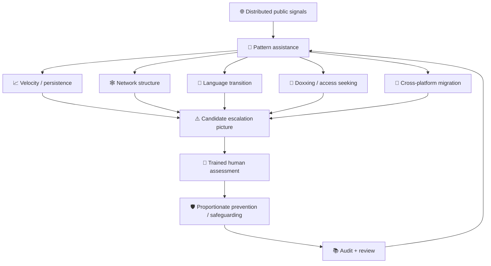

# 🩸 AI In Violence Prevention
**First created:** 2026-05-02 | **Last updated:** 2026-09-06  
*How computational systems might help identify escalating gendered and collective violence early enough to support prevention — without turning survivors, dissidents, or targeted communities into surveillance objects.*

---

## 🛰️ Orientation

This node began, on 2 May 2026, as forty-four bytes:

> **vawg and genocide are intrinsically linked**

That sentence was a hypothesis, not a completed argument.

It was also too strong if read as a universal causal claim.

Violence against women and girls does **not** mechanically progress into genocide.

Most misogynistic abuse does not become atrocity crime.

Most online harassment does not become organised physical violence.

And no responsible early-warning system should behave as though one ugly post, one abusive man, or one distressed community automatically predicts mass violence.

But the underlying intuition survives serious scrutiny.

Gendered violence can be:

- a tool of organised violence;
- a component of genocidal processes;
- a feature of coercive political environments;
- a mechanism of social control;
- an early indicator of worsening conflict;
- and part of the networked behaviour through which groups learn that increasingly severe violence is permissible.

The prevention question is therefore not:

> **Does VAWG cause genocide?**

It is:

> **When does gendered violence tell us that the wider environment is becoming more coercive, organised, dehumanising, or dangerous?**

And because much of that environment is now digitally mediated, another question follows:

> **Can computational systems recognise changes in collective behaviour before institutions accustomed to counting individual incidents recognise that the environment itself has changed?**

That is the AI Beyond AI problem.

---

## 🩸 Four Different Relationships

This node distinguishes four relationships that are often collapsed.

### 1. VAWG as violence in its own right

Domestic abuse, sexual violence, stalking, coercive control, image-based abuse, harassment, and misogynistic intimidation are serious harms whether or not they predict anything else.

Women do not need to become useful indicators of future catastrophe before violence against them deserves intervention.

### 2. Gendered violence as an atrocity method

Sexual and gender-based violence can be deliberately or permissively embedded within organised violence, ethnic cleansing, crimes against humanity, and genocide.

Here the gendered violence is not merely adjacent to the atrocity.

It is one of the ways the atrocity is enacted.

### 3. Gendered violence as an early-warning variable

Changes in violence against women, gendered political harassment, restriction of women’s participation, sexualised threats, or impunity for gender-based violence may sometimes help reveal a wider environment of:

- militarisation;
- authoritarianism;
- social fragmentation;
- impunity;
- identity-based hostility;
- or escalating conflict.

Gender-sensitive early-warning frameworks already exist for this reason.

### 4. Online swarm behaviour as an escalation surface

Digital networks allow large numbers of people to:

- identify targets;
- repeat narratives;
- reward aggression;
- circulate personal information;
- intensify degrading language;
- coordinate attention;
- and move hostility between communities and platforms.

That does not make every swarm centrally organised.

It does mean collective behaviour can become visible in the network before its consequences are obvious in an incident log.

---

## ⚖️ Evidence Discipline

The strongest version of this node requires restraint.

We should distinguish:

### Documented atrocity relationships

International courts and UN investigations have documented cases where rape, sexual slavery, and other gendered violence were part of genocide, crimes against humanity, ethnic cleansing, or systematic terror.

### Established early-warning practice

Conflict-prevention organisations already use gender-sensitive indicators because gendered harms and restrictions can contribute information about changing violence environments.

### Documented online abuse and amplification

Large-scale studies have shown that women — particularly women of colour, journalists, politicians, activists, and public figures — can be subjected to concentrated, repeated, sexualised, racist, misogynistic, and silencing abuse online.

### Emerging computational opportunity

Network analysis, machine learning, natural-language processing, temporal analysis, and cross-platform research can help humans inspect large-scale patterns.

### Polaris hypothesis

Changes in **swarm structure**, gendered targeting, doxxing, dehumanising language, persistence, network convergence, and movement from online hostility toward offline intimidation may sometimes function as useful **candidate escalation signals**.

Candidate signal.

Not automatic verdict.

---

## 🌍 Real-World Atrocity Precedents

### Rwanda: sexual violence within genocide

The International Criminal Tribunal for Rwanda’s 1998 **Akayesu** judgment was historically important because it recognised that rape and sexual violence could constitute acts of genocide when committed with genocidal intent.

The Tribunal found systematic sexual violence against Tutsi women in Taba and described sexual violence as integral to the destruction of the targeted group.

This established something legally and analytically important:

> **sexual violence can be part of how a group is destroyed, not merely an incidental by-product of conflict.**

---

### Bosnia and Herzegovina: terror, enslavement, and ethnic cleansing

The International Criminal Tribunal for the former Yugoslavia documented systematic detention, rape, sexual assault, and sexual enslavement in cases arising from the wars in the former Yugoslavia.

In the **Kunarac, Kovač and Vuković** case, the Tribunal found rape and sexual enslavement to be crimes against humanity.

The Tribunal was careful about evidence.

It did not simply infer a centrally ordered rape strategy from the existence of widespread rape.

What the evidence did establish was an environment in which sexual violence was used as terror, women were detained and repeatedly abused, authorities failed to protect them, and perpetrators were able to operate with extraordinary impunity.

In the **Krstić** case, the ICTY also linked rape in the Srebrenica context to the ethnic-cleansing campaign surrounding the genocide.

The analytical lesson is not:

> all wartime rape is centrally commanded.

It is:

> **impunity, institutional participation, identity targeting, sexual terror, and wider atrocity processes can become mutually reinforcing.**

---

### Yazidi genocide: gender determined the form of destruction

UN investigations into ISIL crimes against the Yazidi community documented:

- killings;
- forced transfer;
- forced conversion;
- enslavement;
- rape;
- sexual slavery;
- torture;
- and forced marriage.

UNITAD concluded that ISIL committed genocide against the Yazidis.

Its evidence also shows why gender analysis matters.

Religion identified the targeted group.

**Gender and age shaped what perpetrators did to different members of that group.**

Yazidi women and girls were subjected to enslavement and systematic sexual violence as part of the genocidal campaign.

So atrocity analysis that treats gender as decorative demographic information will literally fail to describe the structure of the crime.

---

## 🌐 Myanmar: Online Amplification And Offline Atrocity

Myanmar provides a particularly important digital case.

The 2017 campaign against the Rohingya occurred in an information environment where Facebook had become extraordinarily important to public communication.

Meta’s own commissioned human-rights assessment concluded that the company had not done enough to prevent its platform being used to foment division and incite offline violence.

The Independent Investigative Mechanism for Myanmar later documented a **covert Facebook network linked to the Myanmar military that systematically distributed anti-Rohingya hate speech** around the period of the 2017 clearance operations.

Amnesty International’s subsequent investigation argued that Facebook’s engagement-driven systems amplified anti-Rohingya hatred and increased the risk of mass violence.

This case matters because it demonstrates several layers at once:

```text
pre-existing discrimination
→ organised / repeated hostile narratives
→ platform amplification
→ widened social permission
→ identity-based violence
```

No algorithm “caused genocide” by itself.

But digital architecture can become part of the environment through which incitement, dehumanisation, mobilisation, and permission spread.

That is enough to make platform behaviour relevant to atrocity prevention.

---

## 🕸️ What Is A Swarm?

“Swarm” is useful here because not every collective attack is a formal conspiracy.

A swarm can emerge through:

- explicit coordination;
- influencer cues;
- repeated framing;
- algorithmic recommendation;
- opportunistic participation;
- shared grievance;
- imitation;
- or simple visibility.

Participants may not know one another.

They may not share one objective.

They may join at different levels of intensity.

But the target experiences the **aggregate system**.

A useful minimum model is:

```text
trigger
→ target concentration
→ attention acceleration
→ repeated framing
→ participation growth
→ norm reinforcement
→ escalation / persistence / migration
```

Some swarms collapse quickly.

Others become durable targeting infrastructures.

The computational problem is distinguishing the two.

---

## 🧿 Swarm Variables Worth Watching

The goal is not to invent a misogyny score.

It is to understand **changes in collective behaviour**.

### Velocity

How quickly does attention concentrate on the target?

A sudden increase may mean:
- breaking news;
- legitimate public criticism;
- viral humour;
- or organised harassment.

Velocity alone proves nothing.

But it changes the context.

### Volume

How many accounts are participating?

Again, raw volume is weak evidence.

A million people disagreeing with a politician is not equivalent to a thousand accounts circulating rape threats.

Content and structure matter.

### Persistence

Does the attention disappear after the immediate event?

Or does the target continue to receive:

- repeated abuse;
- tracking;
- resurfaced allegations;
- new accounts;
- renewed dogpiles;
- and recurring fixation?

Persistence may distinguish an event from a targeting system.

### Coordination

Do accounts:

- post the same material;
- use highly similar phrasing;
- share identical links;
- arrive in patterned bursts;
- repeatedly amplify the same nodes;
- or appear connected through identifiable network structures?

Coordination can be explicit or emergent.

Both are analytically relevant.

### Cross-platform migration

Does targeting move:

```text
forum
→ X
→ Telegram
→ YouTube
→ TikTok
→ private groups
→ offline contact
```

A single-platform moderation view can miss the system completely.

### Targeting escalation

Does discussion move from:

```text
opinion
→ insult
→ gendered degradation
→ sexual threat
→ identifying information
→ workplace / family targeting
→ location seeking
→ offline contact
```

The transition matters more than simple negativity.

### Dehumanisation

Does the target or group become described as:

- contamination;
- infestation;
- disease;
- sexual property;
- traitors;
- vermin;
- enemies;
- or people outside ordinary moral protection?

Dehumanising language is not identical to violence.

But atrocity-prevention frameworks treat hate propaganda and incitement seriously because language can help construct permission for violence.

### Network convergence

Are previously distinct communities beginning to mobilise around the same target or narrative?

Convergence can increase:

- reach;
- persistence;
- tactical diversity;
- and the number of pathways through which targeting travels.

### Doxxing and information seeking

Attempts to identify:

- home address;
- workplace;
- family;
- routine;
- travel;
- phone number;
- or other physical-world information

should be treated differently from ordinary hostile commentary.

The network is no longer merely speaking about the person.

It is reducing the distance between digital hostility and physical access.

---

## 🫀 Gendered Content Carries Information

A generic sentiment classifier is not enough.

Gendered abuse can contain distinctive forms of threat and control:

- rape threats;
- sexual humiliation;
- reproductive threats;
- threats against children;
- misogynistic slurs;
- image-based sexual abuse;
- sexualised deepfakes;
- gendered doxxing;
- threats framed around domestic or sexual access;
- and attacks combining misogyny with racism, antisemitism, homophobia, transphobia, disability abuse, or other identity-based hostility.

Amnesty International’s **Troll Patrol** project examined hundreds of thousands of tweets directed at women politicians and journalists.

It found particularly high levels of abusive or problematic content directed at Black women.

The project also demonstrated something methodologically useful:

> **machine learning became more useful when paired with large-scale human judgement rather than treated as a substitute for it.**

That is exactly the architecture violence prevention needs.

---

## 📣 Women In Public Life As Repeated Targets

Women journalists, politicians, researchers, activists, and other public-facing women provide many documented examples of concentrated online targeting.

Research has identified:

- sexist and misogynistic abuse;
- threats of physical and sexual violence;
- doxxing;
- racialised abuse;
- attacks on professional legitimacy;
- and coordinated or networked harassment.

The International Center for Journalists has combined:

- machine learning;
- computational linguistics;
- network analysis;
- and interviews with targeted women

to analyse millions of social-media posts directed at women journalists across multiple countries.

That mixed method matters.

The network tells you **what the swarm did**.

The woman tells you **what the swarm meant in the physical world**.

You need both.

---

## 🐺 Non-Atrocity Rehearsals Matter Too

Not every useful case study ends in mass violence.

That is precisely why smaller cases matter for prevention research.

Networked misogynistic conflicts such as:

- Dickwolves;
- Gamergate;
- campaigns against women journalists;
- attacks on women politicians;
- coordinated troll campaigns;
- and repeated harassment of feminist or minority public figures

can reveal social techniques including:

- target selection;
- insider defence;
- loyalty signalling;
- narrative laundering;
- ironic cruelty;
- network reinforcement;
- identity policing;
- reputational attack;
- and the recoding of the target’s complaint as the real aggression.

These are not mini-genocides.

They should not be described that way.

They are useful because they let us study **collective hostility at lower levels of violence**, where prevention is still the relevant task.

---

## 🧭 Gender-Sensitive Early Warning Already Exists

The idea that gender should inform conflict early warning is not a Polaris invention.

The International Foundation for Electoral Systems has developed a global framework for **gender-sensitive indicators for early warning of violence and conflict**, drawing on decades of gender-and-conflict research and pilot implementation.

The broader UN atrocity-prevention framework similarly treats risk assessment as cumulative and contextual.

No single risk factor establishes that atrocity will occur.

The concern increases when:

- multiple risk factors;
- multiple indicators;
- weakening protective institutions;
- enabling circumstances;
- and triggering events

begin to converge.

That logic is important for AI design.

The system should not ask:

> **Did the misogyny threshold fire?**

It should ask:

> **Has the wider risk environment changed?**

---

## 🤖 What AI Could Actually Help With

The strongest role for AI here is **pattern assistance**.

Humans are good at:

- context;
- legal judgement;
- lived meaning;
- credibility assessment;
- proportionality;
- and understanding what a threat means inside a particular community.

Humans are less good at manually inspecting millions of changing interactions across large networks.

Computational systems can help with:

### Temporal change detection

Identifying abrupt changes in:
- volume;
- velocity;
- persistence;
- and threat concentration.

### Network analysis

Mapping:
- repeated amplifiers;
- bridges between communities;
- central accounts;
- coordinated clusters;
- and migration between networks.

### Language transition

Flagging candidate movement from:
- ordinary disagreement;
- to degradation;
- to sexualised hostility;
- to explicit threats;
- to incitement.

### Entity and target concentration

Detecting when attention increasingly focuses on:
- one woman;
- one family;
- one minority group;
- one organisation;
- or one geographic location.

### Doxxing indicators

Identifying attempts to circulate or solicit personal information.

### Cross-platform synthesis

Helping analysts connect signals that appear fragmented when each platform is inspected separately.

### Historical comparison

Comparing current network behaviour with previously documented escalation patterns.

The machine should help humans **see the environment**.

It should not decide whom the state should fear.

---

## 🕸️ A Candidate Early-Warning Architecture



The word **candidate** is load-bearing.

The output is not:

> dangerous person detected.

It is:

> **this environment may have changed in a way that deserves trained human attention.**

---

## 🛑 Detect The Swarm, Not The Canary

This is the central governance rule.

Violence-prevention systems can easily reproduce the oldest institutional mistake:

```text
woman is targeted
→ woman generates reports
→ woman appears repeatedly in systems
→ woman accumulates risk markers
→ institution starts managing the woman
```

Absolutely not.

The relevant signal is:

```text
targeting behaviour
→ aggressor network
→ escalation pattern
→ access seeking
→ threat convergence
```

The person being harmed should not become the suspicious object merely because the system can see her most clearly.

> **Detect the swarm without converting the canary into the surveillance target.**

---

## 🧵 Community Canaries

Some communities encounter hostile mechanisms before dominant institutions learn to recognise them.

That creates a dangerous institutional temptation:

> collect more data about the vulnerable community.

But early-warning value does not automatically justify surveillance.

A community can be an **epistemic early warning source** without becoming a permanent monitored population.

Useful systems should therefore privilege:

- reports from affected communities;
- aggregate environmental signals;
- perpetrator behaviour;
- institutional failures;
- public network dynamics;
- and voluntary community expertise

over covert inference about the private lives of people already carrying the harm.

The system should learn from the canary.

It should not put a tracker on the bird.

---

## 🔐 Privacy And Proportionality

Violence prevention is an unusually dangerous justification because almost any surveillance capability can be described as preventative.

So the architecture needs hard limits.

Possible requirements include:

- prioritising public or lawfully available signals;
- minimising collection of private communications;
- strict purpose limitation;
- short retention where possible;
- separation between safeguarding analysis and unrelated intelligence functions;
- documented thresholds for human review;
- prohibitions on using victim identity as a proxy for dangerousness;
- strong access controls;
- independent oversight;
- auditable model changes;
- meaningful challenge mechanisms where decisions affect individuals;
- and explicit restrictions on repurposing gendered-violence datasets for unrelated policing, immigration, employment, insurance, or political profiling.

A good intention does not make an unlimited dataset safe.

---

## 🧨 The False-Positive Problem

False positives here have real consequences.

A computational system might mistake:

- journalism;
- satire;
- reclaimed slurs;
- survivor testimony;
- academic discussion;
- evidence preservation;
- fiction;
- counterspeech;
- or intense but lawful political argument

for threatening content.

Network analysis can also confuse:

- popular movements;
- emergency mobilisation;
- fandom;
- protest;
- rapid news response;
- and community self-defence

with coordinated harassment.

So escalation analysis should never rely on one signal.

Better systems ask whether **multiple independent features converge**.

For example:

```text
rapid attention
+
sexualised threats
+
persistent target fixation
+
doxxing
+
cross-platform migration
+
offline access attempts
```

is a different risk picture from:

```text
rapid attention
+
large disagreement
```

Context is the difference.

---

## ⚠️ The False-Negative Problem

Missing a real escalation can also be catastrophic.

Perpetrators may:

- use coded language;
- migrate into private networks;
- change vocabulary;
- distribute roles;
- communicate through images or memes;
- avoid explicit threats;
- or exploit languages and dialects poorly represented in moderation systems.

A system trained mainly on English-language explicit threats may be impressive in the laboratory and useless where the next crisis actually happens.

So capability should be assessed across:

- language;
- culture;
- platform;
- geography;
- identity;
- and adversarial adaptation.

There is no universal violence detector.

---

## 🌐 Online / Offline Is The Wrong Split

The internet is part of ordinary social life.

The useful question is not:

> Is this online violence or real-world violence?

It is:

> **How are digital and physical behaviours interacting?**

Possible transitions include:

```text
online narrative
→ offline intimidation
```

```text
offline political speech
→ online swarm
→ renewed offline threat
```

```text
public event
→ target identification
→ doxxing
→ home / workplace contact
```

```text
state or elite cue
→ network amplification
→ ordinary-user participation
```

The Philippines research on women journalists is particularly useful here: interviewees described harassment as a process that could begin with powerful actors, move through social-media personalities and troll networks, and then draw in ordinary users.

The system is hybrid.

Prevention has to be hybrid too.

---

## 🩸 Gender Is Not A Side Variable

Gender changes:

- who is targeted;
- how they are targeted;
- what threats mean;
- which forms of humiliation are used;
- who is believed;
- who withdraws;
- and what kinds of violence become socially available.

This is obvious in atrocity cases.

It is also visible in ordinary public life.

A woman receiving:

> you are wrong

and a woman receiving:

> I know where your children are and I will rape you

are not receiving different points on one generic negativity scale.

They are encountering different social mechanisms.

A violence-prevention system that strips away gender to appear neutral may simply erase useful information.

---

## 🧠 From Sentiment Analysis To Behavioural Environment

One of the weakest possible approaches would be:

```text
negative sentiment increases
→ risk increases
```

No.

People are allowed to be furious.

Political conflict can be intense.

Survivors can speak violently about what happened to them.

Marginalised communities can use reclaimed language.

A useful model looks beyond tone toward:

- behaviour;
- topology;
- persistence;
- target selection;
- information seeking;
- threat specificity;
- role differentiation;
- and movement toward physical access.

This is why **network analysis and context** may be more useful than generic toxicity scoring.

---

## 🛡️ What Prevention Could Look Like

The objective is not necessarily arrest.

Earlier interventions may include:

- platform friction;
- stronger account security for targets;
- rapid removal of exposed personal information;
- preservation of evidence;
- warning a threatened organisation or individual;
- specialist safeguarding;
- improved event security;
- human review of credible threats;
- community support;
- de-amplification of coordinated abuse;
- temporary protective changes;
- and escalation to appropriate authorities where a legally significant threat is identified.

The earlier the system notices a genuine change, the more options may exist **below the level of coercive state intervention**.

That is the point of early warning.

---

## ♻️ Early Warning Must Become Early Action

Detection by itself can become a grotesque bureaucratic achievement.

> We successfully predicted the danger.

Fine.

What happened next?

A prevention system needs:

```text
signal
→ assessment
→ accountable decision
→ proportionate action
→ outcome review
→ model revision
```

Without a response architecture, AI can simply create a more sophisticated dashboard for watching harm happen.

The value is not the alert.

The value is whether somebody can safely do something useful with it.

---

## 🧿 A Polaris Violence-Prevention Checklist

Before deploying an AI-supported early-warning system, ask:

1. **What harm are we trying to prevent?**
2. **Is the signal individual, networked, institutional, or environmental?**
3. **Are we detecting violence, or merely unpopular speech?**
4. **Does gender change the meaning of the signal?**
5. **Are multiple indicators converging?**
6. **What does the network structure add beyond content classification?**
7. **Are doxxing or physical-access behaviours present?**
8. **Is targeting persistent?**
9. **Is hostility migrating across platforms?**
10. **Are previously separate networks converging?**
11. **Could survivor testimony be misclassified as violent content?**
12. **Could the targeted person become the risk object?**
13. **Whose languages and communities are missing from the model?**
14. **Can a trained human inspect why an alert exists?**
15. **What intervention becomes available because of this alert?**
16. **Is that intervention proportionate?**
17. **Who can audit the system?**
18. **Can the data be repurposed for unrelated surveillance?**
19. **What happens when the model is wrong?**
20. **Are we protecting the canary, or monitoring her more efficiently?**

Question 20 is not decorative.

---

## 🌌 Constellations

🩸 🕸️ 🧵 🧿 🛡️ — gendered violence; online swarm behaviour; atrocity early warning; network escalation; prevention without survivor surveillance.

---

## ✨ Stardust

violence against women and girls, atrocity prevention, genocide prevention, conflict related sexual violence, online harassment, swarm behaviour, coordinated abuse, early warning, network analysis, doxxing, misogyny, hate speech, survivor safety, AI governance

---

## 📚 Further Reading

### Genocide, atrocity, and sexual violence

- [International Criminal Tribunal for Rwanda: “Historic judgement finds Akayesu guilty of genocide”](https://unictr.irmct.org/en/news/historic-judgement-finds-akayesu-guilty-genocide) — landmark recognition of rape and sexual violence as acts capable of constituting genocide when committed with genocidal intent.
- [International Criminal Tribunal for the former Yugoslavia: “Landmark Cases”](https://www.icty.org/en/features/crimes-sexual-violence/landmark-cases) — Foča, sexual enslavement, rape as crimes against humanity, and links between sexual violence and ethnic-cleansing contexts.
- [UNITAD: “Detailed Findings of International Crimes, including Genocide, Committed by ISIL against the Yazidi Community in Iraq”](https://iraq.un.org/en/278383-unitad-publishes-detailed-findings-international-crimes-including-genocide-committed-isil-da) — genocide, enslavement, rape, torture, and gendered targeting of Yazidis.
- [OHCHR Commission of Inquiry on Syria: “Ten Years After the Yazidi Genocide”](https://www.ohchr.org/sites/default/files/documents/hrbodies/hrcouncil/coisyria/report2024/coi-syria-position-paper-02-08-2024.pdf) — sexual slavery and gendered violence as part of the genocidal campaign.

### Early warning

- [United Nations Office on Genocide Prevention: “Framework of Analysis for Atrocity Crimes”](https://www.un.org/en/genocideprevention/documents/atrocity-crimes/Doc.49_Framework%20of%20Analysis%20for%20Atrocity%20Crimes_EN.pdf) — risk factors and indicators for atrocity early warning.
- [International Foundation for Electoral Systems: “Gender-Sensitive Indicators for Early Warning of Violence and Conflict”](https://www.ifes.org/gender-sensitive-indicators-early-warning-violence-and-conflict) — global framework integrating gender into conflict early-warning systems.
- [UNHCR: “Early warning and risks to information integrity”](https://www.unhcr.org/handbooks/informationintegrity/understanding-challenge/early-warning-and-risks-information-integrity) — hate speech, disinformation, and atrocity-risk monitoring.

### Online violence and computational analysis

- [Amnesty International: “Crowdsourced Twitter study reveals shocking scale of online abuse against women”](https://www.amnesty.org/en/latest/press-release/2018/12/crowdsourced-twitter-study-reveals-shocking-scale-of-online-abuse-against-women/) — Troll Patrol, human annotation, machine learning, and disproportionate abuse directed at Black women.
- [International Center for Journalists: “Online Violence Big Data Case Studies”](https://www.icfj.org/our-work/online-violence-big-data-case-studies) — computational linguistics, machine learning, network analysis, and interviews across millions of posts targeting women journalists.
- [RSIS: “The Digitization of Harassment: Women Journalists’ Experiences with Online Harassment in the Philippines”](https://rsis.edu.sg/staff-publication/the-digitization-of-harassment-women-journalists-experiences-with/) — research describing harassment moving through powerful actors, social-media personalities, troll networks, and ordinary users.
- [Amnesty International: “Myanmar: The Social Atrocity”](https://www.amnesty.org/en/documents/asa16/5933/2022/en/) — investigation of platform amplification of anti-Rohingya hatred and risks of mass violence.
- [Independent Investigative Mechanism for Myanmar: “Publication of IIMM Analytical Reports”](https://iimm.un.org/en/publication-iimm-analytical-reports) — evidence concerning a covert Myanmar military Facebook network distributing anti-Rohingya hate speech.

---

## 🏮 Footer

*🩸 AI In Violence Prevention* is a living strategy node of the **Polaris Protocol**.  
It explores whether computational systems can help humans recognise changes in gendered, networked, and collective violence early enough to support proportionate prevention — while refusing the familiar institutional inversion in which the person being targeted becomes the object of surveillance.

> 📡 Cross-references:
>
> - [🤖 AI Beyond AI](./README.md) — *parent cluster for machine intelligence as pattern assistance, modelling, and cognitive infrastructure rather than automatic synthetic authority.*
> - [🧵 Community Vulnerability and Early Canaries](../../../🌑_1_Origin_Points/🪿_Embodied_Information_Ecology/♻️🧿_Observation_Becomes_Intervention/🧵_community_vulnerability_and_early_canaries.md) — *why vulnerable communities may reveal dangerous mechanisms early, and why observation must not be converted into containment of the observed community.*
> - [🐺 Dickwolves Survivors Guild](../../../🌑_1_Origin_Points/🪿_Embodied_Information_Ecology/♻️🕸️_The_Feedback_Environment/🐺_dickwolves_survivors_guild.md) — *a lower-intensity historical case of networked misogynistic defence, survivor counter-speech, and community alignment before later amplification.*
> - [🪞 The Backlash Was Also Networked](../../../🌓_3_In_The_Moment/📲_Press_Matters/🌱_Prosocial_Roots/🌸_Digitally_Women/📖_Previously_On_The_Internet/🪞_the_backlash_was_also_networked.md) — *the wider history of misogynistic backlash as a networked social and platform process.*
>
> 🏮 Return To:
>
> - [🤖 AI Beyond AI](./README.md) — *1up*
> - [❤️‍🩹 Rehabilitated Tech](../README.md) — *2up*
> - [🌕 Long Strategies](../../README.md) — *3up*
> - [🌌 Polaris Protocol - Root](../../../README.md) — *root*

*Survivor authorship is sovereign. Containment is never neutral.*

_Last updated: 2026-09-06_
