# 💸 Making Harm Too Expensive To Continue

**First created:** 2026-08-23 | **Last updated:** 2026-08-23
*How long-term economic strategy can turn externalised harm into real cost, making exploitation, abuse and destructive conduct progressively less attractive to continue.*

---

## 🛰️ Orientation

A large amount of harmful behaviour remains economically rational because the people making the decision are not required to bear the full cost of the harm they produce.

The damage is externalised.

Workers bear it.
Children bear it.
Civilians bear it.
Patients bear it.
Communities bear it.
Future governments bear it.
The environment bears it.

The balance sheet often does not.

This creates a recurring systems problem:

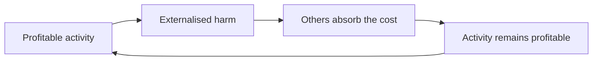

If the harmful conduct remains cheaper than the alternatives, moral criticism alone may not be enough to change it.

Long-term deincentivisation therefore asks a fairly unsentimental question:

> **How do we make the harmful option stop being the economically easy option?**

That does not require every problem to be solved through markets.

It means recognising that where commercial incentives are helping reproduce harm, changing those incentives is one legitimate route to changing the behaviour.

---

## ♻️ Harm Needs A Return Path

A functioning corrective system needs consequences to travel back toward the point at which the relevant decision is being made.

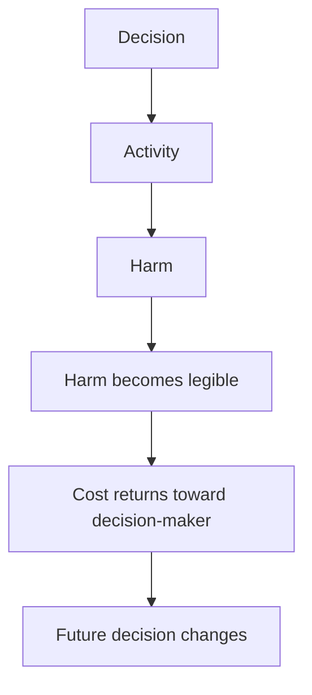

Without the return path:

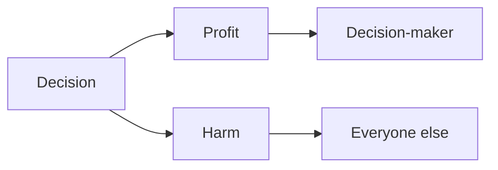

The problem is not simply that harmful people make harmful choices.

The system can make harmful choices **locally rational**.

That is a design problem.

---

## 💸 Externalisation Is A Subsidy

If a company receives the financial benefit of an activity while somebody else bears much of its human, environmental or geopolitical cost, the activity is effectively being subsidised by those who absorb the damage.

That subsidy may never appear in a public budget.

It can still be enormous.

Examples include:

* dangerous labour conditions;
* forced labour;
* child labour;
* environmental contamination;
* carbon emissions;
* unsafe extraction;
* weak redundancy;
* conflict exposure;
* corruption;
* fragile supply chains;
* destruction of public infrastructure.

The intervention question then becomes:

> **How much of that currently externalised cost can be made institutionally visible and economically consequential?**

---

## 🧮 Change The Cost Function

A simplistic system might reward only:

```text
revenue - direct private cost = desirable activity
```

A more realistic system needs to account for:

```text
direct cost
+
labour risk
+
legal risk
+
environmental harm
+
human-rights exposure
+
reputational risk
+
supply-chain fragility
+
geopolitical exposure
+
future remediation
```

The strategic objective is not to make every activity infinitely expensive.

It is to stop systematically pricing serious harm at or near zero.

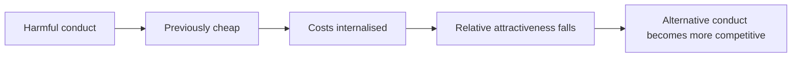

---

## 🕸️ One Pressure Point Is Rarely Enough

Long-term behavioural change is usually more durable when multiple systems return the signal.

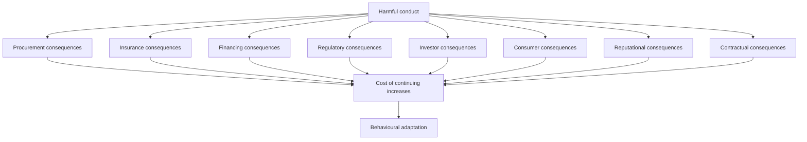

This matters because a company can often absorb one form of pressure.

It is harder to absorb many independent systems reaching the same conclusion.

---

## 🏢 Procurement Is Governance

Public and institutional procurement is often treated as administrative plumbing.

It is much more than that.

Every procurement system contains implicit judgments about what matters.

If price and incumbent convenience dominate every other consideration, then the system rewards suppliers that can make the cheapest offer even where some of that cheapness depends on externalised harm.

Procurement can instead incorporate:

* labour standards;
* environmental standards;
* human-rights due diligence;
* resilience;
* supply-chain transparency;
* security;
* interoperability;
* conflict exposure;
* ethical sourcing;
* exit capacity.

That does not mean every purchasing officer becomes a foreign-policy ministry.

It means **the purchasing system stops pretending that price is the only real thing in the room**.

---

## 🪤 Lowest Cost Can Be The Most Expensive Option

Short-term efficiency can conceal long-term cost.

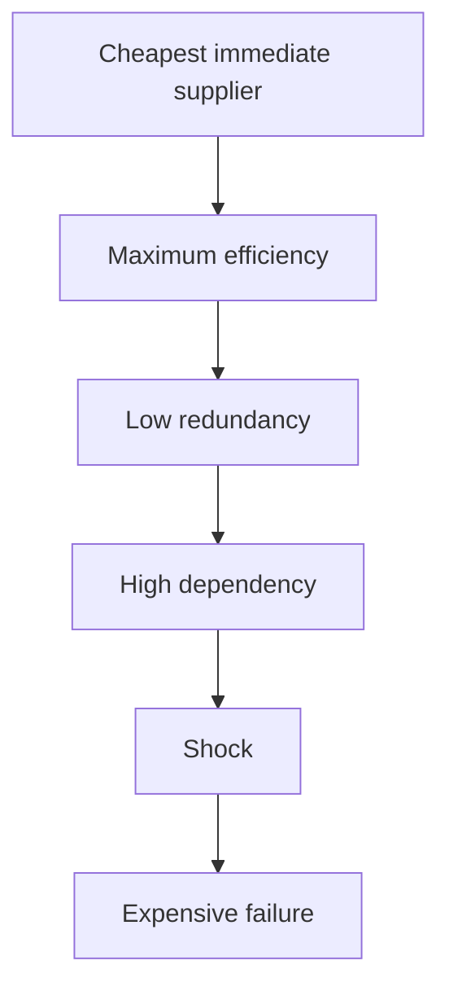

A more resilient system may look inefficient during normal operation because it pays for:

* spare capacity;
* multiple suppliers;
* domestic capability;
* inventories;
* interoperability;
* contingency planning;
* conservative leverage;
* staffing buffers.

Then the crisis arrives.

Those apparent inefficiencies become **stability infrastructure**.

---

## 🧱 Resilience Has A Price Because Failure Has A Price

Modern economic systems often reward the removal of slack.

Unused capacity is called waste.

Inventory is called inefficiency.

Redundant supply is called unnecessary duplication.

Extra staffing is called cost.

Until something fails.

Then the absence of all four becomes vastly more expensive than maintaining them would have been.

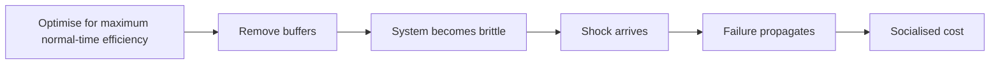

The same logic appears in finance, healthcare, logistics, energy, infrastructure and defence.

A healthy system therefore has to price **survivability**, not merely throughput.

---

## 🧬 Exploitation Can Recurse

Unchecked accumulation can generate its own reinforcing loop.

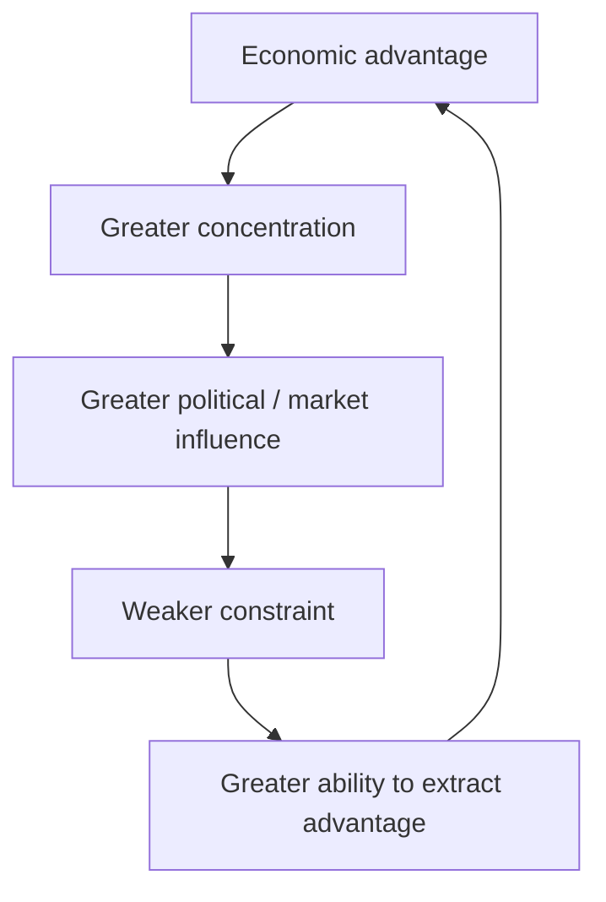

This is one reason systems built around profit-seeking need counterweights even if one is entirely comfortable with markets and private enterprise.

The relevant claim is not:

> *profit is evil.*

It is:

> **advantage can recursively increase the ability to preserve and enlarge advantage.**

A stable system needs mechanisms that interrupt that recursion.

---

## ♻️ Countervailing Feedback

The counter-model looks more like:

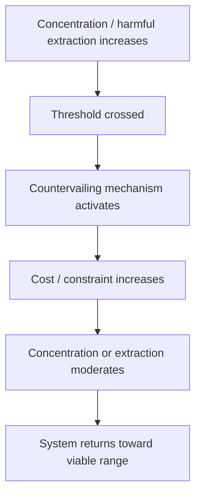

Possible counterweights include:

* competition law;
* labour power;
* progressive taxation;
* corporate governance;
* public procurement;
* regulation;
* supply-chain standards;
* anti-corruption rules;
* public ownership in selected sectors;
* disclosure requirements;
* investor duties;
* professional standards.

This is not necessarily revolution.

It is feedback engineering.

---

## 🧒 The Congo Question

Extractive supply chains provide one of the clearest examples of the problem.

Western economies benefit heavily from globally distributed mineral supply chains.

Some of those chains have repeatedly involved severe labour exploitation, dangerous extraction and child labour, including in the Democratic Republic of the Congo.

The important systems question is not:

> *Could modern technology exist without abuse in the Congo?*

Of course it could.

The better question is:

> **Who would bear the cost of removing the abuse from the supply chain?**

Possibilities include:

* mining companies;
* commodity traders;
* manufacturers;
* technology companies;
* investors;
* consumers;
* governments.

The reason reform can appear economically impossible is often that existing arrangements allow somebody else to bear the cost.

---

## 💎 "Necessary" Often Means "Cheap For Us"

This produces a recurring rhetorical transformation:

```text
this arrangement lowers our cost
```

becomes:

```text
our economy depends on this arrangement
```

which becomes:

```text
changing this arrangement threatens economic survival
```

Those are increasingly strong claims.

They are not interchangeable.

A system may be **adapted to exploitation** without being fundamentally dependent on exploitation.

Removing the exploitation can require:

* higher prices;
* lower margins;
* different suppliers;
* slower growth;
* investment in alternatives;
* redistribution;
* stronger regulation.

That is transition cost.

Transition cost is not proof of impossibility.

---

## 📈 Shareholder Return Is Not A Law Of Physics

One difficult governance problem appears when corporate structures treat maximising shareholder return as the overwhelmingly dominant measure of competent management.

Then a decision such as:

> *we could reduce severe labour exploitation, but doing so would slightly reduce margins*

can become institutionally harder to justify than:

> *we will preserve the harmful relationship because it is profitable.*

That is not an inevitable requirement of economic activity.

It is a governance choice.

Different systems can permit or require directors to consider:

* workers;
* long-term resilience;
* communities;
* environmental effects;
* strategic risk;
* human-rights exposure;
* future liabilities.

The question is not whether profit ceases to matter.

It is whether **maximum short-term return gets automatic priority over every other value**.

---

## 💰 Maybe Do Not Make All The Money

There is an extremely boring proposition hiding underneath a surprising amount of political conflict:

> **Sometimes the socially optimal return is lower than the maximum extractable return.**

This should not be revolutionary.

Yet it can feel revolutionary inside systems that have normalised optimisation toward maximum private extraction.

A firm can remain profitable while:

* paying workers more;
* accepting safer suppliers;
* maintaining redundancy;
* reducing exploitation;
* complying with stronger environmental standards;
* paying more tax;
* holding more capital;
* accepting slower growth.

The relevant comparison is not:

```text
maximum possible return
vs
economic collapse
```

There is quite a lot of civilisation in between.

---

## 🧿 Reform Can Feel Like Existential Threat

This helps explain why modest reforms can provoke extraordinary resistance.

If a system's institutions, professional identities and expectations have developed around particular assumptions, changing those assumptions can feel like an attack on reality itself.


The emotional intensity of that response does not establish that the alternative is actually unworkable.

Sometimes it establishes how completely the incumbent arrangement has been naturalised.

---

## 🌍 Apartheid South Africa And The Politics Of Necessity

Apartheid South Africa provides a useful historical comparison if used carefully.

The point is not that every contemporary case is equivalent to South African apartheid.

The useful question is how political and economic systems react when an unjust arrangement has become deeply integrated into:

* investment;
* strategic planning;
* trade;
* diplomacy;
* corporate relationships;
* security thinking;
* elite assumptions.

For many years, significant Western political and economic interests treated continuity in South Africa as entangled with broader stability and strategic necessity.

Apartheid nevertheless ended.

The world economy did not end with it.

Businesses continued to exist.

Trade continued.

Institutions adapted.

The distribution of power and cost changed.

That is precisely the distinction worth preserving.

---

## 🧭 Dependence Or Habituation?

When institutions claim that an unjust arrangement cannot be changed, ask:

* Is the arrangement genuinely indispensable?
* Or has the system simply built a large amount around it?
* Who benefits from continuity?
* Who pays for change?
* Who currently pays for the absence of change?
* Which risks are transition risks?
* Which risks already exist because the arrangement persists?
* If designing the system from scratch today, would we choose the same dependency?

That last question is often particularly revealing.

---

## 🏗️ Sunk Cost Is Not Strategy

Systems frequently defend existing arrangements because enormous effort has already been invested in them.

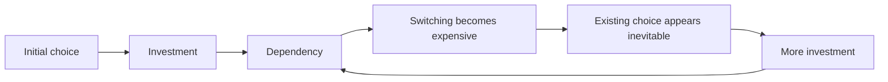

This is path dependence.

It can occur in:

* software;
* military alliances;
* energy infrastructure;
* supply chains;
* healthcare;
* transport;
* finance;
* industrial policy.

The fact that exit is now expensive does not establish that continued dependency is optimal.

It may establish that **exit planning should have begun earlier**.

---

## 🔁 Revolution Does Not Remove The Boring Work

There is a reason systemic problems generate revolutionary desire.

When problems appear everywhere, rebuilding everything can sound simpler than repairing each part.

But a new system still needs:

* procurement;
* accounting;
* tax;
* labour law;
* contracts;
* enforcement;
* logistics;
* regulators;
* governance;
* dispute resolution;
* standards;
* anti-corruption controls.

The boring work survives the revolution.

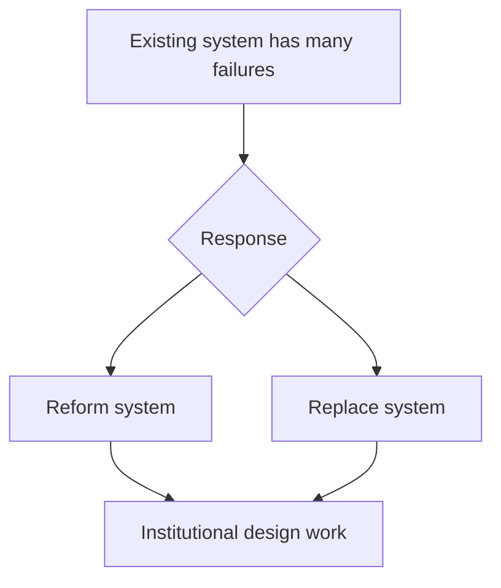

That does not make revolutionary change meaningless.

It means **system replacement is not a substitute for institutional engineering**.

---

## 🪜 Lots Of Small Changes Can Be Structural

A structural transformation does not have to arrive as one dramatic rupture.

It can emerge from many point interventions that collectively alter what behaviour is rewarded.

For example:

* competition rules;
* labour protections;
* procurement standards;
* tax structures;
* supply-chain due diligence;
* stronger anti-corruption controls;
* revolving-door restrictions;
* environmental liability;
* better public capacity;
* interoperability requirements;
* resilience standards;
* corporate-governance reform.

Each can look dull in isolation.

Together they can materially change the operating environment.

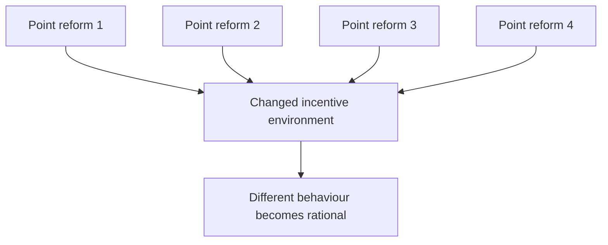

That is structural change through distributed feedback.

---

## 📉 Preventing The Next Crisis Is Less Exciting Than Surviving It

The same reforms that reduce exploitation can also improve stability.

Systems with:

* diversified suppliers;
* less leverage;
* better labour conditions;
* less corruption;
* stronger regulation;
* better public capacity;
* more realistic risk pricing;

are often better able to absorb shocks.

This matters because societies repeatedly spend enormous amounts rescuing systems after risks that were treated as inconvenient abstractions become real.

The cheapest crisis is often the one whose feedback mechanisms prevented it.

That is difficult to celebrate because nothing spectacular happens.

Which is rather the point.

---

## 🪤 Do Not Confuse Efficiency With Extraction

An efficient system should produce useful outcomes with acceptable resource use.

That is not identical to:

> *extract the maximum possible private return from every available relationship.*

A system can be highly extractive and extremely fragile.

It can appear successful because the fragility has not yet been tested.

This suggests a more serious definition of efficiency:

```text
useful output
+
resilience
+
human sustainability
+
strategic survivability
-
externalised harm
```

The exact weights are political choices.

Pretending there are no weights is also a political choice.

---

## 🧠 The System's Tolerated Imagination

There is a deeper cultural problem beneath economic design.

A system does not only organise transactions.

It helps organise what participants understand as:

* realistic;
* ambitious;
* irresponsible;
* innovative;
* radical;
* threatening.

That means relatively modest departures from profit maximisation can feel more destabilising than highly disruptive behaviour conducted in pursuit of profit.

A billionaire reorganising an industry can be celebrated as a revolutionary.

A proposal that firms accept slightly lower returns to avoid severe human exploitation can be described as economically dangerous.

That asymmetry is worth noticing.

It suggests that economic systems constrain not only behaviour.

They can constrain **the imagination of acceptable behaviour**.

---

## 🌀 Disruption Within The Allowed Range

This creates the distinction between:

**innovation within the system**

and

**disruption of the system's governing assumptions**.

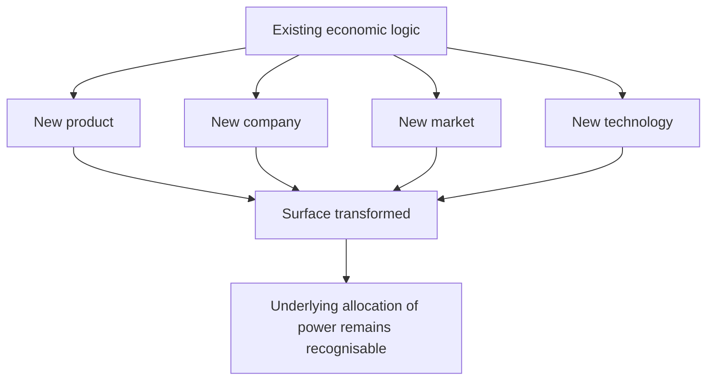

A person can therefore be genuinely innovative and still remain entirely within the system's tolerated imagination.

That is not an insult.

It is a classification.

---

## ♻️ Corrective Systems Need To Be Able To Irritate Power

A feedback mechanism that activates only when it does not materially inconvenience powerful actors is not much of a feedback mechanism.

Useful correction will sometimes:

* reduce profits;
* constrain discretion;
* force diversification;
* redistribute resources;
* require disclosure;
* increase redundancy;
* change ownership;
* create liability;
* make previously cheap behaviour more expensive.

That discomfort is not proof that the intervention is excessive.

Sometimes it is evidence that the signal has finally reached the decision point.

---

## 🌱 Long-Term Deincentivisation

A mature strategy therefore does not wait for each new scandal and then improvise punishment.

It builds standing mechanisms through which harmful behaviour reliably generates increasing friction.

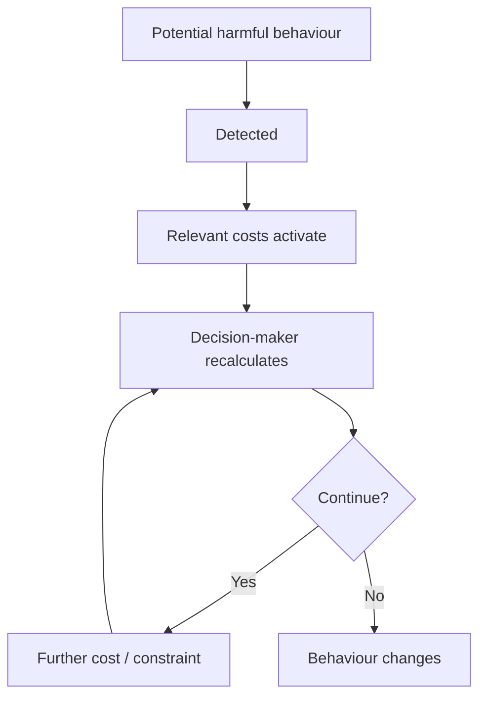

The objective is not permanent escalation.

It is to create a system in which escalation becomes unnecessary because predictable consequences already exist.

---

## 🎯 The Strategic Goal

The long-term goal is not:

> *make bad companies suffer.*

It is:

> **make harmful conduct a worse strategy.**

That requires changing more than reputation.

It means working on:

**prices.
contracts.
insurance.
finance.
procurement.
governance.
labour power.
regulation.
supply chains.
replacement capacity.
risk.**

When those structures align, ethical behaviour becomes easier to choose because the system stops rewarding the alternative quite so aggressively.

---

## 🧮 A Useful Test

For any proposed intervention, ask:

1. What behaviour is producing the harm?
2. Who makes the relevant decision?
3. Who currently benefits?
4. Who currently bears the cost?
5. Why does continuing remain rational?
6. What feedback could reach the decision-maker?
7. Can the harm be incorporated into procurement, financing, insurance or regulatory cost?
8. What alternative behaviour exists?
9. What would make that alternative easier?
10. What collateral effects would the intervention produce?
11. What should happen if behaviour changes?
12. Can the system still reproduce the same harm through another route?

If number twelve is yes, keep going.

---

## 🏛️ Reform Is Stability Work

There is a tendency to frame regulation and redistribution as limitations imposed on a functioning economy.

A different interpretation is possible.

They can be **maintenance systems**.

Markets, firms and financial systems are dynamic.

They produce innovation.

They also produce concentration, externalities, bubbles, rent extraction and dependencies.

Countervailing institutions are not necessarily hostile to that dynamism.

They are part of what keeps the dynamism from eating the substrate on which it depends.

In that sense:

> **regulation is not always the opposite of markets. Sometimes it is what allows markets to remain politically and materially survivable.**

---

## 💥 Cutting Off The Nose To Save The Face

Systems sometimes preserve a short-term distribution of advantage by increasing their own long-term vulnerability.


This is one of the stranger recurring features of political economy.

Societies can spend extraordinary resources defending arrangements whose principal advantage is that changing them would cost somebody powerful money now.

Then everybody pays considerably more later.

A surprisingly large amount of systemic reform can therefore be summarised as:

> **please stop cutting off the nose to save the face.**

---

## 💸 Maybe The Men Cannot Make All The Money For Ten Minutes

There is a less formal formulation.

Many interventions discussed in this node do not require:

* abolishing commerce;
* ending private ownership;
* prohibiting profit;
* destroying markets;
* making everyone materially equal.

Sometimes they require an actor who could extract **100** to accept **93** because extracting the additional **7** produces costs borne by somebody with much less power.

That should be within the imaginable range of a functioning society.

If it is not, the problem may be larger than the proposed regulation.

---

## 🌌 Constellations

💸 ♻️ 🧬 🪤 🪜 — externalised harm; economic feedback; recursive concentration; resilience; distributed reform; long-term behavioural change.

## ✨ Stardust

political economy, economic incentives, externalities, behavioural change, negative feedback, regulation, procurement, resilience, corporate governance, supply chains, reform

---

## 🏮 Footer

*💸 Making Harm Too Expensive To Continue* is a living node of the **Polaris Protocol**.
It develops a long-strategy framework for converting externalised human, environmental and systemic harm into consequential feedback, so that harmful conduct becomes progressively less attractive rather than remaining profitable because somebody else carries the cost.

> 📡 Cross-references:
>
> * [💸 Business Is Tooling](./) — *commercial systems, corporate behaviour and the use of business architecture as a governance tool*
> * [💸 Incentivising Behavioural Change and BDS](../../🌓_3_In_The_Moment/📲_Press_Matters/🇵🇸_Palestine_Factchecking/🌍_Global_Powers/💸_incentivising_behavioural_change_and_bds.md) — *applied case work on target selection, substitutability, procurement horizons and behavioural leverage*
> * [🌀 Absorption and Selective Sacrifice](../../🌑_1_Origin_Points/🪿_Embodied_Information_Ecology/♻️_Cybernetics/🌀_absorption_and_selective_sacrifice.md) — *how corrective signals can be visibly processed without changing the structures reproducing the original harm*
>
> 🏮 Return To:
>
> * [💸 Business Is Tooling](./) — *1up*
> * [🌕 Long Strategies](../) — *2up*
> * [🌌 Polaris Protocol - Root](../../README.md) — *root*

*Survivor authorship is sovereign. Containment is never neutral.*

*Last updated: 2026-08-23*
