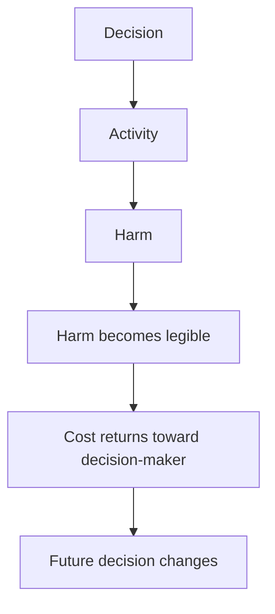
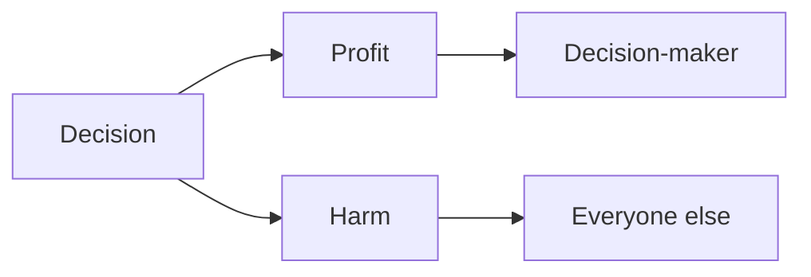
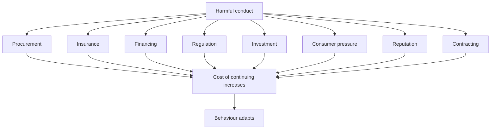
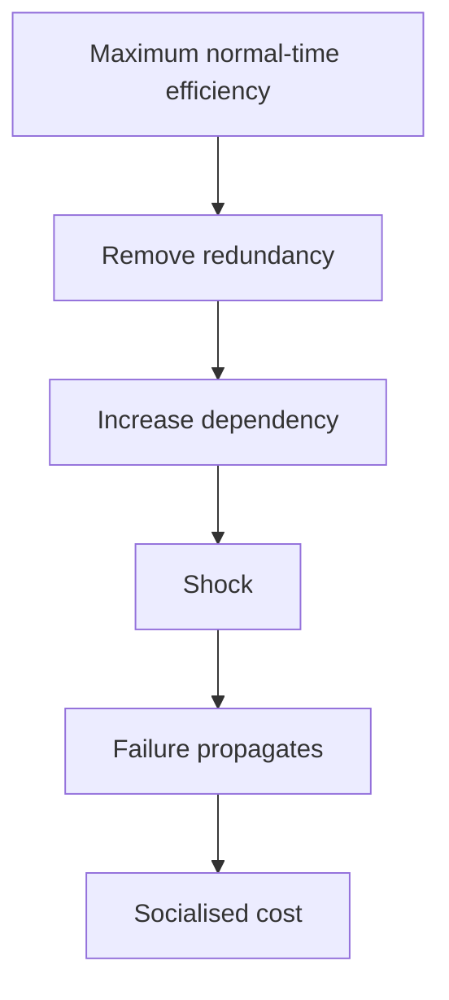
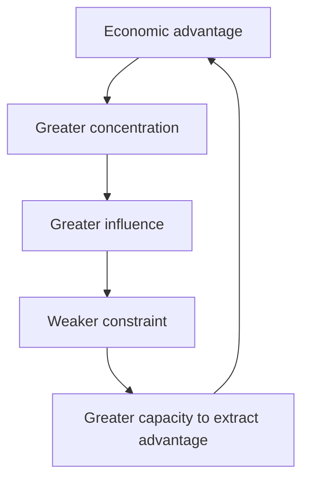
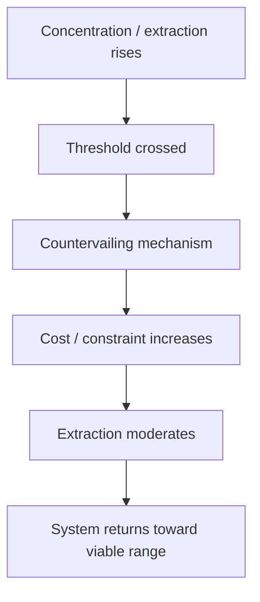
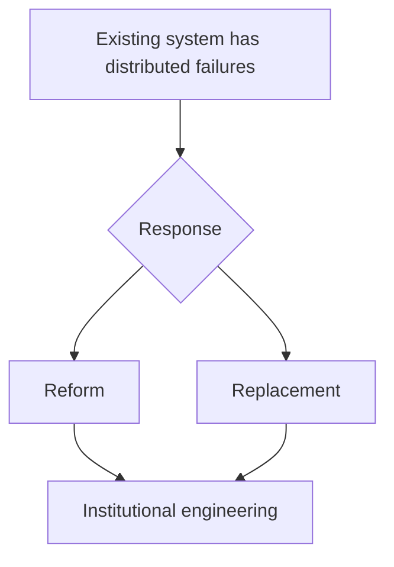
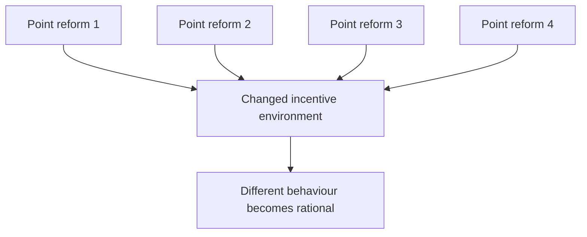
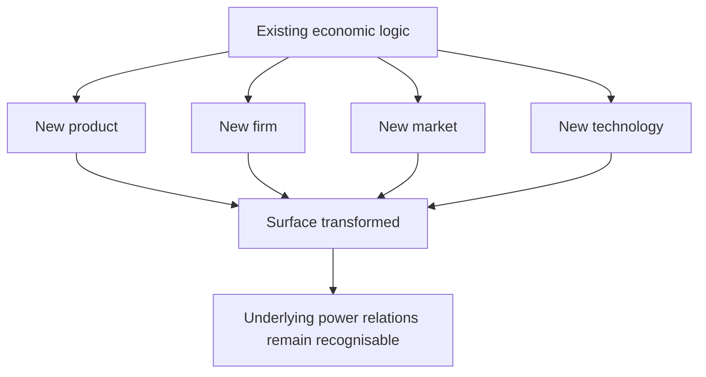
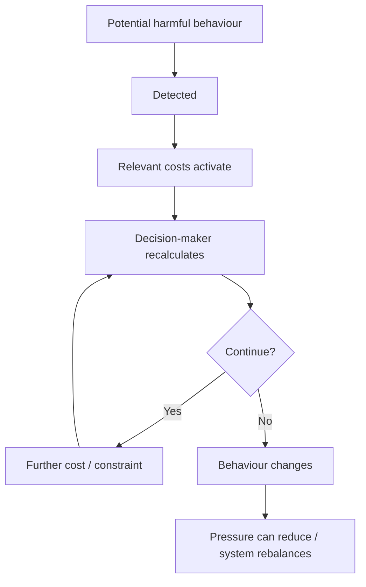

# 💸 Making Harm Too Expensive To Continue
**First created:** 2026-08-23 | **Last updated:** 2026-08-23  
*How long-term economic strategy can turn externalised harm into real cost, making exploitation, abuse and destructive conduct progressively less attractive to continue.*

---

## 🛰️ Orientation

A large amount of harmful behaviour remains economically rational because the actor making the decision does not bear the full cost.

Workers bear it.  
Children bear it.  
Civilians bear it.  
Communities bear it.  
Governments later bear it.  
The environment bears it.

The balance sheet often does not.


Long-term deincentivisation therefore asks:

> **How do we make the harmful option stop being the economically easy option?**

---

## ♻️ Harm Needs A Return Path



Without that return path:



The system can make harmful conduct locally rational.

That is a design problem.

---

## 💸 Externalisation Functions Like A Subsidy

When one actor receives the benefit while someone else carries the damage, the activity is effectively being subsidised by those absorbing the cost.

Examples can include:

- dangerous labour;
- forced labour;
- child labour;
- pollution;
- unsafe extraction;
- carbon emissions;
- corruption;
- conflict exposure;
- fragile supply chains;
- destruction of public infrastructure;
- inadequate redundancy.

The strategic question becomes:

> **How can those currently externalised costs become economically consequential to the actor making the decision?**

---

## 🧮 Change The Cost Function

A more realistic accounting of activity includes:

```text
direct private cost
+
labour risk
+
legal risk
+
human-rights exposure
+
environmental harm
+
reputational risk
+
supply-chain fragility
+
geopolitical exposure
+
future remediation
```

The goal is not to make all enterprise prohibitively expensive.

It is to stop pricing severe harm at effectively zero.

---

## 🕸️ Distributed Negative Feedback



One pressure point can often be absorbed.

Multiple independent systems returning the same signal are harder to ignore.

---

## ⚖️ Law Is Part Of The Transmission Architecture

Moral information does not automatically become an organisational decision.

Law and governance determine whether it can travel.

Relevant structures include:

- procurement rules;
- fiduciary duties;
- insurance conditions;
- due-diligence requirements;
- disclosure;
- liability;
- contracting;
- sanctions regimes;
- environmental law;
- labour standards;
- anti-corruption rules.

These determine whether someone inside an institution can say:

> *This relationship now creates a legally, commercially or governance-relevant reason to change course.*

That translation is crucial.

---

## 🏢 Procurement Is Governance

Procurement systems encode values whether they admit it or not.

If the hierarchy is:

**lowest headline cost + incumbent convenience**

then harms excluded from that calculation become structurally easy to ignore.

Procurement can also value:

- resilience;
- labour standards;
- human-rights due diligence;
- environmental performance;
- strategic security;
- interoperability;
- transparency;
- exit capacity;
- diversified supply.

The purchasing system does not have to become a foreign ministry.

It merely has to stop pretending price is the only material variable.

---

## 🧱 Resilience Is Not Waste

Systems optimised exclusively for normal-time efficiency tend to remove buffers.



What looked inefficient beforehand:

- spare capacity;
- diversified suppliers;
- inventory;
- domestic capability;
- staff buffers;
- conservative leverage;

may actually have been **stability infrastructure**.

---

## 🧬 Exploitation Can Recurse



The claim is not:

> *profit is evil.*

It is:

> **advantage can increase the ability to preserve and enlarge advantage.**

A healthy system needs counterweights.

---

## ♻️ Countervailing Feedback



Possible mechanisms:

- competition law;
- labour power;
- taxation;
- corporate governance;
- procurement;
- regulation;
- supply-chain standards;
- anti-corruption controls;
- disclosure;
- public-sector capacity.

This can be understood as **maintenance**, not merely restraint.

---

## 🧒 Extractive Supply Chains And The Dependence Claim

The DRC and mineral supply chains provide a particularly sharp example.

The question is not:

> *Could modern technology exist without severe labour exploitation?*

It could.

The more interesting question is:

> **Who would bear the cost of making the supply chain less exploitative?**

Potentially:

- mining companies;
- commodity traders;
- manufacturers;
- technology firms;
- investors;
- consumers;
- governments.

A great deal of alleged economic necessity is actually argument about **who is permitted to continue externalising cost**.

---

## 💎 Adapted To Exploitation Is Not The Same As Dependent On Exploitation

This distinction deserves to be explicit.

A system can become deeply:

- adapted to;
- invested in;
- institutionally organised around;
- politically habituated to;

an exploitative arrangement.

That does not prove the system literally requires the exploitation to survive.

```text
this arrangement makes important things cheaper for us
```

can quietly become:

```text
our system depends upon this arrangement
```

and then:

```text
changing it threatens collapse
```

Those are progressively stronger claims.

Transition can require:

- higher prices;
- lower margins;
- different suppliers;
- redistribution;
- slower growth;
- alternative infrastructure.

Those are costs.

They are not proof of impossibility.

---

## 📈 Shareholder Return Is Not A Law Of Physics

If reducing serious harm lowers returns slightly, governance structures determine whether directors can treat that trade-off as legitimate.

The choice is not necessarily:

```text
maximum shareholder return
vs
economic collapse
```

There is a very large policy space between them.

A firm can remain profitable while accepting:

- safer supply;
- stronger labour standards;
- more redundancy;
- higher tax;
- environmental compliance;
- slower growth;
- stronger reserves.

Sometimes the socially optimal return is simply lower than the maximum extractable return.

---

## 🧿 Reform Can Feel Like Existential Threat


The intensity of the reaction does not establish that the alternative is actually impossible.

It can reveal how thoroughly the incumbent arrangement has become naturalised.

---

## 🌍 South Africa And The Politics Of Necessity

Apartheid South Africa is useful here as a **bounded comparison**, not an equivalence machine.

The question is how systems behave when an unjust arrangement has become woven into:

- trade;
- investment;
- strategic assumptions;
- diplomacy;
- corporate relationships;
- security thinking.

A future sourced expansion should examine:

- contemporary Western arguments for maintaining economic relationships;
- claims about instability and strategic necessity;
- professional and commercial boycott;
- what economic adaptation actually looked like through and after transition.

The important theoretical point is:

> **deep integration into an arrangement is not proof that no alternative arrangement can function.**

The end of an incumbent political-economic arrangement may redistribute costs and power without producing the catastrophe predicted by its defenders.

---

## 🧭 Dependence Or Habituation?

Ask:

- Is this genuinely indispensable?
- Or has a great deal simply been built around it?
- Who benefits from continuity?
- Who pays for transition?
- Who currently pays for the lack of transition?
- Which risks are produced by change?
- Which risks are already produced by staying?
- If designing the system from scratch now, would we choose the same arrangement?

That final question cuts through a lot of sunk-cost mysticism.

---

## 🏗️ Sunk Cost Is Not Strategy


Path dependence can appear in:

- software;
- energy;
- healthcare;
- defence;
- supply chains;
- finance;
- transport;
- alliances.

The fact that exit is now expensive may simply mean exit planning should have begun earlier.

---

## 🌍 Allied Risk Accumulation

A related strategic problem appears when states continue adding:

- fiscal exposure;
- diplomatic exposure;
- legal exposure;
- reputational exposure;
- information-sharing exposure;
- defence commitments;
- industrial dependency;

to preserve an established arrangement.

At some point, the relevant question becomes:

> **Are we still defending an advantageous arrangement, or defending previous investment in the arrangement?**

States can become path-dependent too.

This is especially important where preserving one foreign-policy relationship requires continually adding new cost elsewhere.

The detailed contemporary casework belongs in a separate `🌍_Global_Powers` node.

But the long-strategy principle belongs here:

> **periodically recalculate the total exposure rather than treating previous commitment as proof that further commitment is rational.**

---

## 🔁 Revolution Does Not Remove The Boring Work

A new system still needs:

- procurement;
- accounting;
- labour rules;
- taxation;
- enforcement;
- contracts;
- logistics;
- regulation;
- dispute resolution;
- anti-corruption controls.



Revolution does not eliminate the point-change work.

It changes the conditions under which that work occurs.

---

## 🪜 Distributed Reform Can Still Be Structural

Lots of boring interventions can collectively alter what behaviour is rewarded.

For example:

- competition rules;
- labour protections;
- procurement reform;
- corporate-governance reform;
- tax;
- due diligence;
- anti-corruption rules;
- environmental liability;
- public capacity;
- interoperability;
- resilience standards.



That is structural change through distributed feedback.

---

## 📉 Financial Stability Is Part Of The Same Problem

The same systems that externalise human harm can externalise financial risk.

High leverage, low redundancy, concentration and short-term optimisation may appear efficient until a shock arrives.

Mechanisms that moderate extraction can therefore also improve:

- resilience;
- shock absorption;
- supply continuity;
- institutional trust;
- public fiscal stability.

Preventing a crisis is less visually impressive than surviving one.

That is usually a feature.

---

## 🧠 The System's Tolerated Imagination

Economic systems do more than organise transactions.

They also shape what participants understand as:

- realistic;
- ambitious;
- radical;
- irresponsible;
- innovative;
- threatening.

A billionaire reorganising markets can be celebrated as revolutionary.

A proposal that companies accept slightly lower returns to avoid severe exploitation can be treated as dangerously radical.

That asymmetry is analytically interesting.

It suggests that systems constrain not only behaviour but **the imagination of acceptable behaviour**.

---

## 🌀 Bounded Disruption

There is a distinction between:

**innovation inside the operating logic**

and

**disruption of the operating logic itself**.



That does not make the innovation fake.

It means “revolutionary” is often being used to mean:

> **extreme novelty within the tolerated imagination of the system.**

This is the bridge toward the separate Fisher/capitalist-realism work.

---

## 🧠 Desire And The Limits Of Post-System Imagination

The deeper Fisher question should be developed elsewhere rather than swallowed by this node:

> **If an economic system helps organise desire itself, how easily can people imagine what they would want outside its assumptions?**

That matters because a reform can feel existentially threatening not because it destroys material life, but because it disrupts categories through which people understand:

- success;
- security;
- ambition;
- ownership;
- status;
- rationality.

That later node can develop **bounded disruption**, capitalist realism and the way supposedly revolutionary business culture may remain deeply system-conforming.

---

## ⚠️ Failure Modes Of Deincentivisation

Long-term behavioural strategy can fail through:

- **cost displacement** — vulnerable people absorb the intervention;
- **symbolic substitution** — one visible actor is changed while underlying incentives persist;
- **no viable alternative** — the harmful option remains structurally easiest;
- **weak transmission** — criticism never becomes a cost at the decision point;
- **regulatory capture** — corrective institutions become aligned with those they constrain;
- **path dependence** — delay makes future change more expensive;
- **permanent punishment** — interventions lose defined behavioural off-ramps;
- **single-channel dependence** — one boycott, sanction or regulation is expected to carry the whole correction;
- **false necessity** — existing adaptation is described as structural impossibility;
- **short-term optimisation** — marginal returns are preserved at the expense of larger future instability.

---

## 🌱 Long-Term Deincentivisation



The objective is not permanent escalation.

It is to build a system where predictable correction makes escalation increasingly unnecessary.

---

## 🎯 The Strategic Goal

Not:

> *make bad companies suffer.*

But:

> **make harmful conduct a worse strategy.**

That means working on:

**prices.  
contracts.  
insurance.  
finance.  
procurement.  
governance.  
labour power.  
regulation.  
supply chains.  
replacement capacity.  
risk.**

---

## 🧮 A Useful Test

1. What behaviour produces the harm?
2. Who makes the decision?
3. Who benefits?
4. Who bears the cost?
5. Why does continuing remain rational?
6. What feedback can reach the decision-maker?
7. What rules determine whether the feedback is institutionally usable?
8. What alternative behaviour exists?
9. What would make the alternative easier?
10. Who bears the intervention's collateral cost?
11. What changed behaviour should reduce the pressure?
12. Can the system reproduce the same harm through another route?
13. Are we defending genuine necessity or accumulated habituation?
14. If starting from scratch, would we build the same dependency?

If twelve is yes, keep going.

---

## 🏛️ Reform Is Stability Work

Regulation and countervailing institutions are often described as restrictions on a functioning economy.

They can also be understood as maintenance.

Dynamic systems generate:

- innovation;
- concentration;
- bubbles;
- rents;
- dependencies;
- externalities.

Feedback keeps dynamism from consuming its own substrate.

> **Regulation is not always the opposite of markets. Sometimes it is part of what makes markets survivable.**

---

## 💥 Cutting Off The Nose To Save The Face


Societies repeatedly spend enormous resources preserving arrangements because changing them would cost powerful actors money now.

Then everybody pays more later.

---

## 💸 Maybe The Men Cannot Make All The Money For Ten Minutes

Many of the reforms discussed here do not require abolishing commerce or prohibiting profit.

Sometimes they require an actor who could extract **100** to accept **93** because the additional **7** produces severe costs borne by somebody with much less power.

That should be inside the imaginable range of a functioning economy.

If it is not, the problem is probably not the proposed regulation.

---

## 🌌 Constellations

💸 ♻️ 🧬 🪤 🧠 — externalities; economic feedback; recursive concentration; habituated dependency; bounded disruption; long-term reform.  

*Follow the evidence:*  

### 🇵🇸 BDS Movement
- [BDS Movement](https://bdsmovement.net/) — Palestinian-led boycott, divestment and sanctions movement; useful for the movement’s stated objectives, campaign logic, target guidance and strategic framing.
- [What Is BDS?](https://bdsmovement.net/what-bds) — overview of the movement’s aims, origins and relationship to the South African anti-apartheid precedent.

### 💊 Boycott Teva
- [Boycott Teva](https://boycottteva.org/) — medicine-focused campaign materials, including practical work around identifying Teva products and possible alternatives.

### 🩺 Medact
- [Medact](https://www.medact.org/) — UK health-worker organisation working across health justice, militarism, economic justice and related structural issues.
- [Medact — Palestine](https://www.medact.org/project/palestine/) — Palestine-specific health-worker campaigning, resources and organising, including material on BDS and NHS procurement.

### 🩻 Doctors Against Genocide
- [Doctors Against Genocide](https://www.doctorsagainstgenocide.org/) — international coalition of healthcare professionals working on atrocity prevention, medical ethics, advocacy and protection of healthcare workers and systems.

### ✡️ Jewish Voice for Peace — Health Advisory Council
- [Jewish Voice for Peace — Health Advisory Council](https://www.jewishvoiceforpeace.org/health-advisory-council/) — JVP network of physicians, nurses, mental-health workers, public-health professionals and other health workers addressing health, healthcare and human rights in Palestine/Israel.
- [JVP Health Advisory Council](https://www.jvphealth.org/) — dedicated JVP-HAC site, including healthcare-focused resources, campaigns and events.

### 🧭 Research Pathways
- **Medical and professional boycotts of apartheid South Africa** — historical precedent to develop with primary medical-association and professional-body sources.
- **Anti-apartheid professional non-cooperation** — comparative material on the use of institutional, academic, medical, trade-union and professional pressure as part of wider behavioural and economic deincentivisation.

---

## ✨ Stardust

political economy, economic incentives, externalities, negative feedback, regulation, procurement, resilience, corporate governance, supply chains, path dependence, bounded disruption

---

## 🏮 Footer

*💸 Making Harm Too Expensive To Continue* is a living node of the **Polaris Protocol**.  
It develops a long-strategy framework for converting externalised human, environmental and systemic harm into consequential feedback, while distinguishing genuine dependency from institutional habituation and treating reform as both behavioural intervention and stability infrastructure.

> 📡 Cross-references:
>
> - [💸 Incentivising Behavioural Change and BDS](../../🌓_3_In_The_Moment/📲_Press_Matters/🇵🇸_Palestine_Factchecking/🌍_Global_Powers/💸_incentivising_behavioural_change_and_bds.md) — *applied case work on leverage, substitutability, target salience and campaign horizons*
> - [🌀 Absorption and Selective Sacrifice](../../🌑_1_Origin_Points/🪿_Embodied_Information_Ecology/♻️_Cybernetics/🌀_absorption_and_selective_sacrifice.md) — *how corrective signals can be processed without reaching the structures reproducing the original harm*
>
> 🏮 Return To:
>
> - [💸 Business Is Tooling](./README.md) — *1up*
> - [🌕 Long Strategies](../README.md) — *2up*
> - [🌌 Polaris Protocol - Root](../../README.md) — *root*

*Survivor authorship is sovereign. Containment is never neutral.*

_Last updated: 2026-08-23_
