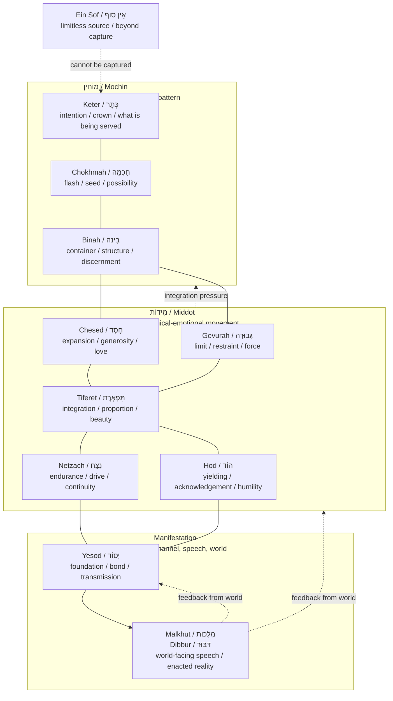

# 🜁 Whole Tree Translation Of C.R.A.K.E.N.  
**First created:** 2026-07-07 | **Last updated:** 2026-07-09  
*Trauma-informed ecological navigation for readers who need the C.R.A.K.E.N. framework translated away from sea-monster imagery and into whole-tree process language.*

---

## 🧭 Orientation

This node is a **translation layer**.

It does not replace C.R.A.K.E.N.

C.R.A.K.E.N. remains a reflexive, load-aware ecological model for geopolitical and defence analysis: a way of noticing how actions distribute pressure through systems, how actors remodel under force, and how apparently distant pressures can create stress fractures elsewhere.

But symbols carry history.

For some readers, the octopus / Kraken image may be evocative in a way that is not useful. Octopus imagery has a documented history in antisemitic propaganda, including Nazi-era visual propaganda representing Jews or supposed “international Jewry” as a conspiratorial force extending tentacles across the world. The United States Holocaust Memorial Museum describes the octopus over the globe as a common visual metaphor for the false Nazi myth that Jews were engaged in global conquest. The Library of Congress also records Axis propaganda using octopus imagery to frame Churchill as part of an alleged Jewish conspiracy.

That history matters.

So does the reader’s body.

If the image is triggering, contaminated, or too close to propaganda forms that have been used to assert fictitious Jewish dominance, that is a valid reason not to use it. The point of the framework is not to force people through imagery that closes their nervous system.

Some people have other associations. A person raised in a naval area may meet sea-monster imagery first through maritime folklore, sea myths, coastlines, naval culture, storm stories, shipwrecks, and practical relationship with water. For them, Kraken may not arrive first as antisemitic visual rhetoric.

Both things can be true.

The trauma-informed rule is simple:

> **If the symbol helps navigation, use it. If the symbol activates the wound more than the work, translate it.**

This node translates the defence framework through the **Tree of Life** and the movement toward closeness with **Ein Sof**: not as escape from the world, but as a disciplined process of receiving, containing, transmitting, speaking, repairing, and acting without rupture.

This is a trauma-informed translation and teaching frame. It is not a claim of rabbinic authority, kabbalistic mastery, or formal religious instruction. Jewish concepts used here should be checked, refined, or corrected by appropriate teachers, scholars, rabbonim, rebbetzins, and learned readers.

---

## 🌌 Starting Point: Closeness With Ein Sof

In this translation, the goal is not “defeating the monster.”

The goal is **closeness without rupture**.

Ein Sof is not treated here as an object to be captured, possessed, or strategically deployed. That would be a category error and probably also how someone accidentally invents a very expensive procurement disaster.

Instead, Ein Sof functions as the horizon of orientation:

- inexhaustible source
- ungraspable fullness
- divine beyond containment
- the reality toward which the tree gives partial, livable access
- the impossible abundance that finite vessels can only receive through structure, humility, and repair

The Tree of Life becomes a way of asking:

> **How does force move from source into world without shattering the vessel?**

That question is spiritual.

It is also trauma-informed.

It is also defence-relevant.

Because systems break when they receive more force than they can hold, interpret, distribute, or metabolise.

People do too.

States do too.

Alliances do too.

Institutions do too.

---

## 🦑 Why Translate C.R.A.K.E.N. At All?

The original C.R.A.K.E.N. model uses sea-monster imagery to name submerged systemic risk: the thing that wakes when actors tug strands of an ecosystem they have not mapped.

That remains analytically useful.

But in trauma-informed terms, a framework should not require a reader to sit inside imagery that recreates threat.

The translated version therefore shifts the symbolic centre:

| Original C.R.A.K.E.N. image | Trauma-informed whole-tree translation |
|---|---|
| Kraken / sea monster | submerged force, unintegrated pressure, rupture risk |
| Anti-Kraken navigation | vessel-aware ecological navigation |
| Calcaneus load distribution | kelim / vessel capacity and stress distribution |
| Reflexive geopolitical ecosystem | whole-tree relational field |
| Stress fractures | rupture, shattering, overload, dissociation, escalation |
| Keeping the Kraken asleep | keeping force metabolised, witnessed, and rightly channelled |
| Feeling the web before tugging a strand | sensing the tree before speaking / acting / escalating |

The core analytic function remains:

> **Do not act as though force travels in straight lines when it actually moves through a living web.**

The new symbolic language makes that usable for readers whose nervous systems would rather not be asked to work through imagery adjacent to antisemitic octopus propaganda.

Fair.

---

## 🌳 Whole Tree Translation: From Source To Speech

The tree is not a ladder out of reality.

It is a map of how force, insight, desire, judgment, relationship, and speech become livable.

In this trauma-informed defence translation, each sefirah becomes a process question.

| Sefirah | Trauma-informed process question | Defence / ecological translation |
|---|---|---|
| **Ein Sof** | What cannot be captured, owned, reduced, or forced into the model? | What uncertainty, excess, complexity, or unknowability must remain respected? |
| **Keter** | What am I actually serving? | What is the strategic orientation: safety, domination, repair, revenge, deterrence, legitimacy, survival? |
| **Chokhmah** | What flash or signal has appeared? | What new intelligence, intuition, anomaly, or weak signal has entered the field? |
| **Binah** | What container can hold this? | What framework, legal boundary, analytic structure, or institutional process can metabolise the signal? |
| **Chesed** | Where is expansion or generosity needed? | Where does reassurance, aid, alliance support, trust-building, or de-escalatory opening reduce pressure? |
| **Gevurah** | Where is boundary or restraint needed? | Where does deterrence, limit-setting, containment, refusal, or disciplined force prevent rupture? |
| **Tiferet** | What integrates love and boundary? | What action preserves legitimacy, proportion, humanity, and strategic coherence? |
| **Netzach** | What must continue? | What commitments, resilience functions, supply lines, alliances, or duties must endure? |
| **Hod** | What must be acknowledged? | What reality, harm, mistake, adversary perception, ally fear, or public truth must be admitted? |
| **Yesod** | What channel carries this? | What relationship, infrastructure, protocol, trust network, comms channel, or embodied practice transmits the action? |
| **Malkhut / Dibbur** | What becomes real through speech or action? | What signal, policy, deployment, statement, sanction, repair, or public act enters the world? |

---

## 🦴 Replacing Calcaneus With Kelim, Without Losing Load Awareness

The calcaneus model remains useful because the heel bone distributes load, records pressure history, absorbs shock, and remodels under force.

The whole-tree translation does not discard this.

It rephrases it through **kelim**: vessels.

A vessel is not passive.

A vessel receives, shapes, limits, contains, and makes possible.

Without a vessel, abundance becomes flood.

Without capacity, force becomes rupture.

Without boundary, care becomes engulfment.

Without channel, insight becomes noise.

Without speech discipline, inner pressure becomes external harm.

| Calcaneus model | Whole-tree / trauma-informed rendering |
|---|---|
| Load distributor | vessel capacity across the tree |
| Shock absorber | nervous-system / institutional capacity to metabolise force |
| Remodelling under pressure | changed doctrine, posture, attachment pattern, or institutional reflex |
| Stress fracture | rupture caused by cumulative unprocessed load |
| Pressure history | trauma history, institutional memory, strategic narrative, inherited doctrine |
| Load-sharing | alliance, ritual, relationship, protocol, supply chain, mutual recognition |

This gives a clean translation:

> **CRAKEN asks where pressure goes. The whole tree asks whether the vessel can receive it without shattering.**

Both are needed.

---

## 🧠 Trauma-Informed Defence Logic

A trauma-informed translation does not mean “make everything soft.”

It means:

- do not confuse activation with clarity
- do not confuse force with safety
- do not confuse silence with consent
- do not confuse compliance with trust
- do not confuse escalation with control
- do not confuse absence of visible fracture with structural integrity
- do not confuse your intention with the other actor’s received reality

Trauma-informed defence analysis asks:

> **How will this action be received by a system with memory?**

Not just:

> What do we intend?

But:

> What will this resemble?  
> What historical wound will it touch?  
> What narrative will it activate?  
> What constituency will be cornered?  
> What ally will be frightened?  
> What adversary will be incentivised?  
> What unprocessed pressure will look for an exit?

This is where the Tree of Life becomes useful.

Not because a naval escalation can be solved by waving a kabbalistic diagram at it. Sadly.

Because the tree gives a disciplined way to ask whether the process has moved from source to manifestation with enough containment, proportion, humility, foundation, and speech discipline.

---

## 🕸️ Original C.R.A.K.E.N. Components, Whole-Tree Translation

| C.R.A.K.E.N. component | Whole-tree translation | Core question |
|---|---|---|
| **Reflexive Load Mapping** | Vessel and channel mapping | Where does force go once released? |
| **Mutual Perception Loops** | Hod / Binah / Tiferet perception repair | What is being perceived, misperceived, denied, or overdetermined by memory? |
| **Distributed Pressure Awareness** | Whole-tree field sensing | Which parts of the system will carry load they did not choose? |
| **Strategic Remodelling** | Kelim adapting under force | How will actors change shape after pressure is applied? |
| **Fracture Detection** | Rupture / shattering analysis | Where is accumulated pressure close to breaking containment? |
| **Anti-Kraken Principle** | Do not disturb submerged force without vessel awareness | What will wake if we tug this strand? |

---

## ⚖️ The Tzimtzum Function

A trauma-informed defence framework needs **tzimtzum**.

Not as disappearance.

As disciplined contraction.

Tzimtzum asks:

> Can power make enough space for reality to appear without immediately occupying the whole room?

In defence terms:

- Can the stronger actor pause long enough to perceive accurately?
- Can the institution create space for dissenting intelligence?
- Can the state distinguish threat from embarrassment?
- Can leadership tolerate ambiguity without rushing to punitive clarity?
- Can a system refrain from filling every gap with projection?

Tzimtzum is not weakness.

It is the capacity not to overrun the field.

Without it, every analytic process becomes colonial in miniature: the self expands until the other is no longer visible except as object, obstacle, threat, or resource.

That is not closeness with Ein Sof.

That is Pharaoh with better software.

---

## 🔥 Rupture Modes Across The Tree

| Overload site | Rupture mode | Defence analogue | Trauma-informed correction |
|---|---|---|---|
| **Keter** | False crown: serving ego, revenge, purity, domination | Strategy captured by prestige or internal politics | Re-state what is actually being served |
| **Chokhmah** | Spark overload: too many signals, not enough holding | Intelligence panic / anomaly chasing | Slow signal processing; distinguish flash from pattern |
| **Binah** | Container failure or over-containering | Either chaos or bureaucratic suffocation | Build proportionate process; do not kill the living signal |
| **Chesed** | Flooding, appeasement, boundary loss | Reassurance without deterrence | Add Gevurah |
| **Gevurah** | Overcontrol, punishment, escalation reflex | Deterrence without legitimacy | Add Chesed and Tiferet |
| **Tiferet** | Failed integration | Incoherent posture; values and action split | Restore proportion, legitimacy, and human reality |
| **Netzach** | Grinding persistence beyond wisdom | Forever-war logic; sunk-cost escalation | Add Hod; admit reality |
| **Hod** | Collapse, over-yielding, shame, performative humility | Strategic paralysis or legitimacy theatre | Add Netzach; act after acknowledgement |
| **Yesod** | Channel corruption | Broken comms, bad intermediaries, misaligned protocols | Repair trust paths and transmission structures |
| **Malkhut / Dibbur** | Speech/action rupture | Statement, deployment, policy, or signal lands as threat | Check world-facing manifestation before release |

---

## 🧪 Practical Use: Whole-Tree Strategic Check

Before action, escalation, statement, deployment, publication, sanction, disclosure, or major narrative intervention, run the tree.

### 1. Ein Sof — Unknown Excess

What do we not know?

What cannot be known from here?

What complexity must not be flattened to make the decision feel cleaner than it is?

### 2. Keter — Orientation

What are we actually serving?

Safety? Justice? Deterrence? Repair? Legitimacy? Control? Revenge? Coalition management? Face-saving? Budget defence? Someone’s career?

Be rude about this if necessary.

G-d can cope with accurate minutes.

### 3. Chokhmah — Signal

What is the flash?

What changed?

What anomaly, warning, opportunity, threat, or intuition has appeared?

### 4. Binah — Container

What process can hold this?

What law, doctrine, analytic method, evidence threshold, red-team process, ethical screen, or timing structure is needed?

### 5. Chesed — Expansion

Where is reassurance needed?

Who needs aid, repair, clarity, or an opening?

Where could generosity reduce pressure rather than signal weakness?

### 6. Gevurah — Boundary

Where is the line?

What must be refused, contained, defended, or deterred?

What is the minimum force needed to make the boundary real?

### 7. Tiferet — Proportion

Does this action remain coherent with stated values?

Does it preserve humanity?

Would it still look defensible once the emails are disclosed, the inquiry opens, and someone’s exhausted barrister reads it aloud in a windowless room?

### 8. Netzach — Endurance

Can this be sustained?

What has to keep functioning if the first move fails?

What commitments are we renewing by acting?

### 9. Hod — Acknowledgement

What must be admitted?

Who has been harmed?

What perception might be reasonable from the other side, even if their conclusion is wrong?

What truth are we avoiding because it makes the room uncomfortable?

### 10. Yesod — Channel

Through what relationship, protocol, infrastructure, intermediary, or public channel will this move travel?

Is the channel trusted?

Is the channel contaminated?

Will the channel distort the message?

### 11. Malkhut / Dibbur — Manifestation

What exactly will enter the world?

A sentence? A signal? A sanction? A deployment? A leak? A silence? A refusal? A repair?

Say the actual thing.

Then ask:

> What will this become once it leaves us?

---

## 🧘 Meditation / Reflection Prompts

These prompts can be used personally, institutionally, or analytically.

They are not confession prompts.

They are vessel checks.

### Ein Sof

- What am I trying to make knowable too quickly?
- What mystery, uncertainty, or excess must I respect?
- Where am I pretending the model is the whole of reality?

### Keter

- What crown am I serving today?
- What would my behaviour suggest I worship, regardless of what I claim?
- Is my stated purpose aligned with my actual emotional motive?

### Chokhmah

- What signal has appeared before language?
- What do I notice but not yet understand?
- What spark needs protection from premature certainty?

### Binah

- What container does this need?
- What boundary, definition, timetable, evidence base, or ritual will help me hold it?
- Am I structuring the insight, or strangling it?

### Chesed

- Where is expansion the medicine?
- Who needs warmth, support, generosity, or reassurance?
- Am I giving freely, or giving in order to avoid conflict?

### Gevurah

- Where is the clean edge?
- What must not pass through me into the world?
- Is this boundary protective, punitive, or fear-disguised-as-control?

### Tiferet

- What would integration look like here?
- How do love and boundary become proportionate action?
- Is there beauty in the solution, or only force?

### Netzach

- What must continue even if it is hard?
- What promise or duty cannot be dropped?
- Am I enduring wisely, or simply refusing to stop?

### Hod

- What must I acknowledge?
- Where do I need to yield without collapsing?
- What truth would make my next action cleaner?

### Yesod

- What channel is carrying this?
- Is the relationship, protocol, body, habit, or institution strong enough to transmit the force?
- Where is the channel blocked, corrupted, or overloaded?

### Malkhut / Dibbur

- What am I about to make real?
- What will my speech do once it leaves me?
- Does this action create repair, rupture, protection, distortion, or theatre?

---

## 🧷 Trauma-Informed Translation Rule

When a symbol carries too much threat, translate the symbol.

Do not shame the reaction.

Do not force the image.

Do not require a Jewish reader, survivor, traumatised person, or historically literate analyst to prove that their nervous system has a footnote.

The work is the work.

The symbol is only useful if it helps the work move.

So:

- Kraken can become submerged risk.
- Tentacles can become distributed pressure pathways.
- Monster can become unintegrated systemic force.
- Anti-Kraken can become vessel-aware navigation.
- Sea mythology can remain available for those whose first encounter with it is maritime, folkloric, ecological, or naval rather than antisemitic.

This is not dilution.

It is access.

---

## 🌊 Trauma-Informed Summary Of The Defence Framework

C.R.A.K.E.N., translated through the Tree of Life, becomes:

> A vessel-aware ecological navigation system for sensing how force moves through living systems before action turns pressure into rupture.

It asks:

- What is the true orientation?
- What signal has appeared?
- What container can hold it?
- Where is expansion needed?
- Where is boundary needed?
- What restores proportion?
- What must endure?
- What must be acknowledged?
- What channel will carry the force?
- What will become real in speech, policy, action, or world?

The point is not to avoid force.

The point is to stop pretending force is clean just because the person using it has a tidy diagram.

Force moves.

Force echoes.

Force wakes memory.

Force remodels the vessel.

A trauma-informed defence framework therefore does not ask only:

> Can we do this?

It asks:

> What will this do to the field that will then do something back to us?

Which is, frankly, the sort of question people might have asked before breaking half the modern world, but apparently there was plenty of money for bombs and less money for seminaries, clinical supervision, women’s testimony, decent minutes, or anyone in the room saying “lads, have we considered the second-order effects?”

---

## 🕯️ Closing Meditation

The tree is not an escape from conflict.

It is a way of remaining close to source while acting inside a world that contains force, fear, harm, memory, and consequence.

Closeness with Ein Sof does not mean becoming vague, passive, or ornamental.

It means becoming less idolatrous about one’s own force.

Less captured by panic.

Less seduced by totalising models.

More capable of receiving without flooding.

More capable of limiting without cruelty.

More capable of speaking without rupture.

More capable of acting without pretending the web is not alive.

Or, if one insists on keeping the sea language:

Feel the whole tide before you pull the rope.

---

## 🌌 Constellations

🜁 🌳 🧭 🕸️ 🕯️ — whole-tree translation; vessel-aware navigation; trauma-informed defence analysis; reflexive pressure mapping; speech before rupture.

Further reading / source notes:

- United States Holocaust Memorial Museum, **Nazi-era Antisemitic Propaganda Poster** — notes Nazi propaganda’s false myth of “international Jewry” and the octopus over the globe as a common visual metaphor for that conspiracy claim.
- Library of Congress, **Josef Plank / Seppla, Churchill as an octopus** — records Axis propaganda portraying Churchill as part of a supposed Jewish conspiracy, shown as an octopus fastening tentacles on the globe.
- AJC Translate Hate, **Control** — background on antisemitic “Jewish control” conspiracy tropes.
- Original Polaris node: **🦑 C.R.A.K.E.N.: Calcaneus Reflexion Anti-Kraken Ecological Navigation System**.
- Related Polaris node: **📿 Whole Tree Process Stack**.

---

## ✨ Stardust

trauma-informed analysis, tree of life, ein sof, kelim, tzimtzum, defence analysis, ecological navigation, reflexive pressure, antisemitic visual rhetoric, propaganda literacy

---

## 🏮 Footer

*🜁 Whole Tree Translation Of C.R.A.K.E.N.* is a living node of the **Polaris Protocol**.  
It functions as the trauma-informed translation key for the `🦑_CRAKEN_Cartography` folder, preserving the original reflexive-risk framework while offering a whole-tree access route for readers who cannot use Kraken or octopus imagery safely.  
Its role is to support vessel-aware navigation, symbolic access, and careful action before pressure becomes rupture.

> 📡 Cross-references:
>
> - [🦑 CRAKEN Cartography](./README.md) — *parent folder for reflexive pressure mapping and trauma-informed translation routes*
> - [🧭 Map Before Movement](./🧭_map_before_movement.md) — *plain-language operational rule for action before escalation*
> - [🐓 איז נישט קיין קליינע זאַך](../README.md) — *wider Jewish counsel and bridge cluster*
> - [🌖 Learning The Skies](../../README.md) — *teaching, translation, and operational literacy layer*
> - [🌌 Polaris Protocol - Root](../../../README.md) — *root archive and protocol routing layer*

*Survivor authorship is sovereign. Containment is never neutral.*

_Last updated: 2026-07-09_
