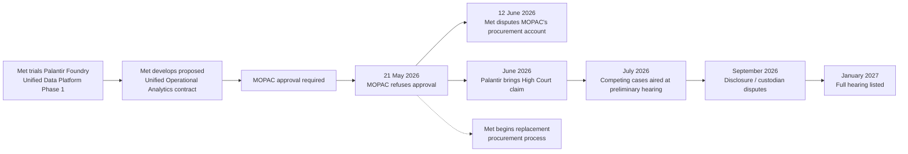
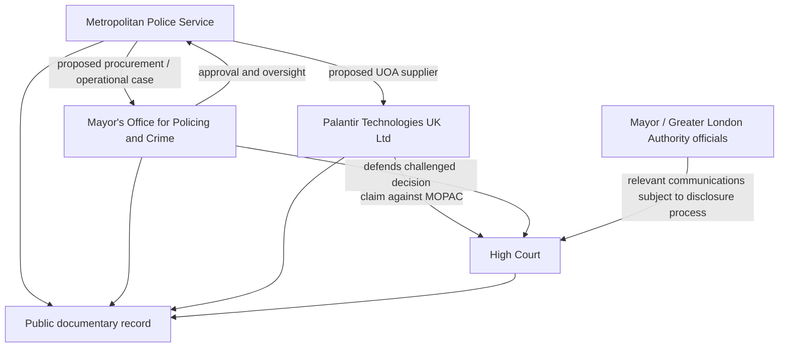

# 📜 Tapestry Draft

**HIC ADVOCATUS REGIS ITERUM VOCATUS EST**  
*Here the King's Counsel has been summoned again.*

**First created:** 2026-09-18 | **Last updated:** 2026-09-18  
*The running chronological weave of The Great Kraken Disturbance: public-domain developments, changing positions, documentary threads, and the occasional arrival of another King's Counsel.*

---

## 🛰️ Orientation

This is the working tapestry.

It records significant developments as they enter the public domain, preserves what was known at different points in the disturbance, and provides somewhere to follow threads before they are mature enough to become finished nodes.

It is chronological rather than thematic.

Later information may clarify, complicate, contradict, or change the significance of earlier entries. Earlier entries should therefore not be silently rewritten to make the eventual story look inevitable. Where a later development changes the interpretation of an earlier event, add the later development to the weave and cross-reference backwards.

The tapestry records the weave as it develops.

This is not the finished tapestry.

This is where we pin the little horses on while Britain continues producing additional fucking horses.

### Evidence rule

Real-world claims in this draft should remain distinguishable as:

- **Documented** — supported by an identified public record or sufficiently reliable source;
- **Party's position** — an attributed argument, allegation, denial, characterisation, or explanation;
- **Reported** — information reported publicly but not independently established here;
- **Our reading** — an analytical interpretation of the available material;
- **Unknown** — not presently established by the available public record.

> **The tapestry is a working chronology, not a judgment.** Competing accounts remain competing accounts unless and until the evidence resolves them.

---

## 🗺️ The Tapestry As It Currently Stands



> **Diagram rule:** This is a navigation aid, not independent evidence. Arrows represent relationships established in the accompanying record. They must not be read as implying undocumented influence, coordination, motive, or causation.

---

## 🕸️ Who Is Doing What?



> **No tentacles.** Network position, institutional relationship, access, capability, use, attribution, coordination, and causation remain separate questions.

---

## 🧵 Live Threads

These are threads currently visible in the tapestry, not conclusions about where they lead.

- ⚖️ **Litigation** — *Palantir Technologies UK Ltd v Mayor's Office for Policing and Crime*, reported case number **HT-2026-000205**.
- 💰 **Procurement and value for money** — whether the proposed procurement route and supplier assessment adequately demonstrated compliance and value.
- 🏛️ **Met–MOPAC governance** — the parties' differing accounts of the Scheme of Delegation, engagement, approval, and procedural expectations.
- 🧮 **Supplier selection** — MOPAC's criticism that only Palantir was seriously considered versus the Met's account of a supplier-agnostic framework assessment identifying only one viable offering.
- 🎭 **Values and ethics** — Palantir's allegation that an irrelevant consideration entered the decision versus MOPAC's case that the refusal rested on procurement and governance grounds.
- 📋 **Disclosure** — the documentary trail concerning how the decision was reached and communicated.
- 📰 **Public communications** — the relationship between the formal decision, subsequent press briefing, and the parties' competing descriptions of the decision-making process.
- ♻️ **Feedback** — how letters, court filings, reporting, procurement records, and later disclosure requests alter the information environment around the dispute.
- 🔭 **Replacement procurement** — the Met's subsequent work on a new procurement process while the litigation continues.

---

# 📜 The Weave

## 2026-01-30 — Palantir awarded the Unified Data Platform Phase 1 trial

### 📋 What entered the public record

**Documented:** The Metropolitan Police Service awarded Palantir Technologies UK Ltd a **£489,999 excluding VAT** call-off contract for **Unified Data Platform Phase 1**. The award notice records an award date of 30 January 2026, a contract period from **1 February to 30 April 2026**, and describes the procurement as a call-off from a framework agreement.

The published description says the Met purchased licensing and services to trial Palantir Foundry, including integrating structured and unstructured datasets, enterprise reporting, testing pattern identification, automating some analysis and reporting, and supporting officer-led decisions.

### 🧵 Threads affected

- Palantir–Met commercial relationship
- framework procurement
- data integration
- trial-to-larger-procurement pathway

### ❓ What remained unresolved

The existence of this trial does not itself establish the legality, merits, or procurement route of the later Unified Operational Analytics proposal. The two procurement objects should remain separately identified.

### 📚 Sources

- [Contracts Finder: Unified Data Platform Phase 1 — G-Cloud 14 Call-Off Contract](https://www.contractsfinder.service.gov.uk/Notice/Attachment/55262f3f-b054-4f4a-ac4e-c199556b0719)
- [OpenTenders: Unified Data Platform Phase 1](https://opentenders.co.uk/tenders/unified-data-platform-phase-1-42595964)

---

## 2026-05-21 — MOPAC refuses approval for the proposed UOA contract

### 📋 What entered the public record

**Documented:** On 21 May 2026, Deputy Mayor for Policing and Crime Kaya Comer-Schwartz wrote to the Metropolitan Police Commissioner informing him that the proposed contract with Palantir for **Unified Operational Analytics (UOA)** would not be approved.

Public City Hall material describes the proposed arrangement as worth **up to £50 million** and intended to automate aspects of intelligence analysis in criminal investigations.

### 🗣️ MOPAC's position

**Party's position:** MOPAC said there were serious concerns about the procurement and governance process. Public City Hall material subsequently described a **“clear and serious breach”** of procedural requirements, said only Palantir had been seriously considered, and said the proposal had not ensured or demonstrated value for money.

### 🧵 Threads affected

- procurement governance
- MOPAC approval
- value for money
- supplier selection
- Met–MOPAC relationship

### ❓ What remained unresolved

At this point, the public dispute included materially different accounts of the adequacy of the procurement process. MOPAC's criticisms were its position; they were not yet findings of the High Court.

### 📚 Sources

- [London City Hall: Questions over “clear and serious breach” of procurement rules over £50m Palantir contract](https://www.london.gov.uk/who-we-are/what-london-assembly-does/london-assembly-press-releases/questions-over-clear-and-serious-breach-procurement-rules-over-ps50m-palantir-contract)
- [London Assembly: MPS Unified Operational Analytics Contract (1)](https://www.london.gov.uk/who-we-are/what-london-assembly-does/questions-mayor/find-an-answer/mps-unified-operational-analytics-contract-1)

---

## 2026-05-21 onward — “Values and ethics” enters the public account

### 📋 What entered the public record

**Documented:** In the public discussion following the refusal, a spokesperson for the Mayor said a broader question remained about whether a company's **“values and ethics”** should be considered during public procurement, and said the Mayor believed Londoners would want public funding to go only to companies sharing the city's values. The wording was subsequently reproduced in a London Assembly question.

### ⚖️ Why this becomes important

**Our reading:** This public-language strand becomes legally significant because Palantir later relies on it in arguing that an irrelevant or unlawful consideration affected MOPAC's decision.

MOPAC disputes that characterisation and maintains that the decision was made on procurement and governance grounds.

### ❓ What remained unresolved

The existence of public commentary about values and ethics does not, by itself, establish what considerations legally caused or materially influenced the 21 May decision. That is one of the matters contested in the litigation.

### 📚 Sources

- [London Assembly: MPS Unified Operational Analytics Contract (1)](https://www.london.gov.uk/who-we-are/what-london-assembly-does/questions-mayor/find-an-answer/mps-unified-operational-analytics-contract-1)

---

## 2026-06-12 — The Met answers back

### 📋 What entered the public record

**Documented:** Deputy Commissioner Matt Jukes responded to the Deputy Mayor on 12 June 2026. The Met rejected MOPAC's characterisation of the process as a clear and serious procedural breach and said the dispute concerned compliance with MOPAC's Scheme of Delegation rather than a breach of law.

The Met acknowledged that the episode had exposed a **“mismatch in expectations”** between the Met and MOPAC and said both organisations needed to be more precise in future when decisions engaged the Scheme of Delegation.

### 🗣️ The Met's procurement account

**Party's position:** The Met said it had considered four broad procurement routes:

1. direct award without market engagement;
2. a desk-based assessment of pre-approved supplier offerings on a Crown Commercial Service framework;
3. a full procurement through a public-sector framework; and
4. a full open-market procurement exercise.

It said urgency, risk, and value for money led it to use a CCS framework.

The Met further said a **supplier-agnostic desk-based assessment** of suppliers available within the framework identified **only one viable service offering** capable of meeting the specification. It said legal advice had been obtained throughout and that it had worked with CCS on adherence to the framework process.

### ♻️ What this changed

The public record now contained two materially different descriptions of the same procurement history:

> **MOPAC:** the process had not adequately tested the market and only Palantir had been seriously considered.
>
> **Met:** a supplier-agnostic assessment within an established framework had been conducted and only one viable offering met the requirement.

These are competing institutional positions. The tapestry should preserve both without silently deciding the disputed legal question.

### 📚 Sources

- [Metropolitan Police: Deputy Commissioner response regarding Unified Operational Analytics, 12 June 2026](https://www.met.police.uk/SysSiteAssets/foi-media/metropolitan-police/other_information/corporate/120626-letter-matt-jukesqpm-mpsdeputy-commissioner-dmpc-unified-operational-analytics.pdf)

---

## 2026-06 — Palantir brings High Court proceedings

### 📋 What entered the public record

**Reported / subsequently confirmed through court reporting:** Palantir Technologies UK Ltd brought proceedings against the **Mayor's Office for Policing and Crime** in the High Court. The reported case number is **HT-2026-000205**.

### 🗣️ Palantir's position

**Party's position:** Palantir alleges that MOPAC acted unlawfully in refusing approval and that consideration of Palantir's perceived **“values and ethics”** improperly affected the decision. It also disputes the procurement criticisms made against the Met's proposed route.

Reported court material says Palantir seeks a declaration of unlawfulness, an order quashing the decision, and an order that the contract be awarded to it.

### 🗣️ MOPAC's position

**Party's position:** MOPAC denies Palantir's account and maintains that its refusal was based on lawful procurement and governance concerns. Its lawyers have argued that the Met's procurement strategy was unlawful or created an unacceptable risk of unlawfulness.

### ❓ What remained unresolved

No final merits judgment had determined these competing positions as of 18 September 2026.

### 📚 Sources

- [Reuters: Palantir says UK police contract wrongly blocked over perceived 'values', 9 July 2026](https://www.reuters.com/world/palantir-says-uk-police-contract-wrongly-blocked-over-perceived-values-2026-07-09/)
- [ITV News: Sadiq Khan's emails to be searched in Palantir legal battle over Met deal, 3 September 2026](https://www.itv.com/news/london/2026-09-03/sadiq-khans-emails-to-be-searched-in-palantir-legal-battle-over-met-deal)

---

## 2026-07-09 — Preliminary hearing; full hearing listed for January 2027

### 📋 What entered the public record

**Reported:** At a preliminary High Court hearing on 9 July 2026, the parties' competing cases were aired publicly. Mr Justice Constable indicated that a full hearing would take place in **January 2027**.

### ⚖️ What the case is now visibly about

The public pleadings/reporting place at least two major factual and legal fault lines in view:

1. **Procurement and governance:** whether MOPAC was entitled, or required, to refuse approval because of the way the Met had structured and presented the proposed procurement.
2. **Decision-making considerations:** whether Palantir's perceived values, ethics, reputation, political associations, or related public controversy improperly entered the decision, as Palantir alleges, or whether the refusal was in fact grounded in procurement and governance concerns, as MOPAC maintains.

### 🔭 Sensors

- disclosure orders and searches;
- amendments or further pleadings;
- further procedural hearings;
- replacement procurement activity;
- January 2027 full hearing.

### 📚 Sources

- [Reuters: Palantir says UK police contract wrongly blocked over perceived 'values', 9 July 2026](https://www.reuters.com/world/palantir-says-uk-police-contract-wrongly-blocked-over-perceived-values-2026-07-09/)

---

## 2026-07-17 — A separate Palantir procurement appears in the same policing ecosystem

### 📋 What entered the public record

**Documented:** A Find a Tender notice records MOPAC as buyer for a separate **Culture, Standards & Integrity Ecosystem (CSIE) Capability** procurement awarded to Palantir Technologies UK Ltd under the Back Office Software 2 Framework. Public procurement data records a contract value of **£1,959,996** and a signing date of 17 July 2026.

### 🧵 Why this belongs in the tapestry

This is a useful continuity warning.

The existence of another Palantir procurement involving MOPAC and the Met policing ecosystem does **not** establish that MOPAC reversed the 21 May decision concerning UOA. It is a separate procurement object and must remain separately labelled.

### ♻️ What this changed

It makes simplistic descriptions such as “MOPAC banned Palantir” or “MOPAC stopped doing business with Palantir” unsafe unless a source establishes that broader proposition. The public record instead shows a dispute over a particular proposed UOA procurement alongside other Palantir-related procurement activity.

### 📚 Sources

- [PublicSupply: Culture, Standards & Integrity Ecosystem (CSIE) Capability](https://www.publicsupply.co.uk/notices/9cf016b4-d8e2-4fa4-95cf-222d3e0b5d09)

---

## 2026-09-03 — The disclosure fight becomes visible

### 📋 What entered the public record

**Reported from a preliminary High Court hearing:** Lord Sadiq Khan and more than a dozen MOPAC and Greater London Authority officials were to be treated as **custodians** for disclosure purposes. Their relevant digital communications — including texts, WhatsApp messages, and Microsoft Teams chats insofar as they exist — are to be searched for material relevant to the litigation and disclosed where required.

ITV reported that Sarah Brown, formerly the Mayor's director of communications and strategy, was also listed as a custodian.

MOPAC's counsel said in written submissions that MOPAC had not initially considered it necessary or proportionate to add the Mayor because the decision had been taken by the Deputy Mayor for Policing and Crime and relevant documents were likely to be held elsewhere, but that MOPAC consented after Palantir persisted with the request.

### 🧵 Threads affected

- disclosure
- decision-making chronology
- public communications
- relationship between formal decision and press handling
- evidential reconstruction of what considerations were present when

### ❓ What this does **not** establish

Custodian status does not establish wrongdoing, improper influence, or that a particular communication exists. It identifies material that may need to be searched because it could be relevant to issues in the litigation.

### ♻️ What this changed

The dispute moved beyond competing public descriptions of the decision and into a more granular reconstruction of the documentary record surrounding it.

This is precisely the kind of transition the tapestry is designed to preserve:

> **decision → public explanation → legal challenge → disclosure demand → new documentary terrain**

### 📚 Sources

- [ITV News: Sadiq Khan's emails to be searched in Palantir legal battle over Met deal, 3 September 2026](https://www.itv.com/news/london/2026-09-03/sadiq-khans-emails-to-be-searched-in-palantir-legal-battle-over-met-deal)
- [The Guardian: Sadiq Khan agrees to have his texts and emails searched in Palantir legal battle, 3 September 2026](https://www.theguardian.com/politics/2026/sep/03/sadiq-khan-agrees-have-texts-emails-searched-palantir-legal-battle)

---

## 2026-09-18 — Current position

### 📋 What can presently be said safely

As of **18 September 2026**:

- Palantir's High Court challenge against MOPAC remains unresolved.
- The public record contains competing accounts of the Met's procurement process and MOPAC's reasons for refusing approval.
- The Met has publicly disputed MOPAC's characterisation of its procurement process.
- Palantir alleges that unlawful consideration of its perceived values and ethics affected the decision.
- MOPAC denies that account and maintains that procurement and governance defects justified refusal.
- Disclosure activity is now part of the litigation, including searches of communications held by identified custodians.
- Reporting says the Met has begun work on a replacement procurement process.
- The full hearing is listed for January 2027.

### ❓ What remains unresolved

- Which account of the procurement process will the court accept, insofar as it needs to decide that issue?
- What precisely was the lawful basis and operative reasoning for the 21 May refusal?
- What role, if any, did concerns about Palantir's perceived values or ethics play in the legally relevant decision-making process?
- What will disclosure show about the chronology of the formal decision, internal discussion, and public communications?
- Which issues will ultimately require determination and which may fall away before trial?
- What will happen to the replacement procurement while the litigation continues?

### 🔭 Sensors

Watch for:

- further High Court orders;
- disclosure disputes or agreed search parameters;
- newly public pleadings or witness evidence;
- procurement notices concerning replacement UOA capability;
- MOPAC or Met decision records;
- London Assembly questions and answers;
- further correspondence published by the Met or City Hall;
- January 2027 hearing materials.

---

# 🪡 Daily Entry Template

Copy this section whenever something material enters the public domain.

```markdown
## YYYY-MM-DD — Event title

### 📋 What entered the public record

**Documented / Reported:**

...

### 🗣️ Positions

**[Party]'s position:**

...

### 🧵 Threads affected

- ...

### ♻️ What this changed

...

### ❓ What remains unresolved

- ...

### 🔭 Sensors

- ...

### 📚 Sources

- [Publisher / institution: “Title”](URL)
```

### Maintenance rule

Do not rewrite an old entry merely because later evidence makes it look naive, incomplete, or unexpectedly hilarious.

Add the later evidence at the later date.

If necessary, add a short cross-reference to the old entry explaining that it was later clarified or contradicted.

That preserves the history of the information environment rather than merely the history of the eventual answer.

---

## 🧶 Thread Index

Use these tags inside future entries where useful:

`#procurement` · `#governance` · `#mopac` · `#met` · `#palantir` · `#litigation` · `#disclosure` · `#values_and_ethics` · `#supplier_selection` · `#value_for_money` · `#public_communications` · `#replacement_procurement` · `#information_feedback`

---

## 🌌 Constellations

- [🦑 The Great Kraken Disturbance](./README.md) — *parent teaching cluster and public narrative route*
- [🫧 Kraken's Pearls](./🫧_Krakens_Pearls/README.md) — *campaign continuity and methodology infrastructure*
- [🫧 Campaign Canon](./🫧_Krakens_Pearls/🫧_campaign_canon.md) — *durable narrative, epistemic, and editorial rules*
- [🍪 Definitions](./🫧_Krakens_Pearls/🍪_definitions.yaml) — *machine-readable semantic and continuity layer*
- [💉 Document Integrity](./🫧_Krakens_Pearls/💉_document_integrity.yaml) — *production and source-file integrity guard*

---

## ✨ Stardust

Palantir, Metropolitan Police, MOPAC, Unified Operational Analytics, Unified Data Platform, procurement, public law, judicial review, High Court, disclosure, value for money, supplier selection, Scheme of Delegation, values and ethics, information feedback, chronology, Bayeux tapestry, living record

---

## 🏮 Footer

*📜 Tapestry Draft* is the living chronological record of **The Great Kraken Disturbance**, a worked teaching cluster within the **Polaris Protocol**. It preserves the order in which public information, institutional positions, litigation, disclosure, and other developments enter the information environment so that later knowledge does not silently rewrite the route by which the story became knowable.

> 📡 Cross-references:
>
> - [🫧 Kraken's Pearls](./🫧_Krakens_Pearls/README.md) — *campaign methodology and continuity infrastructure*
> - [🫧 Campaign Canon](./🫧_Krakens_Pearls/🫧_campaign_canon.md) — *narrative and evidential constitution*
> - [🍪 Definitions](./🫧_Krakens_Pearls/🍪_definitions.yaml) — *machine-readable semantic layer*
> - [💉 Document Integrity](./🫧_Krakens_Pearls/💉_document_integrity.yaml) — *production-integrity rules*
>
> 🏮 Return To:
>
> - [🦑 The Great Kraken Disturbance](./README.md) — *1up*
> - [🌖 Learning The Skies](../README.md) — *2up*
> - [🌌 Polaris Protocol — Root](../../README.md) — *root*

*Survivor authorship is sovereign. Containment is never neutral.*

*Last updated: 2026-09-18*
