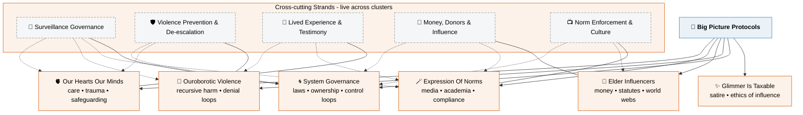

# 🧠 Big Picture Protocols  
**First created:** 2025-08-11 | **Last updated:** 2026-08-16  
*Big ideas to defeat the small ideologies.*  

---

## ✨ Overview  
**Big Picture Protocols** map the structural layers of behavioural governance.  
Each cluster examines **memory control, coercive systems, radicalisation pipelines, and institutional nudging** at scale.  
These entries interlink with **Containment Scripts**, **Survivor Tools**, and **Field Logs** for full forensic mapping.  

---

## 🫐 Current Subclusters  

### [✨ Glimmer Is Taxable And Other Big Drums](./✨_Glimmer_Is_Taxable_And_Other_Big_Drums)  
Ethics of influence, symbolic economies, and moral accounting — where glimmer meets governance.  

### [🌀 System Governance](./🌀_System_Governance)  
The architectures of control: laws, ownership, containment logic, and state–corporate interlocks.  

### [🐍 Ouroborotic Violence](./🐍_Ouroborotic_Violence)  
Recursive architectures of harm — how violence consumes and reproduces itself.  

### [🦕 Elder Influencers](./🦕_Elder_Influencers)  
Old powers in new clothes. From money and statutes to world webs and borders, this cluster maps how legacy elites perpetuate influence.  

### [🪄 Expression Of Norms](./🪄_Expression_Of_Norms)  
Media, academia, and bureaucratic culture as engines of norm enforcement. Tracks compliance theatre and behavioural nudging.  

### [🫀 Our Hearts Our Minds](./🫀_Our_Hearts_Our_Minds)  
Cluster on care, harm, and belief — where trauma, psychology, and safeguarding intersect with humane governance.  

---

## 🗺️ Interlink Logic  

- **Glimmer Is Taxable** explores the ethics and aesthetics of moral authority.  
- **System Governance** provides the infrastructural frameworks underpinning all other clusters.  
- **Ouroborotic Violence** analyses recursive containment — the self-devouring logic of control.  
- **Elder Influencers** traces financial, legal, and territorial continuities of power.  
- **Expression Of Norms** exposes how social order is performed and policed through institutions.  
- **Our Hearts Our Minds** grounds the entire framework in embodied ethics, trauma, and witness.  

---

## 🗺️ Structural Map

---

## 🌍 Routing Examples  

### 1️⃣ Surveillance (general case)  
**Home:** 🌀 *System Governance* — authorisation, legal basis, oversight gaps.  
**Cross-links:** 🪄 *Expression Of Norms*, 🐍 *Ouroborotic Violence*, 🫀 *Our Hearts Our Minds*.  

### 2️⃣ Violence experience, prevention & de-escalation  
**Home:** 🐍 *Ouroborotic Violence*.  
**Cross-links:** 🫀 *Our Hearts Our Minds*, 🌀 *System Governance*, 🪄 *Expression Of Norms*.  

### 3️⃣ Lived testimony & clinical misuse  
**Home:** 🫀 *Our Hearts Our Minds*.  
**Cross-links:** 🪄 *Expression Of Norms*, 🌀 *System Governance*, 🐍 *Ouroborotic Violence*.  

### 4️⃣ Donors, money, and narrative leverage  
**Home:** 🦕 *Elder Influencers*.  
**Cross-links:** 🪄 *Expression Of Norms*, 🌀 *System Governance*, ✨ *Glimmer Is Taxable*.  

### 5️⃣ Norm enforcement & compliance culture  
**Home:** 🪄 *Expression Of Norms*.  
**Cross-links:** 🦕 *Elder Influencers*, 🌀 *System Governance*, 🫀 *Our Hearts Our Minds*.  

---

## 🌌 Constellations  
🧠 🧿 🐍 🪄 🪬 — systemic scale, recursion, ethics, narrative control, survivor memory.  

---

## ✨ Stardust  
system governance, ethics, recursion, narrative control, trauma politics, survivor memory, institutional power, containment  

---

## 🏮 Footer  

*🧠 Big Picture Protocols* is a living node of the Polaris Protocol.  
It organises the conceptual architecture through which containment systems are named, mapped, and undone.  

> 📡 Cross-references:
> 
> - [Disruption Kit] — *tactical field frameworks*  
> - [Survivor Tools] — *applied countermeasures*  
> - [Containment Scripts] — *platform and policy mechanisms*  

*Survivor authorship is sovereign. Containment is never neutral.*  

_Last updated: 2026-08-16_
