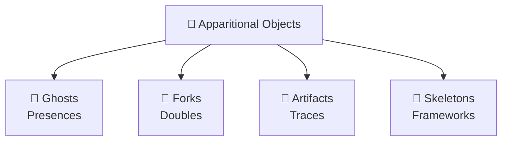

# 👻 Apparitional Objects  
**First created:** 2025-09-12 | **Last updated:** 2025-09-12  
*The shelf for ghosts, forks, 📿 artifacts, and 🦴 skeletons — under construction.*  

---

## 🌱 Scope  

Apparitional Objects are the **things that refuse to stay still.**  
They flicker, double, erase, or collapse — behaving more like hauntings than files.  

This folder holds four categories:  

- **👻 Ghosts** → apparitional *presences* (phantoms, echoes, residues).  
- **🍴 Forks** → apparitional *doubles* (twins, splits, mimics).  
- **📿 Artifacts** → apparitional *traces* (haunted objects, cursed records).  
- **🦴 Skeletons** → apparitional *frameworks* (haunted architectures, shifting scaffolds).  

---

## 🗺 Skeleton Diagram  

---

## 📂 Planned Subfolders  

- **Ghosts/**  
  - Phantom sessions, metadata shadows, ghostwatch protocols.  

- **Forks/**  
  - Execution drift, shatterfork, reverent repetition, sanitiser forks.  

- **📿 Artifacts/**  
  - Vanishing attachments, cursed contracts, redacted reports, metadata ghosts.  

- **🦴 Skeletons/**  
  - Clone matrices, visibility indexing anomalies, UI sabotage scaffolds.  

---

## 🏮 Footer  

*Apparitional Objects* is a living node of the Polaris Protocol.  
It collects the haunted presences, doubles, traces, and frameworks that structure suppression.  
This section is still scaffolding in progress.  

> 📡 Cross-references:  
> - [Weirdness Screening](../Weirdness_Screening/) — first-notice oddities  
> - [Disruption Kit](../Disruption_Kit/) — systemic suppression protocols  
> - [Metadata Sabotage Network](../Metadata_Sabotage_Network/) — deeper sabotage layers  

*Survivor authorship is sovereign. Containment is never neutral.*  

_Last updated: 2025-09-12_
