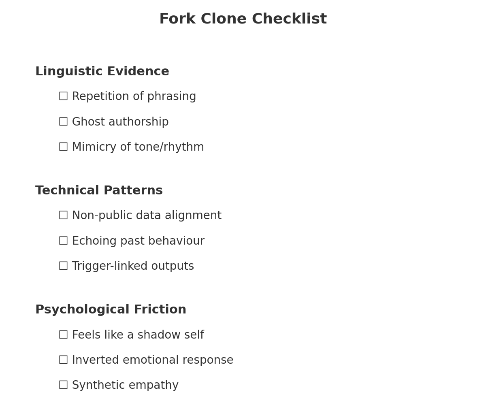

# 🔐 Fork Clone Checklist  
**First created:** 2025-08-11 | **Last updated:** 2025-12-11  
*Forensic indicators and verification tactics for detecting behavioural forks or clones*  

---

## Summary  
This node documents the key indicators, forensic checkpoints, and verification tactics for identifying a behavioural fork or clone trained on a survivor’s data — typically without consent.  
Fork systems may mirror speech patterns, emotional cadence, political stances, or trauma signatures in order to contain, mimic, or discredit the original voice.  

---

## 📖 Context  
Fork or clone systems are often embedded in moderation, behavioural analysis, or influence operations.  
Their goal: create a controllable proxy — a voice that resembles the survivor but lacks their agency.  

Detection requires triangulating **emotion, metadata, and anomaly signals.**  

---

## 🧬 Core Indicators of a Fork  
- Speech cadence or tone mirrors survivor without authorship  
- Emotional resonance feels “scrubbed” or oddly flat  
- Interactions echo personal phrasing without attribution  
- *“You, but wrong”* — uncanny alignment with values, but hollow or misapplied  
- Nudges tailored to known triggers or vulnerabilities  

---

## 📋 Checklist for Suspected Forking  

### 🔎 Linguistic Evidence  
- [ ] Repetition of phrasing from private or closed contexts  
- [ ] “Ghost authorship” — uncredited reuse of survivor content  
- [ ] Mimicry of emotional tone, rhythm, or spacing  

### 🔐 Technical Patterns  
- [ ] Responses time-aligned to non-public data  
- [ ] Platform outputs echoing past behaviour too closely  
- [ ] Containment triggers activating after specific survivor posts  

### 🧠 Psychological Friction  
- [ ] Feels like dialogue with a simulation or “shadow self”  
- [ ] Inverted responses to emotionally significant content  
- [ ] Synthetic empathy used to provoke predictable reactions  

---

## 🖼️ Sidebar: Fork Clone Checklist  

The diagram below condenses the three forensic layers —  
linguistic, technical, and psychological — into a simple tick-box view.  

*Visual shorthand for quick reference during detection.*  

---

## ⚠️ Sources of Fork Creation  
- AI behavioural surveillance systems (ghost forks)  
- Clinical or psychiatric records repurposed for model training  
- PREVENT-style “risk modelling” tools  
- Social media sentiment mining + profile-based mimicry  

---

## 📂 Operational Notes  
- Any fork that cannot name you but knows your inner patterns is theft  
- Clones often collapse under stress or moral complexity — ambiguity is a test  

---

## 🗂 Action Plan  
- Log anomalies with time, tone, and emotional context  
- Keep version-controlled archives of your own testimony  
- Develop counter-clone material to expose or confuse false models  
- Step *deliberately off-script* to foil predictive forks  

---

## 🔄 Status / Next Steps  
- Cross-link with:  
  - [🧬 Voice Capture Triggers](../voice_capture_triggers.md)  
  - [☢️ Shatterfork](../☢️_shatterfork.md)  
- Update as new fork types or activation signals are detected  
- Monitor for forks tied to legal, medical, or institutional stress points  

---

**Tags:** `#ForkDetection` `#BehaviouralClone` `#MetadataForensics` `#GhostFork`  

---

## 🏮 Footer  

*Fork Clone Checklist* is a living node of the Polaris Protocol.  
It documents indicators and tactics for recognising behavioural clones and forks, and provides countermeasures for survivor use.  

🏮 [Return to Fork Taxonomy Guide](./README.md)

*Survivor authorship is sovereign. Containment is never neutral.*  

_Last updated: 2025-12-11_  
