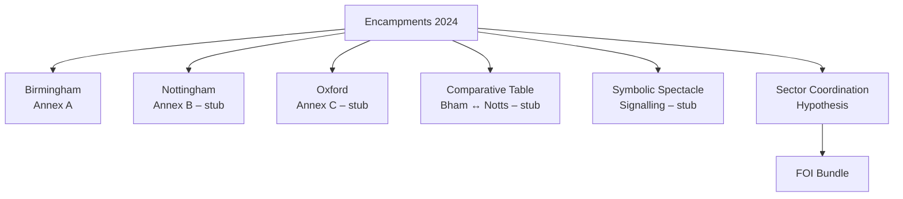

# 🍉 Academic Liberty — Encampments 2024 Mini‑Dossier  
**First created:** 2025-10-28 | **Last updated:** 2025-10-28  
*Clustering source notes, evidence logs, and sector‑coordination analysis around UK university encampment responses (Spring–Summer 2024).*

---

## 🛰️ Orientation  
This mini‑dossier gathers Polaris nodes that document **how UK universities managed Gaza‑solidarity encampments in 2024**, with emphasis on:  
- **Engagement chronology vs legal framing** (e.g., “failure to engage” claims);  
- **Pre‑briefed silence and template language** across institutions;  
- **Risk/identity context** affecting student correspondence and anonymity;  
- **FOI pathways** to surface sector‑level coordination.

Use this README as the hub for /🍉_Academic_Liberty. Drop new annexes and timelines here as they’re created.

---

## 📚 Included Nodes (drop‑in files)
- **Annex A — Birmingham Pre‑Litigation Correspondence Record** → `Annex_A_Birmingham_Pre-Litigation.md`  
  _Chronology + interpretive note + safety context; with primary‑source links._  
- **Sector Coordination Hypothesis — Pre‑Briefed Silence** → `Sector_Coordination_Hypothesis.md`  
  _Observed convergences; possible channels (UUK/OfS/AUCSO/AMOSSHE/insurers/NGOs); research steps._  
- **FOI‑Request Template Bundle — Sector Coordination 2024** → `FOI_Request_Template_Bundle.md`  
  _Reusable FOI letters for UUK, OfS, AUCSO, AMOSSHE, U‑MAL, Aon._

> **Planned additions (stubs)**  
> - **Comparative Case Table — Birmingham v Nottingham (EWHC 1770 / 1771)** → `Comparative_Table_Bham_Notts.md`  
> - **Annex B — Nottingham Correspondence Timeline** → `Annex_B_Nottingham_Timeline.md`  
> - **Annex C — Oxford Timeline & Comms Pack** → `Annex_C_Oxford_Timeline.md`  
> - **Symbolic Spectacle & Dog‑Whistle Signalling** → `Symbolic_Spectacle_Governance.md`

---

## 🗺️ Investigation Map (mermaid)

*Solid nodes exist now; “stub” nodes are suggested next files.*

---

## 🔍 Evidence Log — Quick Pointers  
- **Birmingham, May 22 & 24 (Instagram Reels):** students attempt VC delivery; quote: “Okay. We’ll post it in his post box.”  
  _Logged inside Annex A._  
- **Oxford disbanding and fencing timeline (June–July):** _to be logged in Annex C._  
- **Court dates:** EWHC 1770 (4 Jul 2024) / EWHC 1771 (5 Jul 2024) — _to cite within Comparative Table._

---

## 🧭 Working Questions  
1. How did “engagement” get re‑defined in pleadings vs observed behaviour?  
2. Which bodies (UUK/OfS/AUCSO/AMOSSHE/insurers/PR/NGOs) circulated the boilerplate?  
3. What are the **equality‑impact** and **dignity‑audit** gaps in service of paperwork (e.g., timing during memorials)?  
4. How were identity‑protection concerns handled when insisting on official email routes?

---

## ✅ Next Actions (checklist)  
- [ ] Send FOIs (UUK, OfS, AUCSO, AMOSSHE, U‑MAL, Aon) using the bundle.  
- [ ] Build **Annex B (Nottingham)** from posts, statements, and any served documents.  
- [ ] Draft **Comparative Table (Bham ↔ Notts)** and embed excerpts from judgments.  
- [ ] Compile **Oxford** timeline (site fencing, police involvement, disbanding).  
- [ ] Add **Symbolic Spectacle** node with descriptive → interpretive → governance layers.  
- [ ] Run lexical‑overlap scan on university statements (append as mini‑method note).

---

## 🌌 Constellations  
🍉 Academic Liberty · 🪄 Expression of Norms · 🧿 Watch the Watchers · 🕊️ Civil Governance

---

## ✨ Stardust  
encampments 2024, protest governance, possession orders, engagement chronology, sector coordination, information rights, equality impact, identity protection, FOI

---

## 🏮 Footer  
*🍉 Academic Liberty — Encampments 2024 Mini‑Dossier* is a living hub within Polaris for documenting protest‑response governance in UK higher education.  
*Survivor authorship is sovereign. Containment is never neutral.*  

_Last updated: 2025-10-28_
