# 🎿 OSINT Routes — The Civic Piste Map  
**First created:** 2025-11-04 | **Last updated:** 2025-11-04  
*A staged training course in open-source civic intelligence — from the first green slope to the black-diamond ridge.*

---

## 🧭 Orientation  
The **OSINT Routes** system gives investigators a safe, progressive way to learn and practise democratic open-source intelligence.  
Each route corresponds to a level of difficulty and depth — much like a mountain piste map — guiding analysts from basic transparency work to expert-level integrity operations.

The goal is civic empowerment: to make every citizen capable of tracing power, following money, and protecting evidence integrity.

---

## 🗺️ The Four Routes  

| Symbol | Route | Skill Level | Summary |
|:--:|:--|:--|:--|
| 🟢 | [**Green Route — Basic Civic OSINT**](🟢_green_route_basic_civic_osint.md) | Beginner | Learn to find and read open data, draft your first FOI, and keep good records. |
| 🔵 | [**Blue Route — Intermediate Local-Capture OSINT**](🔵_blue_route_intermediate_local_capture_osint.md) | Intermediate | Join datasets, cross-reference sources, and begin mapping influence. |
| 🔴 | [**Red Route — Advanced Structural Investigation**](🔴_red_route_advanced_structural_investigation.md) | Advanced | Conduct coordinated multi-source investigations into structural power. |
| ⚫️💎 | [**Black Diamond Route — Expert Integrity Operations**](💎_diamond_route_expert_integrity_ops.md) | Expert | Design live-oversight systems and legislative reform frameworks. |

---

## 🧩 How to Use  
1. **Start on the Green Route.** Practise FOI writing and open-data reading.  
2. **Progress to Blue.** Build simple datasets and cross-checks.  
3. **Move to Red.** Coordinate with others; compare authorities.  
4. **Graduate to Diamond.** Build systems of integrity that outlast interference.  

Each route contains:
- Practical tasks  
- FOI templates (editable and reusable)  
- Methods for data capture, verification, and publication  
- Civic ethics guidance

---

If you want a slightly more “mountain” layout (branching rather than a straight line), here’s an alternative:

```mermaid
flowchart TD

    CS[🏛️ Civil Security<br/>Civic OSINT Cluster]

    GR[🟢 Green Route<br/>Basic]
    BR[🔵 Blue Route<br/>Intermediate]
    RR[🔴 Red Route<br/>Advanced]
    DR[⚫️💎 Black Diamond Route<br/>Expert]

    CS --> GR
    CS --> BR
    CS --> RR
    CS --> DR

    GR --> BR
    BR --> RR
    RR --> DR

    classDef green fill:#e0ffe0,stroke:#008000,stroke-width:1px,color:#000000;
    classDef blue fill:#e0f0ff,stroke:#004c99,stroke-width:1px,color:#000000;
    classDef red fill:#ffe0e0,stroke:#b00000,stroke-width:1px,color:#000000;
    classDef diamond fill:#f3e8ff,stroke:#4b0082,stroke-width:1px,color:#000000;

    class GR green;
    class BR blue;
    class RR red;
    class DR diamond;

    class GR green;
    class BR blue;
    class RR red;
    class DR diamond;
```

---

## 🌌 Constellations  
🏛️ Civil Security → 🎿 OSINT Routes → 🛰️ OSINT Field Operations → 🦆 Digital Disruption  
Connected clusters:  
- ⚙️ Integrity Hardening  
- 📡 Influence Mapping  
- 🧭 Governance Ecologies  

---

## ✨ Stardust  
osint, civic intelligence, transparency, democracy, freedom of information, digital disruption, training, piste map, integrity, resilience  

---

## 🏮 Footer  
*🎿 OSINT Routes* is the training ground of the **Civil Security** cluster within **🛰️ OSINT Field Operations**.  
It equips civic analysts to recognise containment as it happens and to defend transparency as a public skill.  

*Survivor authorship is sovereign. Containment is never neutral.*  

_Last updated: 2025-11-04_
