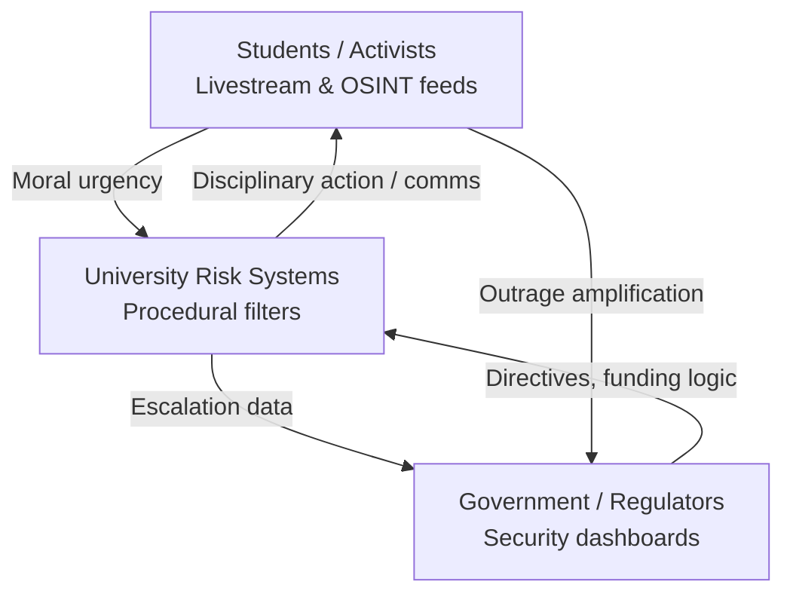

# 🧭 Three Information Realities  
**First created:** 2025-11-08 | **Last updated:** 2025-11-08  
*A comparative model of the information ecosystems through which students, universities, and government experienced the Gaza-related protest cycle (2023 – 2025).*

---

## 🧭 Orientation  

Every actor in the 2023–25 protest cycle saw a different world.  
The same events—campus encampments, protest crackdowns, ICJ rulings—were filtered through entirely separate **information environments**.  
This node maps those environments to show why moral dialogue collapsed and how algorithmic architectures hardened misunderstanding.

---

## 🧩 1. The Three Realities  

| Layer | Primary Feeds | Cognitive Frame | Typical Output Behaviour |
|:--|:--|:--|:--|
| **A. Students / Public Witnesses** | Social-media footage, livestreams, Telegram/Signal groups, Gaza OSINT, NGO updates | *Empathic immediacy.*  Trauma-exposure loop; moral urgency. | Encampments, petitions, creative resistance, direct-action planning. |
| **B. University Administrations** | Risk dashboards, legal counsel, contractor reports (Horus etc.), OfS briefings, police liaison | *Procedural containment.*  Duty-of-care logic; “leadership optics.” | Policy statements, disciplinary hearings, reputational triage. |
| **C. Government / Regulators** | Security-service summaries, media monitoring, political comms cycles | *Narrative control.*  Framed dissent as extremism risk; prioritised stability metrics. | Downing St directives, Prevent integration, press messaging. |

**Result:**  
Each layer validated its own sense of “the real,” producing *cognitive dissonance without malice*—a structural empathy failure.

---

## 💡 2. The Algorithmic Empathy Gap  

Algorithms rewarded outrage and emotional coherence, not accuracy.  
Students saw atrocity; officials saw virality.  
The machine translated grief into “radicalisation signal,” while institutional dashboards reduced moral distress to “risk index.”  

| Symptom | Algorithmic Mechanism | Consequence |
|----------|----------------------|--------------|
| Information flooding | Engagement-weighted feeds | Compassion fatigue, burnout. |
| Suppression / shadow-banning | Content moderation bias | Perceived censorship, radical mistrust. |
| Repetition of risk terms | Sentiment-analysis loops | Self-confirming panic in governance dashboards. |
| Feedback isolation | Recommendation bubbles | Mutual incomprehension between actors. |

The empathy gap is thus an *emergent property* of the digital environment, not simply human indifference.

---

## 🧱 3. Data Hierarchies and Decision Lag  

1. **Students** operate on *real-time sensory data* (video, witness accounts).  
2. **Universities** act on *aggregated incident reports* delayed by legal review.  
3. **Government** reacts to *weekly risk digests* filtered through political comms.  

By the time policy reaches implementation, it already describes an **expired reality**.

---

## 🧭 4. Misalignment Case Study — The Encampment Feedback Loop  

1. Footage of police action spreads → global outrage.  
2. University risk dashboard spikes → “escalation alert.”  
3. Vice-chancellor calls police for reassurance.  
4. Government briefs press that “antisemitism on campus is rising.”  
5. Students interpret clampdown as confirmation of injustice.  

Each step is internally logical yet collectively self-defeating—a perfect closed loop of containment.

---

## 🧮 5. Analytical Model (Mermaid Diagram)

*Containment feedback cycle: moral signal → bureaucratic risk → political directive → suppression → renewed outrage.*

---

## 🧭 6. Bridging Strategies  

| Domain | Repair Mechanism | Practical Action |
|:--|:--|:--|
| **Information parity** | Shared evidence base | Joint open-data repositories; verified transcript archives. |
| **Algorithmic literacy** | Explain moderation and ranking logic | Civic-tech workshops; student–staff training. |
| **Dialogue under uncertainty** | Acknowledge partial data | Structured “information audit” sessions between students and admin. |
| **Ethical buffering** | Trauma-informed moderation | Designate digital-welfare mediators within institutions. |

---

## 🧭 7. OSINT Tasks  

| Task | Purpose | Sources |
|------|----------|---------|
| **Media-flow analysis** | Compare keyword spikes across actor groups. | Meltwater, GDELT, CrowdTangle archives. |
| **Document cross-release** | Pair student eyewitness materials with official responses. | FOI disclosures, press archives. |
| **Timeline alignment** | Build three-column event logs (student / university / government). | Spreadsheet or Mermaid timeline. |
| **Narrative-frame study** | Identify framing shifts before/after ICJ rulings. | Hansard, social-media sentiment datasets. |

---

## 🌌 Constellations  

🧭 Three Realities Model ⚖️ Institutional Accountability 🛰️ OSINT Field Operations 💬 Narrative Ethics  

---

## ✨ Stardust  

information ecosystems, empathy gap, algorithmic bias, protest perception, containment feedback, data lag, cognitive dissonance, civic repair  

---

## 🏮 Footer  

*🧭 Three Information Realities* visualises how different information environments generated incompatible moral worlds during the Gaza-protest era.  
Repair begins not with consensus but with **shared visibility** of the data each side saw.  

*Survivor authorship is sovereign. Containment is never neutral.*  

_Last updated 2025-11-08_
