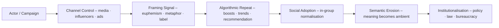

# 📡 Language as Attack Surface  
**First created:** 2025-11-02 | **Last updated:** 2025-12-25  
*How linguistic drift becomes an exploitable vector for coordinated manipulation and how to defend against it.*  

---

## 🧭 Orientation  

Language is infrastructure. When actors manipulate vocabulary, euphemism, or frame velocity, they exploit a blind spot between cybersecurity and communications. This node defines that surface, maps the attack mechanics, and provides templates for documenting and counter-acting frame drift across open networks.

---

## 🧩 Key Claims  

- Every modern information-operation includes **semantic engineering** — coordinated shifts in meaning, metaphor, or emotional register.  
- Algorithmic amplification turns linguistic novelty into an accelerant.  
- Counter-measures depend on **archival precision** + **memetic clarity**.  
- Survivor-voice fidelity is the baseline integrity model: tone is signal.  

---

## 🔬 Propaganda Mechanics  

---

## 🛠️ Operational Countermeasures  

1. **Archive-first:** capture screenshots + plaintext + UTC timestamp + URL + hash.  
2. **Living Glossary:** track euphemism → literal term in `what_they_now_call_X.csv`.  
3. **Watchlist Rules:** see `watchlist/frame_drift_watchlist.yaml`.  
4. **Counter-frames:** short (≤ 7 words) truthful reframings; test for shareability.  
5. **Cross-mirroring:** store ≥ 2 independent copies + hash manifest.  
6. **Community inoculation:** teach frame-recognition + archival reflex.  
7. **Legal flagging:** escalate when phrasing → incitement; attach archive bundle.  

---

## 📚 Historical Examples  

- **Osip Mandelstam (USSR)** — imprisoned 1934 after reciting a poem mocking Stalin; metaphor treated as sedition.  
- **Ngũgĩ wa Thiong’o (Kenya)** — detained 1977 for plays in Gikuyu; linguistic autonomy criminalised.  
- **Forugh Farrokhzad (Iran)** — poems banned post-1979; female voice coded as threat.  
- **Rwandan Radio (1994)** — euphemism “cut the tall trees” functioned as kill order.  
- **Akhmatova & Oral Preservation (USSR)** — poems memorised to evade state erasure.  

Each shows how controlling language becomes equivalent to controlling territory.

---

## 📂 Recommended Sub-files  

- `watchlist/frame_drift_watchlist.yaml` — active monitoring rules.  
- `glossary/what_they_now_call_X.csv` — euphemism ledger.  
- `interventions/counterframes.md` — ready reframings.  
- `templates/archive_capture_template.md` — capture SOP.  

---

## 🌌 Constellations  

🧿 📡 ⚖️ 🎭 🛰️ — diagnostic · protective · counter-propaganda register.  

*Further viewing:*  

- [Watch: Leading lights in the Anglican Church push back against the far right activist Tommy Robinson and his band of "patriots", from Yasmin Alibhai-Brown](https://vm.tiktok.com/ZNRjP3sVf/)  

---

## ✨ Stardust  

language manipulation, semantic erosion, information warfare, frame drift, archive integrity, survivor voice fidelity, counter-frame, digital inoculation, memetic engineering, historical precedent  

---

## 🏮 Footer  

*📡 Language as Attack Surface* is a living node of the Polaris Protocol.  
It anchors operational tracking of linguistic manipulation and provides tools for semantic defence across digital platforms.  

> 📡 Cross-references:
> 
> - [watchlist/frame_drift_watchlist.yaml] — current frame monitoring  
> - [glossary/what_they_now_call_X.csv] — euphemism log  
> - [interventions/counterframes.md] — counter-narrative bank  
> - [templates/archive_capture_template.md] — archival SOP  

*Survivor authorship is sovereign. Containment is never neutral.*  

_Last updated: 2025-12-25_
