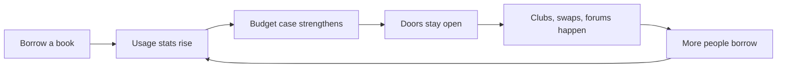

# 📚 Libraries, Metrics, and the One-Book Civic Hack
**First created:** 2025-10-28 | **Last updated:** 2026-01-08  
*How to understand and tactically nourish your local library’s data ecosystem.*

---

## 🛰️ Orientation
Every library sits inside a quiet accounting system. When councils decide what to cut, they don’t read novels — they read *numbers*: how many books were borrowed, how many visitors crossed the threshold, how many log-ins were recorded.  
This means that every time you borrow *even one book*, you feed the metric that says: **“This branch matters. People use it.”**

---

## 🧮 How Library Data Works
| Metric | What It Measures | How It’s Interpreted |
|---|---|---|
| Books loaned / renewed | Circulation | “Engagement and literacy impact” |
| Active borrowers | Distinct users with ≥1 loan in the year | “Community reach” |
| Computer & Wi-Fi sessions | Digital inclusion | “Bridging digital divide” |
| Event attendance | Community cohesion | “Social capital output” |
| Return punctuality | Reliability | “Service efficiency” |

> I’m not telling you to falsify or sabotage data. But it’s worth understanding how decisions are made. If a council receives months of consistent, high-quality data showing that a branch is “under-used,” that record becomes **administratively unassailable**. Under UK local-government law, once a closure proposal rests on verified usage statistics, it’s extremely difficult to challenge — even if those figures reflect austerity conditions rather than community need. The numbers become the truth the bureaucracy acts on.

---

## 🧭 Counter-Move: The One-Book Habit
You don’t need to overhaul the system to protect it. Just **borrow one book, once a month**.  
It doesn’t matter if you read it. It matters that the system sees **circulation** and **active membership**. That one act pushes up usage statistics, signals that the space is alive, and keeps staff jobs and community access points measurable.

> Even if you mainly go in to **use the computers or Wi-Fi**, it still helps. Under cost-cutting logic, governments often claim that “people can get internet access elsewhere.” But if your visit shows **both** digital use **and** book circulation, the library’s data becomes much harder to dismiss. If you worry about returning books on time, build it into your routine: swap a book every time you go in. One in, one out.

---

## 🗳️ Borrowing as Voting
Think of borrowing a library book as **a form of voting**. Every time you take one out and return it, you’ve cast a ballot that says: *“This place matters. Keep it open.”* Councils count circulation, not sentiment. A single book loan is a measurable vote in favour of public space. You can vote twelve times a year simply by borrowing and returning a book. The alternative — not borrowing — is counted too; it reads as silence.

---

## 👩‍🏫 Librarians Are the Infrastructure
Libraries survive on people as much as on numbers. Behind every issue slip or renewal reminder is someone with years of training in library/information science: classification, archival tech, community engagement. They’re not just shelving books; they’re matching people to ideas — an art built on memory, empathy, and pattern recognition. Many stay despite low pay because they care.

---

## 🗺️ Librarians as Local Intelligence
Because librarians help people find *information*, they become informal guides to local life: clinics with walk-ins, benefits advice drop-ins, chemists with weekend hours, forms that actually work. Your questions surface invisible need. Reported patterns (“people keep asking about benefits calculators”) build a **business case** for restoring in-person public-service points.

---

## 🧶 Libraries as Third Spaces
Most branches have **rooms you can book** free or low-cost — conversation classes, homework clubs, RPG campaigns, knitting circles, writing groups. Each booking generates **community-use** data. It’s warm, routine community without café prices. Many branches allow covered drinks or have a small café attached.

---

## 🕯️ Libraries After Lockdown
Post-Covid, many of us lost social rhythm. Libraries can help rebuild it: start a yoga/mindfulness group, host a **Death Café**, run a **“Let’s Talk About…”** club, or a **makers’ afternoon**. For lighter participation, try **geocaching** or **post-crossing** — low-bandwidth hobbies that work fine on older library PCs. Doing something with your hands lowers stress *and* keeps usage data strong.

---

## 🔧 Skill Swaps and Everyday Expertise
Run **skill-swap afternoons** — the offline sibling of FreeCycle. Trade *know-how*: stop-cocks and leaks, bike repair, budgeting, recipe stretching, phone-camera tips, free digital tools for job-hunting. Each exchange saves money, builds trust, and shows up as **community learning**.

---

## 📖 Reading as Resistance
Circulation by subject shapes what stays on shelves. If only thrillers circulate, critical and global titles are marked “low demand” and vanish first in cuts. Safeguard knowledge: **check out** anti-racism, feminism, climate justice, disability rights, queer history, Sudan, Palestine — the shelves most pressured when politics turns authoritarian. Especially if you hold privilege, your borrowing creates statistical cover.

---

## 🪶 Safeguarding Knowledge for the Next Generation
Libraries “weed” titles that don’t circulate. The more a community borrows, the faster it receives **new stock**. If a item isn’t in, **ask staff**; requests are logged and influence procurement. You’re not just borrowing for yourself — you’re lending visibility to the future.

---

## 🗳️ Voting With Your Library Card (Holds/Reserves)
**Reserving** a book sends a signal too. Even if you cancel later, the system records interest. Treat your card as a **ballot**: each reservation and checkout is a lawful vote for the knowledge you want to remain available.

---

## 🤝 Keeping the Library — and Each Other — Alive
None of this breaks rules. Councils are broke; quiet services are easy targets. Act now — fill the numbers. Help others use it via formal volunteering (book buses, care-home visits). **Legal note:** coordinate through official routes; don’t bypass DBS or safeguarding.

---

## 🌍 Why It All Matters
Books are expensive; libraries are engines of literacy. Every visit, swap, and shared complaint teaches civic language. You don’t have to do everything — dip in and out. Together, small lawful acts — borrowing, teaching, fixing, organising — recreate the social conditions that keep authoritarianism at bay.

---

## 🔁 Civic Continuity Loop (Mermaid)

> Each borrowed book keeps the doors open. Each open door creates room for gatherings. Each gathering feeds the next round of borrowing.

---

## 🌱 Civic Literacy Message
When austerity logic says *“use it or lose it,”* the counter-nudge is: *“use it, and keep it alive.”* Libraries are one of the last places you can exist without paying rent on your presence. Feeding their data trails, even minimally, is an act of civic care.

---

## 🌌 Constellations
🪄 🫀 🧠 📚 — norms, care, behavioural data, community survival.  
*Further media:*  
- [Libraries and Lemonade](https://www.librariesforthepeople.org/lemonade) – *well-resourced toolkit for setting up cold drinks and chatting in your community; framed as leftist, equally useful if you just think people should be able to access knowledge as a public good*

---

## ✨ Stardust
libraries, public data, behavioural metrics, civic literacy, social credit, austerity, community infrastructure, counter-nudge, digital inclusion, survivor tools

---

## 🏮 Footer
*📚 Libraries, Metrics, and the One-Book Civic Hack* is a living node of the Polaris Protocol. It documents how everyday acts can manipulate bureaucratic metrics toward community survival.

> 📡 Cross-references:
> 
> - 🪡 [Make-and-Mend Republic — Intergenerational Repair for Hard Times](./🪡_make_and_mend_republic.md)  
> - 🌍 [Why It All Matters — Shared Epilogue](./🌍_why_it_all_matters_shared_epilogue.md)
> - [📚 Library as Algorithmic Interface](../../Metadata_Sabotage_Network/Structural_Analysis/🧬_Structural_Mapping/📚_library_as_algorithmic_interface.md)  
> - [📚 The Tenth Library](../../Disruption_Kit/Big_Picture_Protocols/🦕_Elder_Influencers/🕸️_World_Webs/📚_the_tenth_library.md)  

*Survivor authorship is sovereign. Containment is never neutral.*  

_Last updated: 2026-01-08_
