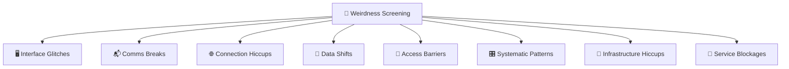

# 👾 Weirdness Screening  
**First created:** 2025-09-12 | **Last updated:** 2025-09-12  
*The shelf of first notices — under construction.*  

---

## 🌱 Scope  

- A space for **everyday oddities** (cursor jumps, lost referrals, attachments disappearing).  
- Each entry contrasts **benign causes** vs. **sabotage-class patterns**.  
- Built around **stepwise flowcharts** and **triage guides**.  

This section is **currently under construction**.  
It will grow to cluster “weirdness” into categories that make sense at first notice.  

---

## 📂 Planned Subfolders  

- **🖥 Interface_Glitches/** — device-level oddities (cursor drift, buttons failing, mic light flickers).  
- **📬 Comms_Breaks/** — breakdowns in letters, emails, referrals, attachments.  
- **🌐 Connection_Hiccups/** — Wi-Fi drops, calls cut, uploads fail.  
- **📂 Data_Shifts/** — records missing, timestamps mismatched, attachments stripped.  
- **🔑 Access_Barriers/** — logins rejected, submit buttons fail, MFA loops.  
- **🎛 Systematic_Patterns/** — glitches that repeat on schedules or in sync with suppression.  
- **🚉 Infrastructure_Hiccups/** — public/service disruptions (trains, ATMs, payment systems).  
- **🛒 Service_Blockages/** — consumer-facing anomalies (shopping carts empty, items always “out of stock”).  

---

## 🗺 Skeleton Diagram  

---

## 🛠 Current Entries  

- [🖥 Interface Glitches/🖱 Cursor Jump Triage](./🖥_Interface_Glitches/🖱_cursor_jump_troubleshooting_flowchart.md)  
- [📬 Comms Breaks/📎 Attachments Not Delivered](./📬_Comms_Breaks/📎_attachments_not_delivered.md)  

*(More triage guides coming soon.)*  

---

## 🏮 Footer  

*Weirdness Screening* is a living node of the Polaris Protocol.  
It captures first-notice anomalies before they are formally named as sabotage.  
This section is still scaffolding in progress.  

> 📡 Cross-references:  
> - [Survivor Tools](../Disruption_Kit/Survivor_Tools/) — countermeasures once sabotage confirmed  
> - [Field Logs](../Disruption_Kit/Field_Logs/) — forensic documentation of anomalies  

*Survivor authorship is sovereign. Containment is never neutral.*  

_Last updated: 2025-09-12_
