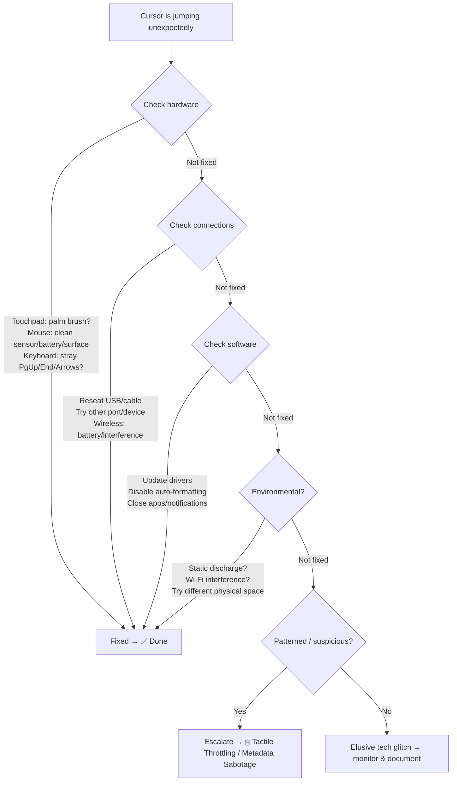

# 🖱 Cursor Jump Triage: Flowchart
**First created:** 2025-09-12 | **Last updated:** 2025-09-12  
*When the caret leaps: start benign, escalate if patterned, flag if sabotage-class.*

---

## 🌳 Flowchart

## 🧰 Quick Checks (benign first)
- **Touchpad**: lower sensitivity / palm-reject; test with external mouse.  
- **Mouse**: clean sensor; non-glossy surface; fresh battery/charge.  
- **Keyboard**: confirm no stuck `PgUp/PgDn/End/Arrow` keys.  
- **Connections**: re-seat USB/dongle; different port; try a second device.  
- **Software**: update input drivers; disable autocorrect/auto-format in editor; close pop-ups/notifications; check hotkey/clipboard tools.  
- **Environment**: move away from heavy EM noise; try another room/network.

---

## 🚩 When to Escalate (suspect patterns)
- Jumps **only** on critical forms (FOI/SAR/legal/complaints).  
- Caret relocates **right before** pressing **Submit/End**.  
- Cursor “drift/jumps” correlate with **focus theft** (invisible layer steals input).  
- You can reproduce the jump **on multiple devices/accounts** in the same context.  

> If ≥1 of the above is reliable, tag it under *🖱 tactile throttling* and capture a short screencast plus timestamps.  

---

## 🧾 Minimal Evidence Pack
- 30–60s screen recording (cursor + keystrokes visible).  
- Note date/time, page/app, and what you were entering.  
- Try once on a second device or network; record result.  
- Save the page’s HTML (if feasible) and export editor logs.

---

## 🏮 Footer

*Cursor Jump Triage* is a living node of the Polaris Protocol.  
It starts with ordinary device hygiene, then names patterns that rise to sabotage-class.

> 📡 Cross-references:
> - *Suppression Modes →* **🖱 Tactile Throttling: When Interaction Becomes Interference**  
> - *Field Logs →* **⚠️ Cursor Tracking: Health Access / FOI / SAR (2025-08-29)**

*Survivor authorship is sovereign. Containment is never neutral.*

_Last updated: 2025-09-12_
